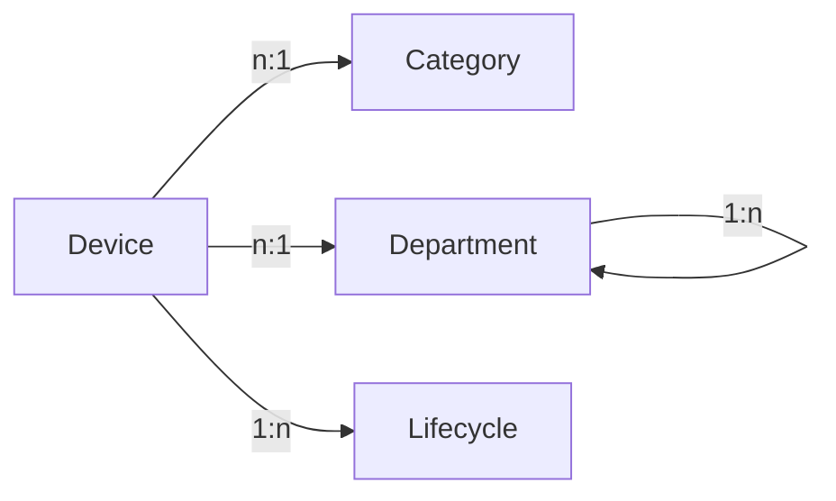
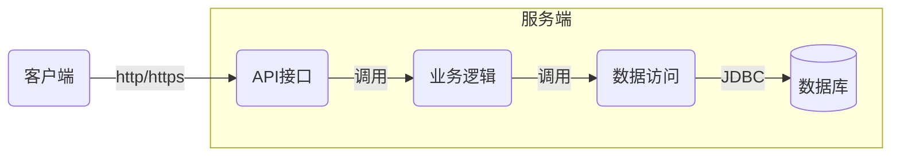

# 设备管理系统详细设计与具体代码实现

作者：禅与计算机程序设计艺术

## 1. 背景介绍
### 1.1 设备管理系统的重要性
在现代企业和组织中,高效管理各类设备资产至关重要。设备管理系统可以帮助企业跟踪、维护和优化其硬件和软件资产,提高运营效率,降低成本。一个设计良好的设备管理系统不仅可以简化日常管理任务,还能提供宝贵的数据洞察,优化资产的分配和使用。

### 1.2 设备管理面临的挑战
设备管理面临诸多挑战。随着企业规模的扩大,需要管理的设备种类和数量急剧增加,手工跟踪和记录变得不切实际。不同类型设备具有不同属性和生命周期,数据的准确性和一致性难以保证。此外,传统的Excel等工具功能有限,难以实现自动化和智能化管理。因此,开发一套功能强大、灵活高效的设备管理系统势在必行。

### 1.3 本文的目标和范围
本文旨在详细阐述设备管理系统的架构设计和代码实现。我们将重点关注系统的核心功能,包括设备信息管理、资产盘点、生命周期管理等。同时,文章将介绍系统采用的关键技术,如Spring Boot、MyBatis、Vue等,并提供具体的代码示例。通过本文,读者可以深入理解设备管理系统的实现原理,学习相关最佳实践,为开发类似系统提供参考。

## 2. 核心概念与关联
### 2.1 设备Device
- 设备是系统管理的核心对象,泛指企业拥有的硬件和软件资产
- 每个设备都有唯一的资产编号,如SN、条码等
- 设备具有多种属性,如类型、型号、厂商、购买日期、保修信息等

### 2.2 类型Category
- 设备按照不同的分类标准组织成类型层级结构
- 常见分类包括：计算机设备、网络设备、办公设备、软件资产等  
- 类型具有树形层级关系,支持定义父类型和子类型

### 2.3 组织部门Department
- 设备从属于特定的组织部门,部门对设备具有管理权限
- 组织部门一般是树形结构,存在上下级关系
- 通过部门可以实现设备的分级授权管理

### 2.4 生命周期Lifecycle
- 每个设备有其生命周期,包括采购、入库、领用、维修、报废等阶段
- 生命周期贯穿设备管理的始终,记录设备各阶段的状态变化
- 通过对生命周期的管理,企业可优化资产的分配、使用和处置

### 2.5 关联关系


## 3. 核心功能与架构设计
### 3.1 系统架构
系统采用前后端分离架构,主要包括以下层次:
- 数据访问层:使用MyBatis实现数据的持久化存储和访问
- 业务逻辑层:使用Spring Boot提供核心业务逻辑和服务能力
- API接口层:使用Spring MVC提供RESTful API,实现前后通信
- 前端展示层:使用Vue.js构建交互友好的用户界面


### 3.2 核心功能概述 
设备管理系统的核心功能包括但不限于:
1. 设备入库:新设备采购到货后,登记设备信息,自动生成唯一编号
2. 设备领用:员工申请领用设备,领用记录与部门关联,同时更新库存
3. 设备维修:记录设备的报修、故障诊断、维修过程等信息 
4. 设备报废:对达到使用年限或无法维修的设备做报废处理
5. 盘点管理:定期盘点盘点各类设备,核对实物与账目,记录盘亏盘盈
6. 统计报表:生成设备分类、数量、金额、使用情况等统计报表

### 3.3 数据库设计
根据需求分析,设计系统的数据库表结构如下:

**1. 设备表 t_device**

| 字段名 | 类型 | 含义 |
| ---- | ---- | ---- |
| id    | int  | 设备ID  |
| sn | varchar | 设备SN |
| category_id | int | 分类ID |
| dept_id | int | 部门ID |
| model | varchar | 型号 |
| buy_date | date | 购买日期 |
| warranty | int | 保修年限 |
| status | int | 设备状态 |
| create_by | varchar | 创建人 |
| create_time | datetime | 创建时间 |
| update_by | varchar | 更新人 |
| update_time | datetime | 更新时间 |
  
**2. 类型表 t_category**

| 字段名 | 类型 | 含义 |
| ---- | ---- | ---- |
| id    | int  | 类型ID  |
| pid | int | 父类型ID |
| name | varchar | 类型名称 |

**3. 部门表 t_dept**
  
| 字段名 | 类型 | 含义 |
| ---- | ---- | ---- |
| id    | int  | 部门ID  |
| pid | int | 父部门ID |
| name | varchar | 部门名称 |
  
**4. 设备生命周期表 t_device_lifecycle** 

| 字段名 | 类型 | 含义 |
| ---- | ---- | ---- |
| id    | int  | ID  |
| device_id | int | 设备ID |
| type | int | 生命周期类型 |
| oper_user | varchar | 操作人 |
| oper_time | datetime | 操作时间 | 
| remark | varchar | 备注 |

### 3.4 API接口设计
系统对外提供一系列RESTful风格的API接口,主要接口定义如下:

**1. 设备相关**

| 接口 | 方法 | 含义 |
| ---- | ---- | ---- |
| /api/devices    | POST  | 新增设备  |
| /api/devices/{id} | PUT | 编辑设备 |
| /api/devices/{id} | DELETE | 删除设备 |
| /api/devices | GET | 查询设备列表|
| /api/devices/{id} | GET | 获取设备详情 |
  
**2. 类型相关**

| 接口 | 方法 | 含义 |
| ---- | ---- | ---- |
| /api/categories    | POST  | 新增类型  |
| /api/categories/{id} | PUT | 编辑类型 |
| /api/categories/{id} | DELETE | 删除类型 |
| /api/categories/tree | GET | 获取类型树 |
 
**3. 部门相关**

| 接口 | 方法 | 含义 |
| ---- | ---- | ---- |
| /api/depts   | POST  | 新增部门 |
| /api/depts/{id} | PUT | 编辑部门 |
| /api/depts/{id} | DELETE | 删除部门 |
| /api/depts/tree | GET | 获取部门树 |

## 4. 代码实现
本节将介绍系统关键功能的具体代码实现,代码使用Java和Vue.js编写。

### 4.1 新增设备
```java
@RestController
@RequestMapping("/api/devices")
public class DeviceController {
    
  @Autowired
  private DeviceService deviceService;
  
  @PostMapping
  public Result add(@RequestBody Device device) {
      deviceService.save(device);
      return Result.ok();
  }
}

@Service
public class DeviceServiceImpl implements DeviceService {
  
  @Autowired
  private DeviceDao deviceDao;
  
  @Override 
  @Transactional
  public void save(Device device) {
    device.setCreateTime(new Date());
    device.setCreateBy(SecurityUtils.getUsername());
    deviceDao.insert(device);
    
    //记录设备生命周期-入库
    DeviceLifecycle lifecycle = new DeviceLifecycle();
    lifecycle.setDeviceId(device.getId());
    lifecycle.setType(LifecycleType.IN_STOCK.value());
    lifecycle.setOperUser(SecurityUtils.getUsername()); 
    lifecycle.setOperTime(new Date());
    deviceLifecycleDao.insert(lifecycle);
  }
}
```

前端新增设备页面
```vue
<template>
  <el-form :model="device" :rules="rules" ref="form" label-width="100px">
    <el-form-item label="资产编号" prop="sn">
      <el-input v-model="device.sn"></el-input>
    </el-form-item>
    <el-form-item label="设备分类" prop="categoryId">
      <tree-select v-model="device.categoryId" :props="categoryProps"></tree-select>
    </el-form-item>
    <el-form-item label="使用部门" prop="deptId">
      <tree-select v-model="device.deptId" :props="deptProps"></tree-select>
    </el-form-item>
    <el-form-item label="设备型号" prop="model">
      <el-input v-model="device.model"></el-input>
    </el-form-item>
    <el-form-item label="购买日期" prop="buyDate">
      <el-date-picker
        v-model="device.buyDate"
        type="date"
        value-format="yyyy-MM-dd">
      </el-date-picker>
    </el-form-item>
    <el-form-item label="保修年限" prop="warranty">
      <el-input-number v-model="device.warranty"></el-input-number>
    </el-form-item>
    <el-form-item>
      <el-button type="primary" @click="handleSave">保存</el-button>
      <el-button @click="handleCancel">取消</el-button>
    </el-form-item>
  </el-form>
</template>

<script>
  export default {
    data() {
      return {
        device: {},
        categoryProps: {
          value:"id",
          label:"name",
          children:"children"
        },
        deptProps: {
          value:"id",
          label:"name",  
          children:"children"
        },
        rules: {
          sn: [
            { required: true, message: "请输入资产编号" }
          ],
          categoryId: [
            { required: true, message: "请选择设备分类" }
          ],
          deptId: [
            { required: true, message: "请选择使用部门" }
          ],
          //...
       }
      };
    },
    methods: {
      handleSave() {
        this.$refs["form"].validate(valid => {
          if (valid) {
            this.$axios.post("/api/devices",this.device).then(()=>{
              this.$message.success("新增成功");
            })
          }
        });
      },
      handleCancel(){
        this.device = {};
        this.$refs["form"].resetFields();
      }
    }
  };
</script>
```

### 4.2 查询设备
```java
@RestController
@RequestMapping("/api/devices")
public class DeviceController{
  
  @Autowired
  private DeviceService deviceService;
  
  @GetMapping
  public Result<List<Device>> list(String sn,Long categoryId, Long deptId){
    LambdaQueryWrapper<Device> queryWrapper = new LambdaQueryWrapper<>();
    queryWrapper.like(StringUtils.isNotBlank(sn),Device::getSn, sn);
    queryWrapper.eq(categoryId != null, Device::getCategoryId, categoryId);
    queryWrapper.eq(deptId != null, Device::getDeptId, deptId);
    List<Device> list = deviceService.list(queryWrapper);
    return Result.ok(list);
  }
}
```

前端设备列表页面:

```vue
<template>
  <div>
    <el-form inline>
      <el-form-item label="资产编号">
        <el-input v-model="query.sn"></el-input>
      </el-form-item>
      <el-form-item label="设备分类">
        <tree-select v-model="query.categoryId" :props="categoryProps"></tree-select>
      </el-form-item>  
      <el-form-item label="使用部门">
        <tree-select v-model="query.deptId" :props="deptProps"></tree-select>
      </el-form-item>
      <el-form-item>
        <el-button type="primary" @click="getList">查询</el-button>
      </el-form-item>
    </el-form>

    <el-table
      :data="tableData"
      border
      style="width: 100%">
      <el-table-column prop="sn" label="资产编号"></el-table-column>
      <el-table-column prop="category.name" label="设备分类"></el-table-column>
      <el-table-column prop="dept.name" label="使用部门"></el-table-column>
      <el-table-column prop="model" label="设备型号"></el-table-column>
      <el-table-column prop="buyDate" label="购买日期"></el-table-column>
      <el-table-column prop="status" label="设备状态