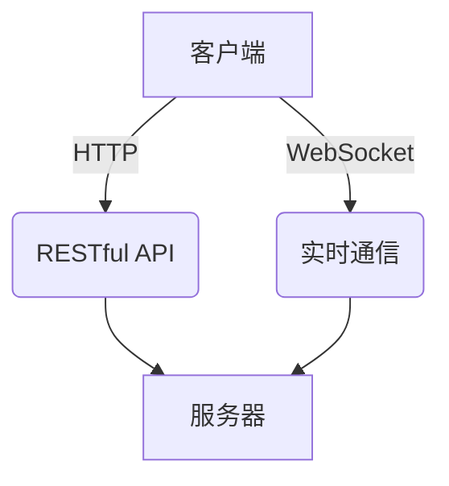
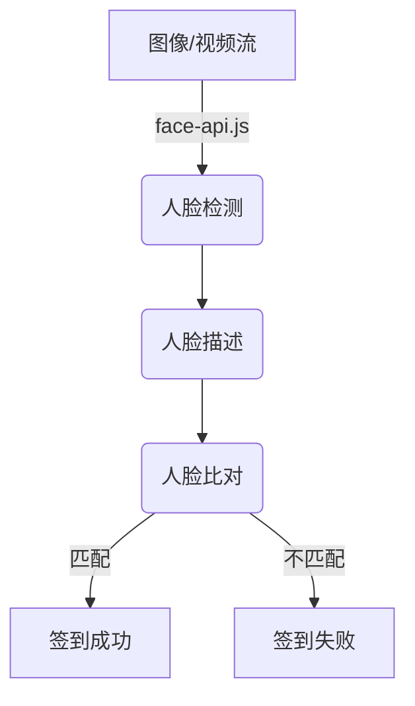

# 课堂考勤管理系统详细设计与具体代码实现

## 1. 背景介绍

### 1.1 考勤管理系统的重要性

在教育机构中,课堂考勤是确保学生按时出勤、监控学习情况的关键环节。传统的纸质考勤方式不仅耗时耗力,而且容易出现数据遗失、统计错误等问题。因此,开发一款高效、准确的课堂考勤管理系统对于提高教学质量、加强学生管理至关重要。

### 1.2 系统目标和挑战

本系统旨在简化考勤流程,提高准确性,同时为教师和学生提供良好的用户体验。其主要挑战包括:

- 设备兼容性:能够适配不同硬件设备
- 数据安全:保护个人隐私,防止数据泄露
- 实时性:及时记录和更新考勤数据
- 扩展性:可根据需求持续扩展功能

### 1.3 相关技术概览  

本系统主要采用以下技术:

- 前端: React、React Native
- 后端: Node.js、Express、MongoDB
- 其他: Socket.IO、Face-api.js

## 2. 核心概念与联系

### 2.1 系统架构

课堂考勤管理系统采用客户端-服务器架构,包括:

- **客户端**: 教师和学生使用的移动应用或网页应用
- **服务器**: 负责处理业务逻辑、存储和管理数据的后端服务器

两者通过 RESTful API 和 WebSocket 进行通信。



### 2.2 用户角色

系统有两种主要用户角色:

- **教师**: 创建课程、发布考勤、查看考勤记录等
- **学生**: 加入课程、签到、查看个人考勤情况等

### 2.3 数据模型

系统的主要数据模型包括:

- **用户(User)**: 存储用户基本信息
- **课程(Course)**: 包含课程详情、教师、学生名单等
- **考勤(Attendance)**: 记录每节课的考勤情况

## 3. 核心算法原理具体操作步骤

### 3.1 人脸识别

考勤签到的核心是人脸识别技术,用于验证学生身份。我们使用 face-api.js 库实现以下步骤:

1. **人脸检测**: 从图像或视频流中检测人脸
2. **人脸描述**: 提取人脸的特征描述
3. **人脸比对**: 将检测到的人脸与已存储的人脸描述进行比对,判断是否匹配



### 3.2 签到流程

1. 学生打开移动应用,选择对应课程
2. 系统请求打开摄像头,捕获学生当前视频流
3. 通过人脸识别算法验证学生身份
4. 服务器记录本次签到信息并实时更新数据库

### 3.3 签退流程

1. 课程结束时,教师在应用中点击"结束考勤"
2. 系统统计本节课的考勤数据
3. 将统计结果发送至服务器,更新数据库
4. 教师可查看课程考勤报告

## 4. 数学模型和公式详细讲解举例说明

人脸识别的核心是计算人脸特征描述,并与已知描述进行匹配。我们使用 face-api.js 提供的 FaceDescriptor 模型,它基于深度卷积神经网络,能够从图像中提取512维人脸特征向量。

给定两个人脸特征向量 $\vec{a}$ 和 $\vec{b}$,我们可以计算它们之间的欧几里得距离:

$$d(\vec{a}, \vec{b}) = \sqrt{\sum_{i=1}^{512}{(a_i - b_i)^2}}$$

距离值 $d$ 越小,说明两张人脸越相似。我们设置一个阈值 $\theta$,若 $d < \theta$,则判定为同一个人。

在实际应用中,我们需要对阈值 $\theta$ 进行调优,以达到较高的识别准确率。此外,我们还可以引入其他距离度量方法,如余弦相似度、曼哈顿距离等,以改善识别效果。

## 5. 项目实践: 代码实例和详细解释说明

### 5.1 前端实现

前端使用 React 和 React Native 构建跨平台应用,主要包括以下模块:

#### 5.1.1 登录/注册模块

```jsx
// LoginScreen.js
import React, { useState } from 'react';
import { View, TextInput, Button, Alert } from 'react-native';
import axios from 'axios';

const LoginScreen = () => {
  const [email, setEmail] = useState('');
  const [password, setPassword] = useState('');

  const handleLogin = async () => {
    try {
      const response = await axios.post('/api/auth/login', { email, password });
      // 处理登录成功的逻辑
    } catch (error) {
      Alert.alert('登录失败', error.response.data.message);
    }
  };

  return (
    <View>
      <TextInput
        placeholder="邮箱"
        value={email}
        onChangeText={setEmail}
      />
      <TextInput
        placeholder="密码"
        secureTextEntry
        value={password}
        onChangeText={setPassword}
      />
      <Button title="登录" onPress={handleLogin} />
    </View>
  );
};

export default LoginScreen;
```

该模块负责处理用户登录和注册,通过发送 HTTP 请求与后端服务器进行交互。

#### 5.1.2 课程模块

```jsx
// CourseScreen.js
import React, { useState, useEffect } from 'react';
import { View, Text, FlatList, Button } from 'react-native';
import axios from 'axios';
import { useNavigation } from '@react-navigation/native';

const CourseScreen = () => {
  const [courses, setCourses] = useState([]);
  const navigation = useNavigation();

  useEffect(() => {
    const fetchCourses = async () => {
      try {
        const response = await axios.get('/api/courses');
        setCourses(response.data);
      } catch (error) {
        console.error(error);
      }
    };
    fetchCourses();
  }, []);

  const handleJoinCourse = (courseId) => {
    navigation.navigate('AttendanceScreen', { courseId });
  };

  return (
    <View>
      <FlatList
        data={courses}
        keyExtractor={(item) => item._id}
        renderItem={({ item }) => (
          <View>
            <Text>{item.name}</Text>
            <Button
              title="加入课程"
              onPress={() => handleJoinCourse(item._id)}
            />
          </View>
        )}
      />
    </View>
  );
};

export default CourseScreen;
```

该模块展示所有可加入的课程列表,用户可选择加入某个课程。

#### 5.1.3 考勤模块

```jsx
// AttendanceScreen.js
import React, { useState, useEffect, useRef } from 'react';
import { View, Text, Button } from 'react-native';
import * as faceapi from 'face-api.js';
import { useNavigation, useRoute } from '@react-navigation/native';
import io from 'socket.io-client';

const AttendanceScreen = () => {
  const [isAttended, setIsAttended] = useState(false);
  const videoRef = useRef(null);
  const navigation = useNavigation();
  const route = useRoute();
  const { courseId } = route.params;
  const socket = io('http://localhost:3000');

  useEffect(() => {
    const loadModels = async () => {
      const MODEL_URL = '/models';
      await faceapi.loadSsdMobilenetv1Model(MODEL_URL);
      await faceapi.loadFaceLandmarkModel(MODEL_URL);
      await faceapi.loadFaceRecognitionModel(MODEL_URL);
    };
    loadModels();
  }, []);

  const handleAttendance = async () => {
    try {
      const detections = await faceapi
        .detectSingleFace(videoRef.current)
        .withFaceLandmarks()
        .withFaceDescriptor();

      if (detections) {
        const faceDescriptor = detections.descriptor;
        // 发送人脸描述到服务器进行匹配
        socket.emit('attendance', { courseId, faceDescriptor });
      } else {
        console.log('未检测到人脸');
      }
    } catch (error) {
      console.error(error);
    }
  };

  useEffect(() => {
    socket.on('attendanceResult', (data) => {
      setIsAttended(data.attended);
    });
  }, [socket]);

  return (
    <View>
      <Text>课程 ID: {courseId}</Text>
      <View>
        <Text>考勤状态: {isAttended ? '已签到' : '未签到'}</Text>
        <Button title="签到" onPress={handleAttendance} />
      </View>
      <View>
        <video ref={videoRef} autoPlay />
      </View>
    </View>
  );
};

export default AttendanceScreen;
```

该模块实现了考勤签到的核心功能。它使用 face-api.js 库进行人脸识别,并通过 Socket.IO 与后端服务器进行实时通信,实现签到功能。

### 5.2 后端实现

后端使用 Node.js 和 Express 框架构建 RESTful API,并使用 Socket.IO 实现实时通信。主要包括以下模块:

#### 5.2.1 用户认证模块

```javascript
// auth.js
const express = require('express');
const bcrypt = require('bcrypt');
const jwt = require('jsonwebtoken');
const User = require('./models/User');

const router = express.Router();

router.post('/register', async (req, res) => {
  const { email, password } = req.body;

  try {
    const existingUser = await User.findOne({ email });
    if (existingUser) {
      return res.status(400).json({ message: '邮箱已被注册' });
    }

    const hashedPassword = await bcrypt.hash(password, 10);
    const newUser = new User({ email, password: hashedPassword });
    await newUser.save();

    res.status(201).json({ message: '注册成功' });
  } catch (error) {
    res.status(500).json({ message: '服务器错误' });
  }
});

router.post('/login', async (req, res) => {
  const { email, password } = req.body;

  try {
    const user = await User.findOne({ email });
    if (!user) {
      return res.status(400).json({ message: '用户不存在' });
    }

    const isPasswordValid = await bcrypt.compare(password, user.password);
    if (!isPasswordValid) {
      return res.status(400).json({ message: '密码错误' });
    }

    const token = jwt.sign({ userId: user._id }, process.env.JWT_SECRET);
    res.json({ token });
  } catch (error) {
    res.status(500).json({ message: '服务器错误' });
  }
});

module.exports = router;
```

该模块实现了用户注册和登录的功能,使用 bcrypt 对密码进行哈希加密,并使用 JSON Web Token (JWT) 进行身份验证。

#### 5.2.2 课程管理模块

```javascript
// courses.js
const express = require('express');
const Course = require('./models/Course');
const auth = require('./middleware/auth');

const router = express.Router();

// 创建新课程
router.post('/', auth, async (req, res) => {
  const { name, students } = req.body;
  const teacher = req.userId;

  try {
    const course = new Course({ name, teacher, students });
    await course.save();
    res.status(201).json(course);
  } catch (error) {
    res.status(500).json({ message: '服务器错误' });
  }
});

// 获取所有课程
router.get('/', auth, async (req, res) => {
  try {
    const courses = await Course.find();
    res.json(courses);
  } catch (error) {
    res.status(500).json({ message: '服务器错误' });
  }
});

module.exports = router;
```

该模块提供了创建和获取课程的 API 接口,使用中间件 `auth` 进行身份验证。

#### 5.2.3 考勤管理模块

```javascript
// attendance.js
const express = require('express');
const Attendance = require('./models/Attendance');
const Course = require('./models/Course');
const faceapi = require('face-api.js');
const fs = require('fs');
const path = require('path');

const router = express.Router();

// 加载人脸识别模型
const modelPath = path.join(__dirname, 'models');
const modelFiles = fs.readdirSync(modelPath).map(file => path.join(modelPath, file));
faceapi.loadFaceRecognitionModels(modelFiles);

// 处理考勤签到请求
router.post('/:courseId', async (req, res) => {
  const { courseId } = req.params;
  const { faceDescriptor } = req.body;

  try {
    const course = await Course.findById(courseId).populate('students');
    const matchedStudent = await matchFace(course.students, faceDescriptor);

    