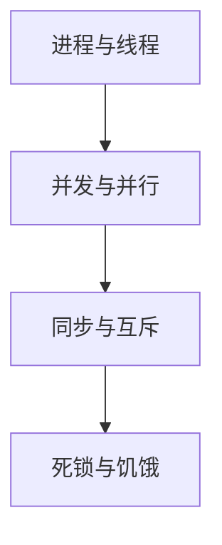

# 调度器的资源管理和优化

作者：禅与计算机程序设计艺术

## 1. 背景介绍

在现代计算机系统中,调度器扮演着至关重要的角色。它负责管理和分配系统资源,确保任务能够高效、公平地执行。一个优秀的调度器不仅能提高系统的整体性能,还能最大限度地利用有限的计算资源。本文将深入探讨调度器的资源管理和优化技术,分享实用的算法、数学模型以及工程实践经验。

### 1.1 调度器的功能与挑战
#### 1.1.1 调度器的主要职责
#### 1.1.2 资源管理面临的难题
#### 1.1.3 优化的必要性与目标

### 1.2 常见的调度策略
#### 1.2.1 先来先服务(FCFS)
#### 1.2.2 短作业优先(SJF) 
#### 1.2.3 时间片轮转(RR)
#### 1.2.4 多级反馈队列(MLFQ)

### 1.3 调度器性能评估指标
#### 1.3.1 周转时间与平均周转时间
#### 1.3.2 等待时间与平均等待时间  
#### 1.3.3 响应时间与平均响应时间
#### 1.3.4 资源利用率与公平性

## 2. 核心概念与联系

要深入理解调度器的资源管理与优化,我们需要掌握一些核心概念:

### 2.1 进程与线程
#### 2.1.1 进程的概念与特点
#### 2.1.2 线程的概念与特点
#### 2.1.3 进程与线程的区别与联系

### 2.2 并发与并行
#### 2.2.1 并发的定义与实现方式
#### 2.2.2 并行的定义与实现方式 
#### 2.2.3 并发与并行的区别与联系

### 2.3 同步与互斥
#### 2.3.1 临界区与竞争条件
#### 2.3.2 同步的概念与实现方法
#### 2.3.3 互斥的概念与实现方法

### 2.4 死锁与饥饿
#### 2.4.1 死锁的概念与产生条件
#### 2.4.2 死锁的预防、避免与检测
#### 2.4.3 饥饿的概念与解决方法

下图展示了这些核心概念之间的联系:



## 3. 核心算法原理具体操作步骤

本节将详细介绍几种经典的调度算法,包括它们的基本原理、优缺点以及具体实现步骤。

### 3.1 先来先服务(FCFS)算法
#### 3.1.1 算法原理
先来先服务算法根据任务到达的先后顺序进行调度,先到达的任务会先得到处理。

优点:
- 实现简单
- 公平

缺点: 
- 平均等待时间较长
- 对短作业不利

#### 3.1.2 算法步骤
1. 将任务按照到达时间排序 
2. 依次执行队列中的任务
3. 重复步骤2,直到所有任务执行完毕

### 3.2 短作业优先(SJF)算法
#### 3.2.1 算法原理
短作业优先算法优先调度执行时间最短的任务。

优点:
- 平均等待时间最优
- 有利于提高系统吞吐量

缺点:
- 实现较复杂 
- 可能导致饥饿

#### 3.2.2 算法步骤
1. 根据执行时间从小到大排序任务
2. 选择执行时间最短的任务执行
3. 重复步骤1-2,直到所有任务完成

### 3.3 时间片轮转(RR)算法 
#### 3.3.1 算法原理
时间片轮转算法为每个任务分配一个固定的CPU时间片,任务在时间片内执行。如果时间片结束后任务还未完成,则将其移至队尾等待下一轮调度。

优点:
- 适用于分时系统
- 响应时间较短

缺点:  
- 上下文切换开销大
- 难以确定最优时间片大小

#### 3.3.2 算法步骤
1. 为所有任务设置相同的时间片
2. 任务按到达顺序排队
3. 为队首任务分配CPU,任务执行一个时间片
4. 时间片用完,若任务还未完成,则将其移至队尾
5. 重复步骤3-4,直至所有任务完成

### 3.4 多级反馈队列(MLFQ)算法
#### 3.4.1 算法原理
多级反馈队列算法设置多个不同优先级的队列,每个队列使用不同的时间片。新任务会被放入最高优先级队列。如果任务在该队列的时间片内无法完成,则会被移入下一级队列,获得更长的时间片,以此类推。

优点:
- 兼顾了短作业和长作业
- 适应不同类型的任务负载

缺点:
- 实现复杂
- 参数调优困难

#### 3.4.2 算法步骤  
1. 设置N个不同优先级的队列,时间片逐级增大
2. 新任务进入Q0队列 
3. 当前队列的队首任务获得CPU,执行一个时间片
4. 时间片用完,若任务还未完成,则进入下一级队列
5. 重复步骤3-4,直至任务完成或到达最后一级队列
6. 最后一级队列的任务采用FCFS策略调度

## 4. 数学模型和公式详细讲解举例说明

为了更好地分析调度算法的性能,我们需要引入一些数学模型和公式。下面将详细讲解这些模型与公式,并给出具体的例子。

### 4.1 周转时间与平均周转时间

- 周转时间(Turnaround Time):是指任务从提交到完成所经历的时间。

设第 $i$ 个任务的提交时间为 $T_{i}^{s}$,完成时间为 $T_{i}^{f}$,则其周转时间 $T_{i}$ 为:

$$
T_{i}=T_{i}^{f}-T_{i}^{s}
$$

- 平均周转时间(Average Turnaround Time):是指所有任务的周转时间平均值。

设有 $n$ 个任务,则平均周转时间 $\bar{T}$ 为:

$$
\bar{T}=\frac{1}{n}\sum_{i=1}^{n}T_{i}
$$

举例:有3个任务,它们的提交时间和完成时间如下:

| 任务   | 提交时间 | 完成时间 |
|:----:|:-----:|:-----:|
| A    | 0     | 10    |
| B    | 1     | 7     |  
| C    | 3     | 12    |

则每个任务的周转时间为:
$$
T_{A} = 10 - 0 = 10 \\
T_{B} = 7 - 1 = 6 \\
T_{C} = 12 - 3 = 9
$$

平均周转时间为:
$$
\bar{T}=\frac{10+6+9}{3}=8.33
$$

### 4.2 等待时间与平均等待时间

- 等待时间(Waiting Time):是指任务从提交到开始执行所经历的时间。

设第 $i$ 个任务的提交时间为 $T_{i}^{s}$,开始执行时间为 $T_{i}^{e}$,则其等待时间 $W_{i}$ 为:

$$
W_{i}=T_{i}^{e}-T_{i}^{s}  
$$

- 平均等待时间(Average Waiting Time):是指所有任务的等待时间平均值。

设有 $n$ 个任务,则平均等待时间 $\bar{W}$ 为:  

$$
\bar{W}=\frac{1}{n}\sum_{i=1}^{n}W_{i}
$$

还是以上面的例子,假设3个任务的开始执行时间分别为:

| 任务   | 提交时间 | 开始执行时间 |  
|:----:|:-----:|:-------:|
| A    | 0     | 0       |
| B    | 1     | 3       | 
| C    | 3     | 7       |

则每个任务的等待时间为:
$$
W_{A} = 0 - 0 = 0 \\  
W_{B} = 3 - 1 = 2 \\ 
W_{C} = 7 - 3 = 4
$$

平均等待时间为:
$$
\bar{W}=\frac{0+2+4}{3}=2
$$

### 4.3 响应时间与平均响应时间

- 响应时间(Response Time):是指任务从提交到首次获得CPU所经历的时间。

设第 $i$ 个任务的提交时间为 $T_{i}^{s}$,首次获得CPU时间为 $T_{i}^{r}$,则其响应时间 $R_{i}$ 为:

$$
R_{i}=T_{i}^{r}-T_{i}^{s}
$$

- 平均响应时间(Average Response Time):是指所有任务的响应时间平均值。

设有 $n$ 个任务,则平均响应时间 $\bar{R}$ 为:

$$
\bar{R}=\frac{1}{n}\sum_{i=1}^{n}R_{i}  
$$

还是以上面的例子,假设3个任务首次获得CPU的时间分别为:

| 任务   | 提交时间 | 首次获得CPU时间 |
|:----:|:-----:|:---------:|
| A    | 0     | 0         |
| B    | 1     | 2         |
| C    | 3     | 5         |

则每个任务的响应时间为:  
$$
R_{A} = 0 - 0 = 0 \\
R_{B} = 2 - 1 = 1 \\ 
R_{C} = 5 - 3 = 2
$$

平均响应时间为:
$$  
\bar{R}=\frac{0+1+2}{3}=1
$$

这些数学模型和公式能够帮助我们定量分析调度算法的性能,为算法的优化提供依据。在实际系统中,我们需要权衡各项指标,选择适合具体场景的调度策略。

## 4. 项目实践:代码实例和详细解释说明

为了加深对调度算法的理解,下面我们将使用Python实现几种经典的调度算法,并给出详细的代码解释。

### 4.1 先来先服务(FCFS)算法

```python
def FCFS(processes):
    n = len(processes)
    waiting_time = [0] * n
    turnaround_time = [0] * n
    
    # 计算等待时间
    for i in range(1, n):
        waiting_time[i] = processes[i-1][1] + waiting_time[i-1]
    
    # 计算周转时间 
    for i in range(n):
        turnaround_time[i] = processes[i][1] + waiting_time[i]
        
    # 计算平均等待时间与平均周转时间
    avg_waiting_time = sum(waiting_time) / n
    avg_turnaround_time = sum(turnaround_time) / n
    
    return avg_waiting_time, avg_turnaround_time

# 测试
processes = [(0, 10), (1, 6), (2, 8)]
avg_waiting_time, avg_turnaround_time = FCFS(processes)
print(f"Average Waiting Time: {avg_waiting_time:.2f}")
print(f"Average Turnaround Time: {avg_turnaround_time:.2f}")
```

输出结果:

```
Average Waiting Time: 7.33
Average Turnaround Time: 15.33
```

代码解释:
- `processes`列表中的每个元组表示一个任务,第一个元素是任务的到达时间,第二个元素是任务的执行时间。
- 先计算每个任务的等待时间,等待时间等于前面所有任务的执行时间之和。
- 再计算每个任务的周转时间,周转时间等于任务的执行时间与等待时间之和。
- 最后计算平均等待时间与平均周转时间。

### 4.2 短作业优先(SJF)算法

```python
def SJF(processes):
    n = len(processes)
    waiting_time = [0] * n
    turnaround_time = [0] * n
    
    # 按执行时间排序
    processes.sort(key=lambda x: x[1])
    
    # 计算等待时间
    for i in range(1, n):
        waiting_time[i] = processes[i-1][1] + waiting_time[i-1]
    
    # 计算周转时间
    for i in range(n):
        turnaround_time[i] = processes[i][1] + waiting_time[i]