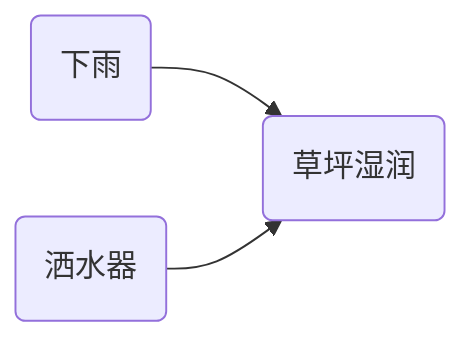

##  贝叶斯网络 原理与代码实例讲解

作者：禅与计算机程序设计艺术

## 1. 背景介绍

### 1.1 什么是贝叶斯网络？

贝叶斯网络（Bayesian Network），又称信念网络（Belief Network）或概率网络（Probabilistic Network），是一种概率图模型（Probabilistic Graphical Model，PGM），用于表示变量之间的概率依赖关系。它是一种有向无环图（Directed Acyclic Graph，DAG），其中节点表示随机变量，边表示变量之间的直接依赖关系。

### 1.2 贝叶斯网络的应用

贝叶斯网络在许多领域都有广泛的应用，包括：

* **医疗诊断:**  根据患者的症状推断疾病的概率。
* **风险评估:**  评估金融投资、自然灾害等事件发生的风险。
* **图像识别:**  识别图像中的物体和场景。
* **自然语言处理:**  进行文本分类、情感分析等任务。
* **故障诊断:**  识别复杂系统中故障的原因。

### 1.3 贝叶斯网络的优势

贝叶斯网络具有以下优势：

* **直观易懂:**  用图形化的方式表示变量之间的关系，易于理解。
* **处理不确定性:**  能够有效地处理现实世界中的不确定性和噪声。
* **进行推理:**  可以根据已知信息推断未知变量的概率分布。
* **学习能力:**  可以从数据中学习网络结构和参数。

## 2. 核心概念与联系

### 2.1  基本概念

* **随机变量 (Random Variable):**  可以随机取不同值的变量，用大写字母表示，如 $X$。
* **节点 (Node):**  图中的每个节点表示一个随机变量。
* **边 (Edge):**  有向边连接两个节点，表示变量之间的直接依赖关系。
* **父节点 (Parent Node):**  有向边指向的节点称为子节点的父节点。
* **子节点 (Child Node):**  有向边起始的节点称为父节点的子节点。
* **条件概率 (Conditional Probability):**  表示在已知某些事件发生的情况下，另一个事件发生的概率。例如，$P(A|B)$ 表示在事件 $B$ 发生的情况下，事件 $A$ 发生的概率。
* **联合概率 (Joint Probability):**  表示多个事件同时发生的概率。例如，$P(A,B)$ 表示事件 $A$ 和事件 $B$ 同时发生的概率。

### 2.2  贝叶斯定理 (Bayes' Theorem)

贝叶斯定理是贝叶斯网络的核心，它描述了如何根据先验概率和似然函数计算后验概率：

$$
P(A|B) = \frac{P(B|A)P(A)}{P(B)}
$$

其中：

* $P(A|B)$ 是后验概率，表示在已知事件 $B$ 发生的情况下，事件 $A$ 发生的概率。
* $P(B|A)$ 是似然函数，表示在事件 $A$ 发生的情况下，事件 $B$ 发生的概率。
* $P(A)$ 是先验概率，表示事件 $A$ 发生的概率。
* $P(B)$ 是边缘概率，表示事件 $B$ 发生的概率。

### 2.3  贝叶斯网络的表示

贝叶斯网络可以用一个有向无环图 (DAG) 表示，其中：

* 节点表示随机变量。
* 边表示变量之间的直接依赖关系，箭头指向被依赖的变量。
* 每个节点都有一个条件概率表 (Conditional Probability Table, CPT)，用于存储该节点在其父节点取不同值时的条件概率分布。

### 2.4  示例

以下是一个简单的贝叶斯网络示例，表示了草坪是否湿润、是否下雨和是否开启洒水器之间的关系：



该网络包含三个节点：下雨 (Rain)、洒水器 (Sprinkler) 和草坪湿润 (WetGrass)。下雨和洒水器是草坪湿润的父节点，表示草坪是否湿润取决于是否下雨和是否开启洒水器。

每个节点都有一个条件概率表，例如，草坪湿润节点的条件概率表如下：

| Rain | Sprinkler | WetGrass |
|---|---|---|
| True | True | 0.95 |
| True | False | 0.9 |
| False | True | 0.8 |
| False | False | 0.05 |

该表表示，如果下雨且开启洒水器，则草坪湿润的概率为 0.95；如果下雨但未开启洒水器，则草坪湿润的概率为 0.9；等等。

## 3. 核心算法原理具体操作步骤

### 3.1  推理 (Inference)

推理是指根据贝叶斯网络和已知信息推断未知变量的概率分布。常见的推理算法包括：

* **精确推理 (Exact Inference):**  计算所有变量的联合概率分布，然后根据需要边缘化或条件化得到目标变量的概率分布。
* **近似推理 (Approximate Inference):**  使用采样或变分方法近似计算目标变量的概率分布。

### 3.2  学习 (Learning)

学习是指从数据中学习贝叶斯网络的结构和参数。常见的学习算法包括：

* **参数学习 (Parameter Learning):**  在给定网络结构的情况下，从数据中学习节点的条件概率表。
* **结构学习 (Structure Learning):**  从数据中学习网络结构，包括节点和边。

### 3.3  操作步骤

使用贝叶斯网络进行推理或学习的基本步骤如下：

1. **构建网络:**  根据领域知识或数据构建贝叶斯网络，包括定义节点、边和条件概率表。
2. **输入证据:**  将已知信息输入网络，例如观测到的变量值。
3. **进行推理或学习:**  根据需要进行推理或学习，例如计算目标变量的概率分布或学习网络结构和参数。
4. **输出结果:**  输出推理或学习的结果，例如目标变量的概率分布或学习到的网络结构和参数。

## 4. 数学模型和公式详细讲解举例说明

### 4.1  联合概率分布

贝叶斯网络表示了所有变量的联合概率分布，可以根据网络结构和节点的条件概率表计算得到。

例如，对于上述草坪湿润的例子，所有变量的联合概率分布为：

$$
\begin{aligned}
P(Rain, Sprinkler, WetGrass) &= P(WetGrass | Rain, Sprinkler) P(Rain) P(Sprinkler) \\
&= P(WetGrass | Rain, Sprinkler) P(Rain) P(Sprinkler)
\end{aligned}
$$

### 4.2  边缘概率

边缘概率是指单个变量的概率分布，可以通过对联合概率分布进行边缘化得到。

例如，要计算草坪湿润的边缘概率 $P(WetGrass)$，可以对联合概率分布 $P(Rain, Sprinkler, WetGrass)$ 对 Rain 和 Sprinkler 进行求和：

$$
\begin{aligned}
P(WetGrass) &= \sum_{Rain} \sum_{Sprinkler} P(Rain, Sprinkler, WetGrass) \\
&= \sum_{Rain} \sum_{Sprinkler} P(WetGrass | Rain, Sprinkler) P(Rain) P(Sprinkler)
\end{aligned}
$$

### 4.3  条件概率

条件概率是指在已知某些事件发生的情况下，另一个事件发生的概率。

例如，要计算在已知下雨的情况下草坪湿润的概率 $P(WetGrass | Rain = True)$，可以使用贝叶斯定理：

$$
\begin{aligned}
P(WetGrass | Rain = True) &= \frac{P(Rain = True | WetGrass) P(WetGrass)}{P(Rain = True)} \\
&= \frac{P(Rain = True | WetGrass) P(WetGrass)}{\sum_{WetGrass} P(Rain = True | WetGrass) P(WetGrass)}
\end{aligned}
$$

## 5. 项目实践：代码实例和详细解释说明

### 5.1 Python 代码实例

以下是一个使用 Python 库 `pgmpy` 构建和使用贝叶斯网络的简单示例：

```python
from pgmpy.models import BayesianModel
from pgmpy.factors.discrete import TabularCPD

# 定义网络结构
model = BayesianModel([('Rain', 'WetGrass'), ('Sprinkler', 'WetGrass')])

# 定义条件概率表
cpd_rain = TabularCPD(variable='Rain', variable_card=2, values=[[0.7], [0.3]])
cpd_sprinkler = TabularCPD(variable='Sprinkler', variable_card=2, values=[[0.6], [0.4]])
cpd_wetgrass = TabularCPD(variable='WetGrass', variable_card=2, 
                           values=[[0.95, 0.9, 0.8, 0.05], 
                                   [0.05, 0.1, 0.2, 0.95]],
                           evidence=['Rain', 'Sprinkler'],
                           evidence_card=[2, 2])

# 将条件概率表添加到模型
model.add_cpds(cpd_rain, cpd_sprinkler, cpd_wetgrass)

# 检查模型是否有效
model.check_model()

# 进行推理
from pgmpy.inference import VariableElimination
infer = VariableElimination(model)

# 计算草坪湿润的概率
q = infer.query(variables=['WetGrass'])
print(q)

# 计算在已知下雨的情况下草坪湿润的概率
q = infer.query(variables=['WetGrass'], evidence={'Rain': 1})
print(q)
```

### 5.2 代码解释

1. **导入必要的库:** 
   - `BayesianModel` 用于创建贝叶斯网络模型。
   - `TabularCPD` 用于创建条件概率表。
   - `VariableElimination` 用于进行推理。

2. **定义网络结构:** 
   - 使用 `BayesianModel` 创建一个模型，并指定节点之间的关系。
   - `('Rain', 'WetGrass')` 表示 "Rain" 是 "WetGrass" 的父节点。

3. **定义条件概率表:** 
   - 使用 `TabularCPD` 创建每个节点的条件概率表。
   - `variable`: 节点名称。
   - `variable_card`: 节点的取值个数。
   - `values`: 条件概率表的值，是一个二维数组，行表示父节点的取值组合，列表示当前节点的取值。
   - `evidence`: 父节点列表（如果存在）。
   - `evidence_card`: 父节点的取值个数列表（如果存在）。

4. **将条件概率表添加到模型:** 
   - 使用 `model.add_cpds()` 将条件概率表添加到模型中。

5. **检查模型是否有效:** 
   - 使用 `model.check_model()` 检查模型是否有效，例如是否存在循环依赖。

6. **进行推理:** 
   - 创建一个 `VariableElimination` 对象，用于进行推理。
   - 使用 `infer.query()` 方法进行推理，可以指定要查询的变量和已知证据。

7. **输出结果:** 
   - 打印推理结果，例如目标变量的概率分布。

## 6. 实际应用场景

### 6.1  医疗诊断

贝叶斯网络可以用于医疗诊断，根据患者的症状推断疾病的概率。例如，可以使用贝叶斯网络构建一个诊断流感系统的模型，其中节点表示症状（例如发烧、咳嗽、喉咙痛）和疾病（例如流感），边表示症状和疾病之间的关系。

### 6.2  风险评估

贝叶斯网络可以用于风险评估，评估金融投资、自然灾害等事件发生的风险。例如，可以使用贝叶斯网络构建一个评估信用卡欺诈风险的模型，其中节点表示用户的交易历史、个人信息和欺诈行为，边表示这些因素之间的关系。

### 6.3  图像识别

贝叶斯网络可以用于图像识别，识别图像中的物体和场景。例如，可以使用贝叶斯网络构建一个识别手写数字的模型，其中节点表示图像中的像素，边表示像素之间的关系。

### 6.4  自然语言处理

贝叶斯网络可以用于自然语言处理，进行文本分类、情感分析等任务。例如，可以使用贝叶斯网络构建一个垃圾邮件过滤器的模型，其中节点表示邮件中的词汇，边表示词汇之间的关系。

## 7. 工具和资源推荐

### 7.1  Python 库

* **pgmpy:**  一个用于概率图模型的 Python 库，提供了构建、推理和学习贝叶斯网络的功能。
* **pymc3:**  一个用于概率编程的 Python 库，也可以用于构建和使用贝叶斯网络。

### 7.2  书籍

* **Probabilistic Graphical Models: Principles and Techniques** by Daphne Koller and Nir Friedman
* **Bayesian Reasoning and Machine Learning** by David Barber

### 7.3  在线资源

* **Bayesian Network Repository:**  一个收集了各种贝叶斯网络模型的网站。
* **Stanford CS228: Probabilistic Graphical Models:**  斯坦福大学的一门关于概率图模型的课程，提供了丰富的学习资源。

## 8. 总结：未来发展趋势与挑战

### 8.1  未来发展趋势

* **深度学习与贝叶斯网络的结合:**  将深度学习的特征提取能力与贝叶斯网络的推理能力相结合，构建更强大的模型。
* **动态贝叶斯网络:**  用于建模随时间变化的系统。
* **因果推理:**  使用贝叶斯网络进行因果关系的推断。

### 8.2  挑战

* **计算复杂性:**  对于大型和复杂的贝叶斯网络，推理和学习的计算复杂度很高。
* **数据需求:**  学习贝叶斯网络需要大量的训练数据。
* **模型解释性:**  贝叶斯网络的推理过程比较复杂，模型的解释性较差。

## 9. 附录：常见问题与解答

### 9.1  如何选择贝叶斯网络的结构？

贝叶斯网络的结构可以根据领域知识或数据进行选择。可以使用专家知识手动构建网络结构，也可以使用结构学习算法从数据中学习网络结构。

### 9.2  如何处理连续变量？

贝叶斯网络通常用于处理离散变量。如果要处理连续变量，可以使用高斯贝叶斯网络或将连续变量离散化。

### 9.3  如何评估贝叶斯网络的性能？

可以使用多种指标评估贝叶斯网络的性能，例如对数似然、AUC 等。