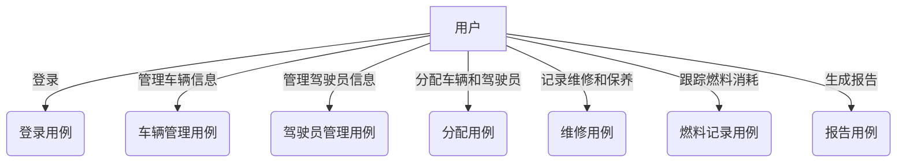

# 车辆管理系统详细设计与具体代码实现

## 1.背景介绍

### 1.1 车辆管理系统概述

车辆管理系统是一种用于管理和跟踪车辆信息的软件应用程序。它旨在帮助组织高效管理其车队,提高运营效率和降低成本。该系统通常包括以下功能:

- 车辆信息管理:记录和跟踪每辆车的详细信息,如型号、制造年份、车牌号码等。
- 维修和保养记录:跟踪每辆车的维修和保养历史,以便及时安排维护。
- 燃料消耗跟踪:监控每辆车的燃料使用情况,优化燃料效率。
- 驾驶员管理:分配驾驶员给特定车辆,跟踪驾驶记录。
- 车队调度:根据需求智能分配车辆和驾驶员。
- 报告和分析:生成各种报告,如使用情况、成本分析等,以支持决策。

### 1.2 系统的必要性

有效的车辆管理对于任何拥有车队的组织都是至关重要的。一个健全的车辆管理系统可以带来以下好处:

- 降低运营成本:通过优化车辆使用、减少浪费和延长车辆使用寿命。
- 提高效率:自动化流程,减少手动管理的工作量。
- 改善安全性:确保车辆得到适当维护,降低事故风险。
- 合规性:满足相关法规和政策要求。
- 决策支持:提供数据分析,支持管理层做出明智决策。

## 2.核心概念与联系

### 2.1 系统架构概览

车辆管理系统通常采用三层或多层架构,包括:

1. **表现层(Presentation Layer)**: 用户界面,允许用户与系统交互。
2. **业务逻辑层(Business Logic Layer)**: 处理系统的核心功能和业务规则。
3. **数据访问层(Data Access Layer)**: 与数据库交互,执行数据存储和检索操作。


### 2.2 核心实体和关系

车辆管理系统的核心实体包括:

- **Vehicle(车辆)**: 描述车辆的基本信息,如型号、制造年份、车牌号等。
- **Driver(驾驶员)**: 包含驾驶员的个人信息和驾驶记录。
- **Maintenance(维修)**: 记录车辆的维修和保养历史。
- **FuelLog(燃料记录)**: 跟踪每辆车的燃料消耗情况。
- **Assignment(分配)**: 将特定车辆分配给特定驾驶员。

这些实体之间存在以下关系:

- 一辆车可以分配给多个驾驶员,一个驾驶员也可以驾驶多辆车。(多对多关系)
- 一辆车可以有多条维修记录,一条维修记录只属于一辆车。(一对多关系)
- 一辆车可以有多条燃料记录,一条燃料记录只属于一辆车。(一对多关系)

### 2.3 系统用例图



上图展示了车辆管理系统的主要用例,涵盖了管理车辆、驾驶员、维修、燃料和报告生成等核心功能。

## 3.核心算法原理具体操作步骤  

### 3.1 车辆分配算法

车辆分配是车辆管理系统的一个关键功能,需要考虑多个因素来优化分配结果。一种常见的分配算法是**匈牙利算法(Hungarian algorithm)**,它可以解决线性赋值问题。

匈牙利算法步骤:

1. 构建代价矩阵(Cost Matrix),其中每个元素表示将一个驾驶员分配给一辆车的代价。
2. 对每一行进行减法操作,使该行存在至少一个0。
3. 对每一列进行减法操作,使该列存在至少一个0。
4. 用直线划掉所有0,使用最少的直线。
5. 如果划线的直线数等于矩阵的阶数,则已经找到最优分配方案。否则,进入步骤6。
6. 找到一个未被覆盖的最小元素,将它减去矩阵中所有被直线覆盖的元素,再加到与它相交的每条直线所覆盖的所有元素上。
7. 重复步骤4到6,直到划线数等于矩阵阶数。

通过上述步骤,可以找到一种分配方案,使总代价最小。在实际应用中,代价矩阵可以根据具体需求进行定制,如考虑驾驶员的技能、车辆类型等因素。

### 3.2 维修预测算法

为了优化车辆维护计划并减少意外故障,系统可以使用机器学习算法来预测车辆的维修需求。一种常见的方法是基于车辆的历史维修数据训练分类模型。

以下是一个使用逻辑回归进行维修预测的示例:

1. **数据预处理**:从维修记录中提取特征,如里程数、使用时间、上次维修距今时间等,并进行标准化。
2. **构建训练集和测试集**:将数据划分为训练集和测试集,例如使用80%数据作为训练集。
3. **模型训练**:使用scikit-learn等机器学习库,在训练集上训练逻辑回归模型。
4. **模型评估**:在测试集上评估模型的性能,计算准确率、精确率、召回率等指标。
5. **模型调优**:根据评估结果,调整模型超参数或特征工程以提高性能。
6. **模型部署**:将训练好的模型集成到车辆管理系统中,定期为每辆车输出维修需求概率。

除了逻辑回归,也可以尝试其他分类算法如决策树、随机森林等。此外,时间序列分析等方法也可用于预测未来的维修需求趋势。

## 4.数学模型和公式详细讲解举例说明

### 4.1 逻辑回归模型

逻辑回归是一种广泛应用的机器学习算法,用于解决二分类问题。在车辆维修预测场景中,我们可以将其用于预测车辆是否需要维修。

逻辑回归模型的数学表达式如下:

$$P(Y=1|X) = \sigma(w^TX + b)$$

其中:

- $P(Y=1|X)$ 表示给定特征向量 $X$ 时,事件发生的概率(即需要维修)
- $\sigma(z) = \frac{1}{1 + e^{-z}}$ 是 Sigmoid 函数,将线性函数的输出映射到 (0,1) 范围内
- $w$ 是模型权重向量,表示每个特征的重要性
- $b$ 是偏置项(bias term)
- $w^TX + b$ 是线性函数的结果

在训练阶段,我们需要找到最优的 $w$ 和 $b$,使得训练数据的对数似然函数最大化:

$$\max_{w,b} \sum_{i=1}^N [y_i \log P(Y=1|X_i) + (1-y_i)\log(1-P(Y=1|X_i))]$$

其中 $N$ 是训练样本数量, $y_i$ 是第 $i$ 个样本的真实标签(0 或 1)。

通过梯度下降等优化算法,可以迭代更新 $w$ 和 $b$,直到收敛。

在预测阶段,对于新的车辆数据 $X_{new}$,我们可以计算:

$$P(Y=1|X_{new}) = \sigma(w^TX_{new} + b)$$

如果该概率大于某个阈值(通常取 0.5),则预测该车辆需要维修,否则无需维修。

### 4.2 匈牙利算法代价矩阵

在车辆分配问题中,我们可以构建一个代价矩阵(Cost Matrix) $C$,其中 $C_{ij}$ 表示将第 $i$ 个驾驶员分配给第 $j$ 辆车的代价。我们的目标是找到一种分配方案,使总代价最小。

假设有 $n$ 个驾驶员和 $n$ 辆车,代价矩阵 $C$ 是一个 $n \times n$ 的矩阵:

$$C = \begin{bmatrix}
    c_{11} & c_{12} & \cdots & c_{1n} \\
    c_{21} & c_{22} & \cdots & c_{2n} \\
    \vdots & \vdots & \ddots & \vdots \\
    c_{n1} & c_{n2} & \cdots & c_{nn}
\end{bmatrix}$$

我们希望找到一个置换 $\pi$,使得:

$$\sum_{i=1}^n c_{i\pi(i)}$$

达到最小值。这就是著名的线性赋值问题,可以通过匈牙利算法高效解决。

## 5.项目实践:代码实例和详细解释说明

本节将提供一些核心功能的代码实现示例,并对关键部分进行详细解释。我们将使用 Python 作为编程语言,并采用 Flask Web 框架和 SQLAlchemy ORM 工具。

### 5.1 数据模型定义

我们首先定义系统的核心数据模型,对应于前面介绍的实体和关系。

```python
from flask_sqlalchemy import SQLAlchemy

db = SQLAlchemy()

# 定义车辆模型
class Vehicle(db.Model):
    id = db.Column(db.Integer, primary_key=True)
    license_plate = db.Column(db.String(10), nullable=False, unique=True)
    make = db.Column(db.String(50), nullable=False)
    model = db.Column(db.String(50), nullable=False)
    year = db.Column(db.Integer, nullable=False)
    maintenance_records = db.relationship('Maintenance', backref='vehicle', lazy='dynamic')
    fuel_logs = db.relationship('FuelLog', backref='vehicle', lazy='dynamic')

# 定义驾驶员模型
class Driver(db.Model):
    id = db.Column(db.Integer, primary_key=True)
    name = db.Column(db.String(100), nullable=False)
    license_number = db.Column(db.String(20), nullable=False, unique=True)

# 定义维修记录模型
class Maintenance(db.Model):
    id = db.Column(db.Integer, primary_key=True)
    vehicle_id = db.Column(db.Integer, db.ForeignKey('vehicle.id'), nullable=False)
    date = db.Column(db.Date, nullable=False)
    description = db.Column(db.Text, nullable=False)
    cost = db.Column(db.Float, nullable=False)

# 定义燃料记录模型
class FuelLog(db.Model):
    id = db.Column(db.Integer, primary_key=True)
    vehicle_id = db.Column(db.Integer, db.ForeignKey('vehicle.id'), nullable=False)
    date = db.Column(db.Date, nullable=False)
    amount = db.Column(db.Float, nullable=False)
    cost = db.Column(db.Float, nullable=False)

# 定义分配模型
assignments = db.Table('assignments',
    db.Column('driver_id', db.Integer, db.ForeignKey('driver.id'), primary_key=True),
    db.Column('vehicle_id', db.Integer, db.ForeignKey('vehicle.id'), primary_key=True)
)
```

这些模型类对应于数据库中的表,并定义了各个字段。`db.relationship` 用于建立模型之间的关联关系。

### 5.2 RESTful API 实现

接下来,我们实现一个 RESTful API,用于对车辆、驾驶员等资源进行 CRUD(创建、读取、更新、删除)操作。

```python
from flask import Flask, jsonify, request
from models import Vehicle, Driver, Maintenance, FuelLog, db

app = Flask(__name__)
app.config['SQLALCHEMY_DATABASE_URI'] = 'sqlite:///fleet.db'
db.init_app(app)

# 车辆相关API
@app.