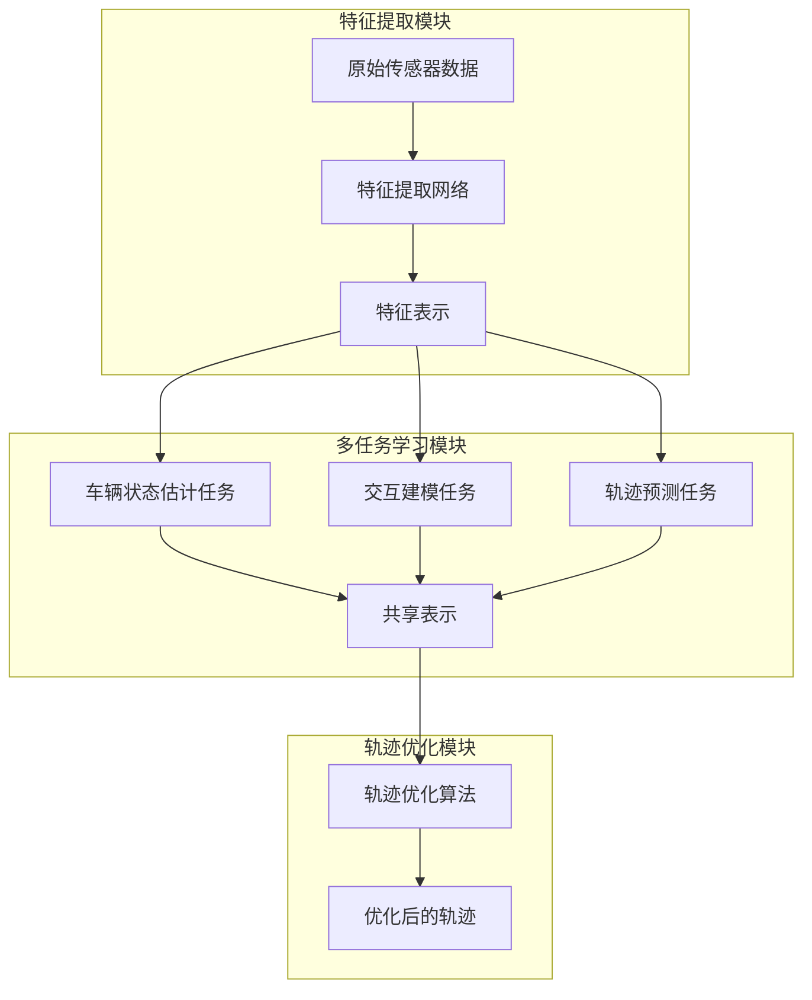

# 车辆群体感知中轨迹优化的多任务学习模型

## 1.背景介绍

### 1.1 车辆群体感知的重要性

在自动驾驶和智能交通系统中,车辆群体感知是一个关键的挑战。准确预测周围车辆的运动轨迹对于规划安全、高效的路线至关重要。传统的单车辆轨迹预测方法存在一些局限性,因为它们无法充分利用车辆之间的相互影响和交互信息。

### 1.2 现有方法的局限性

现有的基于机器学习的车辆轨迹预测模型大多只关注单个车辆,忽视了车辆群体之间的相互影响。另一方面,显式建模车辆交互的方法通常依赖于手工设计的规则和假设,难以捕捉复杂的交互模式。

### 1.3 多任务学习的优势

多任务学习(Multi-Task Learning, MTL)是一种有前景的范式,可以同时学习多个相关任务,提高模型的泛化能力和鲁棒性。通过在相关任务之间共享知识,MTL可以学习更加通用和可迁移的表示,从而提高单个任务的性能。

## 2.核心概念与联系

### 2.1 车辆群体感知

车辆群体感知旨在从传感器数据(如激光雷达、雷达和摄像头)中推断出周围车辆的状态(位置、速度、加速度等)及其相互作用。这是一个具有挑战性的问题,需要从原始数据中提取有意义的模式和特征。

### 2.2 轨迹预测

轨迹预测是指根据车辆的当前状态和历史轨迹,预测未来一段时间内车辆的运动轨迹。准确的轨迹预测对于规划安全路线、避免潜在碰撞至关重要。

### 2.3 多任务学习

多任务学习(MTL)是一种机器学习范式,旨在同时学习多个相关任务,以提高每个单一任务的性能。MTL利用了不同任务之间的相关性,通过在底层特征空间中共享知识来提高模型的泛化能力。

在车辆群体感知中,MTL可以将车辆状态估计、交互建模和轨迹预测等任务联合起来学习,从而获得更加鲁棒和准确的预测结果。

## 3.核心算法原理具体操作步骤

我们提出了一种基于多任务学习的车辆群体感知和轨迹优化模型,旨在同时学习车辆状态估计、交互建模和轨迹预测等任务。该模型的核心思想是利用共享的底层表示来捕获车辆之间的相互影响,并通过联合优化不同任务的损失函数来提高整体性能。

### 3.1 模型架构

我们的模型由三个主要模块组成:

1. **特征提取模块**:从原始传感器数据(如激光雷达点云、图像等)中提取有意义的特征表示。
2. **多任务学习模块**:将车辆状态估计、交互建模和轨迹预测等任务联合起来学习,通过共享底层表示来捕获车辆之间的相互影响。
3. **轨迹优化模块**:基于预测的车辆状态和交互信息,优化每辆车的未来轨迹,以实现更安全、更高效的路线规划。



### 3.2 特征提取

我们使用深度神经网络从原始传感器数据(如激光雷达点云、图像等)中提取有意义的特征表示。具体来说,我们采用了基于注意力机制的点云特征编码器和卷积神经网络等技术,以捕获车辆的空间和视觉特征。

### 3.3 多任务学习

在多任务学习模块中,我们将车辆状态估计、交互建模和轨迹预测等任务联合起来学习。具体来说,我们采用了共享编码器-多任务解码器的架构,其中编码器用于从特征表示中学习共享的底层表示,而解码器则专门处理每个单独的任务。

通过在底层表示中捕获车辆之间的相互影响,我们的模型可以更好地理解复杂的交互模式,从而提高每个单一任务的性能。

我们定义了一个多任务损失函数,将不同任务的损失加权求和,并通过反向传播算法进行联合优化。具体的损失函数定义如下:

$$
\mathcal{L}_{total} = \lambda_1 \mathcal{L}_{state} + \lambda_2 \mathcal{L}_{interaction} + \lambda_3 \mathcal{L}_{trajectory}
$$

其中,$ \mathcal{L}_{state} $、$ \mathcal{L}_{interaction} $和$ \mathcal{L}_{trajectory} $分别表示车辆状态估计、交互建模和轨迹预测任务的损失函数,而$ \lambda_1 $、$ \lambda_2 $和$ \lambda_3 $是相应的权重系数。

### 3.4 轨迹优化

在轨迹优化模块中,我们基于预测的车辆状态和交互信息,优化每辆车的未来轨迹。我们采用了一种基于优化的方法,将车辆安全、效率和舒适性等目标函数纳入考虑,并在满足一定约束条件(如车辆动力学约束、交通规则约束等)的前提下,求解最优轨迹。

具体来说,我们将轨迹优化问题建模为一个非线性优化问题,目标函数包括以下几个部分:

1. **安全性**: 最小化与其他车辆和障碍物的距离,避免潜在碰撞。
2. **效率**: 最小化行驶距离和时间,提高效率。
3. **舒适性**: 最小化加速度和转向角的变化率,提高乘坐舒适度。
4. **一致性**: 最小化与预测轨迹的偏差,确保优化后的轨迹与预测结果一致。

我们采用了序列卷积优化器(Sequential Convex Optimization)等算法求解该优化问题,以获得最优的未来轨迹。

## 4.数学模型和公式详细讲解举例说明

在本节中,我们将详细介绍我们模型中使用的一些关键数学模型和公式。

### 4.1 车辆运动模型

为了准确预测车辆的未来轨迹,我们需要建立一个合适的车辆运动模型。在本文中,我们采用了基于双曲线的运动模型,该模型可以很好地描述车辆在平面上的运动。

车辆的位置$(x, y)$可以用以下双曲线参数方程表示:

$$
\begin{aligned}
x(t) &= x_0 + v_x t + a_x \frac{t^2}{2} \\
y(t) &= y_0 + v_y t + a_y \frac{t^2}{2}
\end{aligned}
$$

其中,$(x_0, y_0)$是初始位置,$(v_x, v_y)$是初始速度,$(a_x, a_y)$是加速度。通过估计这些参数,我们可以预测车辆在未来时刻$t$的位置。

### 4.2 交互建模

为了捕获车辆之间的相互影响,我们需要建立一个合适的交互模型。在本文中,我们采用了基于注意力机制的交互模型,该模型可以自适应地捕获不同车辆之间的相关性。

具体来说,对于第$i$辆车辆,我们计算它与其他车辆之间的注意力权重$\alpha_{ij}$,表示第$j$辆车辆对第$i$辆车辆的影响程度。注意力权重的计算公式如下:

$$
\alpha_{ij} = \frac{\exp(f(h_i, h_j))}{\sum_{k \neq i} \exp(f(h_i, h_k))}
$$

其中,$h_i$和$h_j$分别表示第$i$辆和第$j$辆车辆的特征表示,而$f$是一个可学习的评分函数,用于衡量两辆车辆之间的相关性。

通过将其他车辆的特征表示加权求和,我们可以获得第$i$辆车辆的交互表示$z_i$:

$$
z_i = \sum_{j \neq i} \alpha_{ij} h_j
$$

该交互表示可以用于指导第$i$辆车辆的轨迹预测和优化过程,从而考虑了车辆之间的相互影响。

### 4.3 轨迹优化目标函数

在轨迹优化模块中,我们需要定义一个合适的目标函数,该函数将车辆安全、效率和舒适性等因素纳入考虑。我们的目标函数包括以下几个部分:

1. **安全性目标**:最小化与其他车辆和障碍物的距离,避免潜在碰撞。

$$
\mathcal{J}_{safety} = \sum_{t} \sum_{j \neq i} \exp(-d_{ij}(t))
$$

其中,$d_{ij}(t)$表示第$i$辆车辆与第$j$辆车辆在时刻$t$的距离。

2. **效率目标**:最小化行驶距离和时间,提高效率。

$$
\mathcal{J}_{efficiency} = \sum_{t} \| p_i(t) - p_{target} \|_2 + \gamma \sum_{t} \| v_i(t) \|_2
$$

其中,$p_i(t)$和$v_i(t)$分别表示第$i$辆车辆在时刻$t$的位置和速度,$p_{target}$是目标位置,而$\gamma$是一个权重系数。

3. **舒适性目标**:最小化加速度和转向角的变化率,提高乘坐舒适度。

$$
\mathcal{J}_{comfort} = \sum_{t} \| a_i(t) \|_2 + \beta \sum_{t} \| \dot{\theta}_i(t) \|_2
$$

其中,$a_i(t)$和$\dot{\theta}_i(t)$分别表示第$i$辆车辆在时刻$t$的加速度和转向角变化率,而$\beta$是一个权重系数。

4. **一致性目标**:最小化与预测轨迹的偏差,确保优化后的轨迹与预测结果一致。

$$
\mathcal{J}_{consistency} = \sum_{t} \| p_i^*(t) - p_i(t) \|_2
$$

其中,$p_i^*(t)$和$p_i(t)$分别表示第$i$辆车辆在时刻$t$的预测位置和优化后的位置。

将上述目标函数加权求和,我们可以得到最终的优化目标函数:

$$
\mathcal{J}_{total} = \omega_1 \mathcal{J}_{safety} + \omega_2 \mathcal{J}_{efficiency} + \omega_3 \mathcal{J}_{comfort} + \omega_4 \mathcal{J}_{consistency}
$$

其中,$\omega_1$、$\omega_2$、$\omega_3$和$\omega_4$是相应的权重系数。

通过求解该优化问题,我们可以获得满足安全、效率和舒适性要求的最优轨迹。

## 5.项目实践:代码实例和详细解释说明

在这一节中,我们将提供一些代码示例,以帮助读者更好地理解我们提出的多任务学习模型。这些代码示例是基于Python和PyTorch编写的,并使用了一些流行的机器学习库,如NumPy和Pandas。

### 5.1 数据预处理

在开始训练模型之前,我们需要对原始数据进行预处理。下面是一个示例代码,展示了如何从原始传感器数据中提取特征表示:

```python
import numpy as np
from sklearn.preprocessing import StandardScaler

# 加载原始数据
raw_data = np.load('sensor_data.npz')
lidar_points = raw_data['lidar_points']
radar_tracks = raw_data['radar_tracks']
camera_images = raw_data['camera_images']

# 特征提取
lidar_features = extract_lidar_features(lidar_points)
radar_features =