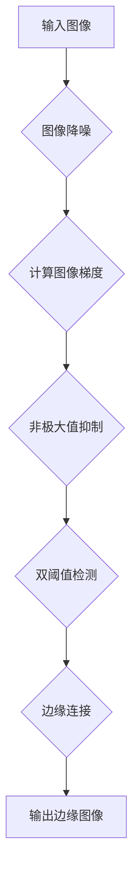

##  边缘检测原理与代码实例讲解

作者：禅与计算机程序设计艺术

## 1. 背景介绍

### 1.1 什么是图像边缘？

在数字图像处理领域，**图像边缘**指的是图像局部区域亮度变化显著的部分。它是图像最基本的特征之一，包含了图像形状、物体边界等丰富的信息。边缘检测是图像处理和计算机视觉中的基本问题，其目的是标识数字图像中亮度变化明显的点。图像边缘检测大幅度地减少了数据量，并且剔除了可以认为不相关的信息，保留了图像重要的结构属性。

### 1.2 边缘检测的应用

边缘检测技术应用广泛，例如：

* **图像识别:**  识别图像中的物体、人脸等。
* **目标跟踪:**  跟踪视频序列中的运动目标。
* **三维重建:** 从多幅图像中重建三维场景。
* **医学图像分析:**  识别医学图像中的病变区域。
* **自动驾驶:**  识别道路边界、交通标志等。

### 1.3 边缘检测算法的发展历程

早期的边缘检测算法主要基于图像的一阶导数和二阶导数，例如Roberts算子、Sobel算子、Prewitt算子、Laplacian算子等。这些算法简单快速，但对噪声敏感，容易产生伪边缘。

随着计算机技术的进步，涌现出了许多更先进的边缘检测算法，例如Canny算子、SUSAN算子、Haralick算子等。这些算法能够更好地抑制噪声，提取更准确的边缘信息。

## 2. 核心概念与联系

### 2.1 图像梯度

图像梯度是图像亮度变化的速度和方向的度量。它是一个二维向量，包含两个分量：水平梯度和垂直梯度。

* **水平梯度:**  表示图像在水平方向上的亮度变化率。
* **垂直梯度:**  表示图像在垂直方向上的亮度变化率。

图像梯度的幅值表示图像亮度变化的剧烈程度，梯度的方向表示图像亮度变化最快的方向。

### 2.2 梯度算子

梯度算子是一类用来计算图像梯度的算子。常用的梯度算子有：

* **Roberts算子:**  使用2x2的卷积核，对噪声敏感。
* **Sobel算子:**  使用3x3的卷积核，对噪声更鲁棒。
* **Prewitt算子:**  与Sobel算子类似，但对水平方向和垂直方向的权重不同。

### 2.3 边缘检测算法

边缘检测算法利用图像梯度信息来检测图像边缘。常见的边缘检测算法有：

* **Canny算子:**  是一种多级边缘检测算法，能够有效地抑制噪声，提取更准确的边缘信息。
* **SUSAN算子:**  是一种基于区域的边缘检测算法，对噪声和光照变化不敏感。
* **Haralick算子:**  是一种基于统计学的边缘检测算法，能够检测不同方向的边缘。

## 3. 核心算法原理具体操作步骤

### 3.1 Canny边缘检测算法

Canny边缘检测算法是一种经典的边缘检测算法，其主要步骤如下：

1. **图像降噪:** 使用高斯滤波器对图像进行平滑处理，去除噪声。
2. **计算图像梯度:** 使用Sobel算子或其他梯度算子计算图像的水平梯度和垂直梯度。
3. **非极大值抑制:** 对于每个像素点，判断其梯度幅值是否是其邻域内的最大值，如果不是，则将其梯度幅值设为0。
4. **双阈值检测:** 设置两个阈值，高阈值和低阈值。梯度幅值大于高阈值的像素点被认为是强边缘像素，梯度幅值小于低阈值的像素点被认为是非边缘像素，介于两者之间的像素点被认为是弱边缘像素。
5. **边缘连接:** 将弱边缘像素连接到强边缘像素上，形成完整的边缘。

### 3.2 Sobel算子

Sobel算子是一种常用的梯度算子，其卷积核如下：

**水平方向:**

```
-1 0 1
-2 0 2
-1 0 1
```

**垂直方向:**

```
-1 -2 -1
 0  0  0
 1  2  1
```

Sobel算子通过卷积运算计算图像的水平梯度和垂直梯度。

### 3.3 非极大值抑制

非极大值抑制的目的是去除非边缘像素，保留真正的边缘像素。其原理是：对于每个像素点，判断其梯度幅值是否是其邻域内的最大值，如果不是，则将其梯度幅值设为0。

### 3.4 双阈值检测

双阈值检测的目的是区分强边缘像素、弱边缘像素和非边缘像素。其原理是：设置两个阈值，高阈值和低阈值。梯度幅值大于高阈值的像素点被认为是强边缘像素，梯度幅值小于低阈值的像素点被认为是非边缘像素，介于两者之间的像素点被认为是弱边缘像素。

### 3.5 边缘连接

边缘连接的目的是将弱边缘像素连接到强边缘像素上，形成完整的边缘。其原理是：从强边缘像素开始，沿着梯度方向搜索弱边缘像素，并将它们连接起来。

## 4. 数学模型和公式详细讲解举例说明

### 4.1 图像梯度

图像梯度可以使用如下公式计算：

$$
\nabla f(x,y) = \begin{bmatrix} G_x \\ G_y \end{bmatrix} = \begin{bmatrix} \frac{\partial f}{\partial x} \\ \frac{\partial f}{\partial y} \end{bmatrix} 
$$

其中，$f(x,y)$ 表示图像在 $(x,y)$ 处的像素值，$G_x$ 和 $G_y$ 分别表示水平梯度和垂直梯度。

### 4.2 Sobel算子

Sobel算子的卷积核可以表示为如下矩阵：

**水平方向:**

$$
S_x = \begin{bmatrix} -1 & 0 & 1 \\ -2 & 0 & 2 \\ -1 & 0 & 1 \end{bmatrix}
$$

**垂直方向:**

$$
S_y = \begin{bmatrix} -1 & -2 & -1 \\ 0 & 0 & 0 \\ 1 & 2 & 1 \end{bmatrix}
$$

Sobel算子通过卷积运算计算图像的水平梯度和垂直梯度：

$$
G_x = S_x * I \\
G_y = S_y * I
$$

其中，$I$ 表示输入图像。

### 4.3 梯度幅值和方向

梯度幅值和方向可以使用如下公式计算：

$$
\begin{aligned}
|G| &= \sqrt{G_x^2 + G_y^2} \\
\theta &= \arctan(\frac{G_y}{G_x})
\end{aligned}
$$

### 4.4 非极大值抑制

非极大值抑制可以使用如下算法实现：

```
for each pixel (x,y) in the image:
  # Calculate the gradient magnitude and direction
  magnitude = |G(x,y)|
  direction = theta(x,y)

  # Determine the neighboring pixels in the gradient direction
  if direction == 0:
    neighbors = [(x-1,y), (x+1,y)]
  elif direction == 45:
    neighbors = [(x-1,y-1), (x+1,y+1)]
  elif direction == 90:
    neighbors = [(x,y-1), (x,y+1)]
  else:
    neighbors = [(x-1,y+1), (x+1,y-1)]

  # If the gradient magnitude is not the maximum among its neighbors, suppress it
  if magnitude <= max([|G(nx,ny)| for (nx,ny) in neighbors]):
    magnitude = 0

  # Update the gradient magnitude
  |G(x,y)| = magnitude
```

### 4.5 双阈值检测

双阈值检测可以使用如下算法实现：

```
# Define the high and low thresholds
high_threshold = ...
low_threshold = ...

# Create two binary images, one for strong edges and one for weak edges
strong_edges = |G| > high_threshold
weak_edges = (|G| > low_threshold) & (|G| <= high_threshold)
```

### 4.6 边缘连接

边缘连接可以使用如下算法实现：

```
# Iterate over the weak edges
for each pixel (x,y) in weak_edges:
  # If the pixel is connected to a strong edge, mark it as a strong edge
  if any([(nx,ny) in strong_edges for (nx,ny) in neighbors(x,y)]):
    strong_edges(x,y) = True
```

## 5. 项目实践：代码实例和详细解释说明

### 5.1 Python代码实现

以下是一个使用Python实现Canny边缘检测算法的例子：

```python
import cv2
import numpy as np

# Load the image
image = cv2.imread('input.jpg', cv2.IMREAD_GRAYSCALE)

# Apply Gaussian blur to reduce noise
blurred_image = cv2.GaussianBlur(image, (5, 5), 0)

# Calculate the gradients using the Sobel operator
grad_x = cv2.Sobel(blurred_image, cv2.CV_64F, 1, 0, ksize=3)
grad_y = cv2.Sobel(blurred_image, cv2.CV_64F, 0, 1, ksize=3)

# Calculate the gradient magnitude and direction
grad_magnitude = np.sqrt(grad_x**2 + grad_y**2)
grad_direction = np.arctan2(grad_y, grad_x)

# Perform non-maximum suppression
nms_output = np.zeros_like(grad_magnitude)
for i in range(1, grad_magnitude.shape[0] - 1):
    for j in range(1, grad_magnitude.shape[1] - 1):
        # Determine the neighboring pixels in the gradient direction
        angle = grad_direction[i, j]
        if (0 <= angle < 22.5) or (157.5 <= angle <= 180) or (-22.5 <= angle < 0) or (-180 <= angle < -157.5):
            neighbors = [(i - 1, j), (i + 1, j)]
        elif (22.5 <= angle < 67.5) or (-157.5 <= angle < -112.5):
            neighbors = [(i - 1, j - 1), (i + 1, j + 1)]
        elif (67.5 <= angle < 112.5) or (-112.5 <= angle < -67.5):
            neighbors = [(i, j - 1), (i, j + 1)]
        else:
            neighbors = [(i - 1, j + 1), (i + 1, j - 1)]

        # If the gradient magnitude is the maximum among its neighbors, keep it
        if grad_magnitude[i, j] == np.max([grad_magnitude[x, y] for x, y in neighbors]):
            nms_output[i, j] = grad_magnitude[i, j]

# Perform double thresholding
high_threshold = 100
low_threshold = 50
strong_edges = nms_output > high_threshold
weak_edges = (nms_output > low_threshold) & (nms_output <= high_threshold)

# Perform edge linking
edges = strong_edges.copy()
for i in range(1, weak_edges.shape[0] - 1):
    for j in range(1, weak_edges.shape[1] - 1):
        if weak_edges[i, j] and np.any(edges[i - 1:i + 2, j - 1:j + 2]):
            edges[i, j] = True

# Display the edges
cv2.imshow('Edges', edges.astype(np.uint8) * 255)
cv2.waitKey(0)
```

### 5.2 代码解释

* 首先，加载图像并将其转换为灰度图像。
* 然后，使用高斯滤波器对图像进行平滑处理，以减少噪声。
* 接下来，使用Sobel算子计算图像的水平梯度和垂直梯度。
* 然后，计算梯度幅值和方向。
* 接下来，执行非极大值抑制，以去除非边缘像素。
* 然后，执行双阈值处理，以区分强边缘像素、弱边缘像素和非边缘像素。
* 最后，执行边缘连接，将弱边缘像素连接到强边缘像素上。

## 6. 实际应用场景

### 6.1 图像识别

边缘检测是图像识别中的重要步骤，可以用于识别图像中的物体、人脸等。

### 6.2 目标跟踪

边缘检测可以用于目标跟踪，例如跟踪视频序列中的运动目标。

### 6.3 三维重建

边缘检测可以用于三维重建，例如从多幅图像中重建三维场景。

### 6.4 医学图像分析

边缘检测可以用于医学图像分析，例如识别医学图像中的病变区域。

### 6.5 自动驾驶

边缘检测可以用于自动驾驶，例如识别道路边界、交通标志等。

## 7. 工具和资源推荐

### 7.1 OpenCV

OpenCV是一个开源的计算机视觉库，提供了丰富的图像处理和计算机视觉算法，包括边缘检测算法。

### 7.2 scikit-image

scikit-image是Python的一个图像处理库，也提供了边缘检测算法。

### 7.3 MATLAB

MATLAB是一个商业数学软件，也提供了边缘检测算法。

## 8. 总结：未来发展趋势与挑战

### 8.1 未来发展趋势

* **深度学习:**  深度学习技术可以用于边缘检测，例如使用卷积神经网络（CNN）来学习图像特征并检测边缘。
* **三维边缘检测:**  随着三维成像技术的进步，三维边缘检测也成为了一个重要的研究方向。
* **实时边缘检测:**  实时边缘检测在自动驾驶、机器人等领域具有重要的应用价值。

### 8.2 挑战

* **噪声:**  噪声是边缘检测的主要挑战之一，如何有效地抑制噪声是边缘检测算法需要解决的关键问题。
* **光照变化:**  光照变化也会影响边缘检测的结果，如何提高算法对光照变化的鲁棒性也是一个挑战。
* **计算复杂度:**  一些先进的边缘检测算法计算复杂度较高，如何降低算法的计算复杂度也是一个挑战。

## 9. 附录：常见问题与解答

### 9.1 为什么需要进行边缘检测？

边缘检测是图像处理和计算机视觉中的基本问题，其目的是标识数字图像中亮度变化明显的点。图像边缘检测大幅度地减少了数据量，并且剔除了可以认为不相关的信息，保留了图像重要的结构属性。

### 9.2 常用的边缘检测算法有哪些？

常用的边缘检测算法有：Roberts算子、Sobel算子、Prewitt算子、Laplacian算子、Canny算子、SUSAN算子、Haralick算子等。

### 9.3 Canny边缘检测算法的优缺点是什么？

**优点：**

* 能够有效地抑制噪声，提取更准确的边缘信息。
* 对边缘的定位精度较高。
* 对边缘的连续性较好。

**缺点：**

* 计算复杂度较高。
* 对参数敏感。

### 9.4 如何选择合适的边缘检测算法？

选择合适的边缘检测算法需要考虑以下因素：

* 图像的噪声水平。
* 图像的边缘特征。
* 算法的计算复杂度。
* 算法的参数敏感性。


## 10.  Mermaid流程图


