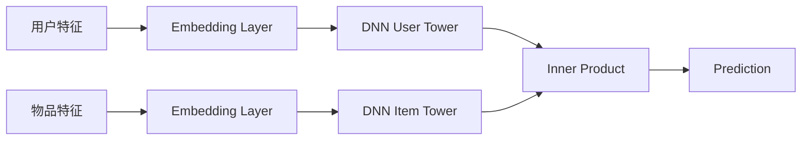

# 迁移学习实战：推荐系统任务

作者：禅与计算机程序设计艺术

## 1. 背景介绍
### 1.1 推荐系统的重要性
### 1.2 传统推荐系统的局限性
### 1.3 迁移学习在推荐系统中的应用前景

## 2. 核心概念与联系
### 2.1 迁移学习
#### 2.1.1 定义
#### 2.1.2 分类
#### 2.1.3 优势
### 2.2 推荐系统
#### 2.2.1 定义
#### 2.2.2 类型
#### 2.2.3 挑战
### 2.3 迁移学习与推荐系统的关系
#### 2.3.1 迁移学习在推荐系统中的应用
#### 2.3.2 解决推荐系统冷启动问题
#### 2.3.3 提高推荐系统的泛化能力

## 3. 核心算法原理具体操作步骤
### 3.1 基于特征迁移的推荐算法
#### 3.1.1 问题定义
#### 3.1.2 算法流程
#### 3.1.3 优化目标
### 3.2 基于深度迁移学习的推荐算法
#### 3.2.1 问题定义
#### 3.2.2 算法流程
#### 3.2.3 网络结构设计
### 3.3 基于元学习的迁移推荐算法
#### 3.3.1 问题定义  
#### 3.3.2 算法流程
#### 3.3.3 元学习器设计

## 4. 数学模型和公式详细讲解举例说明
### 4.1 矩阵分解模型
#### 4.1.1 问题形式化
#### 4.1.2 目标函数
#### 4.1.3 优化求解
### 4.2 图神经网络模型
#### 4.2.1 问题形式化
#### 4.2.2 聚合函数
#### 4.2.3 更新函数
### 4.3 贝叶斯迁移学习模型
#### 4.3.1 问题形式化
#### 4.3.2 先验分布
#### 4.3.3 后验推断

## 5. 项目实践：代码实例和详细解释说明
### 5.1 数据集准备
#### 5.1.1 Movielens 数据集
#### 5.1.2 亚马逊数据集
#### 5.1.3 预处理和特征工程
### 5.2 模型实现
#### 5.2.1 协同过滤模型
#### 5.2.2 深度迁移学习模型
#### 5.2.3 元学习迁移模型
### 5.3 实验结果分析
#### 5.3.1 评估指标
#### 5.3.2 消融实验
#### 5.3.3 对比实验

## 6. 实际应用场景 
### 6.1 电商推荐
#### 6.1.1 跨领域商品推荐
#### 6.1.2 冷启动商品推荐
#### 6.1.3 个性化推荐
### 6.2 社交网络推荐
#### 6.2.1 好友推荐 
#### 6.2.2 社区发现
#### 6.2.3 社交影响力建模
### 6.3 新闻推荐
#### 6.3.1 跨语言新闻推荐
#### 6.3.2 冷启动新闻推荐
#### 6.3.3 动态兴趣建模

## 7. 工具和资源推荐
### 7.1 开源代码库
#### 7.1.1 Suprise 
#### 7.1.2 DeepRec
#### 7.1.3 TransRec
### 7.2 数据集
#### 7.2.1 Movielens
#### 7.2.2 Netflix Prize
#### 7.2.3 Yelp
### 7.3 论文与教程
#### 7.3.1 Must-read Papers on Transfer Learning for Recommender Systems
#### 7.3.2 Deep Transfer Learning for Recommendation
#### 7.3.3 Transfer Learning for Recommender Systems

## 8. 总结：未来发展趋势与挑战
### 8.1 异构信息的高效利用
### 8.2 知识迁移与推理
### 8.3 用户动态兴趣建模
### 8.4 隐私与安全问题

## 9. 附录：常见问题与解答 
### 9.1 什么情况下迁移学习在推荐系统中最有效？
### 9.2 迁移学习相对于传统推荐算法的优势是什么？
### 9.3 如何权衡源领域和目标领域的重要性？
### 9.4 负迁移问题如何解决？

迁移学习近年来在推荐系统领域得到了广泛关注和应用。传统的推荐系统主要依赖于用户在特定领域的历史交互数据来学习用户的兴趣偏好，存在冷启动、数据稀疏等问题。迁移学习通过对不同领域或任务间的知识迁移，充分利用已有的经验和信息，能够快速适应新的推荐任务，提高推荐效果。

迁移学习按照迁移对象可分为三类，分别是基于实例的迁移、基于特征的迁移和基于模型的迁移。其中，基于特征的迁移通过学习不同领域间共享的潜在特征空间，实现跨领域的知识迁移；基于模型的迁移则是利用源领域学习到的模型参数来初始化目标领域模型，加速模型的训练收敛。在推荐系统中，我们可以利用用户在其他社交平台、电商网站的历史行为数据，通过迁移学习来辅助建模用户在新平台上的兴趣偏好。

关于迁移学习在推荐系统中的典型应用，总结如下几点：
1. 跨领域推荐：利用迁移学习在不同领域（如电影和图书）间共享用户偏好信息，实现跨领域的推荐。这可以缓解用户在新领域的冷启动问题。
2. 社交网络推荐：通过迁移用户在社交网络中的关系链接和交互信息，来辅助建模用户的兴趣偏好，提高社交推荐的效果。
3. 跨平台推荐：利用用户在多个平台上的行为数据，通过迁移学习构建统一的用户画像，实现跨平台的无缝推荐。
4. 时间上下文推荐：考虑用户兴趣的动态演化，利用迁移学习在不同时间上下文之间共享知识，捕捉用户实时的兴趣偏好。

下面重点介绍几个典型的迁移学习算法在推荐系统中的应用。

### 3.1 基于特征迁移的推荐算法

基于特征迁移的核心思想是学习源领域和目标领域的公共特征表示，实现特征层面的知识迁移。以矩阵分解为例，考虑单一领域的矩阵分解推荐可以表示为：

$$\min_{P,Q} \sum_{(u,i)\in S}(r_{ui} - p_u^Tq_i)^2 + \lambda_P\|P\|^2_F + \lambda_Q\|Q\|^2_F$$

其中$P\in \mathbb{R}^{m\times d},Q\in \mathbb{R}^{n\times d}$分别是用户和物品的隐向量矩阵。$S$是已知的评分集合。$\lambda$为正则化系数。现在考虑跨领域的推荐场景，我们有源领域的评分矩阵$R^s\in \mathbb{R}^{m\times n_s}$和目标领域评分矩阵$R^t\in \mathbb{R}^{m\times n_t}$。基于特征迁移的思想，我们可以假设源领域和目标领域共享同一个用户隐空间，但物品隐空间不同。因此优化目标可以改写为：

$$\min_{P,Q^s,Q^t} \sum_{(u,i)\in S^s}(r^s_{ui} - p_u^T q^s_i)^2 + \sum_{(u,j)\in S^t}(r^t_{uj} - p_u^T q^t_j)^2 + \Omega(P,Q^s,Q^t)$$

其中$Q^s,Q^t$分别表示源领域和目标领域的物品隐向量矩阵。$\Omega$是针对参数矩阵的正则项。通过联合学习源领域和目标领域，获得统一的用户隐空间表示$P$，再利用学习到的$P$和$Q^t$进行目标领域的推荐预测。上述方法可以拓展到更一般的跨领域矩阵分解框架，如collective matrix factorization等。

### 3.2 基于深度迁移学习的推荐算法

深度神经网络强大的表示学习能力使其在推荐系统领域得到广泛应用。对于迁移学习，深度神经网络可以学习更高层次的用户/物品表示，同时引入领域适配的策略，减小源领域和目标领域的分布差异。以经典的双塔DNN网络结构为例：

在跨领域推荐中，我们可以设计不同的网络结构来实现用户塔和物品塔之间的知识迁移。一种典型的做法是引入领域适配层，通过对抗学习或者MMD（maximum mean discrepancy）等分布对齐方法，使得源领域和目标领域学习到的用户/物品表示在公共空间更加一致，同时保留各自的特性。此外，还可以利用源领域数据预训练得到的用户/物品Embedding参数，迁移至目标领域网络，作为目标领域模型参数的初始化，实现参数层面的迁移。

### 3.3 基于元学习的迁移推荐算法

元学习（Meta Learning）的核心思想是"学会学习"，即从一系列相关任务中学习共同的知识，使得模型能够快速适应新的任务。在推荐系统领域，我们面临着用户冷启动、跨领域等多个任务。通过元学习，我们可以从多个历史推荐任务中学习到共享的知识，然后快速适应新的推荐任务。

以基于度量（metric-based）的元学习为例，我们希望学习一个任务无关的度量函数，使得在新的推荐任务中，用户和其感兴趣的物品在该度量空间中更加接近。形式化地，记$\phi$为度量函数的参数，$\mathcal{L}$为损失函数，则元学习的优化目标可以表示为：

$$\min_\phi \mathbb{E}_{T\sim p(\mathcal{T})} \mathcal{L}_T(\phi - \alpha \nabla_\phi \mathcal{L}_{T_{train}}(\phi))$$

其中$p(\mathcal{T})$表示推荐任务的分布，元学习的目标是最小化采样任务的损失期望。对于每个具体任务$T$，首先在其训练集$T_{train}$上计算梯度并更新参数，得到任务特定的度量函数参数$\phi_T=\phi - \alpha \nabla_\phi \mathcal{L}_{T_{train}}(\phi)$，然后在该任务的测试集上评估模型性能。通过不断采样不同的推荐任务进行训练，学习的度量函数参数$\phi$可以快速适应新的任务，实现推荐系统的迁移学习。

相比传统的推荐算法，迁移学习在如下几个方面体现出优势：
1. 缓解冷启动问题：通过迁移其他领域、平台已有的知识，可以为新用户/新物品快速构建准确的初始兴趣表示。
2. 提高模型泛化性：迁移学习使模型面向更广泛的数据分布，从多个领域学习知识，具有更强的泛化推理能力。  
3. 减少数据依赖：对于一些数据稀疏的领域，直接训练模型可能效果不佳。通过迁移外部知识来辅助建模，减轻对数据量和质量的依赖。
4. 加速模型学习：通过参数迁移等策略，将知识作为目标领域模型学习的起点，减少训练所需的数据和时间成本。

在实践中，我们往往面临着源领域和目标领域差异较大的问题，例如不同的用户重叠度、数据分布、特征空间等。因此在应用迁移学习时，需要权衡源领域知识和目标领域知识的重要性，避免负迁移问题。一些有效的策