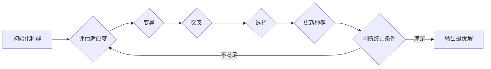

## 1. 背景介绍

### 1.1. 从自然选择到参数优化

自然界中，生物通过遗传、变异和自然选择不断进化，最终适应环境并生存下来。这种强大的优化机制启发了科学家们，他们将其应用于解决各种复杂问题，例如工程设计、机器学习和人工智能。进化算法便是其中一种模拟自然选择过程的优化算法，它通过模拟生物进化的过程，在解空间中搜索最优解。

### 1.2. 进化算法的优势

相较于传统的优化算法，进化算法具有以下优势：

* **全局搜索能力:** 进化算法能够跳出局部最优解，找到全局最优解或近似最优解。
* **对目标函数要求低:** 进化算法不需要目标函数可微或连续，适用于处理复杂、非线性、多峰值的问题。
* **并行性:** 进化算法的种群特性使其易于并行化，能够有效利用多核处理器和分布式计算资源，提高求解效率。

### 1.3. 进化算法的应用

进化算法已被广泛应用于各个领域，例如：

* **机器学习:** 超参数优化、特征选择、神经网络结构搜索
* **工程设计:** 结构优化、电路设计、航空航天
* **金融领域:** 投资组合优化、风险管理
* **游戏开发:** 游戏AI设计、关卡生成

## 2. 核心概念与联系

### 2.1. 个体、种群和适应度

* **个体 (Individual):** 进化算法中的基本单元，代表解空间中的一个候选解。每个个体由一组参数（基因）组成，例如神经网络的权重和偏置。
* **种群 (Population):** 由多个个体组成的集合，代表解空间的一个子集。
* **适应度 (Fitness):** 用于衡量个体对环境适应程度的指标，通常由目标函数决定。适应度越高的个体，其对应的解越好。

### 2.2. 选择、交叉和变异

* **选择 (Selection):** 根据个体的适应度，选择一部分个体作为下一代的父代。常用的选择算子包括轮盘赌选择、锦标赛选择等。
* **交叉 (Crossover):** 将两个父代个体的基因进行交换，产生新的子代个体。交叉算子能够将父代个体的优秀基因组合起来，产生更优的解。
* **变异 (Mutation):** 对个体的基因进行随机改变，引入新的基因信息。变异算子能够增加种群的多样性，防止算法陷入局部最优解。

### 2.3. 进化流程

进化算法通常按照以下步骤进行迭代：

1. **初始化种群:** 随机生成一组个体，构成初始种群。
2. **评估适应度:** 计算每个个体的适应度值。
3. **选择:** 根据适应度选择一部分个体作为父代。
4. **交叉:** 对选出的父代个体进行交叉操作，产生子代个体。
5. **变异:** 对子代个体进行变异操作。
6. **更新种群:** 用新生成的子代个体替换部分或全部父代个体，形成新的种群。
7. **判断终止条件:** 如果满足终止条件，则算法停止，输出最优解；否则，返回步骤 2 继续迭代。

## 3. 核心算法原理具体操作步骤

### 3.1. 遗传算法 (Genetic Algorithm, GA)

#### 3.1.1. 编码方式

遗传算法通常使用二进制编码方式表示个体，例如：

```
个体 1: 01011010
个体 2: 11000101
```

#### 3.1.2. 选择算子

* **轮盘赌选择 (Roulette Wheel Selection):**  每个个体被选中的概率与其适应度成正比。
* **锦标赛选择 (Tournament Selection):**  从种群中随机选择 k 个个体，选择其中适应度最高的个体作为父代。

#### 3.1.3. 交叉算子

* **单点交叉 (Single-point Crossover):**  随机选择一个交叉点，将两个父代个体在该点处断开，交换基因片段。
* **多点交叉 (Multi-point Crossover):**  随机选择多个交叉点，将两个父代个体在这些点处断开，交换基因片段。

#### 3.1.4. 变异算子

* **位翻转变异 (Bit Flip Mutation):**  随机选择一个个体的一个基因位，将其值取反。

#### 3.1.5. 遗传算法流程图


### 3.2. 差分进化算法 (Differential Evolution, DE)

#### 3.2.1. 编码方式

差分进化算法通常使用实数编码方式表示个体，例如：

```
个体 1: [1.2, 3.5, 2.8]
个体 2: [2.1, 1.7, 4.2]
```

#### 3.2.2. 变异算子

* **DE/rand/1:** 
  - 从种群中随机选择三个不同的个体 $x_r1$, $x_r2$, $x_r3$。
  - 生成变异向量：$v_i = x_r1 + F * (x_r2 - x_r3)$，其中 F 是缩放因子。

#### 3.2.3. 交叉算子

* **二项式交叉 (Binomial Crossover):**  对变异向量和目标个体进行交叉操作，生成试验个体。

#### 3.2.4. 选择算子

* **贪婪选择 (Greedy Selection):**  如果试验个体的适应度优于目标个体，则用试验个体替换目标个体。

#### 3.2.5. 差分进化算法流程图



## 4. 数学模型和公式详细讲解举例说明

### 4.1. 遗传算法

#### 4.1.1. 适应度函数

适应度函数用于评估个体的优劣，通常根据具体问题进行设计。例如，对于求解函数 $f(x) = x^2$ 的最小值问题，可以使用以下适应度函数：

```
fitness(x) = -f(x) = -x^2
```

#### 4.1.2. 选择概率

轮盘赌选择中，个体 $i$ 被选中的概率为：

$$
P_i = \frac{f_i}{\sum_{j=1}^N f_j}
$$

其中，$f_i$ 是个体 $i$ 的适应度值，$N$ 是种群大小。

#### 4.1.3. 交叉概率

交叉概率 $p_c$ 表示进行交叉操作的概率。

#### 4.1.4. 变异概率

变异概率 $p_m$ 表示进行变异操作的概率。

### 4.2. 差分进化算法

#### 4.2.1. 缩放因子

缩放因子 $F$ 控制差分变异的幅度，通常取值范围为 $[0, 2]$。

#### 4.2.2. 交叉率

交叉率 $CR$ 控制试验个体从变异向量和目标个体继承基因的概率，通常取值范围为 $[0, 1]$。

## 5. 项目实践：代码实例和详细解释说明

### 5.1. Python 实现遗传算法

```python
import random

# 定义适应度函数
def fitness_function(x):
    return -x**2

# 定义遗传算法类
class GeneticAlgorithm:
    def __init__(self, population_size, chromosome_length, p_c, p_m):
        self.population_size = population_size
        self.chromosome_length = chromosome_length
        self.p_c = p_c
        self.p_m = p_m
        self.population = self.initialize_population()

    # 初始化种群
    def initialize_population(self):
        population = []
        for _ in range(self.population_size):
            chromosome = [random.randint(0, 1) for _ in range(self.chromosome_length)]
            population.append(chromosome)
        return population

    # 计算适应度
    def calculate_fitness(self, chromosome):
        x = int("".join(str(i) for i in chromosome), 2)
        return fitness_function(x)

    # 选择操作
    def selection(self):
        fitness_values = [self.calculate_fitness(chromosome) for chromosome in self.population]
        total_fitness = sum(fitness_values)
        probabilities = [fitness / total_fitness for fitness in fitness_values]
        selected_indices = random.choices(range(self.population_size), weights=probabilities, k=2)
        return [self.population[i] for i in selected_indices]

    # 交叉操作
    def crossover(self, parent1, parent2):
        if random.random() < self.p_c:
            crossover_point = random.randint(1, self.chromosome_length - 1)
            child1 = parent1[:crossover_point] + parent2[crossover_point:]
            child2 = parent2[:crossover_point] + parent1[crossover_point:]
            return child1, child2
        else:
            return parent1, parent2

    # 变异操作
    def mutation(self, chromosome):
        for i in range(self.chromosome_length):
            if random.random() < self.p_m:
                chromosome[i] = 1 - chromosome[i]
        return chromosome

    # 运行遗传算法
    def run(self, generations):
        for _ in range(generations):
            new_population = []
            for _ in range(self.population_size // 2):
                parent1, parent2 = self.selection()
                child1, child2 = self.crossover(parent1, parent2)
                child1 = self.mutation(child1)
                child2 = self.mutation(child2)
                new_population.extend([child1, child2])
            self.population = new_population
        best_chromosome = max(self.population, key=self.calculate_fitness)
        best_fitness = self.calculate_fitness(best_chromosome)
        return best_chromosome, best_fitness

# 设置参数
population_size = 100
chromosome_length = 10
p_c = 0.8
p_m = 0.1
generations = 100

# 创建遗传算法对象
ga = GeneticAlgorithm(population_size, chromosome_length, p_c, p_m)

# 运行遗传算法
best_chromosome, best_fitness = ga.run(generations)

# 打印结果
print("Best chromosome:", best_chromosome)
print("Best fitness:", best_fitness)
```

### 5.2. Python 实现差分进化算法

```python
import random

# 定义适应度函数
def fitness_function(x):
    return -x**2

# 定义差分进化算法类
class DifferentialEvolution:
    def __init__(self, population_size, chromosome_length, F, CR):
        self.population_size = population_size
        self.chromosome_length = chromosome_length
        self.F = F
        self.CR = CR
        self.population = self.initialize_population()

    # 初始化种群
    def initialize_population(self):
        population = []
        for _ in range(self.population_size):
            chromosome = [random.uniform(-10, 10) for _ in range(self.chromosome_length)]
            population.append(chromosome)
        return population

    # 计算适应度
    def calculate_fitness(self, chromosome):
        return fitness_function(chromosome[0])

    # 变异操作
    def mutation(self, target_index):
        candidates = list(range(self.population_size))
        candidates.remove(target_index)
        r1, r2, r3 = random.sample(candidates, 3)
        mutant = [self.population[r1][i] + self.F * (self.population[r2][i] - self.population[r3][i]) for i in range(self.chromosome_length)]
        return mutant

    # 交叉操作
    def crossover(self, target, mutant):
        trial = []
        for i in range(self.chromosome_length):
            if random.random() < self.CR or i == random.randint(0, self.chromosome_length - 1):
                trial.append(mutant[i])
            else:
                trial.append(target[i])
        return trial

    # 选择操作
    def selection(self, target, trial):
        if self.calculate_fitness(trial) > self.calculate_fitness(target):
            return trial
        else:
            return target

    # 运行差分进化算法
    def run(self, generations):
        for _ in range(generations):
            for i in range(self.population_size):
                mutant = self.mutation(i)
                trial = self.crossover(self.population[i], mutant)
                self.population[i] = self.selection(self.population[i], trial)
        best_chromosome = max(self.population, key=self.calculate_fitness)
        best_fitness = self.calculate_fitness(best_chromosome)
        return best_chromosome, best_fitness

# 设置参数
population_size = 100
chromosome_length = 1
F = 0.8
CR = 0.5
generations = 100

# 创建差分进化算法对象
de = DifferentialEvolution(population_size, chromosome_length, F, CR)

# 运行差分进化算法
best_chromosome, best_fitness = de.run(generations)

# 打印结果
print("Best chromosome:", best_chromosome)
print("Best fitness:", best_fitness)
```

## 6. 实际应用场景

### 6.1. 机器学习中的超参数优化

机器学习模型通常包含许多超参数，例如学习率、正则化系数等。手动调整这些超参数非常耗时，而进化算法可以自动搜索最优的超参数组合，提高模型性能。

### 6.2. 金融领域的投资组合优化

投资组合优化旨在在风险和收益之间找到最佳平衡点。进化算法可以用于构建投资组合，最大化预期收益，同时将风险控制在可接受的范围内。

### 6.3. 游戏开发中的游戏AI设计

进化算法可以用于训练游戏AI，例如控制NPC的行为、生成游戏关卡等。通过模拟自然选择的过程，进化算法可以帮助开发人员创建更具挑战性和趣味性的游戏体验。

## 7. 工具和资源推荐

### 7.1. DEAP (Distributed Evolutionary Algorithms in Python)

DEAP 是一个用于快速原型设计和测试进化算法的 Python 框架，提供了丰富的算法组件和工具，方便用户构建和评估进化算法。

### 7.2. PyGMO (Python Parallel Global Multiobjective Optimizer)

PyGMO 是一个用于解决多目标优化问题的 Python 库，提供了多种进化算法和接口，支持并行计算和约束处理。

### 7.3. ECJ (Evolutionary Computation in Java)

ECJ 是一个用 Java 编写的进化计算研究平台，提供了丰富的算法组件、算子、问题和统计工具，方便用户进行进化计算研究。

## 8. 总结：未来发展趋势与挑战

### 8.1. 未来发展趋势

* **多目标优化:** 进化算法在解决多目标优化问题方面具有天然优势，未来将会出现更多针对多目标优化的进化算法和应用。
* **大规模优化:** 随着数据规模的不断增长，大规模优化问题日益突出，未来将会出现更多针对大规模优化的进化算法和并行计算技术。
* **与机器学习的结合:** 进化算法可以与机器学习算法结合，例如用于神经网络结构搜索、超参数优化等，未来将会出现更多结合进化算法和机器学习的应用。

### 8.2. 面临的挑战

* **算法效率:** 进化算法的计算复杂度较高，如何提高算法效率是一个重要的研究方向。
* **参数设置:** 进化算法的性能对参数设置比较敏感，如何自动选择合适的参数是一个挑战。
* **可解释性:** 进化算法的搜索过程比较复杂，如何解释算法的决策过程是一个挑战。

## 9. 附录：常见问题与解答

### 9.1. 进化算法如何处理约束条件？

进化算法可以通过惩罚函数法、修复函数法、多目标优化等方法处理约束条件。

### 9.2. 进化算法如何避免早熟收敛？

进化算法可以通过增加种群多样性、调整选择压力、引入新的变异算子等方法避免早熟收敛。

### 9.3. 进化算法如何选择合适的参数？

进化算法的参数选择通常需要根据具体问题进行实验和