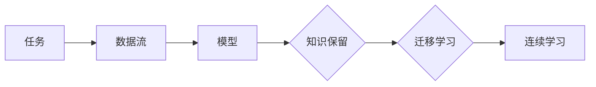

## 1. 背景介绍

### 1.1 人工智能的局限性

人工智能 (AI) 在近年来取得了显著的进步，在图像识别、自然语言处理、游戏博弈等领域取得了突破性进展。然而，当前的 AI 系统仍然存在着一些局限性，其中最主要的问题之一是**灾难性遗忘** (Catastrophic Forgetting)。灾难性遗忘是指 AI 系统在学习新任务时，会忘记之前学习过的任务，导致性能下降。这与人类的学习方式截然不同，人类能够不断积累知识，并在新环境中灵活运用已有的知识。

### 1.2 连续学习的必要性

为了克服灾难性遗忘问题，研究者们提出了**连续学习** (Continual Learning) 的概念。连续学习旨在使 AI 系统能够像人类一样，不断地学习新的知识，而不会忘记之前学习过的内容。这对于构建更加通用、灵活和智能的 AI 系统至关重要。

### 1.3 连续学习的应用场景

连续学习在许多实际应用场景中都具有重要的意义，例如：

* **机器人控制:** 机器人需要不断学习新的技能，以适应不断变化的环境。
* **自动驾驶:** 自动驾驶系统需要不断学习新的路况和交通规则，以提高安全性。
* **个性化推荐:** 推荐系统需要根据用户的历史行为和偏好，不断更新推荐内容。
* **医疗诊断:** 医疗诊断系统需要不断学习新的疾病和治疗方案，以提高诊断准确率。

## 2. 核心概念与联系

### 2.1 核心概念

连续学习涉及到许多核心概念，包括：

* **任务:**  AI 系统需要学习的一系列相关联的任务。
* **数据流:**  AI 系统接收到的数据是按时间顺序排列的，每个时间点对应一个任务。
* **模型:**  AI 系统用于完成任务的模型，例如神经网络。
* **知识保留:**  AI 系统在学习新任务时，需要保留之前学习到的知识。
* **迁移学习:**  AI 系统可以利用之前学习到的知识，来加速新任务的学习。

### 2.2 概念之间的联系

这些概念之间存在着密切的联系，例如：

* 任务的定义决定了数据流的结构。
* 模型的结构决定了知识保留和迁移学习的效率。
* 知识保留和迁移学习是实现连续学习的关键。

### 2.3 Mermaid流程图



## 3. 核心算法原理具体操作步骤

### 3.1 基于正则化的方法

基于正则化的方法是目前最常用的连续学习方法之一。其核心思想是在学习新任务时，对模型参数进行正则化，以防止模型忘记之前学习到的知识。常见的正则化方法包括：

* **L2正则化:**  将模型参数的平方和加入到损失函数中，以限制参数的取值范围。
* **Elastic Net正则化:**  结合 L1 和 L2 正则化，以同时实现参数稀疏性和防止过拟合。

#### 3.1.1 具体操作步骤

1. 训练模型完成第一个任务。
2. 在学习第二个任务时，将第一个任务的模型参数作为初始值。
3. 在损失函数中加入正则化项，以限制模型参数的变化幅度。
4. 训练模型完成第二个任务。
5. 重复步骤 2-4，直到完成所有任务的学习。

### 3.2 基于记忆的方法

基于记忆的方法将之前学习到的知识存储在一个外部记忆模块中，并在学习新任务时，从记忆模块中检索相关的知识。常见的记忆模块包括：

* **Episodic Memory:**  存储特定事件的记忆，例如图像、视频或文本。
* **Semantic Memory:**  存储一般性知识的记忆，例如概念、关系或规则。

#### 3.2.1 具体操作步骤

1. 训练模型完成第一个任务。
2. 将第一个任务的训练数据存储到记忆模块中。
3. 在学习第二个任务时，从记忆模块中检索与当前任务相关的知识。
4. 将检索到的知识与当前任务的训练数据一起输入到模型中进行训练。
5. 重复步骤 2-4，直到完成所有任务的学习。

## 4. 数学模型和公式详细讲解举例说明

### 4.1 Elastic Weight Consolidation (EWC)

EWC 是一种基于正则化的连续学习方法，其核心思想是在学习新任务时，对模型参数的变化进行限制，以防止模型忘记之前学习到的知识。

#### 4.1.1 数学模型

EWC 的损失函数如下：

$$
\mathcal{L}(\theta) = \mathcal{L}_t(\theta) + \frac{\lambda}{2} \sum_{i=1}^n F_i (\theta_i - \theta_{i}^*)^2
$$

其中：

* $\mathcal{L}_t(\theta)$ 表示当前任务的损失函数。
* $\theta$ 表示模型参数。
* $\theta_{i}^*$ 表示模型参数在完成第一个任务时的值。
* $F_i$ 表示模型参数 $\theta_i$ 的重要性，可以通过 Fisher 信息矩阵计算得到。
* $\lambda$ 表示正则化系数。

#### 4.1.2 举例说明

假设我们有一个神经网络模型，用于识别手写数字。我们首先训练模型完成识别数字 0-4 的任务。然后，我们希望模型能够识别数字 5-9。使用 EWC 方法，我们可以将模型参数在识别数字 0-4 时的值作为初始值，并在损失函数中加入正则化项，以限制模型参数的变化幅度。这样，模型就可以在学习识别数字 5-9 的同时，保留识别数字 0-4 的能力。

## 5. 项目实践：代码实例和详细解释说明

### 5.1 Python 代码实例

```python
import torch
import torch.nn as nn
import torch.optim as optim

# 定义模型
class Net(nn.Module):
    def __init__(self):
        super(Net, self).__init__()
        self.fc1 = nn.Linear(784, 128)
        self.fc2 = nn.Linear(128, 10)

    def forward(self, x):
        x = torch.flatten(x, 1