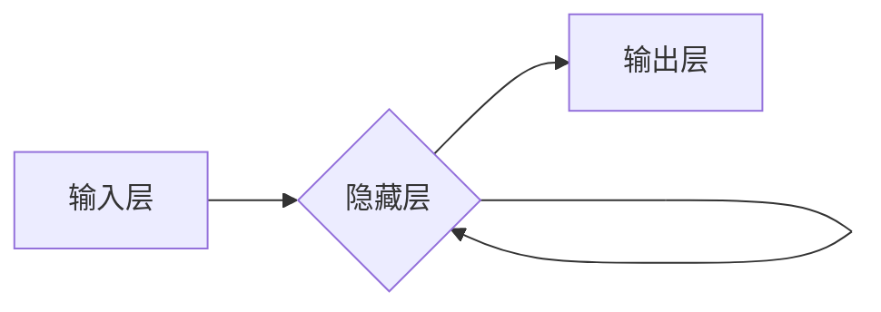

##  通过机器学习改进聊天机器人的性能

作者：禅与计算机程序设计艺术

## 1. 背景介绍

### 1.1 聊天机器人的兴起

近年来，随着人工智能技术的飞速发展，聊天机器人（Chatbot）作为一种新型的人机交互方式，已经逐渐走进了我们的生活。从简单的问答系统到复杂的智能助手，聊天机器人在各个领域都展现出了巨大的应用潜力。

### 1.2 传统聊天机器人的局限性

传统的聊天机器人大多基于规则和模板进行构建，这种方法虽然简单易用，但也存在一些难以克服的局限性：

* **灵活性不足:** 只能处理预先设定好的问题和指令，对于未曾见过的问题或指令无法做出有效的响应。
* **对话自然度低:** 由于缺乏语义理解能力，传统的聊天机器人往往只能进行机械的问答，难以进行自然流畅的对话。
* **维护成本高:** 随着规则和模板的不断增加，维护成本也会随之增加，难以适应快速变化的应用场景。

### 1.3 机器学习带来的变革

为了解决传统聊天机器人的局限性，越来越多的开发者开始将机器学习技术应用于聊天机器人的开发中。机器学习可以帮助聊天机器人从大量的对话数据中学习语言模式和语义信息，从而实现更加智能化的对话交互。

## 2. 核心概念与联系

### 2.1 自然语言处理 (NLP)

自然语言处理（Natural Language Processing，NLP）是人工智能领域的一个重要分支，旨在让计算机能够理解和处理人类语言。在聊天机器人中，NLP技术主要用于以下几个方面：

* **分词:** 将文本数据按照一定的规则切分成词语序列。
* **词性标注:** 识别出每个词语的词性，例如名词、动词、形容词等。
* **命名实体识别:** 识别出文本数据中的人名、地名、机构名等实体。
* **句法分析:** 分析句子的语法结构，例如主语、谓语、宾语等。
* **语义分析:** 理解句子的语义信息，例如情感倾向、意图识别等。

### 2.2 机器学习 (ML)

机器学习（Machine Learning，ML）是人工智能的另一个重要分支，其核心思想是让计算机能够从数据中学习规律，并利用学习到的规律对未知数据进行预测。在聊天机器人中，机器学习技术主要用于以下几个方面：

* **对话状态跟踪:** 跟踪对话的上下文信息，例如用户之前说过的话、当前的对话主题等。
* **对话策略学习:** 学习如何根据当前的对话状态选择合适的回复策略，例如回答问题、提供建议、结束对话等。
* **语言生成:** 根据对话策略生成自然流畅的回复文本。

### 2.3 深度学习 (DL)

深度学习（Deep Learning，DL）是机器学习的一个分支，其核心思想是利用多层神经网络对数据进行特征提取和模式识别。相比传统的机器学习算法，深度学习算法能够自动地学习更加复杂和抽象的特征表示，从而在很多领域都取得了突破性的进展。在聊天机器人中，深度学习技术主要用于以下几个方面：

* **自然语言理解:** 更加准确地理解用户输入的语义信息。
* **对话生成:** 生成更加自然流畅、富有情感的回复文本。
* **端到端对话系统:**  构建端到端的对话系统，无需人工设计复杂的规则和模板。

### 2.4 核心概念之间的联系

下图展示了自然语言处理、机器学习和深度学习之间的关系：


自然语言处理为机器学习和深度学习提供了数据基础，机器学习和深度学习为自然语言处理提供了算法支持。三者相辅相成，共同推动着聊天机器人技术的不断发展。

## 3. 核心算法原理具体操作步骤

### 3.1 基于检索的聊天机器人

基于检索的聊天机器人（Retrieval-based chatbot）是最早出现的一种聊天机器人类型，其原理是从预先定义好的问答库中检索与用户输入最相似的问答对，并将检索到的答案返回给用户。

#### 3.1.1 构建问答库

构建问答库是基于检索的聊天机器人的第一步，需要收集大量的问答对数据，并对数据进行清洗、标注等预处理操作。

#### 3.1.2 文本相似度计算

当用户输入一个问题时，聊天机器人需要计算用户输入与问答库中每个问题的相似度，并选择相似度最高的问答对作为答案返回给用户。常用的文本相似度计算方法包括：

* **余弦相似度:** 计算两个向量夹角的余弦值，值越大表示相似度越高。
* **欧氏距离:** 计算两个向量之间的距离，距离越小表示相似度越高。
* **Jaccard 相似度:** 计算两个集合交集元素个数占并集元素个数的比例，比例越大表示相似度越高。

#### 3.1.3 答案排序

当问答库中存在多个与用户输入相似的问题时，需要对检索到的答案进行排序，并将排序最高的答案返回给用户。常用的答案排序方法包括：

* **基于规则的排序:** 根据预先定义的规则对答案进行排序，例如优先选择答案长度较短、包含关键词较多的答案。
* **基于机器学习的排序:** 利用机器学习算法对答案进行排序，例如 Learning to Rank 算法。


### 3.2 基于生成的聊天机器人

基于生成的聊天机器人（Generative-based chatbot）可以根据用户输入自动生成回复文本，无需预先定义好的问答库。

#### 3.2.1 序列到序列模型 (Seq2Seq)

序列到序列模型（Sequence-to-sequence，Seq2Seq）是一种常用的对话生成模型，其核心思想是将对话历史和当前用户输入编码成一个向量表示，然后将该向量解码成回复文本。

#### 3.2.2 注意力机制 (Attention Mechanism)

注意力机制（Attention Mechanism）可以帮助模型更加关注输入序列中的重要信息，从而提高对话生成的准确性和流畅度。

#### 3.2.3 束搜索 (Beam Search)

束搜索（Beam Search）是一种常用的解码算法，可以帮助模型在生成回复文本时考虑更多的候选词，从而提高对话生成的质量。

## 4. 数学模型和公式详细讲解举例说明

### 4.1 余弦相似度

余弦相似度是一种常用的文本相似度计算方法，其计算公式如下：

$$
similarity(A, B) = \frac{A \cdot B}{||A|| ||B||} = \frac{\sum_{i=1}^{n} A_i B_i}{\sqrt{\sum_{i=1}^{n} A_i^2} \sqrt{\sum_{i=1}^{n} B_i^2}}
$$

其中，$A$ 和 $B$ 分别表示两个文本向量，$A_i$ 和 $B_i$ 分别表示向量 $A$ 和 $B$ 中的第 $i$ 个元素。

**举例说明:**

假设有两个文本向量：

```
A = [1, 2, 3]
B = [2, 4, 6]
```

则它们的余弦相似度为：

```
similarity(A, B) = (1 * 2 + 2 * 4 + 3 * 6) / (sqrt(1^2 + 2^2 + 3^2) * sqrt(2^2 + 4^2 + 6^2)) = 1.0
```

**结果分析:**

余弦相似度的取值范围为 $[-1, 1]$，值越大表示相似度越高。在本例中，$A$ 和 $B$ 的余弦相似度为 1.0，表示它们完全相似。

### 4.2 循环神经网络 (RNN)

循环神经网络（Recurrent Neural Network，RNN）是一种能够处理序列数据的深度学习模型，其核心思想是利用循环结构来存储历史信息，从而能够对序列数据进行建模。

#### 4.2.1 RNN 的结构

RNN 的基本结构如下图所示：



其中，$x_t$ 表示时刻 $t$ 的输入，$h_t$ 表示时刻 $t$ 的隐藏状态，$y_t$ 表示时刻 $t$ 的输出。

#### 4.2.2 RNN 的前向传播

RNN 的前向传播过程如下：

$$
h_t = f(W_{xh} x_t + W_{hh} h_{t-1} + b_h)
$$

$$
y_t = g(W_{hy} h_t + b_y)
$$

其中，$W_{xh}$、$W_{hh}$ 和 $W_{hy}$ 分别表示输入层到隐藏层、隐藏层到隐藏层和隐藏层到输出层的权重矩阵，$b_h$ 和 $b_y$ 分别表示隐藏层和输出层的偏置向量，$f$ 和 $g$ 分别表示隐藏层和输出层的激活函数。

#### 4.2.3 RNN 的反向传播

RNN 的反向传播过程可以使用时间反向传播算法（Backpropagation Through Time，BPTT）来计算梯度，并利用梯度下降算法来更新模型参数。

## 5. 项目实践：代码实例和详细解释说明

### 5.1 基于检索的聊天机器人

以下是一个简单的基于检索的聊天机器人的 Python 代码示例：

```python
import re
import math

def cosine_similarity(vec1, vec2):
    """
    计算两个向量的余弦相似度。
    """
    intersection = set(vec1.keys()) & set(vec2.keys())
    numerator = sum([vec1[x] * vec2[x] for x in