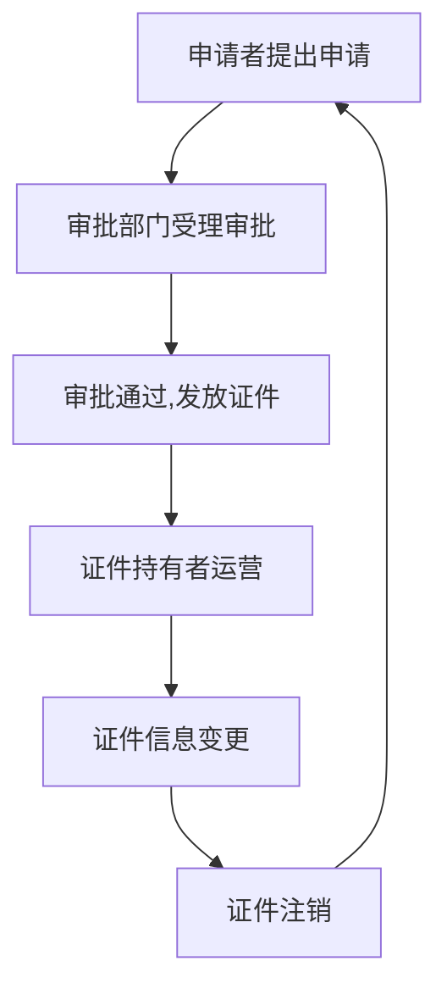
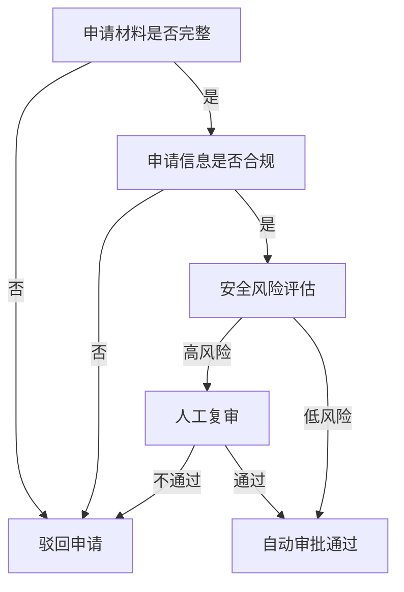
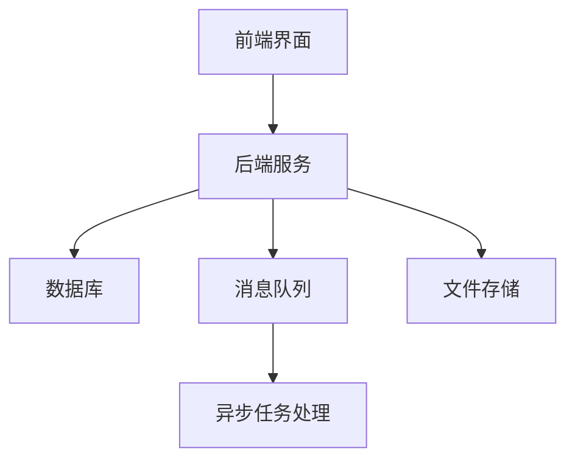

# 道路运输证管理系统详细设计与具体代码实现

## 1.背景介绍

### 1.1 道路运输证概述

道路运输证是指由交通运输主管部门核发的，允许从事道路运输经营活动的许可证件。它是道路运输企业合法经营的凭证，对于规范道路运输市场秩序、维护运输安全、保障人民群众生命财产安全具有重要意义。

### 1.2 道路运输证管理现状及问题

传统的道路运输证管理模式存在诸多问题:

- 证件审批流程繁琐、周期长
- 数据孤岛,信息不对称和资源浪费
- 人工管理效率低下,容易出错
- 缺乏有效的监管和执法手段

为解决这些问题,迫切需要建立一套高效、规范、透明的道路运输证管理系统。

### 1.3 系统目标

本系统旨在实现道路运输证的电子化申请、审批、发放和监管,提高管理效率,规范从业行为,为公众出行提供安全保障。其主要目标包括:

- 简化申请审批流程,提高办理效率
- 实现数据共享,提高管理透明度
- 加强监管执法,维护运输秩序
- 提升公众出行体验,保障人民群众利益

## 2.核心概念与联系

### 2.1 道路运输证种类

本系统主要管理以下几类道路运输证:

- 道路运输经营许可证
- 道路运输从业资格证
- 车辆运营证

其中,道路运输经营许可证分为客运、货运两类,并根据经营范围和运输车辆further细分。

### 2.2 角色和权限

系统主要涉及以下角色:

- 申请者(道路运输企业)
- 审批员(交通运输管理部门工作人员)
- 执法人员(交通执法部门人员)
- 系统管理员

不同角色拥有不同的操作权限,如申请、审批、查询、修改、作废等。

### 2.3 业务流程

道路运输证的管理包括申请、审批、发放、变更、注销等环节,形成一个闭环流程:



上述流程贯穿了系统的各项核心功能设计。

## 3.核心算法原理具体操作步骤

### 3.1 申请流程

1. 申请者登录系统,填写申请信息
2. 上传相关证明材料(如营业执照、车辆清单等)
3. 选择申请证件种类和经营范围
4. 提交申请,等待审批

申请环节的关键是信息采集和完整性校验。

### 3.2 审批流程

1. 审批员根据申请分配,进行审核
2. 审核申请材料的真实性和合规性
3. 根据审核结果,同意或驳回申请
4. 对通过的申请,发放相应证件

审批环节需要对申请信息进行严格的合规性检查,防止违规发证。

### 3.3 证件发放和监管

1. 将审批通过的证件信息导入系统
2. 证件持有者可查询和打印电子证件
3. 执法部门可在系统内查询证件信息
4. 对过期或违规的证件进行注销或处罚

发放和监管环节需要实现证件信息的高效查询和处置。

### 3.4 证件变更

1. 证件持有者登录,提出变更申请
2. 变更申请重新进入审批流程
3. 审批通过后,证件信息完成变更

变更流程可确保证件信息的持续更新和准确性。

### 3.5 证件注销

1. 证件持有者可主动申请注销
2. 管理部门也可直接注销过期或违规证件
3. 注销后,证件信息作废,不可用于运输

注销环节完成证件生命周期管理。

## 4.数学模型和公式详细讲解举例说明

### 4.1 证件编号生成算法

为了实现证件编号的唯一性和可追溯性,本系统采用以下算法生成证件编号:

$$
证件编号 = 发证机构代码 + 年份后两位 + 证件类型代码 + 9位顺序号
$$

其中:

- 发证机构代码: 由发证机构统一编码,防止编号冲突
- 年份后两位: 便于识别证件发放年份 
- 证件类型代码: 不同证件类型使用不同代码
- 9位顺序号: 每年按照发放顺序重新递增编号

例如, 证件编号"11221701000001234"表示:
- 由"1122"机构在2017年发放
- 证件类型代码为"17"
- 为该机构当年发放的第1234个证件

### 4.2 证件有效期计算

不同类型证件的有效期不同,需要对有效期进行精确计算。本系统采用以下公式:

$$
有效期满日期 = 发证日期 + 证件有效期(月)转换的天数
$$

有效期满后,证件自动失效,持证者需要重新申请。

### 4.3 证件审批流程优化

为提高审批效率,减少人工干预,本系统采用决策树算法对申请进行初步自动审核:



通过决策树算法,可以自动过滤掉大部分不合格申请,减轻审批员工作压力。

## 4.项目实践:代码实例和详细解释说明

### 4.1 系统架构



1. **前端界面**: 提供用户操作界面,包括申请、审批、查询等功能
2. **后端服务**: 处理业务逻辑,对接数据库、消息队列等
3. **数据库**: 存储证件信息、申请数据等
4. **消息队列**: 用于异步任务处理,如发送审批通知
5. **文件存储**: 存储证明材料等上传文件
6. **异步任务处理**: 处理耗时操作,避免影响界面响应

### 4.2 核心代码模块

#### 4.2.1 申请模块

```python
class ApplicationForm(models.Model):
    applicant = models.ForeignKey(Applicant)
    cert_type = models.CharField(max_length=20)
    business_scope = models.CharField(max_length=100)
    materials = models.ManyToManyField(UploadedFile)
    status = models.CharField(max_length=20, default='pending')
    
    def submit(self):
        if self.validate_info():
            self.status = 'submitted'
            self.save()
            # 触发审批流程
        else:
            # 返回错误信息
            
    def validate_info(self):
        # 检查申请信息完整性和合规性
        # ...
        
        return True
```

- `ApplicationForm`模型存储申请信息
- `submit`方法提交申请,触发审批流程
- `validate_info`方法检查申请信息的完整性和合规性

#### 4.2.2 审批模块

```python
class Application(models.Model):
    form = models.ForeignKey(ApplicationForm)
    cert_number = models.CharField(max_length=20, null=True)
    issue_date = models.DateField(null=True)
    expiry_date = models.DateField(null=True)
    status = models.CharField(max_length=20, default='pending')
    
    def approve(self, approved, message, operator):
        if approved:
            self.issue_cert()
        else:
            self.reject(message)
        self.save()
        self.record_operation(message, operator)
        
    def issue_cert(self):
        # 生成证件编号
        # 计算有效期
        # ...
        
    def reject(self, message):
        self.status = 'rejected'
        # 发送驳回通知
        
    def record_operation(self, message, operator):
        # 记录审批过程
```

- `Application`模型表示审批实例
- `approve`方法执行审批操作
- `issue_cert`方法生成证件编号,计算有效期等
- `reject`方法执行驳回操作,发送通知
- `record_operation`记录审批过程,用于追溯

#### 4.2.3 监管模块

```python
class CertRecord(models.Model):
    cert_number = models.CharField(max_length=20)
    holder = models.ForeignKey(Applicant)
    cert_type = models.CharField(max_length=20)
    issue_date = models.DateField()
    expiry_date = models.DateField()
    status = models.CharField(max_length=20)
    
    @staticmethod
    def search_certs(conditions):
        # 根据条件查询证件记录
        # ...
        
    def revoke(self, message, operator):
        self.status = 'revoked'
        self.save()
        # 记录注销信息
        
def daily_cert_check():
    # 每天检查过期证件
    expired = CertRecord.objects.filter(
        expiry_date__lte=date.today(),
        status='valid'
    )
    for cert in expired:
        cert.revoke('证件过期', '系统')
```

- `CertRecord`模型存储证件记录
- `search_certs`方法根据条件查询证件信息
- `revoke`方法执行证件注销操作
- `daily_cert_check`每天检查过期证件,自动注销

通过上述核心代码,实现了系统的申请、审批、发放、监管等关键功能。

## 5.实际应用场景

### 5.1 道路客运企业

客运企业申请从事城市公交、长途汽车等客运业务,需要获得相应的道路运输经营许可证。通过本系统,企业可以高效办理证件申请、变更和年审手续。

### 5.2 货运物流企业

货运企业申请从事普通货运、危险品运输等货运业务,需要获得道路运输经营许可证和车辆运营证。本系统实现了证件的电子化申请和管理,提高了物流运作效率。

### 5.3 个体运营者

从事网约车、货运等个体运营,需要申请道路运输从业资格证。系统提供个人在线申请渠道,方便个体从业者办理相关手续。

### 5.4 政府监管部门

交通运输管理部门通过本系统,可以高效审批证件申请、发放证件,并实时监控证件状态,对过期或违规证件及时作出处理,维护道路运输秩序。

## 6.工具和资源推荐

### 6.1 开发工具

- **IntelliJ IDEA**: 功能强大的Java集成开发环境
- **PyCharm**: Python IDE,适用于Python开发
- **Visual Studio Code**: 轻量级代码编辑器,插件丰富
- **Git**: 分布式版本控制系统,实现代码协作
- **Docker**: 容器化应用部署和管理工具

### 6.2 框架和库

- **Spring Boot**: 用于构建Java应用程序的开源框架
- **Django**: Python Web开发框架,快速开发原型
- **React**: 构建用户界面的JavaScript库
- **Hibernate/MyBatis**: Java持久层框架,简化数据库操作
- **Kafka**: 分布式流处理平台,实现异步消息传递

### 6.3 云服务

- **AWS/Azure/阿里云**: 提供云服务器、数据库、存储等资源
- **Jenkins**: 持续集成和部署工具,实现自动化流程

### 6.4 设计工具

- **Mermaid**: 基于文本的图表工具,可渲染流程图等
- **draw.io**: 在线图表制作工具,支持多种图形绘制

### 6.5 参考资源

- 各地交通运输管理部门的道路运输证办理指南
- 《道路运输管理条例》等相关法律法规
- 《软件架构设计》、《软件工程》等专业书籍

## 7.总结:未来发展趋势与挑战

### 7.1 智能化审批

未来,道路运输证审批可进一步引入AI技术,如计算机视觉(识别证件材料)、自然语言处理(理解申请内容)等,实现智能化审批,提高审批质