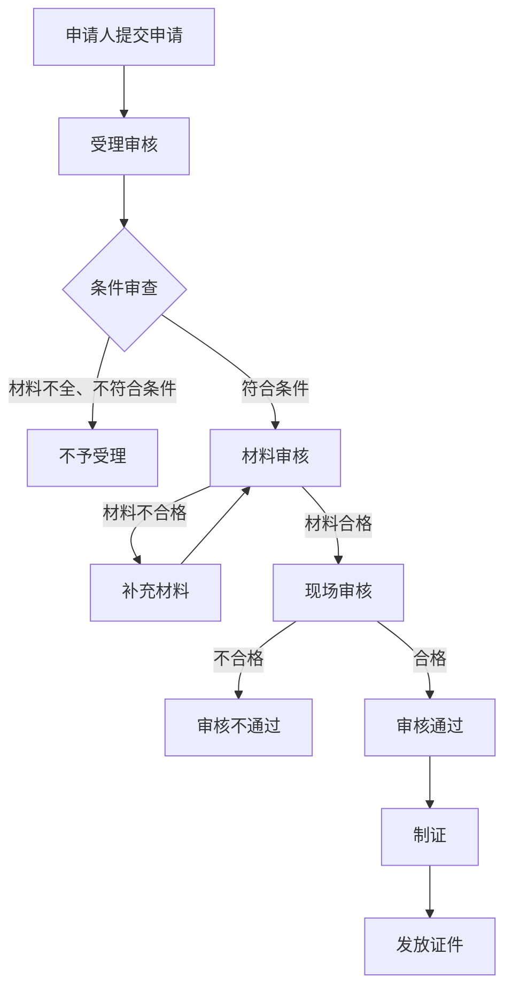

# 道路运输证管理系统详细设计与具体代码实现

## 1.背景介绍

### 1.1 道路运输证概述

道路运输证是指对从事道路运输经营活动的车辆和驾驶员的资格证件。它是确保道路运输安全有序运行的重要手段。道路运输证主要包括道路运输经营许可证、车辆运输证和驾驶员从业资格证三种类型。

#### 1.1.1 道路运输经营许可证

道路运输经营许可证是国家对从事道路运输经营活动的企业所核发的资质证件。企业需要持有相应的道路运输经营许可证,才能合法从事客运、货运等道路运输经营活动。

#### 1.1.2 车辆运输证 

车辆运输证是核发给运输企业的车辆的一种车辆营运资格证件。每一辆从事运输经营的车辆都需要持有车辆运输证,否则将被视为无证运营。

#### 1.1.3 驾驶员从业资格证

驾驶员从业资格证是国家对从事道路运输驾驶员职业的人员所核发的执业资格证件。从事道路运输驾驶工作必须持有相应的驾驶员从业资格证。

### 1.2 道路运输证管理的重要性

道路运输证管理工作对于规范道路运输市场秩序、维护交通运输安全、保障运输质量服务水平至关重要。合理高效的道路运输证管理有助于:

1. 加强事中事后监管,遏制违法违规运营行为
2. 规范从业人员职业操守,提高服务质量和文明程度 
3. 促进道路运输行业健康有序发展
4. 保障人民群众出行安全

因此,建立科学完善的道路运输证管理系统,提高管理的规范化、信息化水平,是交通运输主管部门的一项重要工作。

## 2.核心概念与联系

### 2.1 运输企业信息管理

运输企业是道路运输经营的主体,包括客运企业和货运企业。企业信息主要包括:

- 企业基本信息:企业名称、地址、法人代表、注册资本等
- 经营许可信息:许可证编号、经营范围、发证机关、有效期限等
- 企业车辆信息:车辆数量、车型、载客载重量等
- 企业从业人员信息:从业人员数量、驾驶员执业资格等

企业信息是核发和管理道路运输证的基础,需要建立完善的企业信息库。

### 2.2 车辆运输证管理

车辆运输证管理是道路运输证管理的核心环节,包括以下主要内容:

- 车辆基本信息管理:车牌号、车型、核定载客载重量等
- 车辆运输证发证管理:证件编号、发证机构、发证日期、有效期等
- 车辆运营情况管理:运营线路、运输周期、运营里程等
- 车辆违章记录管理:违章事件、处理结果等

车辆运输证的发放、换证、注销、查询、违章处理等都需要通过系统实现规范化管理。

### 2.3 驾驶员从业资格证管理  

驾驶员从业资格证管理是确保道路运输安全的关键,包括:

- 驾驶员基本信息管理:姓名、性别、出生年月、联系方式等
- 从业资格证管理:证件编号、准驾车型、发证机构、有效期等
- 驾驶员培训考核管理:培训机构、课程安排、考核成绩等
- 违章记录管理:违章事件、扣分、处罚等

通过对驾驶员的资格审查、从业培训、违章监管等全流程管控,有助于提高驾驶员职业素质,降低道路交通事故风险。

### 2.4 核心概念关联

运输企业信息、车辆运输证信息和驾驶员从业资格证信息三者之间存在紧密的关联关系:

- 运输企业持有一个或多个车辆运输证
- 每一个车辆运输证对应一辆运输车辆
- 每一辆运输车辆需要指派一名持证驾驶员
- 一名驾驶员可以为多家运输企业的车辆驾驶

因此,三者的信息需要通过关联关系进行集成和管理,以实现高效的证件发放、换证、注销,以及运输车辆、驾驶员的监管。

## 3.核心算法原理具体操作步骤

### 3.1 证件编号生成算法

证件编号的生成算法需要满足以下要求:

1. 全局唯一性,不会出现重复
2. 有一定规则,便于识别和管理
3. 信息冗余,包含发证时的相关信息

一种常用的证件编号生成算法是:

```
证件编号 = 发证机构代码 + 发证年份后两位 + 发证顺序号 + 校验码
```

其中:

- 发证机构代码: 采用国家统一的行政区划代码
- 发证年份后两位: 如22表示2022年
- 发证顺序号: 每年自00000001开始的顺序编号
- 校验码: 通过特定算法计算的1-2位数字,用于校验合法性

例如,一个车辆运输证的编号为 `510107221234567`,其中:

- 510107 - 成都市交通运输管理处代码 
- 22 - 2022年
- 12345 - 当年第12345个证件
- 67 - 校验码

该算法生成的证件编号可以直接反映发证信息,有利于证件查询和管理。

### 3.2 证件有效期计算算法

不同类型的证件有效期的计算规则不同:

- 道路运输经营许可证: 有效期通常为3-5年
- 车辆运输证: 有效期根据车辆使用年限而定,通常为6年
- 驾驶员从业资格证: 有效期通常为6年

因此,证件有效期的计算算法需要区分证件类型。以车辆运输证为例,算法如下:

```python
import datetime

def calc_expiry_date(issue_date, vehicle_age):
    """
    计算车辆运输证有效期
    
    Args:
        issue_date (datetime.date): 发证日期
        vehicle_age (int): 车辆使用年限(年)
        
    Returns:
        datetime.date: 有效期截止日期
    """
    max_valid_years = 6  # 最长有效期6年
    expiry_years = min(max_valid_years, 6 - vehicle_age)
    expiry_date = issue_date + datetime.timedelta(days=expiry_years*365)
    return expiry_date
```

该算法根据车辆使用年限和最长有效期6年,计算出具体的有效期截止日期。

### 3.3 证件审核流程

证件的审核流程是证件发放和换证的关键环节,需要对申请人的资格条件和提交材料进行严格审查,防止违规发证。典型的审核流程如下:



上述流程中的关键环节包括:

1. **条件审查**: 根据申请类型的不同,对申请人的主体资格、车辆使用年限等进行审查,判断是否符合基本条件。
2. **材料审核**: 对申请人提交的各类证明材料进行审核,如营业执照、车辆行驶证、驾驶证等,判断是否齐全合格。
3. **现场审核**: 对有需要的情况,可以实施现场审核,如实地查看运输车辆,核查驾驶员驾驶行为等。

每个环节的审核人员通过系统录入审核意见,实现流程的规范化、留痕化管理。

## 4.数学模型和公式详细讲解举例说明

### 4.1 证件编号合法性校验算法

为确保证件编号的合法性,需要采用数学校验算法对证件编号进行合法性验证。一种常用的校验算法是模数校验算法。

假设证件编号为17位字符串 $S = s_1s_2...s_{17}$,其中前15位为证件本身编号,最后2位为校验码。模数校验算法计算步骤如下:

1. 取证件编号前15位,作为加权系数: $w_i = s_i (i=1,2,...,15)$
2. 设置加权因子: $P = (7, 3, 1, 7, 3, 1, 7, 3, 1, 7, 3, 1, 7, 3, 1)$
3. 计算加权求和: $W = \sum_{i=1}^{15}w_iP_i$
4. 计算模数: $N = W \bmod 11$
5. 若 $N = 10$,则校验码为"X",否则校验码为 $N$ 对应的整数字符

用数学表达式表示为:

$$
\begin{aligned}
W &= \sum_{i=1}^{15}s_i(7,3,1,7,3,1,7,3,1,7,3,1,7,3,1)_i\\
N &= W \bmod 11\\
\text{校验码} &= \begin{cases}
X & N=10\\
N & \text{其他}
\end{cases}
\end{aligned}
$$

例如,证件编号为 `510107221234567`,则:

$$
\begin{aligned}
W &= 5\times7 + 1\times3 + 0\times1 + 1\times7 + 0\times3 + 7\times1 + 2\times7 + 2\times3 + 1\times1 + 2\times7 + 3\times3 + 4\times1 + 5\times7 + 6\times3 + 7\times1\\
&= 35 + 3 + 0 + 7 + 0 + 7 + 14 + 6 + 1 + 14 + 9 + 4 + 35 + 18 + 7\\
&= 160\\
N &= 160 \bmod 11 = 7\\
\therefore \text{校验码} &= 7
\end{aligned}
$$

因此,该证件编号的最后两位校验码应为 `67`。通过这种模数校验算法可以有效防止证件编号的手工录入错误。

### 4.2 运输线路最优规划模型

对于运输企业而言,如何合理规划运输线路是一个重要的运营管理问题。最优运输线路规划需要考虑多个目标,包括总运输里程最短、运输时间最短、满足客户需求等。这可以建立为一个多目标优化模型。

假设有 $n$ 个客户点,记为 $C_1, C_2, ..., C_n$,运输企业位于点 $O$。已知每两点之间的距离 $d_{ij}$,其中 $d_{ij} = d_{ji}$,以及每个客户点的需求量 $q_i$。令决策变量 $x_{ij} \in \{0, 1\}$ 表示是否需在 $i$ 和 $j$ 之间运输,目标函数可以设置为:

$$
\begin{aligned}
\min\ &z_1 = \sum_{i=0}^n\sum_{j=0}^nd_{ij}x_{ij} \qquad\text{(最小运输总里程)}\\
\min\ &z_2 = \max\limits_{1\le i\le n}\sum_{j=0}^nd_{ij}x_{ij} \qquad\text{(最小最大运输距离)}\\
\max\ &z_3 = \sum_{i=1}^nq_ix_i \qquad\qquad\qquad\text{(最大满足需求量)}
\end{aligned}
$$

约束条件为:

$$
\begin{aligned}
&x_{ij} \in \{0, 1\},\quad \forall i,j=0,1,...,n\\
&\sum_{i=0}^nx_{ij} = 1,\quad \forall j=1,2,...,n \qquad\text{(每个客户点只经过一次)}\\
&\sum_{j=0}^nx_{ij} = 1,\quad \forall i=1,2,...,n \qquad\text{(每个客户点只经过一次)}\\
&\sum_{i=1}^n\sum_{j=1}^nx_{ij} \le m \qquad\qquad\qquad\text{(运输路