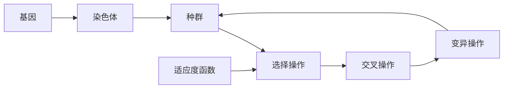
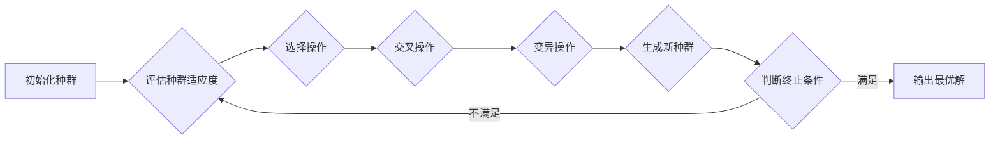

# 遗传算法的基本原理和术语

作者：禅与计算机程序设计艺术

## 1. 背景介绍

### 1.1. 算法概述

遗传算法（Genetic Algorithm，GA）是一种模拟自然选择和遗传机制的搜索启发式算法，属于进化算法（Evolutionary Algorithm，EA）的一种。它借鉴了达尔文进化论的“物竞天择，适者生存”的思想，通过模拟自然进化过程中的选择、交叉和变异等操作，在解空间中搜索最优解。

### 1.2. 发展历程

遗传算法的概念最早由 John Holland 教授于 20 世纪 60 年代提出，并在 70 年代得到初步发展。20 世纪 80 年代以来，随着计算机技术的快速发展，遗传算法得到了广泛的应用和研究，并在许多领域取得了成功，例如机器学习、优化控制、图像处理、人工生命等。

### 1.3. 算法优势

相比于传统的优化算法，遗传算法具有以下优势：

* **全局搜索能力强：**  遗传算法从多个初始解开始搜索，并通过交叉和变异操作跳出局部最优，从而能够找到全局最优解或近似最优解。
* **对问题性质要求低：** 遗传算法不需要目标函数的连续性、可导性等信息，因此可以应用于解决各种复杂优化问题。
* **易于并行化：** 遗传算法的种群进化过程可以并行执行，因此可以利用多核处理器或集群系统加速求解过程。

## 2. 核心概念与联系

### 2.1.  基因 (Gene)

基因是遗传算法的基本单元，它代表了问题解的一个特征或变量。基因可以是二进制编码、实数编码、符号编码等形式。

### 2.2. 染色体 (Chromosome)

染色体是由多个基因组成的序列，它代表了问题的一个完整解。

### 2.3.  种群 (Population)

种群是由多个染色体组成的集合，它代表了问题解空间的一个子集。

### 2.4. 适应度函数 (Fitness Function)

适应度函数用于评价染色体的好坏，它将染色体映射到一个实数值，表示该染色体对问题的适应程度。

### 2.5. 选择操作 (Selection)

选择操作根据染色体的适应度函数值，从种群中选择优良的染色体，淘汰劣质的染色体。常用的选择操作有轮盘赌选择、锦标赛选择等。

### 2.6. 交叉操作 (Crossover)

交叉操作将两个父代染色体的部分基因进行交换，产生新的子代染色体。常用的交叉操作有单点交叉、多点交叉等。

### 2.7. 变异操作 (Mutation)

变异操作随机改变染色体的某个基因的值，以增加种群的多样性。常用的变异操作有位变异、逆转变异等。

### 2.8. 核心概念联系

遗传算法的核心概念之间存在着密切的联系，它们共同构成了遗传算法的基本框架。



## 3. 核心算法原理具体操作步骤

遗传算法的基本流程如下：



### 3.1. 初始化种群

随机生成一定数量的染色体，构成初始种群。

### 3.2. 评估种群适应度

计算种群中每个染色体的适应度函数值。

### 3.3. 选择操作

根据染色体的适应度函数值，从种群中选择优良的染色体，淘汰劣质的染色体。

### 3.4. 交叉操作

将两个父代染色体的部分基因进行交换，产生新的子代染色体。

### 3.5. 变异操作

随机改变染色体的某个基因的值，以增加种群的多样性。

### 3.6. 生成新种群

将选择、交叉、变异操作后产生的子代染色体与父代染色体合并，形成新的种群。

### 3.7. 判断终止条件

判断是否满足终止条件，例如达到最大迭代次数或找到满足要求的解。

### 3.8. 输出最优解

如果满足终止条件，则输出种群中适应度函数值最高的染色体作为最优解。

## 4. 数学模型和公式详细讲解举例说明

### 4.1. 适应度函数

适应度函数是遗传算法的核心组成部分，它用于评价染色体的好坏。适应度函数的设计应该根据具体的问题而定，常用的适应度函数有：

* **目标函数值：** 对于最大化问题，适应度函数可以定义为目标函数值本身；对于最小化问题，适应度函数可以定义为目标函数值的相反数或倒数。
* **排序指标：** 对于无法直接计算目标函数值的问题，可以使用排序指标作为适应度函数，例如排序等级、Pareto 前沿距离等。
* **惩罚函数：** 对于约束优化问题，可以在适应度函数中加入惩罚项，以惩罚违反约束条件的染色体。

### 4.2. 选择操作

选择操作的目的是从种群中选择优良的染色体，淘汰劣质的染色体。常用的选择操作有：

* **轮盘赌选择 (Roulette Wheel Selection)：**  根据染色体的适应度函数值，计算每个染色体被选择的概率，概率越高被选择的可能性越大。
    * 公式：$P_i = \frac{f_i}{\sum_{j=1}^{N} f_j}$，其中 $P_i$ 表示第 $i$ 个染色体被选择的概率，$f_i$ 表示第 $i$ 个染色体的适应度函数值，$N$ 表示种群大小。
* **锦标赛选择 (Tournament Selection)：** 从种群中随机选择 k 个染色体，选择其中适应度函数值最高的染色体作为父代染色体。

### 4.3. 交叉操作

交叉操作的目的是将两个父代染色体的部分基因进行交换，产生新的子代染色体。常用的交叉操作有：

* **单点交叉 (Single-point Crossover)：** 随机选择一个交叉点，将两个父代染色体在交叉点处断开，并将断开后的片段进行交换，生成两个子代染色体。
* **多点交叉 (Multi-point Crossover)：** 随机选择多个交叉点，将两个父代染色体在交叉点处断开，并将断开后的片段进行交换，生成两个子代染色体。

### 4.4. 变异操作

变异操作的目的是随机改变染色体的某个基因的值，以增加种群的多样性。常用的变异操作有：

* **位变异 (Bit-flip Mutation)：** 随机选择染色体上的一个基因，将其值取反。
* **逆转变异 (Inversion Mutation)：** 随机选择染色体上的两个基因，将其之间的基因序列进行反转。

### 4.5. 公式举例

假设有一个最大化目标函数 $f(x) = x^2$，其中 $x$ 的取值范围为 $[0, 10]$。我们可以使用遗传算法来求解该函数的最大值。

* **染色体编码：** 使用二进制编码，染色体长度为 4，表示 $x$ 的取值范围为 $[0, 15]$。
* **适应度函数：** $fitness(x) = x^2$。
* **选择操作：** 使用轮盘赌选择。
* **交叉操作：** 使用单点交叉，交叉概率为 0.8。
* **变异操作：** 使用位变异，变异概率为 0.1。

## 5. 项目实践：代码实例和详细解释说明

### 5.1. Python 代码实例

```python
import random

# 定义目标函数
def objective_function(x):
    return x**2

# 定义遗传算法参数
population_size = 100
chromosome_length = 4
crossover_rate = 0.8
mutation_rate = 0.1
max_generations = 50

# 初始化种群
def initialize_population():
    population = []
    for i in range(population_size):
        chromosome = [random.randint(0, 1) for j in range(chromosome_length)]
        population.append(chromosome)
    return population

# 计算适应度函数值
def calculate_fitness(chromosome):
    x = int("".join(str(i) for i in chromosome), 2)
    return objective_function(x)

# 选择操作
def selection(population):
    fitness_values = [calculate_fitness(chromosome) for chromosome in population]
    total_fitness = sum(fitness_values)
    probabilities = [fitness / total_fitness for fitness in fitness_values]
    selected_indices = random.choices(range(population_size), probabilities, k=population_size)
    selected_population = [population[i] for i in selected_indices]
    return selected_population

# 交叉操作
def crossover(parent1, parent2):
    if random.random() < crossover_rate:
        crossover_point = random.randint(1, chromosome_length - 1)
        child1 = parent1[:crossover_point] + parent2[crossover_point:]
        child2 = parent2[:crossover_point] + parent1[crossover_point:]
        return child1, child2
    else:
        return parent1, parent2

# 变异操作
def mutation(chromosome):
    for i in range(chromosome_length):
        if random.random() < mutation_rate:
            chromosome[i] = 1 - chromosome[i]
    return chromosome

# 遗传算法主函数
def genetic_algorithm():
    # 初始化种群
    population = initialize_population()

    # 迭代进化
    for generation in range(max_generations):
        # 选择操作
        selected_population = selection(population)

        # 交叉操作
        new_population = []
        for i in range(0, population_size, 2):
            parent1 = selected_population[i]
            parent2 = selected_population[i + 1]
            child1, child2 = crossover(parent1, parent2)
            new_population.append(child1)
            new_population.append(child2)

        # 变异操作
        mutated_population = [mutation(chromosome) for chromosome in new_population]

        # 更新种群
        population = mutated_population

    # 输出最优解
    best_chromosome = max(population, key=calculate_fitness)
    best_fitness = calculate_fitness(best_chromosome)
    print("最优解:", best_chromosome)
    print("最优适应度值:", best_fitness)

# 运行遗传算法
genetic_algorithm()
```

### 5.2. 代码解释

* **目标函数 `objective_function(x)`：** 定义了需要优化的目标函数，这里以 $f(x) = x^2$ 为例。
* **遗传算法参数：** 定义了种群大小、染色体长度、交叉概率、变异概率、最大迭代次数等参数。
* **初始化种群 `initialize_population()`：** 随机生成指定数量的染色体，构成初始种群。
* **计算适应度函数值 `calculate_fitness(chromosome)`：** 根据染色体编码计算对应的目标函数值，作为该染色体的适应度函数值。
* **选择操作 `selection(population)`：** 使用轮盘赌选择方法，根据染色体的适应度函数值选择优良的染色体。
* **交叉操作 `crossover(parent1, parent2)`：** 使用单点交叉方法，将两个父代染色体的部分基因进行交换，生成新的子代染色体。
* **变异操作 `mutation(chromosome)`：** 使用位变异方法，随机改变染色体的某个基因的值。
* **遗传算法主函数 `genetic_algorithm()`：** 实现了遗传算法的基本流程，包括初始化种群、迭代进化、输出最优解等步骤。

## 6. 实际应用场景

遗传算法作为一种通用的优化算法，在许多领域都有着广泛的应用，例如：

* **机器学习：** 特征选择、参数优化、神经网络训练等。
* **优化控制：** 路径规划、调度问题、参数优化等。
* **图像处理：** 图像分割、图像识别、图像压缩等。
* **人工生命：** 模拟生物进化、人工免疫系统等。
* **金融领域：** 投资组合优化、风险管理等。

### 6.1.  案例一：旅行商问题

旅行商问题 (Traveling Salesman Problem, TSP) 是一个经典的组合优化问题，其目标是在给定多个城市和城市之间的距离的情况下，找到一条访问每个城市恰好一次并返回出发城市的 Hamilton 回路，使得总路程最短。

遗传算法可以用于解决旅行商问题，其基本思路是将 Hamilton 回路编码为染色体，使用适应度函数评价染色体代表的路径长度，通过选择、交叉、变异等操作不断优化种群，最终找到最优解或近似最优解。

### 6.2. 案例二：函数优化

遗传算法可以用于求解各种函数的极值问题，例如：

* **连续函数：** $f(x) = x^2 - 4x + 3$
* **离散函数：** 背包问题、0-1 背包问题等

### 6.3. 案例三：机器学习

遗传算法可以用于机器学习中的特征选择、参数优化、神经网络训练等方面，例如：

* **特征选择：** 从原始特征集中选择最优的特征子集，以提高模型的泛化能力。
* **参数优化：** 寻找模型的最优超参数，以提高模型的性能。
* **神经网络训练：** 使用遗传算法优化神经网络的权重和偏置，以提高模型的准确率。

## 7. 工具和资源推荐

### 7.1. Python 库

* **DEAP：** 一个用于快速原型设计和测试进化算法的 Python 框架。
* **PyGAD：** 一个用于构建遗传算法的 Python 库。
* **Scikit-learn：** 包含遗传算法实现的机器学习库。

### 7.2. 在线资源

* **Genetic Algorithms Tutorial：**  Analytics Vidhya 网站上的遗传算法教程。
* **Genetic Algorithm - GeeksforGeeks：** GeeksforGeeks 网站上的遗传算法介绍和代码示例。

## 8. 总结：未来发展趋势与挑战

### 8.1.  发展趋势

* **与其他算法的融合：** 将遗传算法与其他优化算法相结合，例如粒子群算法、模拟退火算法等，以克服各自的局限性，提高求解效率。
* **并行化和分布式计算：** 利用多核处理器或集群系统加速遗传算法的求解过程。
* **应用于新兴领域：** 将遗传算法应用于新兴领域，例如深度学习、大数据分析等。

### 8.2. 挑战

* **参数设置：** 遗传算法的参数设置对算法的性能影响较大，如何自动地调整参数是一个挑战。
* **早熟收敛：** 遗传算法容易陷入局部最优，如何避免早熟收敛是一个挑战。
* **可解释性：** 遗传算法的求解过程难以解释，如何提高算法的可解释性是一个挑战。

## 9. 附录：常见问题与解答

### 9.1.  如何选择遗传算法的参数？

遗传算法的参数设置对算法的性能影响较大，一般需要根据具体的问题进行调整。常用的参数调整方法有：

* **经验法：** 根据经验设置参数，例如种群大小设置为 100，交叉概率设置为 0.8，变异概率设置为 0.1 等。
* **实验法：** 通过实验比较不同参数设置下的算法性能，选择性能最好的参数设置。
* **自适应参数调整：** 在算法运行过程中动态地调整参数，例如根据种群多样性调整交叉概率和变异概率。

### 9.2.  如何避免遗传算法的早熟收敛？

遗传算法容易陷入局部最优，导致早熟收敛。常用的避免早熟收敛的方法有：

* **增加种群多样性：** 使用更大的种群大小、更高的变异概率等方法增加种群多样性。
* **改进选择操作：** 使用锦标赛选择等方法，避免适应度函数值高的染色体被过度选择。
* **引入精英策略：** 将每一代种群中适应度函数值最高的染色体直接复制到下一代种群中，以防止最优解丢失。

### 9.3.  如何提高遗传算法的可解释性？

遗传算法的求解过程难以解释，如何提高算法的可解释性是一个挑战。常用的提高可解释性的方法有：

* **可视化：** 将算法的求解过程可视化，例如绘制种群进化曲线、最优解搜索路径等。
* **规则提取：** 从进化后的种群中提取规则，以解释算法的决策过程。
