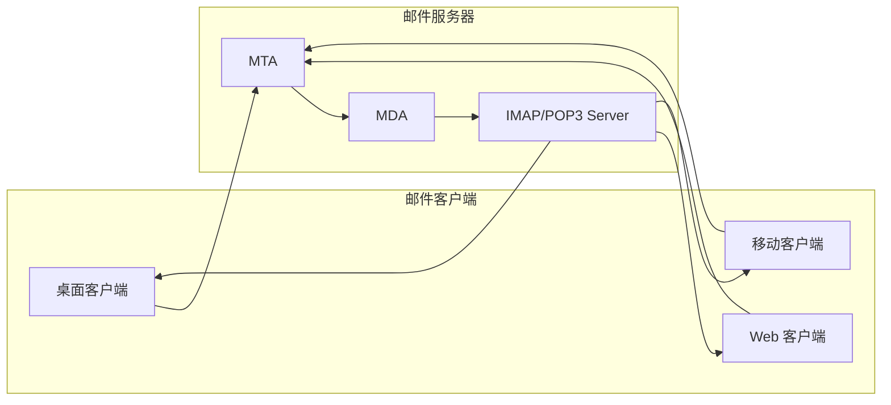

## 1. 背景介绍

### 1.1 邮件通信的现状与挑战

电子邮件 (Email) 作为一种便捷、高效的通信方式，在当今社会中扮演着至关重要的角色。无论是个人用户还是企业组织，都依赖邮件进行信息传递、协作沟通以及业务往来。然而，随着信息技术的飞速发展和互联网的普及，邮件通信也面临着一系列挑战：

* **海量邮件的处理压力:** 随着用户数量和邮件数量的激增，传统邮件系统在处理效率、存储空间、安全防护等方面面临巨大压力。
* **垃圾邮件和恶意邮件的泛滥:** 垃圾邮件和恶意邮件不仅浪费用户时间和网络带宽，还可能窃取敏感信息、传播病毒，严重威胁用户信息安全。
* **移动化和云计算时代的适应性:** 随着移动设备的普及和云计算技术的兴起，邮件系统需要具备更高的灵活性和可扩展性，以满足用户随时随地访问邮件的需求。

### 1.2 邮件收发管理系统的意义和价值

为了应对上述挑战，邮件收发管理系统应运而生。这类系统旨在提供高效、安全、便捷的邮件服务，帮助用户更好地管理和使用邮件。具体而言，邮件收发管理系统具有以下意义和价值：

* **提升邮件处理效率:** 通过自动化处理、智能分类、多线程并发等技术，提高邮件收发速度，减轻用户负担。
* **增强邮件安全防护:** 通过垃圾邮件过滤、病毒查杀、身份验证等措施，保障用户信息安全，防止恶意攻击。
* **优化用户体验:** 提供友好的用户界面、个性化设置、多平台支持等功能，提升用户使用体验，满足多样化需求。

## 2. 核心概念与联系

### 2.1 邮件协议

邮件收发管理系统基于一系列标准的邮件协议，这些协议定义了邮件的格式、传输方式、安全机制等。

* **SMTP (Simple Mail Transfer Protocol):** 用于发送邮件。
* **POP3 (Post Office Protocol 3):** 用于接收邮件。
* **IMAP (Internet Message Access Protocol):** 用于在线管理邮件。

### 2.2 邮件服务器架构

邮件服务器是邮件收发管理系统的核心组件，负责接收、存储、转发邮件。典型的邮件服务器架构包括以下模块：

* **MTA (Mail Transfer Agent):** 负责接收和转发邮件。
* **MDA (Mail Delivery Agent):** 负责将邮件投递到用户邮箱。
* **IMAP/POP3 Server:** 负责用户访问邮件。

### 2.3 邮件客户端

邮件客户端是用户与邮件服务器交互的工具，用于发送、接收、管理邮件。常见的邮件客户端包括：

* **桌面客户端:** 如 Outlook、Thunderbird、Foxmail 等。
* **Web 客户端:** 如 Gmail、Yahoo Mail、QQ 邮箱等。
* **移动客户端:**  如 iOS Mail、Gmail App、Outlook App 等。

### 2.4 核心概念联系图



## 3. 核心算法原理具体操作步骤

### 3.1 邮件发送流程

1. 用户使用邮件客户端编写邮件，并指定收件人、主题、内容等信息。
2. 邮件客户端通过 SMTP 协议将邮件发送到 MTA。
3. MTA 接收邮件后，解析邮件头信息，并根据收件人地址进行路由选择。
4. MTA 将邮件转发到目标邮件服务器的 MTA。
5. 目标邮件服务器的 MTA 接收邮件后，将邮件传递给 MDA。
6. MDA 将邮件存储到收件人的邮箱中。

### 3.2 邮件接收流程

1. 用户使用邮件客户端连接到 IMAP/POP3 Server。
2. IMAP/POP3 Server 验证用户身份，并获取用户邮箱中的邮件列表。
3. 邮件客户端根据用户选择下载邮件内容。
4. 用户阅读或处理邮件。

### 3.3 垃圾邮件过滤算法

垃圾邮件过滤是邮件收发管理系统的重要功能之一，常用的垃圾邮件过滤算法包括：

* **基于规则的过滤:** 根据预先定义的规则，识别垃圾邮件特征，例如特定关键词、发件人地址、邮件格式等。
* **基于统计的过滤:** 通过统计分析邮件内容、发送行为等信息，识别垃圾邮件的概率。
* **基于机器学习的过滤:** 利用机器学习算法，训练垃圾邮件识别模型，自动识别垃圾邮件。

## 4. 数学模型和公式详细讲解举例说明

### 4.1 朴素贝叶斯分类器

朴素贝叶斯分类器是一种常用的垃圾邮件过滤算法，其原理是根据贝叶斯定理计算邮件属于垃圾邮件的概率。

**贝叶斯定理:**

```
P(A|B) = P(B|A) * P(A) / P(B)
```

其中:

* P(A|B) 表示在事件 B 发生的情况下，事件 A 发生的概率。
* P(B|A) 表示在事件 A 发生的情况下，事件 B 发生的概率。
* P(A) 表示事件 A 发生的概率。
* P(B) 表示事件 B 发生的概率。

**应用于垃圾邮件过滤:**

* A 表示邮件是垃圾邮件。
* B 表示邮件包含特定关键词。

**计算过程:**

1. 统计垃圾邮件和正常邮件中包含特定关键词的概率 P(B|A) 和 P(B|¬A)。
2. 统计垃圾邮件的比例 P(A)。
3. 对于新邮件，根据其包含的关键词，计算其属于垃圾邮件的概率 P(A|B)。

**举例说明:**

假设垃圾邮件中包含关键词 "免费" 的概率为 0.8，正常邮件中包含关键词 "免费" 的概率为 0.1，垃圾邮件的比例为 0.2。

现在有一封新邮件包含关键词 "免费"，则其属于垃圾邮件的概率为:

```
P(A|B) = P(B|A) * P(A) / P(B)
       = 0.8 * 0.2 / (0.8 * 0.2 + 0.1 * 0.8)
       = 0.67
```

因此，这封邮件属于垃圾邮件的概率为 67%。

## 5. 项目实践：代码实例和详细解释说明

### 5.1 Python 实现 SMTP 邮件发送

```python
import smtplib
from email.mime.text import MIMEText

def send_email(sender_email, sender_password, receiver_email, subject, content):
    """
    发送邮件

    Args:
        sender_email: 发送方邮箱地址
        sender_password: 发送方邮箱密码
        receiver_email: 接收方邮箱地址
        subject: 邮件主题
        content: 邮件内容

    Returns:
        None
    """

    msg = MIMEText(content, 'plain', 'utf-8')
    msg['Subject'] = subject
    msg['From'] = sender_email
    msg['To'] = receiver_email

    try:
        server = smtplib.SMTP_SSL('smtp.gmail.com', 465)
        server.login(sender_email, sender_password)
        server.sendmail(sender_email, receiver_email, msg.as_string())
        server.quit()
        print('邮件发送成功')
    except Exception as e:
        print('邮件发送失败: {}'.format(e))

# 示例用法
sender_email = 'your_email@gmail.com'
sender_password = 'your_password'
receiver_email = 'receiver_email@example.com'
subject = '测试邮件'
content = '这是一封测试邮件。'

send_email(sender_email, sender_password, receiver_email, subject, content)
```

### 5.2 Java 实现 IMAP 邮件接收

```java
import javax.mail.*;
import javax.mail.internet.MimeMessage;
import java.util.Properties;

public class ImapReceiver {

    public static void main(String[] args) {
        Properties props = new Properties();
        props.put("mail.imap.host", "imap.gmail.com");
        props.put("mail.imap.port", "993");
        props.put("mail.imap.ssl.enable", "true");

        Session session = Session.getDefaultInstance(props, null);

        try {
            Store store = session.getStore("imap");
            store.connect("your_email@gmail.com", "your_password");

            Folder inbox = store.getFolder("INBOX");
            inbox.open(Folder.READ_ONLY);

            Message[] messages = inbox.getMessages();
            for (Message message : messages) {
                MimeMessage mimeMessage = (MimeMessage) message;
                System.out.println("主题: " + mimeMessage.getSubject());
                System.out.println("发件人: " + mimeMessage.getFrom()[0]);
                System.out.println("内容: " + mimeMessage.getContent());
            }

            inbox.close(false);
            store.close();
        } catch (Exception e) {
            e.printStackTrace();
        }
    }
}
```

## 6. 实际应用场景

### 6.1 企业内部邮件系统

企业内部邮件系统是邮件收发管理系统最常见的应用场景之一，用于企业内部员工之间的沟通和协作。

### 6.2 电子商务平台

电子商务平台利用邮件系统进行用户注册、订单确认、物流通知、促销活动等业务操作。

### 6.3 在线教育平台

在线教育平台利用邮件系统进行课程通知、作业提醒、学习资料分享等教学活动。

## 7. 工具和资源推荐

### 7.1 邮件服务器软件

* **Postfix:** 开源邮件服务器软件，稳定可靠，功能强大。
* **Sendmail:** 商业邮件服务器软件，性能优越，安全性高。
* **Microsoft Exchange Server:** 微软企业级邮件服务器软件，集成度高，管理方便。

### 7.2 邮件客户端软件

* **Microsoft Outlook:** 功能强大的桌面邮件客户端软件，支持多种邮件协议和账户。
* **Mozilla Thunderbird:** 开源桌面邮件客户端软件，界面简洁，易于使用。
* **Gmail:** Google 提供的 Web 邮件客户端，功能丰富，使用方便。

## 8. 总结：未来发展趋势与挑战

### 8.1 人工智能技术应用

未来邮件收发管理系统将更多地应用人工智能技术，例如自然语言处理、机器学习等，以提升邮件处理效率、增强安全防护、优化用户体验。

### 8.2 云计算技术融合

云计算技术将为邮件收发管理系统提供更灵活、可扩展的部署方式，降低运维成本，提高系统可靠性。

### 8.3 安全挑战

随着网络攻击手段的不断升级，邮件收发管理系统面临着更加严峻的安全挑战，需要不断加强安全防护措施，保障用户信息安全。

## 9. 附录：常见问题与解答

### 9.1 如何设置邮件客户端？

不同邮件客户端的设置方法略有不同，一般需要提供以下信息：

* 邮件服务器地址
* 邮箱地址
* 邮箱密码

### 9.2 如何防止垃圾邮件？

* 不要随意公开邮箱地址。
* 使用垃圾邮件过滤功能。
* 定期清理邮箱。

### 9.3 如何提高邮件发送成功率？

* 确保邮件地址正确。
* 避免发送大量邮件。
* 检查邮件服务器设置。