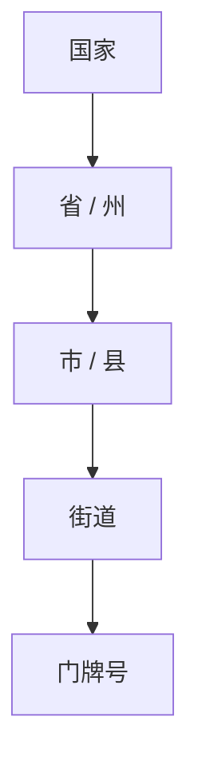

# 邮政编码系统详细设计与具体代码实现

作者：禅与计算机程序设计艺术

## 1. 背景介绍
### 1.1 邮政编码的重要性
邮政编码是一个国家或地区的邮政系统中用于区分不同地理位置的编码体系。它在现代社会的信件、包裹递送以及许多其他领域发挥着至关重要的作用。一个设计良好的邮政编码系统可以大大提高邮递效率,降低错误率。

### 1.2 邮政编码系统面临的挑战
然而,随着城市化进程的加快,人口流动日益频繁,传统的邮政编码体系逐渐暴露出一些局限性,主要表现在:
1. 编码位数有限,难以满足日益增长的地址需求
2. 编码规则复杂,不利于记忆和使用
3. 更新不及时,滞后于城市规划和地址变更
4. 缺乏灵活性,难以适应物流、电商等新兴领域的需求

### 1.3 现代化、智能化邮政编码系统的必要性
为了应对上述挑战,世界各国都在积极探索现代化、智能化的邮政编码系统。这些系统利用大数据、云计算、人工智能等新技术,在兼容传统编码的基础上,实现了动态更新、精准定位、灵活扩展等功能,极大地提升了编码系统的实用价值。本文将重点介绍这种新型邮政编码系统的设计理念和具体实现。

## 2. 核心概念与联系
### 2.1 地址要素分解
地址是描述一个位置的结构化信息,通常由国家、省(州)、市(县)、街道、门牌号等多个层级要素组成。要素之间的关系可以用树形结构表示:

### 2.2 地址编码
地址编码是一个将结构化的地址要素映射为一串数字或字母的过程。编码后的结果通常具有唯一性、有序性等特点,便于计算机高效处理。

一个简单的编码规则示例:
- 国家代码(2位数字) + 
- 省/州代码(2位数字) + 
- 市/县代码(3位数字) + 
- 街道代码(3位数字) + 
- 门牌号(4位数字)

根据这个规则,一个完整的邮政编码共14位,形如: "01-02-001-008-0025"。

### 2.3 地理信息系统(GIS)
地理信息系统是专门用于采集、管理与分析地理空间数据的计算机系统。在邮政编码场景下,GIS 可以提供如下关键功能:
- 地理编码(Geocoding):将地址转换为对应的地理坐标(经纬度)
- 空间索引:对地理区域进行网格化划分,加速地址匹配
- 路径规划:计算两个地址点之间的最短递送路线
- 可视化:生成直观的地图界面,展示地址位置、编码覆盖等信息

### 2.4 编码更新机制
为了保持与地址变更的同步,编码体系需要一套完善的更新机制,主要包括:
- 增量更新:当出现新的街道、楼盘时,自动为其分配新的编码
- 定期校验:定期核查编码与实际地址的一致性,清除过期失效的编码
- 版本控制:记录每次编码的更新时间、操作人等信息,便于回溯

## 3. 核心算法原理及操作步骤
### 3.1 地址解析算法
地址解析算法的目标是将一个自然语言描述的地址转换为结构化的地址要素。其主要步骤包括:

1. 地址预处理:对原始地址进行清洗、分词等预处理操作
2. 要素识别:利用命名实体识别(NER)技术,从地址中提取出关键要素(如国家、省、市等)
3. 要素归一:对提取出的要素进行标准化处理,消除同义词、别名等差异
4. 地址校验:对结构化的地址要素进行有效性校验和纠错

伪代码实现:
```python
def parse_address(raw_addr):
    # 1. 地址预处理
    cleaned_addr = preprocess(raw_addr)
    # 2. 要素识别
    elements = NER(cleaned_addr)
    # 3. 要素归一化
    normalized_elements = normalize(elements)
    # 4. 地址校验
    is_valid, parsed_addr = validate(normalized_elements) 
    return parsed_addr if is_valid else None
```

### 3.2 地址编码算法
地址编码算法的目标是将一个结构化的地址映射为一个唯一的邮政编码。其主要步骤包括:

1. 制定编码规则:设计固定长度的编码格式,确定每个字段的位数和取值范围
2. 构建编码映射:给每个地址要素的可能取值分配一个编码,形成映射字典
3. 地址编码:将结构化地址的每个字段替换为对应的编码,按顺序拼接形成完整编码

以Section 2.2中的样例规则为例,编码步骤如下:
1. 编码规则已知:14位码,分别对应国家、省、市、街道、门牌号
2. 构建编码映射:
```python
COUNTRY_CODE = {'US': '01', 'CN': '02', ...}
PROVINCE_CODE = {'California': '01', 'Beijing': '02', ...}  
CITY_CODE = {'Los Angeles': '001', 'Shanghai': '002', ...}
STREET_CODE = {'Hollywood Blvd': '001', 'Nanjing Road': '002', ... }
```
3. 地址编码:
```python
def encode_address(structured_addr):
    country = structured_addr['country']
    province = structured_addr['province']
    city = structured_addr['city']
    street = structured_addr['street']
    number = structured_addr['number']
    
    country_code = COUNTRY_CODE[country]
    province_code = PROVINCE_CODE[province]
    city_code = CITY_CODE[city]
    street_code = STREET_CODE[street]
    number_code = f"{int(number):04d}"
    
    return f"{country_code}-{province_code}-{city_code}-{street_code}-{number_code}"
```

### 3.3 邮编解码算法
邮编解码是编码算法的逆过程,目标是将一个邮政编码还原为对应的结构化地址。解码步骤如下:

1. 编码切分:按照预设的规则,将长编码切分为国家、省、市、街道、门牌号等字段
2. 字段解码:利用编码映射字典,将每个字段的编码值转换回原始的地址要素
3. 地址拼接:将解码后的各个地址要素按照顺序拼接,得到完整的结构化地址

以Section 3.2的编码规则和映射为例,解码算法实现如下:
```python 
def decode_postcode(postcode):
    # 1. 编码切分
    country_code, province_code, city_code, street_code, number_code = postcode.split('-')
    
    # 2. 字段解码
    country = reverse_dict_lookup(COUNTRY_CODE, country_code)
    province = reverse_dict_lookup(PROVINCE_CODE, province_code)    
    city = reverse_dict_lookup(CITY_CODE, city_code)
    street = reverse_dict_lookup(STREET_CODE, street_code)
    number = int(number_code)
    
    # 3. 地址拼接
    return {
        'country': country,
        'province': province,
        'city': city, 
        'street': street,
        'number': number
    }

def reverse_dict_lookup(dict_obj, value):
    return next(k for k, v in dict_obj.items() if v == value)
```

### 3.4 地址匹配算法
地址匹配算法用于判断两个地址是否指向同一位置,或找出与目标地址最接近的已知地址。常见的匹配算法包括:

1. 编辑距离算法:计算两个地址字符串之间的编辑距离(插入、删除、替换字符的最少操作次数),距离越小则相似度越高。
2. Jaccard相似度:将两个地址看作字符的集合,计算它们交集和并集的比值作为相似度度量。
3. 词向量语义匹配:利用词向量(如Word2Vec)表示地址中的关键词,通过向量空间的距离(如余弦相似度)来衡量语义上的接近程度。
4. 地理坐标距离:对于有完整地理坐标信息的地址,直接计算两点之间的空间距离(如欧氏距离或Haversine公式)。

以Jaccard相似度为例,匹配算法实现如下:
```python
def jaccard_similarity(addr1, addr2):
    set1 = set(addr1.lower().split())
    set2 = set(addr2.lower().split())
    intersection = set1 & set2
    union = set1 | set2
    return len(intersection) / len(union)

def find_best_match(target_addr, addr_list, threshold=0.8):
    best_match = None
    max_similarity = 0
    for addr in addr_list:
        similarity = jaccard_similarity(target_addr, addr)
        if similarity > max_similarity:
            best_match = addr
            max_similarity = similarity
    return best_match if max_similarity >= threshold else None
```

## 4. 数学模型和公式详细讲解举例说明
本节我们重点介绍编辑距离算法中的Levenshtein距离模型。

### 4.1 Levenshtein距离定义
Levenshtein距离是用于衡量两个字符串差异程度的一种度量。它表示将一个字符串转化为另一个字符串所需的最少单字符编辑操作(插入、删除、替换)的次数。

形式化地,对于两个字符串 $a$ 和 $b$,它们的Levenshtein距离 $lev(a,b)$ 可以递归地定义为:

$
lev(a, b) = 
\begin{cases}
|a| & if |b| = 0 \\
|b| & if |a| = 0 \\
lev(tail(a), tail(b)) & if a[0] = b[0] \\
1 + min\begin{cases}
lev(tail(a), b) \\
lev(a, tail(b))  \\
lev(tail(a), tail(b))
\end{cases} & otherwise
\end{cases}
$

其中 $|a|$ 和 $|b|$ 分别表示字符串 $a$ 和 $b$ 的长度, $tail(a)$ 表示移除字符串 $a$ 的首字符后的子串, $a[0]$ 表示 $a$ 的首字符。

### 4.2 Levenshtein距离计算示例
我们以两个字符串 "kitten" 和 "sitting" 为例,演示如何计算它们的Levenshtein距离。

逐步计算过程如下:
1. $lev("kitten", "sitting") = 1 + min(lev("itten","sitting"), lev("kitten","itting"), lev("itten","itting"))$
2. $lev("itten","sitting") = 1 + min(lev("tten","sitting"), lev("itten","itting"), lev("tten","itting"))$
3. $lev("tten","sitting") = 1 + min(lev("ten","sitting"), lev("tten","itting"), lev("ten","itting"))$
4. $lev("ten","sitting") = 1 + min(lev("en","sitting"), lev("ten","itting"), lev("en","itting"))$
5. $lev("en","sitting") = 1 + min(lev("n","sitting"), lev("en","itting"), lev("n","itting"))$
6. $lev("n","sitting") = 1 + min(lev("","sitting"), lev("n","itting"), lev("","itting"))$
7. $lev("","sitting") = 7$
8. $lev("n","itting") = 1 + min(lev("","itting"), lev("n","tting"), lev("","tting"))$
9. $lev("","itting") = 6$
10. $lev("n","tting") = 1 + min(lev("","tting"), lev("n","ting"), lev("","ting"))$
11. $lev("","tting") = 5$
12. $lev("n","ting") = 1 + min(lev("","ting"), lev("n","ing"), lev("","ing"))$
13. $lev("","ting") = 4$
14. $lev("n","ing") = 1 + min(lev("","ing"), lev("n","ng"), lev("","ng"))$
15. $lev("","ing") = 3$
16. $lev("n","ng") = 1 + min(lev("","ng"), lev("n","g"), lev("","g"))$
17. $lev("","ng") = 2$
18. $lev("n","g") = 1 + min(lev("","g"), lev("n",""), lev("",""))$
19. $lev("","g") = 1$
20. $lev("n","") = 1$