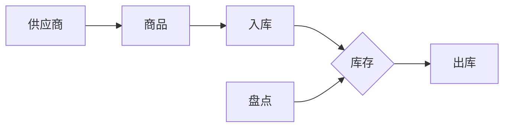

## 1. 背景介绍

### 1.1 酒店仓库管理的现状与挑战

现代酒店业竞争日益激烈，高效的仓库管理对于酒店的运营成本控制、客户满意度提升至关重要。传统的仓库管理方式存在诸多弊端，例如：

* **人工操作繁琐，效率低下：**  手工记录出入库信息，容易出错且耗费大量人力。
* **库存数据不准确，难以实时掌握库存情况：**  缺乏有效的库存跟踪机制，导致库存数据滞后，无法及时调整采购计划。
* **物资浪费严重，成本难以控制：**  无法有效监控物资的使用情况，容易造成物资积压或短缺，增加运营成本。

### 1.2 酒店仓库管理系统的必要性

为了解决上述问题，酒店仓库管理系统应运而生。该系统旨在通过信息化手段，实现仓库管理的自动化、智能化，帮助酒店：

* **提高仓库管理效率：**  自动化出入库操作，减少人工干预，提高效率。
* **实时掌握库存情况：**  实时跟踪库存变化，提供准确的库存数据，支持决策。
* **降低运营成本：**  优化库存结构，减少物资浪费，降低采购成本。

### 1.3 本文的目的和意义

本文将详细介绍酒店仓库管理系统的详细设计与具体代码实现，旨在：

* 为酒店管理人员提供仓库管理系统的设计思路和参考方案。
* 为软件开发人员提供系统开发的具体步骤和代码示例。
* 推动酒店仓库管理的信息化建设，提升酒店运营效率。

## 2. 核心概念与联系

### 2.1 仓库管理系统的核心概念

酒店仓库管理系统主要涉及以下核心概念：

* **商品：**  酒店仓库中存储的各种物资，包括食品、饮料、客房用品、清洁用品等。
* **供应商：**  向酒店提供商品的企业或个人。
* **入库：**  将商品存入仓库的过程。
* **出库：**  将商品从仓库取出的过程。
* **库存：**  仓库中存储的商品数量。
* **盘点：**  定期核查仓库中商品的实际数量，与系统记录进行比对。

### 2.2 核心概念之间的联系

这些核心概念之间存在着密切的联系，例如：

* **商品**是仓库管理的对象，**供应商**是商品的来源。
* **入库**和**出库**是仓库管理的两个基本操作，它们直接影响着**库存**数量。
* **盘点**是为了确保**库存**数据的准确性。

### 2.3 核心概念的 Mermaid 流程图



## 3. 核心算法原理具体操作步骤

### 3.1 入库管理

#### 3.1.1 入库流程

1. 采购部门根据需求制定采购计划。
2. 仓库管理员接收采购计划，创建入库单。
3. 供应商送货至仓库，仓库管理员核对商品信息，确认入库。
4. 系统自动更新库存数据。

#### 3.1.2 核心算法

入库管理的核心算法是 **库存数量的更新**，即在原有库存数量的基础上加上入库数量。

### 3.2 出库管理

#### 3.2.1 出库流程

1. 各部门根据需求提交领用申请。
2. 仓库管理员审核领用申请，创建出库单。
3. 仓库管理员根据出库单配货，确认出库。
4. 系统自动更新库存数据。

#### 3.2.2 核心算法

出库管理的核心算法是 **库存数量的更新**，即在原有库存数量的基础上减去出库数量。

### 3.3 库存管理

#### 3.3.1 库存查询

系统提供实时库存查询功能，用户可以随时查看各种商品的库存数量、库存预警状态等信息。

#### 3.3.2 库存预警

系统可以设置库存预警阈值，当某种商品的库存数量低于预警阈值时，系统会自动发出预警信息，提醒仓库管理员及时补充库存。

### 3.4 盘点管理

#### 3.4.1 盘点流程

1. 定期进行盘点，核对仓库中商品的实际数量。
2. 将盘点结果与系统记录进行比对，查找差异。
3. 分析差异原因，进行调整。

#### 3.4.2 核心算法

盘点管理的核心算法是 **差异分析**，即比较实际盘点数量与系统记录数量之间的差异，并分析差异原因。

## 4. 数学模型和公式详细讲解举例说明

### 4.1 库存周转率

库存周转率是衡量仓库管理效率的重要指标，其计算公式如下：

$$
库存周转率 = \frac{年度销售成本}{平均库存价值}
$$

**举例说明：**

假设某酒店年度销售成本为 1000 万元，平均库存价值为 200 万元，则该酒店的库存周转率为：

$$
库存周转率 = \frac{1000}{200} = 5
$$

这意味着该酒店的库存平均周转 5 次。

### 4.2 库存预警阈值

库存预警阈值是指当某种商品的库存数量低于该阈值时，系统会发出预警信息。预警阈值的设置需要考虑商品的采购周期、消耗速度等因素。

**举例说明：**

假设某种商品的采购周期为 7 天，平均每天消耗 10 件，则该商品的预警阈值可以设置为：

$$
预警阈值 = 7 \times 10 = 70
$$

这意味着当该商品的库存数量低于 70 件时，系统会发出预警信息。

## 5. 项目实践：代码实例和详细解释说明

### 5.1 技术选型

* **编程语言：** Python
* **数据库：** MySQL
* **Web框架：** Django

### 5.2 数据库设计

```sql
-- 商品表
CREATE TABLE product (
    id INT PRIMARY KEY AUTO_INCREMENT,
    name VARCHAR(255) NOT NULL,
    category VARCHAR(255) NOT NULL,
    unit VARCHAR(255) NOT NULL,
    price DECIMAL(10, 2) NOT NULL,
    stock INT NOT NULL
);

-- 供应商表
CREATE TABLE supplier (
    id INT PRIMARY KEY AUTO_INCREMENT,
    name VARCHAR(255) NOT NULL,
    contact VARCHAR(255) NOT NULL,
    phone VARCHAR(255) NOT NULL
);

-- 入库单表
CREATE TABLE inbound_order (
    id INT PRIMARY KEY AUTO_INCREMENT,
    product_id INT NOT NULL,
    supplier_id INT NOT NULL,
    quantity INT NOT NULL,
    created_at TIMESTAMP DEFAULT CURRENT_TIMESTAMP
);

-- 出库单表
CREATE TABLE outbound_order (
    id INT PRIMARY KEY AUTO_INCREMENT,
    product_id INT NOT NULL,
    department VARCHAR(255) NOT NULL,
    quantity INT NOT NULL,
    created_at TIMESTAMP DEFAULT CURRENT_TIMESTAMP
);
```

### 5.3 代码实现

**入库操作：**

```python
def inbound(request):
    if request.method == 'POST':
        product_id = request.POST.get('product_id')
        supplier_id = request.POST.get('supplier_id')
        quantity = request.POST.get('quantity')

        # 更新库存
        product = Product.objects.get(id=product_id)
        product.stock += int(quantity)
        product.save()

        # 创建入库单
        inbound_order = InboundOrder(
            product_id=product_id,
            supplier_id=supplier_id,
            quantity=quantity
        )
        inbound_order.save()

        return HttpResponse('入库成功！')
```

**出库操作：**

```python
def outbound(request):
    if request.method == 'POST':
        product_id = request.POST.get('product_id')
        department = request.POST.get('department')
        quantity = request.POST.get('quantity')

        # 更新库存
        product = Product.objects.get(id=product_id)
        product.stock -= int(quantity)
        product.save()

        # 创建出库单
        outbound_order = OutboundOrder(
            product_id=product_id,
            department=department,
            quantity=quantity
        )
        outbound_order.save()

        return HttpResponse('出库成功！')
```

## 6. 实际应用场景

### 6.1 酒店餐饮部

餐饮部可以使用仓库管理系统管理各种食材、饮料的库存，以及跟踪食材的消耗情况，以便及时补充库存，避免食材短缺影响餐饮服务。

### 6.2 酒店客房部

客房部可以使用仓库管理系统管理客房用品、清洁用品的库存，以及跟踪客房用品的消耗情况，以便及时补充库存，确保客房服务质量。

### 6.3 酒店采购部

采购部可以使用仓库管理系统制定采购计划，跟踪采购进度，以及管理供应商信息。

## 7. 总结：未来发展趋势与挑战

### 7.1 未来发展趋势

* **智能化：**  利用人工智能技术，实现仓库管理的自动化、智能化，例如自动识别商品、自动盘点等。
* **移动化：**  开发移动端应用，方便仓库管理员随时随地进行操作。
* **数据化：**  利用大数据技术，分析仓库管理数据，优化库存结构，提高仓库管理效率。

### 7.2 面临的挑战

* **数据安全：**  仓库管理系统存储着大量的商品信息、供应商信息等敏感数据，需要做好数据安全防护工作。
* **系统集成：**  仓库管理系统需要与酒店其他系统进行集成，例如财务系统、采购系统等，以实现数据共享和业务协同。
* **用户体验：**  仓库管理系统的用户界面需要简洁易用，方便用户操作。

## 8. 附录：常见问题与解答

### 8.1 如何设置库存预警阈值？

库存预警阈值的设置需要考虑商品的采购周期、消耗速度等因素。建议根据历史数据进行分析，确定合理的预警阈值。

### 8.2 如何进行盘点？

盘点可以通过人工盘点或 RFID 技术进行。人工盘点需要逐一核对商品数量， RFID 技术可以通过扫描商品标签快速完成盘点。

### 8.3 如何提高仓库管理效率？

提高仓库管理效率可以从以下几个方面入手：

* **优化仓库布局：**  合理规划仓库布局，方便商品的出入库操作。
* **使用条码技术：**  使用条码技术可以快速识别商品，提高出入库效率。
* **加强员工培训：**  对仓库管理员进行专业培训，提高其操作技能和安全意识。
