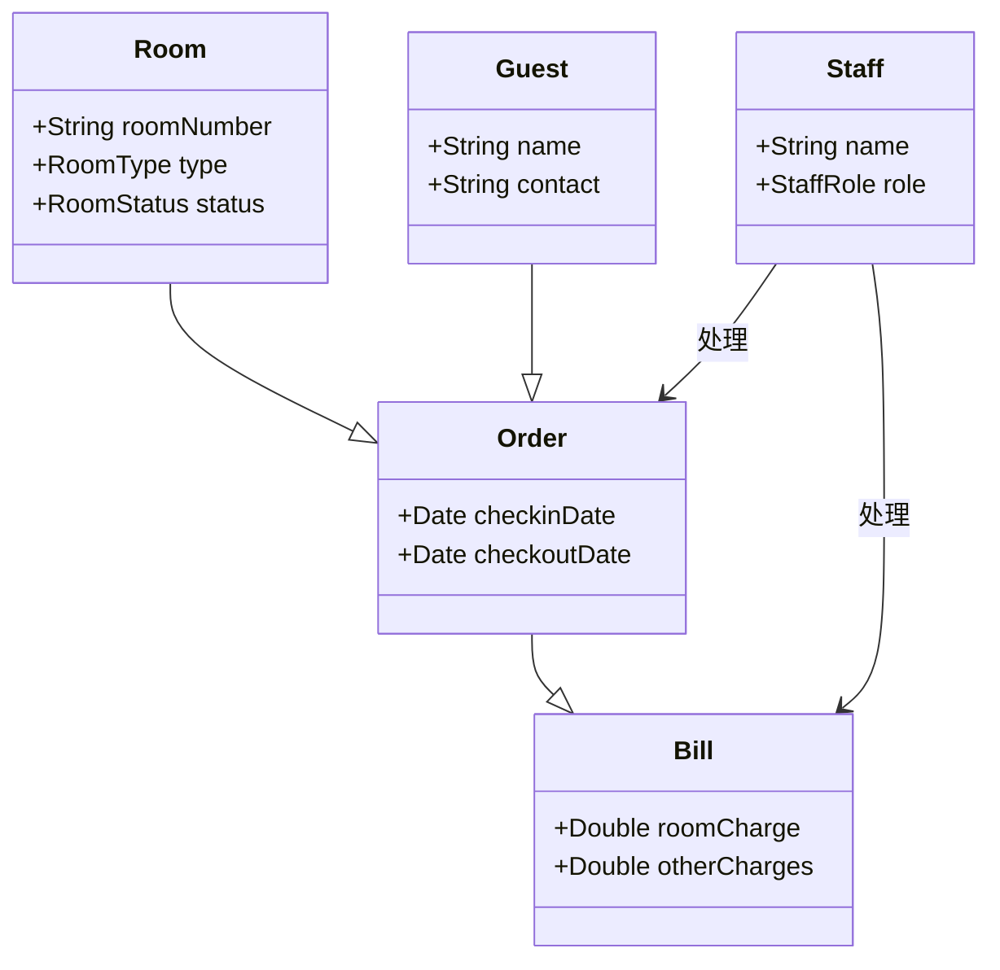
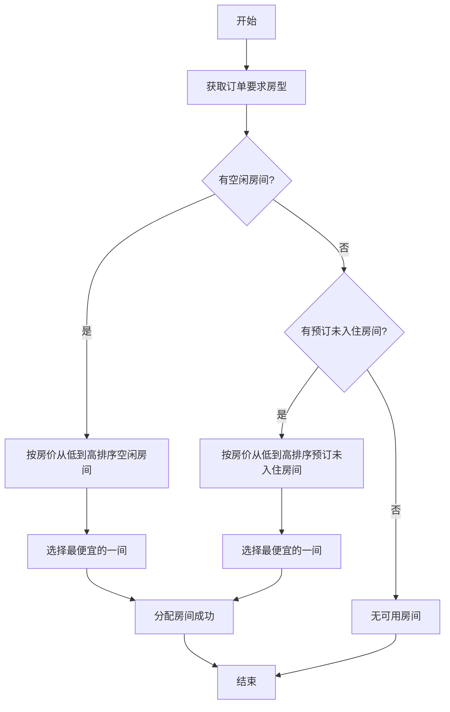
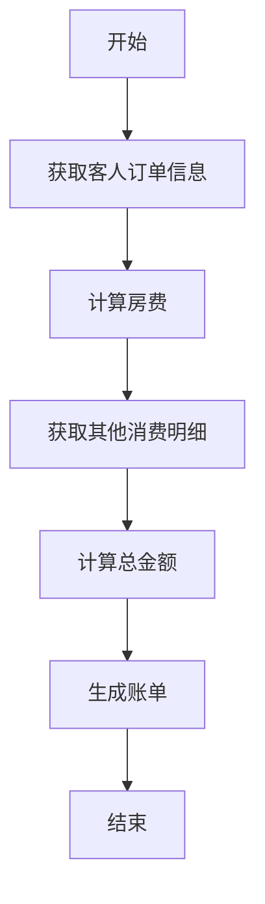

# 酒店管理系统详细设计与具体代码实现

## 1.背景介绍

### 1.1 酒店管理系统概述

酒店管理系统是一种专门为酒店业务设计的计算机应用程序,旨在提高酒店运营效率、优化客户服务和降低运营成本。它集成了客房管理、前台运营、订单处理、账单管理、统计报表等多个模块,为酒店提供全面的业务管理解决方案。

### 1.2 系统需求分析

- **客房管理**:包括房态查看、入住登记、退房结账等功能。
- **前台运营**:负责接待客人、分配房间、处理预订和取消等工作。 
- **订单管理**:处理在线预订、团队预订等订单,并进行状态跟踪。
- **账单管理**:生成账单、记录收支、应收应付款项等财务相关功能。
- **统计报表**:提供各类统计报表,如入住率、营业数据等,方便决策分析。

### 1.3 系统架构选择

基于业务需求和未来扩展性,本系统采用经典的三层架构(表现层、业务逻辑层、数据访问层),使用 Java 语言、Spring 框架、Mybatis 持久层框架进行开发。前端使用 Vue.js 框架,数据库选择 MySQL。

## 2.核心概念与联系  

### 2.1 系统核心概念

- **房间(Room)**:酒店的核心资源,包含房间号、类型、状态等属性。
- **客人(Guest)**:下订单、入住的顾客,包含姓名、联系方式等信息。
- **订单(Order)**:客人预订房间时产生的订单记录,包含入住/退房日期等信息。
- **账单(Bill)**:记录客人的消费情况,包含房费、其他消费等明细。
- **员工(Staff)**:酒店的工作人员,可分为不同角色如前台、财务等。

### 2.2 核心概念关系



上图展示了系统中核心概念的关系。一个 `Order` 对应一个 `Guest` 和一个 `Room`。`Order` 产生相应的 `Bill`。`Staff` 负责处理 `Order` 和 `Bill`。

## 3.核心算法原理具体操作步骤

### 3.1 房间分配算法

#### 3.1.1 算法目标

当有新的订单到来时,需要为客人分配一个合适的房间。算法目标是:

1. 优先分配空闲房间
2. 若无空房,则分配已预订但未入住的房间
3. 满足客人对房型的要求
4. 尽可能选择较低的房价

#### 3.1.2 算法流程

1. 获取订单要求的房型
2. 查找所有状态为空闲的符合要求的房间
3. 如果存在空闲房间,则按房价从低到高排序,选择最便宜的一间
4. 如果没有空闲房间,则查找所有状态为预订未入住的符合要求的房间
5. 如果存在预订未入住房间,则按房价从低到高排序,选择最便宜的一间
6. 如果仍然没有可用房间,则无法分配房间

以上算法使用了贪心策略,每次选择当前最优解,但不能保证全局最优。在实际应用中,可根据业务需求进行调整和优化。



### 3.2 账单生成算法

#### 3.1.1 算法目标

当客人办理退房时,需要为其生成账单。算法目标是:

1. 正确计算住房的房费
2. 汇总客人的其他消费
3. 生成总账单

#### 3.1.2 算法流程

1. 获取客人的订单信息,包括入住和退房日期
2. 根据房型和入住天数计算房费
3. 从消费记录中获取客人的其他消费明细及金额
4. 将房费和其他消费金额相加得到总金额
5. 生成账单,包含房费、其他消费明细及总金额



上述算法较为简单直观,通过获取订单信息、消费记录,分别计算房费和其他消费,最终将它们相加得到总金额并生成账单。

## 4.数学模型和公式详细讲解举例说明

### 4.1 房费计算模型

房费的计算公式如下:

$$
房费 = 房价 \times 入住天数 \times (1 + 税率)
$$

其中:

- $房价$: 对应房型的标准日房价,如单人房500元/天、双人房800元/天等
- $入住天数$: 客人实际入住的天数,按自然日计算
- $税率$: 住宿的税费,如服务税、营业税等,视当地政策而定,通常为5%-15%

**举例**:
假设一位客人入住双人房3晚,双人房日房价为800元,税率为10%,则其房费为:

$$
房费 = 800 \times 3 \times (1 + 0.1) = 2640元
$$

### 4.2 客房收入计算模型

在一个时间段内,酒店的客房收入可以用下式计算:

$$
客房收入 = \sum\limits_{i=1}^{n}房费_i = \sum\limits_{i=1}^{n}(房价_i \times 入住天数_i \times (1 + 税率_i))
$$

其中 $n$ 为入住客人的总数,对每一位客人的房费进行求和即可得到客房收入总额。

**举例**:
假设一家酒店在5月份共接待了以下5位客人:

| 客人 | 房型 | 房价(元/天) | 入住天数 | 税率 |
|------|------|--------------|-----------|------|
| A    | 单人房 | 500        | 2         | 10%  |  
| B    | 双人房 | 800        | 3         | 10%  |
| C    | 豪华房 | 1200       | 1         | 15%  |
| D    | 单人房 | 500        | 4         | 10%  |
| E    | 双人房 | 800        | 2         | 10%  |

则5月份的客房收入为:

$$
\begin{aligned}
客房收入 &= 500 \times 2 \times (1+0.1) + 800 \times 3 \times (1+0.1) + 1200 \times 1 \times (1+0.15) \\
        & \quad + 500 \times 4 \times (1+0.1) + 800 \times 2 \times (1+0.1) \\
        &= 1100 + 2640 + 1380 + 2200 + 1760 \\
        &= 9080元
\end{aligned}
$$

通过建立数学模型,可以精确计算酒店的客房收入,为经营决策提供依据。

## 4.项目实践:代码实例和详细解释说明

本小节将通过具体的代码示例,展示酒店管理系统中主要功能的实现细节。

### 4.1 房间管理模块

#### 4.1.1 Room 实体类

```java
public class Room {
    private String roomNumber; //房间号
    private RoomType type; //房型
    private RoomStatus status; //房态
    private double price; //日房价

    //构造函数、Getter/Setter方法...
}

public enum RoomType {
    SINGLE, DOUBLE, DELUXE //单人房、双人房、豪华房
}

public enum RoomStatus {
    AVAILABLE, OCCUPIED, RESERVED //空闲、已入住、已预订
}
```

Room 类表示一个客房,包含了房间号、房型、房态和日房价等属性。RoomType 和 RoomStatus 使用枚举类型表示。

#### 4.1.2 RoomService 业务逻辑层

```java
@Service
public class RoomServiceImpl implements RoomService {
    @Autowired
    private RoomMapper roomMapper;

    @Override
    public List<Room> getAvailableRooms(RoomType type) {
        //查询状态为空闲且房型符合要求的房间列表
        return roomMapper.findByTypeAndStatus(type, RoomStatus.AVAILABLE);
    }

    @Override
    public Room assignRoom(Order order) {
        RoomType type = order.getRoomType();
        //先查找空闲房间
        List<Room> availableRooms = getAvailableRooms(type);
        if (!availableRooms.isEmpty()) {
            //按房价从低到高排序,选择最便宜的一间
            availableRooms.sort(Comparator.comparingDouble(Room::getPrice));
            Room room = availableRooms.get(0);
            room.setStatus(RoomStatus.OCCUPIED);
            roomMapper.update(room);
            return room;
        }
        //若无空闲房间,则查找预订未入住的房间
        List<Room> reservedRooms = roomMapper.findByTypeAndStatus(type, RoomStatus.RESERVED);
        if (!reservedRooms.isEmpty()) {
            reservedRooms.sort(Comparator.comparingDouble(Room::getPrice));
            Room room = reservedRooms.get(0);
            room.setStatus(RoomStatus.OCCUPIED);
            roomMapper.update(room);
            return room;
        }
        //无可用房间
        return null;
    }

    //其他方法...
}
```

RoomService 层负责房间的分配和管理。assignRoom 方法实现了前文所述的房间分配算法,首先尝试分配空闲房间,若无空闲房间则尝试分配预订未入住的房间,每次选择对应房型中价格最低的一间。

#### 4.1.3 RoomController 表现层

```java
@RestController
@RequestMapping("/rooms")
public class RoomController {
    @Autowired
    private RoomService roomService;

    @GetMapping
    public List<Room> getAllRooms() {
        return roomService.getAllRooms();
    }

    @PostMapping("/{roomNumber}/checkin")
    public ResponseEntity<Room> checkinRoom(@PathVariable String roomNumber) {
        Room room = roomService.getRoomByNumber(roomNumber);
        if (room == null || room.getStatus() != RoomStatus.AVAILABLE) {
            return ResponseEntity.badRequest().build();
        }
        room.setStatus(RoomStatus.OCCUPIED);
        roomService.updateRoom(room);
        return ResponseEntity.ok(room);
    }

    //其他方法...
}
```

RoomController 是 RESTful 风格的控制器,提供了获取所有房间信息、入住登记等接口。

### 4.2 订单管理模块

#### 4.2.1 Order 实体类  

```java
public class Order {
    private String orderNumber; //订单号
    private Guest guest; //客人信息
    private Room room; //分配的房间
    private Date checkinDate; //入住日期
    private Date checkoutDate; //退房日期
    private OrderStatus status; //订单状态

    //构造函数、Getter/Setter方法...
}

public enum OrderStatus {
    PENDING, CONFIRMED, CHECKEDIN, CHECKEDOUT, CANCELLED
}
```

Order 类表示一个订单,包含订单号、客人信息、分配的房间、入住退房日期以及订单状态等属性。

#### 4.2.2 OrderService 业务逻辑层

```java
@Service
public class OrderServiceImpl implements OrderService {
    @Autowired
    private OrderMapper orderMapper;
    @Autowired
    private RoomService roomService;

    @Override
    public Order createOrder(Guest guest, RoomType roomType, Date checkinDate, Date checkoutDate) {
        Order order = new Order();
        order.setGuest(guest);
        order.setCheckinDate(checkinDate);
        order.setCheckoutDate(checkoutDate);
        order.setRoomType(roomType);
        order.setStatus(OrderStatus.PENDING);
        orderMapper.insert(order);

        Room room = roomService.assignRoom(order);
        if (room != null) {
            order.setRoom(room);
            order.setStatus(Order