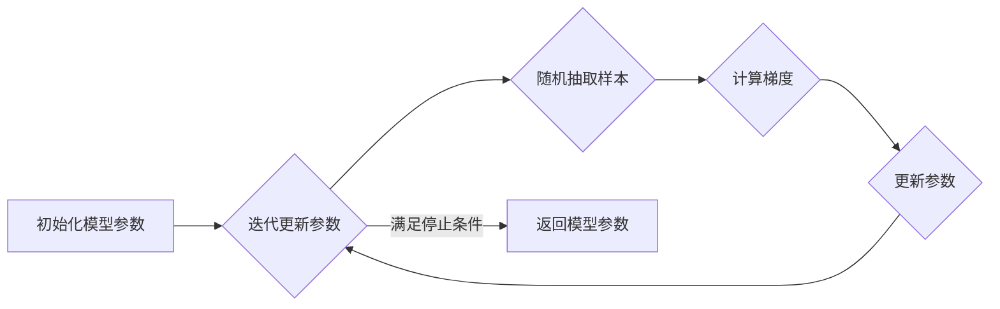

##  1. 背景介绍

### 1.1 机器学习中的优化问题
机器学习的核心任务之一是从数据中学习模型参数，使得模型能够对未知数据进行预测。这个学习过程通常被转化为一个优化问题，即找到一组模型参数，使得模型在训练数据上的损失函数最小。损失函数用于衡量模型预测值与真实值之间的差异。

常见的损失函数包括：

* 均方误差（MSE）：常用于回归问题
* 交叉熵损失：常用于分类问题

### 1.2 梯度下降法
梯度下降法是一种经典的优化算法，它通过迭代地更新模型参数来最小化损失函数。其基本思想是沿着损失函数梯度的反方向更新参数，直到找到一个局部最小值。

梯度下降法的更新公式如下：
 $$
 \theta_{t+1} = \theta_t - \eta \nabla J(\theta_t)
 $$

其中：

* $\theta_t$ 表示第 $t$ 次迭代时的模型参数
* $\eta$ 表示学习率，控制每次迭代的步长
* $\nabla J(\theta_t)$ 表示损失函数 $J(\theta)$ 在 $\theta_t$ 处的梯度

### 1.3 梯度下降法的不足
传统的梯度下降法在每次迭代时需要计算整个训练数据集的梯度，这在数据集规模很大时会非常耗时。此外，梯度下降法容易陷入局部最小值，尤其是在损失函数非凸的情况下。

## 2. 核心概念与联系

### 2.1 随机梯度下降法（SGD）
随机梯度下降法（Stochastic Gradient Descent，SGD）是对传统梯度下降法的一种改进，它每次迭代只使用一个样本或一小批样本（mini-batch）来计算梯度，从而大大提高了训练速度。

SGD的更新公式如下：
$$
\theta_{t+1} = \theta_t - \eta \nabla J(\theta_t; x_i, y_i)
$$

其中：

* $(x_i, y_i)$ 表示从训练数据集中随机抽取的一个样本
* $\nabla J(\theta_t; x_i, y_i)$ 表示损失函数 $J(\theta)$ 在 $\theta_t$ 处关于样本 $(x_i, y_i)$ 的梯度

### 2.2 SGD的特点

* **优点：**
    * 计算速度快，适用于大规模数据集
    * 能够跳出局部最小值，找到更好的解
* **缺点：**
    * 更新方向波动较大，收敛速度较慢
    * 需要调整学习率等超参数

### 2.3 SGD与梯度下降法的联系
SGD可以看作是梯度下降法的一种近似，它用单个样本或一小批样本的梯度来近似整个训练数据集的梯度。

## 3. 核心算法原理具体操作步骤

### 3.1 算法流程

1. 初始化模型参数 $\theta$
2. 迭代更新参数，直到满足停止条件：
    * 从训练数据集中随机抽取一个样本 $(x_i, y_i)$
    * 计算损失函数 $J(\theta)$ 在 $\theta_t$ 处关于样本 $(x_i, y_i)$ 的梯度 $\nabla J(\theta_t; x_i, y_i)$
    * 更新参数：$\theta_{t+1} = \theta_t - \eta \nabla J(\theta_t; x_i, y_i)$
3. 返回最终的模型参数 $\theta$

### 3.2 算法流程图



## 4. 数学模型和公式详细讲解举例说明

### 4.1 线性回归模型
以线性回归模型为例，说明SGD的具体计算过程。

线性回归模型的假设函数为：
$$
h_\theta(x) = \theta^T x
$$

其中：

* $x$ 为特征向量
* $\theta$ 为参数向量

线性回归模型的损失函数为均方误差（MSE）：
$$
J(\theta) = \frac{1}{2m} \sum_{i=1}^m (h_\theta(x_i) - y_i)^2
$$

其中：

* $m$ 为样本数量
* $(x_i, y_i)$ 为第 $i$ 个样本

### 4.2 SGD更新公式推导
SGD的更新公式为：
$$
\theta_{t+1} = \theta_t - \eta \nabla J(\theta_t; x_i, y_i)
$$

将线性回归模型的损失函数代入，得到：

$$
\begin{aligned}
\theta_{t+1} &= \theta_t - \eta \nabla \left[ \frac{1}{2m} \sum_{i=1}^m (h_\theta(x_i) - y_i)^2 \right] \\
&= \theta_t - \eta \frac{1}{m} \sum_{i=1}^m (h_\theta(x_i) - y_i) \nabla h_\theta(x_i) \\
&= \theta_t - \eta \frac{1}{m} \sum_{i=1}^m (h_\theta(x_i) - y_i) x_i
\end{aligned}
$$

由于SGD每次迭代只使用一个样本，因此上式可以简化为：

$$
\theta_{t+1} = \theta_t - \eta (h_\theta(x_i) - y_i) x_i
$$

## 5. 项目实践：代码实例和详细解释说明

### 5.1 Python代码实现

```python
import numpy as np

# 定义线性回归模型
class LinearRegression:
    def __init__(self, learning_rate=0.01, n_iters=1000):
        self.lr = learning_rate
        self.n_iters = n_iters
        self.weights = None
        self.bias = None

    def fit(self, X, y):
        # 初始化参数
        n_samples, n_features = X.shape
        self.weights = np.zeros(n_features)
        self.bias = 0

        # 迭代更新参数
        for _ in range(self.n_iters):
            # 随机抽取一个样本
            random_index = np.random.randint(n_samples)
            xi = X[random_index]
            yi = y[random_index]

            # 计算梯度
            dw = (self.predict(xi) - yi) * xi
            db = (self.predict(xi) - yi)

            # 更新参数
            self.weights -= self.lr * dw
            self.bias -= self.lr * db

    def predict(self, X):
        return np.dot(X, self.weights) + self.bias

# 生成模拟数据
X = np.random.rand(100, 1)
y = 2 * X + 1 + np.random.randn(100, 1)

# 创建模型并训练
model = LinearRegression(learning_rate=0.01, n_iters=1000)
model.fit(X, y)

# 预测
y_pred = model.predict(X)

# 打印结果
print("Weights:", model.weights)
print("Bias:", model.bias)
```

### 5.2 代码解释

* `LinearRegression` 类定义了线性回归模型，包括 `fit` 方法用于训练模型，`predict` 方法用于预测。
* `fit` 方法中，首先初始化模型参数 `weights` 和 `bias`。然后迭代更新参数，每次迭代随机抽取一个样本，计算梯度并更新参数。
* `predict` 方法根据输入特征 `X` 预测目标值 `y`。

## 6. 实际应用场景

SGD及其变种算法被广泛应用于各种机器学习任务中，例如：

* **图像分类：**训练卷积神经网络（CNN）进行图像分类
* **自然语言处理：**训练循环神经网络（RNN）进行文本生成、机器翻译等任务
* **推荐系统：**训练矩阵分解模型进行推荐

## 7. 工具和资源推荐

* **Scikit-learn：**Python机器学习库，包含SGDRegressor等实现
* **TensorFlow：**开源机器学习平台，提供SGD优化器
* **PyTorch：**开源机器学习框架，提供SGD优化器

## 8. 总结：未来发展趋势与挑战

### 8.1 未来发展趋势

* **自适应学习率：**自动调整学习率，提高收敛速度和稳定性
* **动量法：**利用历史梯度信息加速收敛
* **分布式SGD：**将训练数据分布到多个节点进行并行训练，提高训练速度

### 8.2 面临的挑战

* **超参数调整：**SGD对学习率等超参数比较敏感，需要进行仔细调整
* **非凸优化问题：**SGD容易陷入局部最小值，尤其是在损失函数非凸的情况下

## 9. 附录：常见问题与解答

### 9.1 学习率如何选择？

学习率是SGD中最重要的超参数之一，它控制每次迭代的步长。学习率过大会导致参数更新过快，模型难以收敛；学习率过小会导致参数更新过慢，训练时间过长。

常用的学习率选择方法包括：

* **固定学习率：**设置一个固定的学习率，例如0.01、0.001等
* **学习率衰减：**随着迭代次数的增加逐渐减小学习率
* **自适应学习率：**根据模型训练情况自动调整学习率

### 9.2 如何判断SGD是否收敛？

可以通过观察训练集上的损失函数值来判断SGD是否收敛。如果损失函数值逐渐减小并趋于稳定，则说明模型已经收敛。

### 9.3 SGD和批量梯度下降法（BGD）有什么区别？

| 特性 | SGD | BGD |
|---|---|---|
| 每次迭代使用的样本数量 | 1个或一小批 | 全部 |
| 计算速度 | 快 | 慢 |
| 收敛速度 | 慢 | 快 |
| 内存占用 | 低 | 高 |
| 适用场景 | 大规模数据集 | 小规模数据集 |

## 10. 后记

本文详细介绍了随机梯度下降法（SGD）的原理、算法流程、数学模型、代码实现以及实际应用场景。SGD是一种简单 yet powerful 的优化算法，被广泛应用于各种机器学习任务中。 
