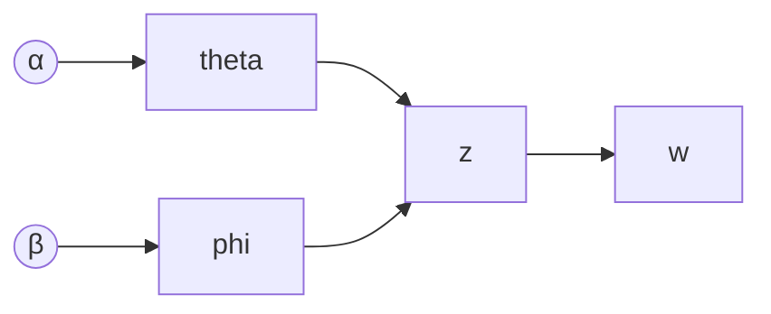

# 隐含狄利克雷分布(LDA)原理与代码实战案例讲解

## 1. 背景介绍

### 1.1 文本挖掘和主题建模的重要性

在当今的信息时代,我们每天都会产生和接收大量的文本数据,例如新闻报道、社交媒体帖子、电子邮件和文档等。有效地从这些海量文本数据中提取有价值的信息和知识,已经成为许多领域的关键任务,包括信息检索、文本分类、观点分析和推荐系统等。

文本挖掘(Text Mining)正是解决这一问题的有力工具。它指的是从大规模的文本集合中发现有用的知识和隐藏模式的过程。其中,主题建模(Topic Modeling)是文本挖掘的一个核心任务,旨在自动发现文本集合中的潜在主题结构。

### 1.2 主题建模的应用场景

主题建模广泛应用于以下场景:

- 信息检索: 通过主题模型可以更好地理解查询和文档的语义,提高检索效果。
- 文本聚类: 根据主题对文档进行无监督聚类,发现潜在的文档类别。
- 文本摘要: 通过主题模型可以提取文档的核心主题,生成高质量的文本摘要。
- 观点分析: 发现文本中的主题观点,挖掘公众对于热点事件的看法和态度。
- 个性化推荐: 通过用户的主题兴趣模型,为用户推荐感兴趣的内容。

### 1.3 隐含狄利克雷分布模型(LDA)

隐含狄利克雷分布(Latent Dirichlet Allocation, LDA)是主题建模领域中最流行和最成功的无监督模型之一。它由David Blei等人于2003年提出,被广泛应用于自然语言处理、信息检索、计算机视觉等多个领域。LDA能够自动发现文本集合中的主题,并为每个文档推断出一个主题分布。

本文将深入探讨LDA的核心原理、算法细节、数学模型以及实战代码案例,帮助读者全面了解和掌握这一重要的主题建模技术。

## 2. 核心概念与联系

### 2.1 主题(Topic)的概念

在LDA模型中,一个主题是一组相关的词语的概率分布。具体来说,每个主题都由一个多项分布(Multinomial Distribution)描述,该分布定义了这个主题中每个词语出现的概率。

例如,对于"科技"这个主题,相关的词语可能包括"计算机"、"互联网"、"编程"、"算法"等,而与之无关的词语如"足球"、"音乐"等出现的概率会很低。

一个文本集合通常包含多个潜在的主题,每个文档都是这些主题的一个混合体(Mixture)。LDA的目标就是发现这些隐含的主题,并推断每个文档对应的主题分布。

### 2.2 文档-主题分布和主题-词语分布

LDA模型包含两个核心的多项分布:

1. 文档-主题分布(Document-Topic Distribution): 对于每个文档d,它由一个K维的多项分布 $\theta_d$ 表示,其中第i个分量 $\theta_{d,i}$ 表示文档d属于第i个主题的概率。所有的 $\theta_d$ 共同构成了文档-主题分布矩阵。

2. 主题-词语分布(Topic-Word Distribution): 对于每个主题t,它由一个V维的多项分布 $\phi_t$ 表示,其中第j个分量 $\phi_{t,j}$ 表示在主题t下生成词语w_j的概率。所有的 $\phi_t$ 共同构成了主题-词语分布矩阵。

LDA模型的目标就是利用观测数据(文档词语)来同时估计这两个分布矩阵。

### 2.3 生成式建模思想

LDA是一个生成式建模(Generative Modeling)方法。它基于以下假设:

- 每个文档是按照一定的概率分布混合了一组主题而产生的。
- 每个主题又是按照一定的概率分布混合了一组词语而产生的。

根据这一假设,LDA定义了一个生成文档集合的随机过程,通过反向推断这一过程,就能发现文档集合中潜在的主题结构。

生成过程可以形象地描述为:

1. 对于每个文档,先根据狄利克雷先验分布(Dirichlet Prior)随机生成一个文档-主题分布 $\theta$。
2. 对于每个主题,先根据狄利克雷先验分布随机生成一个主题-词语分布 $\phi$。
3. 对于每个词语:
    - 先根据 $\theta$ 随机选择一个主题
    - 再根据该主题对应的 $\phi$ 随机选择一个词语

通过这样的生成过程,就可以得到包含多个主题和词语的文档集合。LDA的推断过程就是反向求解这一生成过程,推断出最有可能产生观测数据的 $\theta$ 和 $\phi$ 分布。

### 2.4 狄利克雷先验分布

狄利克雷分布(Dirichlet Distribution)是LDA模型中的一个关键组成部分。它是一个在单位K-simplex上的多元分布,常被用作多项分布的先验分布。

在LDA中,狄利克雷分布被用作文档-主题分布 $\theta$ 和主题-词语分布 $\phi$ 的先验分布。具体来说:

- 对于每个文档d,其文档-主题分布 $\theta_d$ 服从 $Dir(\alpha)$ 分布,其中 $\alpha$ 是一个K维向量,称为狄利克雷先验参数。
- 对于每个主题t,其主题-词语分布 $\phi_t$ 服从 $Dir(\beta)$ 分布,其中 $\beta$ 是一个V维向量,也是狄利克雷先验参数。

狄利克雷先验分布能够很好地捕捉文档和主题之间的关系,是LDA模型得以成功的关键因素之一。通过调整先验参数 $\alpha$ 和 $\beta$,可以控制生成的主题和词语分布的稀疏程度。

## 3. 核心算法原理具体操作步骤 

### 3.1 LDA的生成过程

LDA模型定义了一个生成文档集合的随机过程,这个过程可以形式化地描述如下:

1. 对于每个主题 $t \in \{1,...,T\}$:
    - 从狄利克雷先验分布 $Dir(\beta)$ 中采样一个 $V$ 维的多项分布 $\phi_t$
2. 对于每个文档 $d \in \{1,...,D\}$:
    - 从狄利克雷先验分布 $Dir(\alpha)$ 中采样一个 $T$ 维的多项分布 $\theta_d$
    - 对于文档 $d$ 中的每个词语位置 $n \in \{1,...,N_d\}$:
        - 从多项分布 $\theta_d$ 中采样一个主题 $z_{d,n} \sim Mult(\theta_d)$
        - 从该主题对应的多项分布 $\phi_{z_{d,n}}$ 中采样一个词语 $w_{d,n} \sim Mult(\phi_{z_{d,n}})$

其中:

- $D$ 是文档集合的大小
- $T$ 是主题数量
- $V$ 是词汇表的大小
- $N_d$ 是文档 $d$ 的词语数量
- $\alpha$ 和 $\beta$ 是狄利克雷先验参数
- $\theta_d$ 是文档 $d$ 的文档-主题分布
- $\phi_t$ 是主题 $t$ 的主题-词语分布
- $z_{d,n}$ 是文档 $d$ 中第 $n$ 个词语的主题编号
- $w_{d,n}$ 是文档 $d$ 中第 $n$ 个词语的词汇编号

可以看出,LDA先从狄利克雷先验分布中采样出每个文档的主题分布 $\theta_d$ 和每个主题的词语分布 $\phi_t$,然后根据这些分布生成每个词语的主题编号和词汇编号。

在推断阶段,我们只观测到了词语序列 $w_{d,n}$,目标就是反向推断出最有可能生成这些词语的 $\theta_d$ 和 $\phi_t$ 分布。

### 3.2 变分推断算法

由于 LDA 模型涉及隐变量(主题分配 $z$)的后验推断是很困难的,因此需要使用近似推断算法。变分推断(Variational Inference)就是解决这一问题的有效方法之一。

变分推断的基本思想是:使用一个具有简单形式的变分分布 $q(z|\gamma)$ 来近似隐变量 $z$ 的真实后验分布 $p(z|w,\alpha,\beta)$,其中 $\gamma$ 是变分分布的参数。我们希望找到一个 $\gamma^*$ 使得 $q(z|\gamma^*)$ 最佳地近似 $p(z|w,\alpha,\beta)$。

具体来说,对于 LDA 模型,我们假设变分分布 $q$ 可以完全分解为词语层面的条件独立分布:

$$q(z|\gamma) = \prod_{d=1}^D \prod_{n=1}^{N_d} q(z_{d,n}|\gamma_{d,n})$$

其中 $\gamma_{d,n}$ 是词语 $w_{d,n}$ 对应的变分参数。

我们的目标是最小化变分分布 $q$ 与真实后验分布 $p$ 之间的 KL 散度:

$$\gamma^* = \arg\min_\gamma \text{KL}(q(z|\gamma)||p(z|w,\alpha,\beta))$$

通过一些数学推导,可以得到该目标函数的下界:

$$\mathcal{L}(q, \phi, \theta) = \mathbb{E}_{q(z|\gamma)}[\log p(w, z|\alpha, \beta)] - \mathbb{E}_{q(z|\gamma)}[\log q(z|\gamma)]$$

这个下界被称为 Evidence Lower Bound (ELBO),最大化它就等价于最小化 KL 散度。

因此,变分推断的过程就转化为交替优化以下两个步骤:

1. 固定 $\phi$ 和 $\theta$,最大化 $\mathcal{L}$ 关于 $\gamma$ 的部分,得到 $\gamma^*$
2. 固定 $\gamma^*$,最大化 $\mathcal{L}$ 关于 $\phi$ 和 $\theta$ 的部分,得到 $\phi^*$ 和 $\theta^*$

重复上述两个步骤,直至 ELBO 收敛。最终得到的 $\phi^*$ 和 $\theta^*$ 就是我们所需的主题-词语分布和文档-主题分布的估计值。

### 3.3 算法总结

综上所述,LDA 变分推断算法的具体步骤如下:

1. 初始化参数:
    - 对每个主题 $t$,初始化主题-词语分布 $\phi_t$
    - 对每个文档 $d$,初始化文档-主题分布 $\theta_d$
    - 初始化变分参数 $\gamma$
2. 在迭代过程中,交替执行以下两个步骤:
    - 固定 $\phi$ 和 $\theta$,使用坐标上升优化算法更新 $\gamma$
    - 固定 $\gamma$,使用期望最大化算法更新 $\phi$ 和 $\theta$
3. 重复上述步骤,直至 ELBO 收敛
4. 输出最终估计的 $\phi^*$ 和 $\theta^*$

需要注意的是,LDA 算法的时间复杂度与文档数 $D$、词语数 $\sum_d N_d$ 和主题数 $T$ 成正比。当文档集合或主题数较大时,推断过程会变得十分耗时。因此,在实际应用中往往需要使用一些优化技术(如在线变分推断、稀疏优化等)来加速计算。

## 4. 数学模型和公式详细讲解举例说明

### 4.1 LDA 的概率图模型

LDA 可以用一个简洁的概率图模型来表示,如下所示:

其中:

- $\alpha$ 和 $\beta$ 是狄利克雷先验参数
- $\theta$ 是文档-主题分布,服从 $Dir(\alpha)$