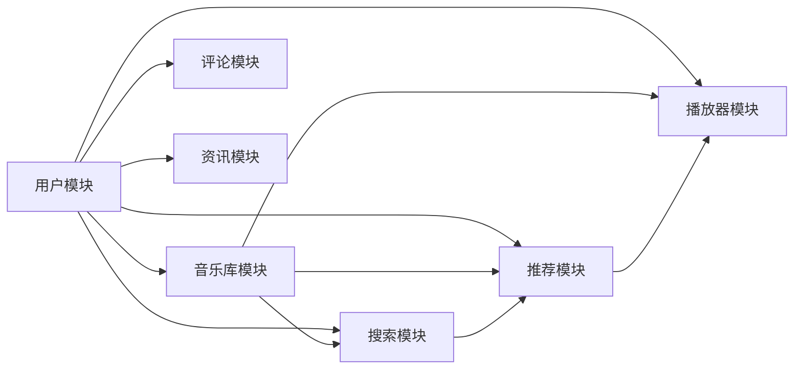

## 1. 背景介绍

### 1.1 音乐网站的兴起与发展

互联网技术的飞速发展，极大地改变了人们的生活方式，其中之一便是音乐消费方式的转变。传统的音乐消费方式，如购买CD、磁带等，逐渐被在线音乐平台所取代。音乐网站的兴起，为用户提供了更加便捷、多样化的音乐体验，也为音乐产业带来了新的发展机遇。

### 1.2 音乐网站的功能需求

一个成功的音乐网站，需要满足用户多样化的功能需求，例如：

* **海量曲库:** 提供丰富的音乐内容，涵盖各种流派、年代、语种的歌曲。
* **高质量音源:** 提供高品质的音乐音源，满足用户对音质的追求。
* **个性化推荐:** 根据用户的喜好和历史行为，推荐符合用户口味的音乐。
* **搜索功能:** 允许用户根据歌曲名、歌手名、专辑名等关键词搜索音乐。
* **播放列表:** 允许用户创建、编辑、分享自己的播放列表。
* **用户互动:**  提供评论、点赞、分享等功能，增强用户互动性。
* **音乐资讯:** 提供最新的音乐资讯、歌曲排行榜、歌手动态等内容。

### 1.3 本文目的

本文旨在详细介绍音乐网站系统的架构设计和具体代码实现，为开发者提供一个完整的参考方案。

## 2. 核心概念与联系

### 2.1 系统架构

音乐网站系统通常采用多层架构设计，主要包括以下几个层次:

* **表现层:** 负责用户界面的展示和交互，包括网页、移动应用等。
* **业务逻辑层:** 负责处理用户请求、实现业务逻辑，例如用户登录、歌曲搜索、播放控制等。
* **数据访问层:** 负责与数据库交互，进行数据的增删改查操作。
* **数据库层:** 存储音乐数据，例如歌曲信息、用户信息、播放列表等。

### 2.2 核心模块

音乐网站系统通常包含以下核心模块:

* **用户模块:** 负责用户注册、登录、信息管理等功能。
* **音乐库模块:** 负责音乐数据的存储、管理、检索等功能。
* **播放器模块:** 负责音乐播放、控制、音效处理等功能。
* **搜索模块:** 负责歌曲搜索、推荐等功能。
* **推荐模块:** 负责根据用户行为和喜好推荐音乐。
* **评论模块:** 负责用户评论、点赞、分享等功能。
* **资讯模块:** 负责音乐资讯、歌曲排行榜、歌手动态等内容的发布和管理。

### 2.3 模块间联系

各个模块之间相互协作，共同完成音乐网站的各项功能。例如，用户模块负责用户身份验证，播放器模块负责音乐播放，搜索模块负责歌曲搜索，推荐模块负责推荐音乐，评论模块负责用户互动，资讯模块负责音乐资讯的发布。



## 3. 核心算法原理具体操作步骤

### 3.1 音乐推荐算法

音乐推荐算法是音乐网站系统的核心算法之一，其目的是根据用户的喜好和历史行为，推荐符合用户口味的音乐。常用的音乐推荐算法包括：

* **基于内容的推荐:**  根据歌曲的特征，例如流派、年代、歌手等，推荐与用户历史播放记录相似的内容。
* **协同过滤推荐:**  根据其他用户的喜好，推荐与用户口味相似的音乐。
* **混合推荐:**  结合多种推荐算法，提高推荐的准确性和多样性。

#### 3.1.1 基于内容的推荐算法

基于内容的推荐算法的具体操作步骤如下:

1. **提取歌曲特征:**  从歌曲信息中提取特征，例如流派、年代、歌手等。
2. **构建用户画像:**  根据用户的历史播放记录，构建用户的音乐偏好画像。
3. **计算相似度:**  计算歌曲特征与用户画像的相似度。
4. **推荐歌曲:**  将相似度较高的歌曲推荐给用户。

#### 3.1.2 协同过滤推荐算法

协同过滤推荐算法的具体操作步骤如下:

1. **构建用户-歌曲矩阵:**  根据用户的历史播放记录，构建用户-歌曲矩阵，矩阵中的元素表示用户对歌曲的评分或播放次数。
2. **计算用户相似度:**  计算用户之间的相似度，例如皮尔逊相关系数、余弦相似度等。
3. **寻找相似用户:**  找到与目标用户相似度较高的用户。
4. **推荐歌曲:**  将相似用户喜欢的歌曲推荐给目标用户。


### 3.2 音乐搜索算法

音乐搜索算法是音乐网站系统的另一个核心算法，其目的是根据用户的搜索关键词，快速准确地找到用户想要的歌曲。常用的音乐搜索算法包括：

* **倒排索引:**  将歌曲信息中的关键词建立倒排索引，以便快速检索。
* **TF-IDF:**  根据关键词在歌曲信息中的词频和逆文档频率，计算关键词的权重，用于排序搜索结果。
* **布尔模型:**  根据用户的搜索关键词，使用布尔逻辑运算符进行检索。

#### 3.2.1 倒排索引算法

倒排索引算法的具体操作步骤如下:

1. **建立倒排索引:**  将歌曲信息中的关键词建立倒排索引，索引中包含关键词和包含该关键词的歌曲列表。
2. **搜索关键词:**  根据用户的搜索关键词，在倒排索引中查找包含该关键词的歌曲列表。
3. **排序搜索结果:**  根据关键词在歌曲信息中的词频和逆文档频率，计算关键词的权重，用于排序搜索结果。

#### 3.2.2 TF-IDF算法

TF-IDF算法的具体操作步骤如下:

1. **计算词频:**  计算关键词在歌曲信息中的词频。
2. **计算逆文档频率:**  计算关键词在所有歌曲信息中的逆文档频率。
3. **计算TF-IDF值:**  将词频和逆文档频率相乘，得到关键词的TF-IDF值。
4. **排序搜索结果:**  根据关键词的TF-IDF值，排序搜索结果。

## 4. 数学模型和公式详细讲解举例说明

### 4.1 余弦相似度

余弦相似度是一种常用的计算用户相似度的指标，其公式如下:

$$
similarity(u,v) = \frac{\sum_{i=1}^{n}u_i \times v_i}{\sqrt{\sum_{i=1}^{n}u_i^2} \times \sqrt{\sum_{i=1}^{n}v_i^2}}
$$

其中，$u$ 和 $v$ 分别表示两个用户的向量，$u_i$ 和 $v_i$ 分别表示用户 $u$ 和 $v$ 对歌曲 $i$ 的评分或播放次数，$n$ 表示歌曲总数。

例如，用户 A 的向量为 [1, 0, 1, 1]，用户 B 的向量为 [0, 1, 1, 0]，则用户 A 和用户 B 的余弦相似度为:

$$
similarity(A,B) = \frac{1 \times 0 + 0 \times 1 + 1 \times 1 + 1 \times 0}{\sqrt{1^2 + 0^2 + 1^2 + 1^2} \times \sqrt{0^2 + 1^2 + 1^2 + 0^2}} = 0.5
$$

### 4.2 TF-IDF

TF-IDF 是一种常用的计算关键词权重的指标，其公式如下:

$$
tfidf(t,d) = tf(t,d) \times idf(t)
$$

其中，$t$ 表示关键词，$d$ 表示歌曲信息，$tf(t,d)$ 表示关键词 $t$ 在歌曲信息 $d$ 中的词频，$idf(t)$ 表示关键词 $t$ 在所有歌曲信息中的逆文档频率。

逆文档频率的计算公式如下:

$$
idf(t) = log(\frac{N}{df(t)})
$$

其中，$N$ 表示歌曲总数，$df(t)$ 表示包含关键词 $t$ 的歌曲数量。

例如，歌曲信息为 "喜欢这首歌，旋律优美动听"，关键词为 "旋律"，则:

* 词频 $tf("旋律", "喜欢这首歌，旋律优美动听") = 1$
* 假设歌曲总数为 1000，包含关键词 "旋律" 的歌曲数量为 100，则逆文档频率 $idf("旋律") = log(\frac{1000}{100}) = 1$
* TF-IDF 值 $tfidf("旋律", "喜欢这首歌，旋律优美动听") = 1 \times 1 = 1$

## 5. 项目实践：代码实例和详细解释说明

### 5.1 用户模块

#### 5.1.1 用户注册

```python
from flask import Flask, request, jsonify

app = Flask(__name__)

@app.route('/register', methods=['POST'])
def register():
    # 获取用户提交的注册信息
    username = request.form.get('username')
    password = request.form.get('password')

    # 验证用户名和密码是否合法
    if not username or not password:
        return jsonify({'code': 400, 'message': '用户名或密码不能为空'})

    # 将用户信息保存到数据库
    # ...

    # 返回注册成功信息
    return jsonify({'code': 200, 'message': '注册成功'})

if __name__ == '__main__':
    app.run(debug=True)
```

#### 5.1.2 用户登录

```python
from flask import Flask, request, jsonify

app = Flask(__name__)

@app.route('/login', methods=['POST'])
def login():
    # 获取用户提交的登录信息
    username = request.form.get('username')
    password = request.form.get('password')

    # 验证用户名和密码是否正确
    # ...

    # 生成用户令牌
    token = generate_token(username)

    # 返回登录成功信息和用户令牌
    return jsonify({'code': 200, 'message': '登录成功', 'token': token})

if __name__ == '__main__':
    app.run(debug=True)
```

### 5.2 音乐库模块

#### 5.2.1 添加歌曲

```python
from flask import Flask, request, jsonify

app = Flask(__name__)

@app.route('/songs', methods=['POST'])
def add_song():
    # 获取歌曲信息
    title = request.form.get('title')
    artist = request.form.get('artist')
    album = request.form.get('album')
    genre = request.form.get('genre')
    # ...

    # 将歌曲信息保存到数据库
    # ...

    # 返回添加成功信息
    return jsonify({'code': 200, 'message': '添加成功'})

if __name__ == '__main__':
    app.run(debug=True)
```

#### 5.2.2 获取歌曲列表

```python
from flask import Flask, request, jsonify

app = Flask(__name__)

@app.route('/songs', methods=['GET'])
def get_songs():
    # 获取分页参数
    page = request.args.get('page', 1, type=int)
    per_page = request.args.get('per_page', 10, type=int)

    # 从数据库中获取歌曲列表
    # ...

    # 返回歌曲列表
    return jsonify({'code': 200, 'data': songs})

if __name__ == '__main__':
    app.run(debug=True)
```


## 6. 实际应用场景

音乐网站系统可以应用于各种场景，例如:

* **在线音乐平台:**  提供在线音乐播放、下载、分享等服务。
* **音乐教育平台:**  提供音乐教学、乐器演奏、音乐欣赏等服务。
* **音乐社交平台:**  提供音乐交流、分享、推荐等服务。
* **音乐版权管理平台:**  提供音乐版权登记、保护、交易等服务。

## 7. 工具和资源推荐

### 7.1 开发框架

* **Flask:**  轻量级 Python Web 开发框架。
* **Django:**  全功能 Python Web 开发框架。
* **Spring Boot:**  Java Web 开发框架。

### 7.2 数据库

* **MySQL:**  开源关系型数据库。
* **PostgreSQL:**  开源关系型数据库。
* **MongoDB:**  NoSQL 数据库。

### 7.3 云服务

* **阿里云:**  提供云服务器、数据库、存储等服务。
* **腾讯云:**  提供云服务器、数据库、存储等服务。
* **AWS:**  提供云服务器、数据库、存储等服务。

## 8. 总结：未来发展趋势与挑战

### 8.1 未来发展趋势

* **个性化推荐:**  随着人工智能技术的不断发展，音乐推荐算法将更加智能化、个性化。
* **沉浸式体验:**  虚拟现实、增强现实等技术将为用户带来更加沉浸式的音乐体验。
* **版权保护:**  区块链技术将为音乐版权保护提供更加安全可靠的解决方案。

### 8.2 面临的挑战

* **数据安全:**  音乐网站系统存储了大量的用户数据和音乐数据，如何保障数据安全是一个重要挑战。
* **版权问题:**  音乐版权问题一直是音乐网站系统面临的难题，需要不断探索新的解决方案。
* **用户体验:**  如何提升用户体验，满足用户不断变化的需求，是一个持续的挑战。

## 9. 附录：常见问题与解答

### 9.1 如何提高音乐推荐的准确性？

* 结合多种推荐算法，例如基于内容的推荐、协同过滤推荐、混合推荐等。
* 收集更多用户数据，例如用户的历史播放记录、收藏列表、评分等。
* 利用人工智能技术，例如深度学习、强化学习等，提高推荐算法的精度。

### 9.2 如何解决音乐版权问题？

* 与版权方合作，获得音乐版权授权。
* 使用版权音乐库，例如 YouTube Music Library、Free Music Archive 等。
* 开发版权管理系统，对音乐版权进行登记、保护、交易。

### 9.3 如何提升用户体验？

* 提供简洁易用的用户界面。
* 提供高品质的音乐音源。
* 提供个性化的音乐推荐服务。
* 提供丰富的音乐资讯和互动功能。