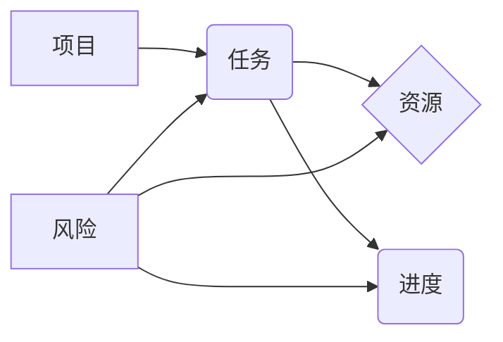
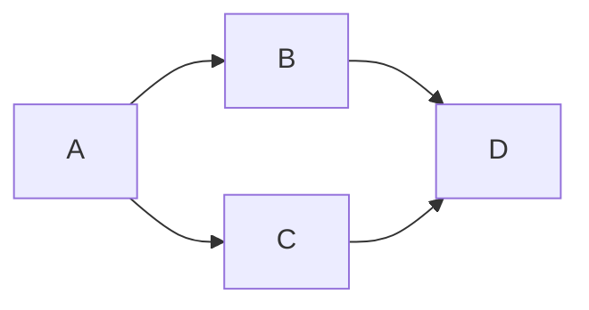
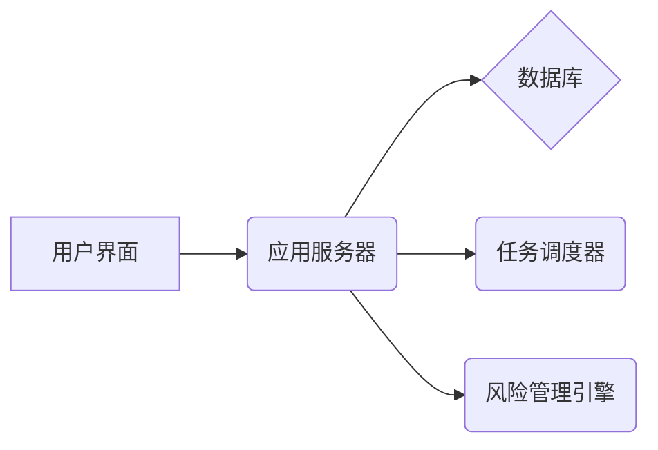

## 1. 背景介绍

### 1.1 项目管理的挑战与机遇

在当今快节奏的商业环境中，高效的项目管理对于企业的成功至关重要。项目管理涉及到规划、组织、执行和控制资源，以实现特定目标。然而，随着项目规模的扩大和复杂性的增加，传统的项目管理方法面临着诸多挑战：

* **信息孤岛:** 项目信息分散在不同的团队和系统中，导致沟通不畅和决策滞后。
* **协作效率低下:** 团队成员之间缺乏有效的协作工具和平台，影响工作效率和项目进度。
* **缺乏实时洞察:** 管理者难以实时掌握项目进展和风险，难以做出及时调整和决策。

为了应对这些挑战，越来越多的企业开始采用项目管理系统来提升项目管理效率和效益。项目管理系统提供了一个集中化的平台，用于管理项目计划、任务、资源、预算和风险等信息，并促进团队协作和沟通。

### 1.2 项目管理系统的价值

项目管理系统可以为企业带来诸多价值，包括：

* **提升项目可见性和可控性:** 通过集中化的信息管理和实时监控，管理者可以清晰地了解项目进展和风险，并及时采取措施。
* **增强团队协作和沟通:** 项目管理系统提供协作工具和平台，促进团队成员之间的沟通和信息共享，提升团队效率。
* **优化资源配置和利用:** 项目管理系统可以帮助管理者优化资源配置，避免资源浪费，提升资源利用率。
* **提高项目成功率:** 通过高效的项目管理，企业可以降低项目风险，提高项目成功率。

## 2. 核心概念与联系

### 2.1 项目管理系统的核心概念

项目管理系统通常包含以下核心概念：

* **项目:** 指的是一个临时性的、独特的、旨在创造独特产品、服务或成果的活动。
* **任务:** 指的是为了完成项目目标而需要执行的一系列活动。
* **资源:** 指的是完成项目所需的各种投入，例如人力、物力、财力等。
* **进度:** 指的是项目完成的时间安排和计划。
* **风险:** 指的是可能影响项目目标实现的不确定性事件。

### 2.2 核心概念之间的联系

这些核心概念之间存在着紧密的联系：

* **项目**由一系列**任务**组成，每个任务都需要**资源**来完成。
* **任务**的完成情况决定了项目的**进度**。
* **风险**可能会影响项目的**进度**、**资源**和**任务**的完成情况。

### 2.3 Mermaid流程图



## 3. 核心算法原理具体操作步骤

### 3.1 任务调度算法

项目管理系统中，任务调度算法用于确定任务的执行顺序和资源分配。常见的任务调度算法包括：

* **关键路径法 (CPM):** 识别项目中最长的任务序列，即关键路径，并根据关键路径安排任务执行顺序。
* **计划评审技术 (PERT):** 考虑任务完成时间的概率分布，计算任务完成时间和项目完工时间的期望值。
* **资源均衡算法:** 优化资源分配，避免资源冲突和浪费。

### 3.2 风险管理算法

项目管理系统中，风险管理算法用于识别、评估和应对项目风险。常见的风险管理算法包括：

* **风险矩阵:** 根据风险发生的可能性和影响程度，对风险进行分类和排序。
* **决策树分析:** 用于评估不同风险应对策略的成本和收益。
* **蒙特卡罗模拟:** 通过模拟项目执行过程，评估项目风险和预测项目结果。

## 4. 数学模型和公式详细讲解举例说明

### 4.1 关键路径法 (CPM)

关键路径法 (CPM) 是一种用于识别项目中最长任务序列的算法。关键路径上的任务决定了项目的完工时间，因此对项目的进度至关重要。

**计算关键路径的步骤:**

1. 绘制项目网络图，表示任务之间的依赖关系。
2. 计算每个任务的最早开始时间 (ES) 和最晚开始时间 (LS)。
3. 计算每个任务的最早结束时间 (EF) 和最晚结束时间 (LF)。
4. 找出所有总浮动时间 (TF) 为 0 的任务，这些任务构成关键路径。

**公式:**

* **ES = max(EF of all predecessors)**
* **LS = min(LF of all successors)**
* **EF = ES + Duration**
* **LF = LS + Duration**
* **TF = LF - EF = LS - ES**

**举例:**

假设一个项目包含以下任务：

| 任务 | 前置任务 | 工期 |
|---|---|---|
| A | - | 5 |
| B | A | 3 |
| C | A | 4 |
| D | B, C | 2 |

**计算关键路径:**

1. 绘制项目网络图：



2. 计算 ES、LS、EF、LF 和 TF：

| 任务 | ES | LS | EF | LF | TF |
|---|---|---|---|---|---|
| A | 0 | 0 | 5 | 5 | 0 |
| B | 5 | 5 | 8 | 8 | 0 |
| C | 5 | 6 | 9 | 10 | 1 |
| D | 8 | 8 | 10 | 10 | 0 |

3. 关键路径为 A -> B -> D，总工期为 10 天。

### 4.2 计划评审技术 (PERT)

计划评审技术 (PERT) 是一种考虑任务完成时间不确定性的项目管理技术。PERT 使用概率分布来表示任务完成时间，并计算任务完成时间和项目完工时间的期望值。

**计算 PERT 的步骤:**

1. 估计每个任务的乐观时间 (O)、最可能时间 (M) 和悲观时间 (P)。
2. 计算每个任务的期望时间 (E) 和标准差 (SD)。
3. 计算项目的期望完工时间和标准差。

**公式:**

* **E = (O + 4M + P) / 6**
* **SD = (P - O) / 6**

**举例:**

假设一个项目包含以下任务：

| 任务 | O | M | P |
|---|---|---|---|
| A | 4 | 5 | 8 |
| B | 2 | 3 | 5 |
| C | 3 | 4 | 6 |

**计算 PERT:**

1. 计算每个任务的 E 和 SD：

| 任务 | E | SD |
|---|---|---|
| A | 5.17 | 0.67 |
| B | 3.17 | 0.50 |
| C | 4.17 | 0.50 |

2. 假设任务 A、B、C 顺序执行，则项目的期望完工时间为 12.51 天，标准差为 0.84 天。

## 5. 项目实践：代码实例和详细解释说明

### 5.1 项目管理系统架构

一个典型的项目管理系统架构如下：



### 5.2 代码实例 (Python)

**任务模型:**

```python
class Task:
    def __init__(self, name, duration, predecessors=None):
        self.name = name
        self.duration = duration
        self.predecessors = predecessors or []
        self.es = 0
        self.ls = 0
        self.ef = 0
        self.lf = 0
        self.tf = 0
```

**关键路径算法实现:**

```python
def calculate_critical_path(tasks):
    # 计算 ES 和 EF
    for task in tasks:
        task.es = max([t.ef for t in task.predecessors], default=0)
        task.ef = task.es + task.duration

    # 计算 LF 和 LS
    for task in reversed(tasks):
        task.lf = min([t.ls for t in tasks if task in t.predecessors], default=task.ef)
        task.ls = task.lf - task.duration

    # 计算 TF
    for task in tasks:
        task.tf = task.lf - task.ef

    # 找出关键路径
    critical_path = [task for task in tasks if task.tf == 0]
    return critical_path
```

**示例用法:**

```python
# 创建任务列表
tasks = [
    Task("A", 5),
    Task("B", 3, ["A"]),
    Task("C", 4, ["A"]),
    Task("D", 2, ["B", "C"]),
]

# 计算关键路径
critical_path = calculate_critical_path(tasks)

# 打印关键路径
for task in critical_path:
    print(task.name)
```

### 5.3 代码解释

* **任务模型:** 定义了任务的属性，包括名称、工期、前置任务、ES、LS、EF、LF 和 TF。
* **关键路径算法实现:** 实现了关键路径算法的逻辑，包括计算 ES、LS、EF、LF、TF 和找出关键路径。
* **示例用法:** 演示了如何创建任务列表，调用关键路径算法，并打印关键路径。

## 6. 实际应用场景

### 6.1 软件开发

项目管理系统在软件开发中广泛应用，用于管理软件开发项目的需求、设计、编码、测试和发布等环节。

### 6.2 建设工程

项目管理系统在建设工程中也发挥着重要作用，用于管理工程项目的规划、设计、施工、验收和运营等环节。

### 6.3 活动策划

项目管理系统可以用于管理各种活动的策划和执行，例如会议、展览、婚礼等。

## 7. 总结：未来发展趋势与挑战

### 7.1 未来发展趋势

* **人工智能 (AI) 和机器学习 (ML) 的应用:** AI 和 ML 可以用于自动化任务调度、风险预测和资源优化等。
* **云计算和移动化:** 云计算和移动化使得项目管理系统更加灵活和易于访问。
* **数据分析和可视化:** 数据分析和可视化可以帮助管理者更好地了解项目进展和风险。

### 7.2 面临的挑战

* **数据安全和隐私:** 项目管理系统存储了大量的敏感信息，需要确保数据安全和隐私。
* **系统集成和互操作性:** 项目管理系统需要与其他企业系统集成，以实现数据共享和流程自动化。
* **用户体验和易用性:** 项目管理系统需要提供良好的用户体验和易用性，以提高用户接受度和工作效率。

## 8. 附录：常见问题与解答

### 8.1 如何选择合适的项目管理系统？

选择合适的项目管理系统需要考虑以下因素：

* **项目规模和复杂性:** 不同的项目管理系统适用于不同规模和复杂性的项目。
* **团队规模和协作需求:** 不同的项目管理系统提供不同的协作功能，需要根据团队规模和协作需求选择。
* **预算和成本:** 不同的项目管理系统价格不同，需要根据预算和成本选择。

### 8.2 如何有效地使用项目管理系统？

有效地使用项目管理系统需要遵循以下最佳实践：

* **明确项目目标和范围:** 在使用项目管理系统之前，需要明确项目目标和范围，并制定详细的项目计划。
* **及时更新项目信息:** 项目信息需要及时更新，以确保项目管理系统中的数据准确可靠。
* **定期审查项目进度和风险:** 定期审查项目进度和风险，及时采取措施应对问题和挑战。
* **促进团队协作和沟通:** 利用项目管理系统提供的协作功能，促进团队成员之间的沟通和信息共享。

### 8.3 如何解决项目管理系统中遇到的问题？

遇到问题时，可以参考以下方法解决：

* **查阅系统文档和帮助资源:** 项目管理系统通常提供详细的文档和帮助资源，可以帮助用户解决问题。
* **联系系统供应商或技术支持:** 如果无法自行解决问题，可以联系系统供应商或技术支持寻求帮助。
* **参考在线论坛和社区:** 在线论坛和社区可以提供其他用户的经验和解决方案，帮助用户解决问题。 
