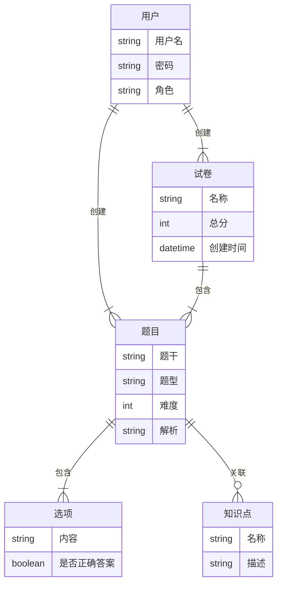

## 1. 背景介绍

### 1.1. 题库管理系统的意义

随着信息技术的飞速发展和教育信息化的不断推进，在线教育平台如雨后春笋般涌现。而题库作为在线教育平台的核心组成部分，其重要性不言而喻。一个高效、灵活、稳定的题库管理系统，不仅可以提高教师出题效率、减轻工作负担，更能有效提升学生的学习效率和质量。

### 1.2. 传统题库管理系统的弊端

传统的题库管理系统往往存在以下弊端：

* 功能单一，难以满足多样化的需求；
* 数据冗余，难以维护和管理；
* 安全性低，容易造成数据泄露；
* 用户体验差，操作繁琐。

### 1.3. 新一代题库管理系统的需求

为了克服传统题库管理系统的弊端，新一代题库管理系统需要具备以下特点：

* 功能丰富，支持多种题型，如单选题、多选题、判断题、填空题、简答题、编程题等；
* 数据结构合理，避免数据冗余，方便维护和管理；
* 安全可靠，保障数据安全；
* 用户界面友好，操作便捷。


## 2. 核心概念与联系

### 2.1. 实体关系图 (ERD)

为了更好地理解题库管理系统的核心概念及其联系，我们可以使用实体关系图 (ERD) 来进行描述。



### 2.2. 核心概念解释

* **题目**: 指的是一个具体的测试题目，包含题干、题型、难度、解析等信息。
* **选项**: 指的是一个题目的可选答案，包含内容、是否正确答案等信息。
* **知识点**: 指的是一个具体的知识点，包含名称、描述等信息。
* **用户**: 指的是使用题库管理系统的用户，包含用户名、密码、角色等信息。
* **试卷**: 指的是由多道题目组成的测试试卷，包含名称、总分、创建时间等信息。

### 2.3. 关系解释

* **题目 - 选项**: 一道题目可以包含多个选项，一个选项只能属于一道题目。
* **题目 - 知识点**: 一道题目可以关联多个知识点，一个知识点可以被多道题目关联。
* **用户 - 题目**: 用户可以创建题目。
* **用户 - 试卷**: 用户可以创建试卷。
* **试卷 - 题目**: 一张试卷可以包含多道题目，一道题目可以被多张试卷包含。


## 3. 核心算法原理具体操作步骤

### 3.1. 题目添加算法

1. 用户选择题型，并填写题干、难度、解析等信息。
2. 系统根据题型生成相应的选项输入框。
3. 用户填写选项内容，并设置正确答案。
4. 系统将题目信息和选项信息保存到数据库中。

### 3.2. 题目查询算法

1. 用户输入查询条件，例如题型、难度、知识点等。
2. 系统根据查询条件从数据库中检索符合条件的题目。
3. 系统将查询结果展示给用户。

### 3.3. 试卷组卷算法

1. 用户选择试卷类型，例如随机组卷、手动组卷等。
2. 用户设置试卷参数，例如总分、题量、难度分布等。
3. 系统根据试卷类型和参数，从数据库中检索符合条件的题目。
4. 系统将选中的题目组合成试卷，并保存到数据库中。


## 4. 数学模型和公式详细讲解举例说明

### 4.1. TF-IDF算法

TF-IDF算法是一种常用的文本相似度计算方法，可以用于题库管理系统中的题目推荐功能。

**TF**: Term Frequency，词频，指的是某个词语在某篇文章中出现的频率。

$$
TF_{i,j} = \frac{n_{i,j}}{\sum_{k} n_{k,j}}
$$

其中，$n_{i,j}$ 表示词语 $i$ 在文档 $j$ 中出现的次数，$\sum_{k} n_{k,j}$ 表示文档 $j$ 中所有词语出现的总次数。

**IDF**: Inverse Document Frequency，逆文档频率，指的是包含某个词语的文档数量的倒数的对数。

$$
IDF_i = log \frac{|D|}{|\{j: t_i \in d_j\}|}
$$

其中，$|D|$ 表示文档总数，$|\{j: t_i \in d_j\}|$ 表示包含词语 $i$ 的文档数量。

**TF-IDF**: 词频-逆文档频率，指的是词频和逆文档频率的乘积。

$$
TF-IDF_{i,j} = TF_{i,j} \times IDF_i
$$

### 4.2. 举例说明

假设我们有一个包含以下三篇文档的语料库：

* 文档1: "我喜欢吃苹果"
* 文档2: "我喜欢吃香蕉"
* 文档3: "我喜欢吃苹果和香蕉"

现在我们要计算词语 "苹果" 在文档1中的 TF-IDF 值。

首先计算 "苹果" 在文档1中的词频：

$$
TF_{苹果,文档1} = \frac{1}{3}
$$

然后计算 "苹果" 的逆文档频率：

$$
IDF_{苹果} = log \frac{3}{2}
$$

最后计算 "苹果" 在文档1中的 TF-IDF 值：

$$
TF-IDF_{苹果,文档1} = \frac{1}{3} \times log \frac{3}{2} \approx 0.139
$$

### 4.3. 应用场景

在题库管理系统中，我们可以使用 TF-IDF 算法来计算题目之间的相似度，从而实现题目推荐功能。例如，当用户浏览某道题目时，系统可以根据该题目的关键词计算其他题目的 TF-IDF 值，并将 TF-IDF 值较高的题目推荐给用户。


## 5. 项目实践：代码实例和详细解释说明

### 5.1. 技术选型

* **后端**: Spring Boot
* **数据库**: MySQL
* **前端**: Vue.js

### 5.2. 代码实例

**题目实体类:**

```java
@Entity
@Table(name = "t_question")
public class Question {

    @Id
    @GeneratedValue(strategy = GenerationType.IDENTITY)
    private Long id;

    @Column(nullable = false)
    private String stem;

    @Column(nullable = false)
    private String type;

    @Column(nullable = false)
    private Integer difficulty;

    @Column(nullable = false)
    private String analysis;

    @OneToMany(mappedBy = "question", cascade = CascadeType.ALL, orphanRemoval = true)
    private List<Option> options = new ArrayList<>();

    // getter 和 setter 方法
}
```

**选项实体类:**

```java
@Entity
@Table(name = "t_option")
public class Option {

    @Id
    @GeneratedValue(strategy = GenerationType.IDENTITY)
    private Long id;

    @Column(nullable = false)
    private String content;

    @Column(nullable = false)
    private Boolean isCorrect;

    @ManyToOne(fetch = FetchType.LAZY)
    @JoinColumn(name = "question_id")
    private Question question;

    // getter 和 setter 方法
}
```

### 5.3. 详细解释说明

* `@Entity` 注解表示这是一个实体类。
* `@Table` 注解指定了实体类对应的数据库表名。
* `@Id` 注解指定了实体类的主键。
* `@GeneratedValue` 注解指定了主键的生成策略。
* `@Column` 注解指定了实体类属性对应的数据库表字段。
* `@OneToMany` 注解表示一对多关系。
* `@ManyToOne` 注解表示多对一关系。
* `@JoinColumn` 注解指定了外键字段名。


## 6. 实际应用场景

### 6.1. 在线教育平台

题库管理系统可以应用于各种在线教育平台，例如：

* **慕课平台**: 为学生提供海量题库，支持在线练习和考试。
* **培训机构**: 为学员提供针对性的练习题库，帮助学员提高学习效率。
* **企业内部培训**: 为员工提供企业内部知识库和考试系统。

### 6.2. 招聘考试

题库管理系统可以用于各种招聘考试，例如：

* **公务员考试**: 为考生提供历年真题和模拟试题。
* **事业单位考试**: 为考生提供专业知识和技能测试题库。
* **企业招聘考试**: 为企业提供笔试题库和面试题库。


## 7. 总结：未来发展趋势与挑战

### 7.1. 未来发展趋势

* **人工智能化**: 利用人工智能技术，实现智能组卷、自动批改、个性化推荐等功能。
* **大数据化**: 利用大数据技术，分析学生学习数据，优化题库结构和内容。
* **移动化**: 开发移动端题库管理系统，方便用户随时随地进行学习和练习。

### 7.2. 面临挑战

* **数据安全**: 如何保障题库数据的安全，防止数据泄露。
* **技术更新**: 如何应对不断更新的技术，保持系统的先进性。
* **用户需求**: 如何满足用户不断变化的需求，提供更好的用户体验。


## 8. 附录：常见问题与解答

### 8.1. 如何添加新题型？

1. 在数据库中添加新题型对应的表。
2. 在后端代码中添加新题型对应的实体类和接口。
3. 在前端代码中添加新题型对应的组件和逻辑。

### 8.2. 如何提高系统性能？

1. 使用缓存技术，例如 Redis，缓存常用的数据。
2. 优化数据库查询语句，例如创建索引。
3. 使用负载均衡技术，分担服务器压力。

### 8.3. 如何保障数据安全？

1. 对用户密码进行加密存储。
2. 对敏感数据进行脱敏处理。
3. 定期备份数据。