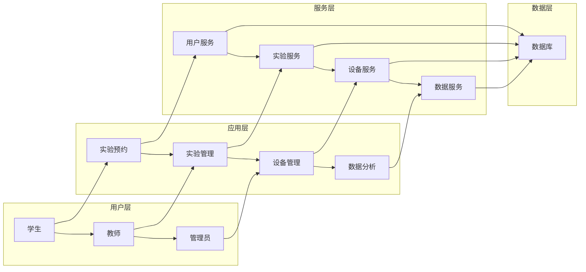

## 高校实验室教学管理系统的设计与实现

作者：禅与计算机程序设计艺术


## 1. 引言：迈向智能化实验室管理的新时代

### 1.1 高校实验室教学现状与挑战

传统的高校实验室教学管理模式面临着诸多挑战：

* **信息孤岛**:  实验预约、设备管理、数据分析等环节信息分散，缺乏整合，导致管理效率低下。
* **资源利用率低**: 实验资源调度不合理，部分设备闲置，造成资源浪费。
* **安全隐患**:  缺乏有效的安全监管机制，实验过程中可能存在安全风险。

### 1.2  实验室教学管理系统的设计目标

为了解决上述问题，构建一个高效、安全、智能的实验室教学管理系统势在必行。系统的设计目标如下：

* **实现信息化管理**:  将实验教学的各个环节进行信息化整合，构建统一的管理平台。
* **提高资源利用率**:  通过智能化的资源调度算法，优化实验资源配置，提高设备利用率。
* **保障实验安全**:  建立健全的安全管理机制，实时监控实验过程，及时发现并处理安全隐患。
* **提升教学质量**:  为学生提供更加便捷、高效的实验环境，促进学生实验技能的提升。

## 2. 系统架构设计：构建灵活可扩展的管理平台

### 2.1 系统总体架构

本系统采用 B/S 架构，主要分为以下几个模块：

* **用户管理模块**:  负责管理系统用户的基本信息、权限等。
* **实验课程管理模块**:  负责管理实验课程信息、实验项目、实验资源等。
* **实验预约管理模块**:  学生可以在线预约实验时间、实验设备等。
* **设备管理模块**:  对实验室的设备进行管理，包括设备信息、设备状态、设备维护等。
* **数据统计分析模块**:  对实验教学相关数据进行统计分析，为教学管理提供数据支撑。



### 2.2 模块设计

#### 2.2.1 用户管理模块

* **功能**: 用户注册、登录、信息修改、权限管理等。
* **技术**:  Spring Security 框架实现用户认证和授权，数据库持久化用户信息。

#### 2.2.2 实验课程管理模块

* **功能**: 录入和管理实验课程信息、实验项目、实验资源等。
* **技术**:  Spring Data JPA 实现数据持久化，使用树形结构展示课程和实验项目之间的关系。

#### 2.2.3 实验预约管理模块

* **功能**: 学生在线预约实验时间、实验设备，教师审核预约申请。
* **技术**:  使用时间片的方式管理实验资源，采用乐观锁机制解决并发预约冲突问题。

#### 2.2.4 设备管理模块

* **功能**:  管理实验室的设备信息、设备状态、设备维护等。
* **技术**:  使用二维码技术实现设备的快速识别和管理，结合物联网技术实时监控设备状态。

#### 2.2.5 数据统计分析模块

* **功能**:  对实验教学相关数据进行统计分析，生成报表，为教学管理提供数据支撑。
* **技术**:  使用 ECharts 等数据可视化工具，将统计分析结果以图表的形式展示出来。

## 3. 核心算法：实现智能化资源调度

### 3.1 资源调度算法概述

本系统采用基于优先级和时间窗的资源调度算法， 结合实验课程、学生预约、设备状态等信息，实现对实验资源的合理分配。

### 3.2 算法具体步骤

1. **优先级排序**:  根据实验课程的重要程度、学生预约的先后顺序等因素，对实验预约进行优先级排序。
2. **时间窗匹配**:  根据实验资源的可用时间和实验预约的时间要求，进行时间窗匹配，找到满足条件的资源。
3. **资源分配**:  将匹配成功的资源分配给相应的实验预约。

### 3.3 算法示例

假设实验室有 A、B 两种设备，可用时间分别为：

* A 设备:  周一至周五 8:00-12:00, 14:00-18:00
* B 设备:  周一至周五 9:00-12:00, 14:00-17:00

现有两个实验预约：

* 预约 1:  课程 A， 需使用 A 设备，时间为周一下午 14:00-16:00
* 预约 2:  课程 B， 需使用 B 设备，时间为周一下午 14:00-16:00

算法执行过程如下：

1. **优先级排序**:  假设课程 A 的优先级高于课程 B，则预约 1 的优先级高于预约 2。
2. **时间窗匹配**: 
    * 预约 1:  A 设备在周一下午 14:00-16:00 可用，匹配成功。
    * 预约 2:  B 设备在周一下午 14:00-16:00 可用，匹配成功。
3. **资源分配**: 
    * 将 A 设备分配给预约 1。
    * 将 B 设备分配给预约 2。

## 4. 数据库设计：构建高效稳定的数据存储

### 4.1 数据库选型

本系统采用 MySQL 数据库，具有开源、性能稳定、易于维护等优点。

### 4.2 数据库表设计

主要数据库表如下：

* **用户表**:  存储用户信息，包括用户名、密码、姓名、角色等。
* **实验课程表**:  存储实验课程信息，包括课程名称、课程介绍、学分等。
* **实验项目表**:  存储实验项目信息，包括项目名称、项目介绍、所属课程等。
* **实验资源表**:  存储实验资源信息，包括资源名称、资源类型、规格型号、存放地点等。
* **实验预约表**:  存储实验预约信息，包括预约人、预约时间、预约资源、预约状态等。

## 5. 项目实践：基于 Spring Boot 的系统实现

### 5.1 开发环境搭建

* **开发工具**:  IntelliJ IDEA
* **开发语言**:  Java
* **框架**:  Spring Boot、Spring Security、Spring Data JPA、Thymeleaf
* **数据库**:  MySQL
* **缓存**:  Redis

### 5.2 代码实例

#### 5.2.1 用户实体类

```java
@Entity
@Table(name = "user")
public class User {

    @Id
    @GeneratedValue(strategy = GenerationType.IDENTITY)
    private Long id;

    @Column(nullable = false, unique = true)
    private String username;

    @Column(nullable = false)
    private String password;

    @Column(nullable = false)
    private String name;

    @Enumerated(EnumType.STRING)
    @Column(nullable = false)
    private Role role;

    // 省略 getter 和 setter 方法
}
```

#### 5.2.2 用户服务接口

```java
public interface UserService {

    User findByUsername(String username);

    void save(User user);
}
```

#### 5.2.3 用户服务实现类

```java
@Service
public class UserServiceImpl implements UserService {

    @Autowired
    private UserRepository userRepository;

    @Override
    public User findByUsername(String username) {
        return userRepository.findByUsername(username);
    }

    @Override
    public void save(User user) {
        userRepository.save(user);
    }
}
```

## 6. 实际应用场景

高校实验室教学管理系统适用于各种类型的高校实验室，例如：

* **计算机类实验室**:  计算机基础实验室、软件工程实验室、网络工程实验室等。
* **电子信息类实验室**:  电路分析实验室、模拟电子技术实验室、数字电子技术实验室等。
* **机械类实验室**:  机械制图实验室、机械原理实验室、机械设计实验室等。

## 7. 工具和资源推荐

* **Spring Boot**:  简化 Spring 应用的创建和开发过程。
* **Spring Security**:  提供身份验证和授权功能。
* **Spring Data JPA**:  简化数据访问层的开发。
* **Thymeleaf**:  用于渲染 Web 页面的模板引擎。
* **MySQL**:  关系型数据库管理系统。
* **Redis**:  高性能的键值存储系统，可以用作缓存。
* **ECharts**:  数据可视化工具库。

## 8. 总结：未来发展趋势与挑战

### 8.1 未来发展趋势

* **智能化**:  利用人工智能技术，实现更加智能化的实验资源调度、实验过程监控、实验数据分析等功能。
* **虚拟化**:  构建虚拟实验室环境，为学生提供更加灵活、便捷的实验条件。
* **云化**:  将实验室教学管理系统部署到云平台，实现资源的弹性扩展和按需使用。

### 8.2 面临的挑战

* **数据安全**:  如何保障实验数据的安全性和隐私性。
* **系统稳定性**:  如何保证系统在高并发访问情况下的稳定运行。
* **技术更新迭代**:  如何应对不断更新迭代的技术，保持系统的先进性。

## 9. 附录：常见问题与解答

### 9.1  如何解决实验预约冲突问题？

本系统采用乐观锁机制解决并发预约冲突问题。

### 9.2  如何保障实验数据的安全？

* 对用户进行权限管理，限制用户对数据的访问权限。
* 对敏感数据进行加密存储。
* 定期备份数据，防止数据丢失。

### 9.3 如何提高系统的稳定性？

* 使用负载均衡技术，将用户请求分发到多台服务器上，提高系统的并发处理能力。
* 使用缓存技术，减少数据库的访问压力。
* 对系统进行性能测试，找出性能瓶颈并进行优化。

## 10. 后记

高校实验室教学管理系统的设计与实现是一个复杂的系统工程，需要综合运用多种技术手段。相信随着技术的不断发展，实验室教学管理系统将会变得更加智能化、高效化，为高校的实验教学提供更加优质的服务。
