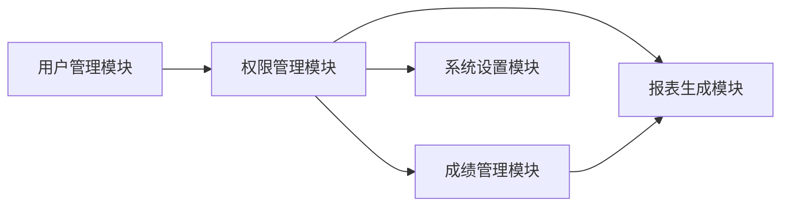

## 高校成绩管理系统的设计与实现

作者：禅与计算机程序设计艺术

## 1. 引言

### 1.1 成绩管理系统的重要性

在现代高校教育中，成绩管理是教学管理的核心环节之一。一个高效、准确、安全的成绩管理系统，不仅可以减轻教师的工作负担，提高工作效率，还可以为学生提供及时、准确的成绩信息，帮助学生了解自己的学习状况，促进学生学习积极性的提高。

### 1.2 传统成绩管理模式的弊端

传统的成绩管理模式主要依靠手工记录和计算，存在着许多弊端，例如：

* **效率低下:** 手动录入成绩耗时耗力，容易出错。
* **数据安全性差:** 纸质成绩单容易丢失、损坏，且难以进行备份和恢复。
* **统计分析功能薄弱:** 难以对学生的成绩进行多维度、全方位的统计分析。

### 1.3 本文的目标

为了解决传统成绩管理模式存在的弊端，本文旨在设计和实现一个基于现代信息技术的高校成绩管理系统。该系统将采用B/S架构，实现成绩录入、查询、统计分析、报表生成等功能，并提供安全可靠的数据存储和访问控制机制。

## 2. 核心概念与联系

### 2.1 系统用户角色

系统用户主要包括以下几种角色：

* **管理员:** 负责系统的维护和管理，包括用户管理、权限管理、数据备份和恢复等。
* **教师:** 负责录入和管理学生的成绩信息，包括平时成绩、期中成绩、期末成绩等。
* **学生:** 可以查询自己的成绩信息，包括各科成绩、总评成绩、排名等。

### 2.2 系统功能模块

系统主要包括以下功能模块：

* **用户管理模块:** 实现用户的注册、登录、信息修改、密码找回等功能。
* **权限管理模块:**  根据用户角色分配不同的系统操作权限。
* **成绩管理模块:** 实现成绩的录入、修改、删除、查询、统计分析等功能。
* **报表生成模块:**  可以生成各种类型的成绩报表，例如学生成绩单、班级成绩汇总表、课程成绩分析表等。
* **系统设置模块:**  可以设置系统参数，例如学期设置、课程设置、评分标准等。

### 2.3 核心概念关系图



## 3. 核心算法原理具体操作步骤

### 3.1 成绩计算算法

系统采用加权平均法计算学生的总评成绩。

**具体操作步骤如下:**

1.  确定各部分成绩的权重，例如平时成绩占30%，期中成绩占30%，期末成绩占40%。
2.  将各部分成绩乘以对应的权重，得到加权成绩。
3.  将所有加权成绩相加，得到总评成绩。

**例如:** 某学生的平时成绩为80分，期中成绩为85分，期末成绩为90分，各部分成绩的权重分别为30%、30%、40%，则该学生的总评成绩为：

```
总评成绩 = 80 * 0.3 + 85 * 0.3 + 90 * 0.4 = 86.5
```

### 3.2 排名算法

系统采用排名算法对学生的总评成绩进行排名。

**具体操作步骤如下:**

1.  将所有学生的总评成绩按照从高到低的顺序进行排序。
2.  为每个学生赋予一个排名，排名相同的学生，其排名相同。

**例如:** 某班级有10名学生，他们的总评成绩分别为：90、88、88、85、82、80、78、75、72、70，则他们的排名分别为：1、2、2、4、5、6、7、8、9、10。

## 4. 数学模型和公式详细讲解举例说明

### 4.1 加权平均数公式

加权平均数公式如下：

$$
\bar{x} = \frac{\sum_{i=1}^{n} w_i x_i}{\sum_{i=1}^{n} w_i}
$$

**其中:**

* $\bar{x}$ 表示加权平均数。
* $x_i$ 表示第 $i$ 个数据的数值。
* $w_i$ 表示第 $i$ 个数据的权重。
* $n$ 表示数据的个数。

### 4.2 标准差公式

标准差公式如下：

$$
\sigma = \sqrt{\frac{\sum_{i=1}^{n} (x_i - \bar{x})^2}{n-1}}
$$

**其中:**

* $\sigma$ 表示标准差。
* $x_i$ 表示第 $i$ 个数据的数值。
* $\bar{x}$ 表示数据的平均数。
* $n$ 表示数据的个数。

### 4.3 举例说明

假设某班级的学生期末考试成绩如下：

| 学生姓名 | 成绩 |
|---|---|
| 张三 | 90 |
| 李四 | 85 |
| 王五 | 80 |
| 赵六 | 75 |
| 孙七 | 70 |

则该班级学生期末考试成绩的平均数为：

$$
\bar{x} = \frac{90 + 85 + 80 + 75 + 70}{5} = 80
$$

标准差为：

$$
\sigma = \sqrt{\frac{(90-80)^2 + (85-80)^2 + (80-80)^2 + (75-80)^2 + (70-80)^2}{5-1}} = 7.07
$$

## 5. 项目实践：代码实例和详细解释说明

### 5.1 开发环境

本项目采用 Java 语言开发，使用 Spring Boot 框架构建后端服务，使用 MySQL 数据库存储数据。

### 5.2 数据库设计

系统数据库主要包括以下几张表：

* **用户表:** 存储用户信息，包括用户名、密码、角色等。
* **学生表:** 存储学生信息，包括学号、姓名、班级等。
* **课程表:** 存储课程信息，包括课程编号、课程名称、学分等。
* **成绩表:** 存储学生成绩信息，包括学号、课程编号、成绩等。

### 5.3 代码实例

**用户实体类:**

```java
@Entity
@Table(name = "user")
public class User {

    @Id
    @GeneratedValue(strategy = GenerationType.IDENTITY)
    private Long id;

    @Column(nullable = false, unique = true)
    private String username;

    @Column(nullable = false)
    private String password;

    @Column(nullable = false)
    private String role;

    // getter and setter methods
}
```

**成绩实体类:**

```java
@Entity
@Table(name = "score")
public class Score {

    @Id
    @GeneratedValue(strategy = GenerationType.IDENTITY)
    private Long id;

    @ManyToOne
    @JoinColumn(name = "student_id")
    private Student student;

    @ManyToOne
    @JoinColumn(name = "course_id")
    private Course course;

    @Column(nullable = false)
    private Double score;

    // getter and setter methods
}
```

**成绩计算接口:**

```java
public interface ScoreService {

    /**
     * 计算学生的总评成绩
     *
     * @param studentId 学生ID
     * @return 总评成绩
     */
    Double calculateTotalScore(Long studentId);
}
```

**成绩计算实现类:**

```java
@Service
public class ScoreServiceImpl implements ScoreService {

    @Autowired
    private ScoreRepository scoreRepository;

    @Override
    public Double calculateTotalScore(Long studentId) {
        // 查询学生所有成绩
        List<Score> scores = scoreRepository.findByStudentId(studentId);

        // 计算总评成绩
        double totalScore = 0;
        for (Score score : scores) {
            totalScore += score.getScore() * score.getCourse().getWeight();
        }

        return totalScore;
    }
}
```

## 6. 实际应用场景

高校成绩管理系统可以应用于各种类型的高校，例如：

* **本科院校:** 可以用于管理学生的平时成绩、期中成绩、期末成绩、实验成绩、实践成绩等。
* **高职院校:** 可以用于管理学生的理论课程成绩、实践课程成绩、技能考核成绩等。
* **成人高校:** 可以用于管理学生的课程作业成绩、考试成绩等。

## 7. 工具和资源推荐

### 7.1 开发工具

* **IntelliJ IDEA:** 一款功能强大的 Java 集成开发环境。
* **MySQL Workbench:** 一款图形化的 MySQL 数据库管理工具。
* **Postman:** 一款 API 测试工具。

### 7.2 学习资源

* **Spring Boot 官方文档:** https://spring.io/projects/spring-boot
* **MySQL 官方文档:** https://dev.mysql.com/doc/
* **GitHub:** https://github.com/

## 8. 总结：未来发展趋势与挑战

### 8.1 未来发展趋势

* **智能化:** 利用人工智能技术，实现成绩的自动分析和预警。
* **个性化:** 根据学生的学习特点和需求，提供个性化的成绩分析和学习建议。
* **移动化:** 开发移动端应用，方便学生随时随地查询成绩信息。

### 8.2 面临的挑战

* **数据安全:** 如何保障学生成绩数据的安全性和隐私性。
* **系统性能:** 如何提高系统的并发处理能力和响应速度。
* **用户体验:** 如何设计简洁易用的用户界面，提升用户体验。

## 9. 附录：常见问题与解答

### 9.1 如何修改密码？

登录系统后，点击右上角的用户名，选择“修改密码”，即可进入密码修改页面。

### 9.2 如何查询成绩？

登录系统后，点击“成绩查询”菜单，即可进入成绩查询页面。

### 9.3 如何联系管理员？

如果遇到任何问题，可以通过系统内的“联系我们”功能联系管理员。
