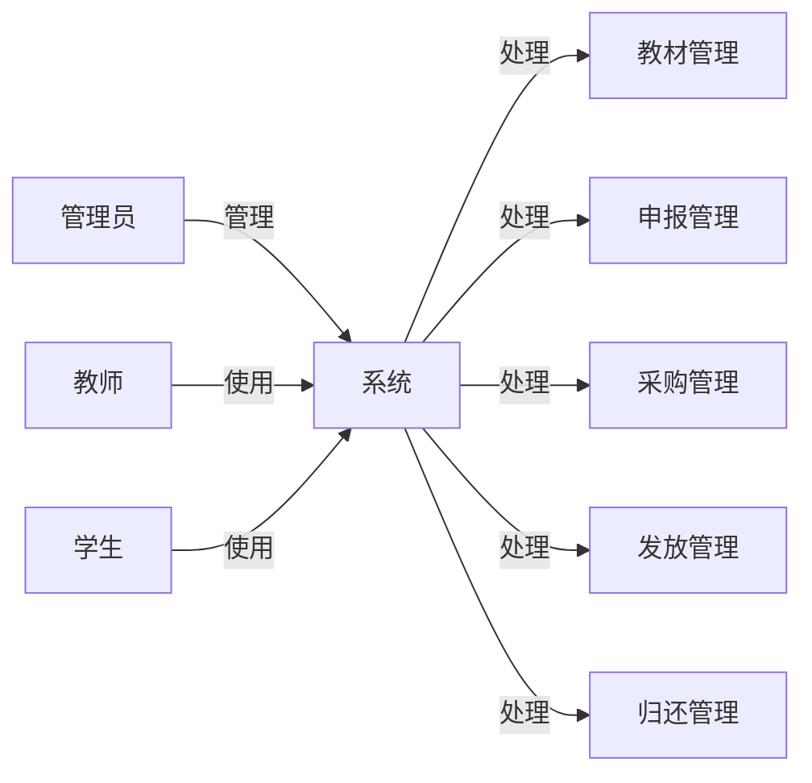

##  高校教材管理系统详细设计与具体代码实现

作者：禅与计算机程序设计艺术

## 1. 背景介绍

### 1.1 教材管理现状与挑战

随着高校教育规模的不断扩大和信息化进程的加快，传统的教材管理模式已经难以满足现代高校的需求。传统的教材管理模式主要依赖于人工操作，存在着效率低下、易出错、信息不透明等问题。具体表现为：

* **信息分散，难以统计**: 教材信息分散在各个部门，难以进行统一管理和统计分析。
* **工作量大，效率低下**: 教材的申报、审核、采购、发放等环节都需要人工操作，工作量大且容易出错。
* **缺乏透明度，难以监管**: 教材的流通环节缺乏透明度，难以对教材的使用情况进行有效监管。

### 1.2 系统建设目标

为了解决上述问题，提高高校教材管理的效率和质量，开发一套高校教材管理系统势在必行。本系统旨在实现以下目标：

* **实现教材信息化管理**: 将教材信息进行电子化管理，方便查询、统计和分析。
* **提高工作效率**:  实现教材申报、审核、采购、发放等流程的自动化，提高工作效率。
* **增强透明度**:  实现教材流通环节的全程跟踪，增强透明度，方便监管。
* **提高服务质量**:  为师生提供便捷的教材查询、借阅服务，提高服务质量。

## 2. 核心概念与联系

### 2.1 系统用户角色

高校教材管理系统涉及的用户角色主要包括：

* **管理员**: 负责系统的维护和管理，包括用户管理、权限管理、数据备份等。
* **教师**:  负责教材的申报、领用和归还。
* **学生**:  负责教材的查询和借阅。

### 2.2  核心业务流程

高校教材管理系统的核心业务流程包括：

* **教材管理**: 包括教材信息的录入、修改、删除、查询等。
* **申报管理**:  包括教师提交教材申报表、管理员审核申报表、生成采购计划等。
* **采购管理**:  包括根据采购计划进行教材采购、登记入库等。
* **发放管理**:  包括根据学生选课信息进行教材发放、登记借阅信息等。
* **归还管理**:  包括学生归还教材、登记归还信息等。

### 2.3 概念关系图



## 3. 核心算法原理具体操作步骤

### 3.1 教材余量计算算法

教材余量是指某门课程在某个学期结束后剩余的教材数量。教材余量的计算需要考虑以下因素：

* 上学期期末库存量
* 本学期教材征订数量
* 本学期教材发放数量
* 本学期教材报废数量

具体计算公式如下：

```
教材余量 = 上学期期末库存量 + 本学期教材征订数量 - 本学期教材发放数量 - 本学期教材报废数量
```

### 3.2 教材分配算法

教材分配是指根据学生的选课信息，将教材分配给每个学生。教材分配算法需要考虑以下因素：

* 学生选课信息
* 教材库存量
* 教材分配规则

常见的教材分配规则有：

* **先到先得**:  按照学生提交选课申请的时间顺序进行分配，先提交申请的学生优先获得教材。
* **按需分配**:  根据学生的实际需求进行分配，例如只分配给选修了该门课程的学生。
* **混合分配**:  综合考虑多种因素进行分配，例如可以先按照先到先得的规则分配一部分教材，然后再按照按需分配的规则分配剩余的教材。

### 3.3 操作步骤示例

**教材入库操作步骤：**

1. 管理员登录系统，进入教材管理模块。
2. 点击“教材入库”按钮，进入教材入库页面。
3. 输入教材的基本信息，包括教材名称、作者、出版社、ISBN、数量等。
4. 点击“确认入库”按钮，完成教材入库操作。

**教材申报操作步骤：**

1. 教师登录系统，进入教材申报模块。
2. 点击“新增申报”按钮，进入教材申报页面。
3. 选择申报课程、教材、申报数量等信息。
4. 点击“提交申报”按钮，完成教材申报操作。

## 4. 数学模型和公式详细讲解举例说明

### 4.1 库存预警模型

库存预警模型用于预测未来一段时间内教材的库存情况，并及时发出预警信息。常用的库存预警模型有：

* **移动平均法**:  根据过去一段时间的教材使用情况，预测未来一段时间的教材需求量。
* **指数平滑法**:  在移动平均法的基础上，赋予近期数据更高的权重，从而更准确地预测未来一段时间的教材需求量。

**举例说明：**

假设某高校某门课程过去5个月的教材使用量如下：

| 月份 | 使用量 |
|---|---|
| 1月 | 100 |
| 2月 | 120 |
| 3月 | 110 |
| 4月 | 130 |
| 5月 | 140 |

使用移动平均法预测未来3个月的教材需求量，移动平均周期为3个月。

```
6月份需求量 = (110 + 130 + 140) / 3 = 126.67 ≈ 127
7月份需求量 = (130 + 140 + 127) / 3 = 132.33 ≈ 132
8月份需求量 = (140 + 127 + 132) / 3 = 133 ≈ 133
```

### 4.2  效益分析模型

效益分析模型用于评估高校教材管理系统的建设效益。常用的效益分析指标有：

* **工作效率**:  例如教材申报、审核、采购、发放等环节的时间成本节约。
* **成本节约**:  例如教材库存成本、教材损耗成本的降低。
* **服务质量**:  例如师生满意度、教材利用率的提高。

**举例说明：**

假设某高校建设教材管理系统后，教材申报环节的时间成本节约了50%，教材库存成本降低了20%，师生满意度提高了10%。则该系统的效益分析指标如下：

| 指标 | 数值 |
|---|---|
| 工作效率 | 50% |
| 成本节约 | 20% |
| 服务质量 | 10% |

## 5. 项目实践：代码实例和详细解释说明

### 5.1 技术选型

本项目采用以下技术栈进行开发：

* **后端**:  Spring Boot
* **数据库**:  MySQL
* **前端**:  Vue.js

### 5.2 代码实例

**教材实体类：**

```java
@Entity
@Table(name = "textbook")
public class Textbook {

    @Id
    @GeneratedValue(strategy = GenerationType.IDENTITY)
    private Long id;

    @Column(nullable = false)
    private String name;

    @Column(nullable = false)
    private String author;

    @Column(nullable = false)
    private String publisher;

    @Column(nullable = false)
    private String isbn;

    @Column(nullable = false)
    private Integer stock;

    // 省略 getter 和 setter 方法
}
```

**教材入库接口：**

```java
@RestController
@RequestMapping("/api/textbook")
public class TextbookController {

    @Autowired
    private TextbookService textbookService;

    @PostMapping
    public Textbook create(@RequestBody Textbook textbook) {
        return textbookService.save(textbook);
    }
}
```

### 5.3 代码解释

* `@Entity` 注解表示这是一个实体类，对应数据库中的一个表。
* `@Table` 注解指定了实体类对应的表名。
* `@Id` 注解指定了主键字段。
* `@GeneratedValue` 注解指定了主键的生成策略。
* `@Column` 注解指定了字段的属性，例如是否可以为空、长度等。
* `@RestController` 注解表示这是一个 RESTful 风格的控制器。
* `@RequestMapping` 注解指定了接口的路径。
* `@Autowired` 注解用于自动注入依赖。
* `@PostMapping` 注解表示这是一个 POST 请求的接口。
* `@RequestBody` 注解表示将请求体中的 JSON 数据绑定到参数对象上。

## 6. 实际应用场景

高校教材管理系统可以应用于各种类型的高校，例如：

* **综合性大学**:  可以管理全校各个学院、各个专业的教材。
* **高等职业院校**:  可以管理各个专业的教材，并与实训课程相结合。
* **成人高校**:  可以管理各个专业的教材，并根据学生的学习特点进行个性化推荐。

## 7. 工具和资源推荐

### 7.1 开发工具

* **IntelliJ IDEA**:  一款功能强大的 Java 集成开发环境。
* **Navicat**:  一款数据库管理工具，支持 MySQL、Oracle、SQL Server 等多种数据库。
* **Postman**:  一款 API 测试工具，可以方便地发送 HTTP 请求并查看响应结果。

### 7.2 学习资源

* **Spring Boot 官方文档**:  https://spring.io/projects/spring-boot
* **Vue.js 官方文档**:  https://vuejs.org/
* **MySQL 官方文档**:  https://dev.mysql.com/doc/

## 8. 总结：未来发展趋势与挑战

### 8.1 未来发展趋势

* **智能化**:  利用人工智能技术，实现教材的智能推荐、库存预警、效益分析等功能。
* **移动化**:  开发移动端应用，方便师生进行教材查询、申报、借阅等操作。
* **数据化**:  收集和分析教材使用数据，为教材建设提供决策支持。

### 8.2 面临的挑战

* **数据安全**:  教材管理系统涉及到大量的学生信息和教材信息，需要加强数据安全防护。
* **系统性能**:  随着高校规模的扩大，教材管理系统的数据量和访问量都会不断增加，需要保证系统的性能和稳定性。
* **用户体验**:  教材管理系统的用户包括管理员、教师和学生，需要不断优化系统界面和操作流程，提升用户体验。

## 9. 附录：常见问题与解答

### 9.1  问：如何修改教材信息？

**答:**  管理员登录系统，进入教材管理模块，找到需要修改的教材，点击“修改”按钮，即可进入教材修改页面进行修改。

### 9.2 问：如何查询教材库存？

**答:**  管理员、教师和学生都可以登录系统，进入教材查询模块，输入教材名称、ISBN 等信息进行查询。

### 9.3  问：如何进行教材申报？

**答:**  教师登录系统，进入教材申报模块，选择申报课程、教材、申报数量等信息，点击“提交申报”按钮即可。
