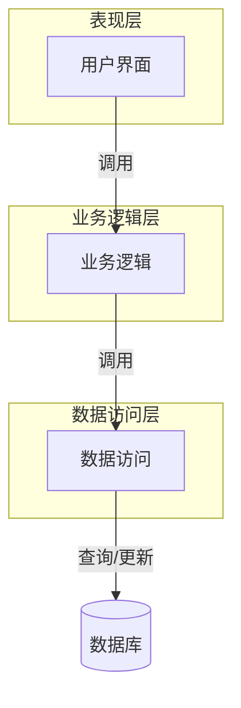
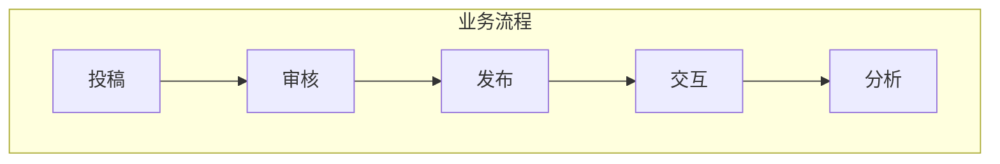
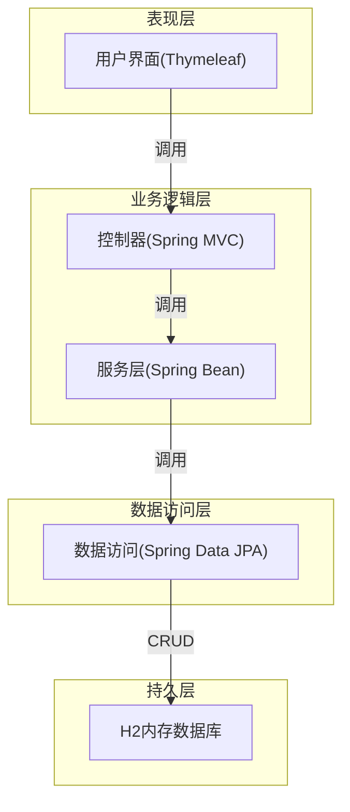

# 高校文学系统的设计与开发系统详细设计与具体代码实现

## 1. 背景介绍

### 1.1 文学系统的重要性

在当今快节奏的数字时代,文学作为人类精神文明的重要组成部分,扮演着弘扬民族文化、陶冶情操、启迪智慧的重要角色。高校作为知识传播和创新的重镇,其文学系统的建设对于培养学生的人文素养、激发创作热情、保护知识产权等方面意义重大。

### 1.2 现有系统存在的问题

然而,传统的文学系统管理往往存在诸多弊端:

- 信息孤岛,数据难以共享
- 流程繁琐,效率低下
- 缺乏创新,无法满足新需求

为了解决这些问题,设计一套全新的高校文学系统平台应运而生。

### 1.3 新系统设计目标

新的高校文学系统将实现:

- 数据一体化,实现跨系统共享
- 流程优化,提高工作效率
- 创新支撑,快速响应新需求
- 移动支持,随时随地访问

## 2. 核心概念与联系

### 2.1 系统架构

整个系统采用经典的三层架构设计,包括:

- **表现层**: 提供用户界面,负责数据展示和交互
- **业务逻辑层**: 实现系统的核心业务流程和规则
- **数据访问层**: 负责对底层数据库的访问和操作

三层之间通过明确定义的接口相互依赖和交互,遵循高内聚低耦合的设计原则。



### 2.2 数据模型

系统的数据模型设计遵循规范化理论,将数据的逻辑结构与存储结构相分离,主要包括:

- **作品(Work)**: 存储作品的元数据,如标题、作者、创作时间等
- **作者(Author)**: 存储作者的个人信息
- **文类(Category)**: 定义作品类型的分类体系
- **版权(Copyright)**: 记录作品的版权信息
- **评论(Comment)**: 存储读者对作品的评论
- **收藏(Favorite)**: 记录读者收藏的作品

这些实体之间通过一系列关联关系相互关联,形成复杂的数据网状结构。

### 2.3 业务流程

系统的核心业务流程包括:

- 作品投稿: 作者提交原创作品
- 作品审核: 编辑审核作品内容和版权
- 作品发布: 通过审核的作品对外发布
- 读者交互: 读者浏览、评论、收藏作品
- 数据分析: 对作品数据进行多维度分析
- ...

每个流程均由一系列精细的业务规则控制,确保数据的完整性和业务逻辑的正确性。



## 3. 核心算法原理具体操作步骤

### 3.1 投稿审核算法

投稿审核是系统的核心环节,需要对作品的原创性和合规性进行严格把控。我们采用了先进的文本指纹技术,具体步骤如下:

1. **文本指纹提取**: 对作品文本进行分词、去停用词等预处理,提取关键词n-gram作为指纹特征
2. **指纹库查重**: 将提取的指纹与系统中已有作品的指纹库进行对比,计算相似度分数
3. **人工审核**: 当相似度分数超过事先设定的阈值时,系统自动触发人工审核流程
4. **版权确认**: 如果系统判定为抄袭行为,将拒绝投稿并通知作者;反之,确认版权归属并继续后续流程

该算法有效提高了审核的准确性和效率,也最大限度地保护了原创者的权益。

### 3.2 作品推荐算法

为了提高读者的使用体验,系统集成了个性化的作品推荐功能,算法流程如下:

1. **用户画像构建**: 基于读者的浏览、评论、收藏记录,利用协同过滤等技术构建用户画像
2. **相似度计算**: 计算目标用户与其他用户的画像相似度,找到最相似的若干用户
3. **推荐生成**: 根据这些相似用户的历史喜好,为目标用户生成个性化的作品推荐列表
4. **反馈迭代**: 收集用户对推荐结果的反馈,并持续优化算法模型

该算法能够有效挖掘用户的个性化兴趣爱好,提高推荐的准确度和满意度。

### 3.3 文本分析算法

为了深入挖掘作品的内在价值,系统提供了多种文本分析功能,主要算法包括:

1. **情感分析**: 利用词向量技术和深度学习模型,对文本的情感极性(积极/消极)进行判断
2. **主题模型**: 基于LDA等主题模型算法,自动发现文本语料中隐含的抽象主题
3. **实体识别**: 使用命名实体识别技术,从文本中提取人名、地名、机构名等实体
4. **知识图谱**: 将上述分析结果组织成结构化的知识图谱,支持智能问答等应用

这些算法的应用不仅能够帮助读者更深入地理解作品内涵,也为文学研究者提供了强大的分析工具。

## 4. 数学模型和公式详细讲解举例说明

在上述算法中,我们广泛应用了各种数学模型和公式,下面分别进行详细讲解。

### 4.1 文本相似度计算

在投稿审核中,我们需要计算待审核作品与已有作品的相似度。最常用的相似度度量是余弦相似度:

$$sim(A, B) = \frac{\vec{A} \cdot \vec{B}}{|\vec{A}||\vec{B}|} = \frac{\sum\limits_{i=1}^{n}{A_iB_i}}{\sqrt{\sum\limits_{i=1}^{n}{A_i^2}}\sqrt{\sum\limits_{i=1}^{n}{B_i^2}}}$$

其中$\vec{A}$和$\vec{B}$分别表示两个文本的词袋向量。当相似度值接近1时,表明两个文本高度相似;当接近0时,表明极度不相似。

在实际应用中,我们会将文本先转换为TF-IDF向量,以提高相似度的判别能力:

$$\mathrm{tfidf}(w, d) = \mathrm{tf}(w, d) \times \log\frac{|D|}{|\{d \in D: w \in d\}|}$$

$\mathrm{tf}(w, d)$表示词$w$在文档$d$中的词频,$|D|$表示语料库中文档总数,分母部分则表示出现该词的文档数量。

### 4.2 协同过滤算法

在个性化推荐中,我们使用了基于用户的协同过滤算法,其核心思想是找到与目标用户$u$最相似的$k$个用户,并基于他们的历史喜好进行推荐。

用户相似度的计算通常采用余弦相似度或皮尔逊相关系数,这里以皮尔逊相关系数为例:

$$w_{uv} = \frac{\sum\limits_{i \in I}(r_{ui} - \overline{r_u})(r_{vi} - \overline{r_v})}{\sqrt{\sum\limits_{i \in I}(r_{ui} - \overline{r_u})^2}\sqrt{\sum\limits_{i \in I}(r_{vi} - \overline{r_v})^2}}$$

其中$r_{ui}$表示用户$u$对项目$i$的评分,$\overline{r_u}$表示用户$u$的平均评分,求和是在两个用户都评分过的项目集合$I$上进行的。

最终,推荐列表$R_u$的得分计算如下:

$$score(u, i) = \overline{r_u} + \frac{\sum\limits_{v \in N(u,k)}w_{uv}(r_{vi} - \overline{r_v})}{\sum\limits_{v \in N(u,k)}|w_{uv}|}$$

其中$N(u,k)$表示与用户$u$最相似的$k$个用户集合。

### 4.3 主题模型 LDA

LDA(Latent Dirichlet Allocation)是一种常用的主题模型,可以发现文本语料中隐含的主题结构。

LDA的基本思想是:

- 每个文档是一个混合了多个主题的文本
- 每个主题又是一个多项分布,描述了词语在该主题下出现的概率

我们用$\theta_d$表示文档$d$的主题分布,$\phi_k$表示主题$k$的词语分布,则文档$d$生成的概率为:

$$p(d|\alpha, \beta) = \int_\theta \prod_{n=1}^N \sum_k p(z_{dn}=k|\theta)p(w_{dn}|\phi_k,\beta)p(\theta|\alpha)d\theta$$

其中$\alpha$和$\beta$分别是两个狄利克雷先验分布的参数。利用Gibbs采样等方法,我们可以从文档语料中估计出最优的$\theta$和$\phi$参数。

LDA模型可以帮助我们高效地发现文本的主题结构,为挖掘文学作品的深层内涵提供了有力支持。

## 5. 项目实践:代码实例和详细解释说明

为了直观地展示系统的实现细节,我们准备了一个简单的示例项目。该项目使用Java语言开发,采用Spring Boot框架,并集成上文提到的部分算法功能。

### 5.1 项目架构



如上图所示,整个项目遵循经典的三层架构设计:

- **表现层**: 使用Thymeleaf模板引擎渲染前端页面
- **业务逻辑层**: 使用Spring MVC处理Http请求,Spring Bean封装业务逻辑
- **数据访问层**: 使用Spring Data JPA操作底层H2内存数据库

### 5.2 投稿审核功能

我们先看投稿审核的实现,该功能涉及到前端、后端和数据库的交互。

**1. 持久层(JPA Entity)**

```java
@Entity
public class Work {
    @Id
    @GeneratedValue
    private Long id;
    private String title;
    private String content;
    @ManyToOne
    private Author author;
    // ...
}
```

`Work`实体用于存储作品的元数据,包括标题、内容和作者等字段。

**2. 数据访问层(Spring Data Repository)** 

```java
public interface WorkRepository extends JpaRepository<Work, Long> {
    List<Work> findByTitleContainingOrContentContaining(String title, String content);
}
```

我们定义了一个自定义查询方法,用于根据标题或内容搜索作品。

**3. 业务逻辑层(Service)**

```java
@Service
public class WorkService {
    
    @Autowired
    private WorkRepository workRepo;
    
    public boolean isWorkOriginal(String title, String content) {
        // 计算文本指纹
        String fingerprint = textFingerprint(content);
        
        // 在数据库中查找相似作品
        List<Work> similarWorks = workRepo.findByTitleContainingOrContentContaining(title, fingerprint);
        
        // 如果存在高度相似的作品,则认为抄袭
        return similarWorks.stream()
                .noneMatch(w -> computeSimilarity(w.getContent(), content) > PLAGIARISM_THRESHOLD);
    }
    
    // 其他方法...
}
```

`WorkService`中的`isWorkOriginal`方法实现了投稿审核的核心逻辑:

1. 首先通过`textFingerprint`方法计算作品内容的文本指纹
2.