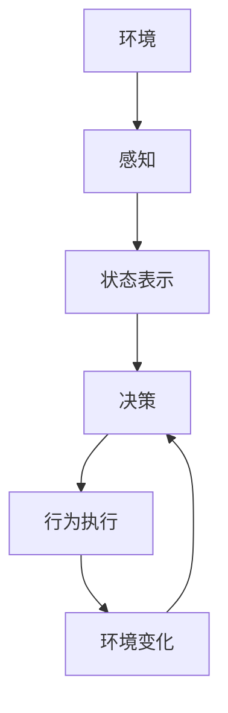

# AI Agent: AI的下一个风口 从软件到硬件的进化

## 1.背景介绍

### 1.1 人工智能的发展历程

人工智能(Artificial Intelligence, AI)作为一门富有前景的交叉学科,已经在各个领域取得了长足的进步。从20世纪50年代AI的概念被正式提出,到今天AI已经渗透到我们生活的方方面面,无论是语音助手、自动驾驶汽车,还是医疗诊断和金融投资等领域,AI都发挥着越来越重要的作用。

### 1.2 软件时代的人工智能

在过去几十年里,人工智能主要集中在软件层面的发展。依托算力的飞速提升和大数据时代的到来,机器学习、深度学习等算法取得了突破性进展,使得AI系统能够模拟人类的感知、推理和决策能力。软件AI代理可以通过消化海量数据,学习模式并做出预测和决策。

### 1.3 硬件时代的人工智能

然而,仅仅依赖软件是远远不够的。人工智能系统需要能够感知外部世界、与环境交互并作出实时反应。这就需要AI不仅在软件层面有突破,还需要在硬件层面实现创新。AI代理需要具备感知、控制和决策的硬件能力,以更好地融入现实世界。

### 1.4 AI代理:软硬件融合的新范式

AI代理(AI Agent)作为AI发展的新范式,正在将软件和硬件层面的人工智能融合在一起。AI代理不仅拥有强大的软件算力,还具备感知、控制和作出实时决策的硬件能力,使其能够灵活地部署在各种场景中,有效解决现实世界中的复杂问题。

## 2.核心概念与联系  

### 2.1 什么是AI代理

AI代理是一种能够感知环境、作出决策并在环境中采取行动的智能体系统。它包含以下三个核心组成部分:

1. **感知器(Sensor)**: 用于从环境中获取数据输入,如视觉、听觉、触觉等传感器。
2. **智能核心(Intelligent Core)**: 基于输入数据做出决策判断的软件系统,通常采用机器学习等AI算法。
3. **执行器(Actuator)**: 根据智能核心的决策指令,在环境中执行相应的动作,如机械臂、无人机等。

AI代理就像一个具有感知、思考和行动能力的智能体,它能够通过与环境的交互不断学习和提升自身。

### 2.2 AI代理的作用

AI代理的引入使得人工智能系统不再是孤立的软件模块,而是能够与现实世界深度融合的智能化系统。它们可以广泛应用于以下场景:

- 工业自动化: 智能机器人替代人工进行制造流程
- 智能家居: 智能家电根据环境状态做出响应
- 无人驾驶: 感知道路信息,规划行驶路线并控制车辆
- 智能安防: 通过摄像头监控并识别潜在威胁
- 医疗保健: 智能护理机器人协助患者康复
- 航空航天: 智能探测器探索未知环境

### 2.3 AI代理与传统软件的区别

相比传统的软件系统,AI代理具有以下显著特点:

1. **感知能力**: 能够通过各种传感器获取环境数据
2. **交互性**: 可以与环境进行实时的双向交互
3. **决策能力**: 基于学习能力做出智能决策判断 
4. **自主性**: 无需人工干预即可自主执行任务
5. **持续学习**: 通过与环境的交互不断积累经验

这些特性使AI代理更加贴近现实世界,能够灵活应对复杂多变的环境,展现出超越传统软件系统的智能行为。

## 3.核心算法原理具体操作步骤

### 3.1 AI代理的工作流程

AI代理的工作流程主要包括以下几个环节:

1. **感知(Perception)**: 通过传感器获取环境数据,如图像、声音、位置等
2. **状态表示(State Representation)**: 将感知到的数据转化为代理系统可以理解的状态表示
3. **决策(Decision Making)**: 基于当前状态,通过决策算法选择最优行为
4. **行为执行(Action)**: 通过执行器将选定的行为方案在环境中执行
5. **反馈(Feedback)**: 观察执行后的环境变化,并将结果反馈到决策模块,用于持续学习和优化

这个循环过程使得AI代理可以不断感知环境、做出决策并采取行动,进而逐步提高自身的决策能力。



### 3.2 决策算法

AI代理的决策算法是其智能核心的关键所在,决定了其行为的合理性和有效性。常用的决策算法包括:

1. **规则引擎**: 基于预定义的规则集合做出决策
2. **搜索算法**: 通过遍历状态空间寻找最优解,如A*、IDA*等
3. **强化学习**: 通过试错和奖惩机制,逐步优化决策策略
4. **深度学习**: 利用神经网络从数据中自动学习决策模型
5. **多智能体系统**: 多个代理通过协作或竞争完成复杂任务

不同算法适用于不同场景,也可以组合使用。比如结合深度强化学习,让AI代理在与环境的交互中逐步学习最优决策模型。

### 3.3 执行环节

决策的执行是AI代理与环境交互的关键一环。常见的执行器包括:

- 机械臂: 用于工业制造、物料搬运等任务
- 无人机/机器人: 用于勘探、巡逻等移动式任务 
- 虚拟现实: 用于模拟测试各类复杂场景
- 语音输出: 用于人机交互和语音辅助

执行器需要精准、高效并与决策模块高度协同,才能使AI代理的行为更加自然、合理。

## 4.数学模型和公式详细讲解举例说明

### 4.1 马尔可夫决策过程

马尔可夫决策过程(Markov Decision Process, MDP)是AI决策理论中的基础模型,广泛应用于强化学习等领域。一个MDP可以用元组 $\langle S, A, T, R \rangle$ 来表示:

- $S$ 是有限的状态集合
- $A$ 是有限的行为集合  
- $T(s, a, s')=P(s'|s,a)$ 是状态转移概率
- $R(s,a)$ 是在状态 $s$ 执行行为 $a$ 后获得的即时奖励

在给定的MDP模型下,我们需要找到一个策略 $\pi: S \rightarrow A$,使得期望的累积奖励最大:

$$
\max_\pi \mathbb{E}\left[ \sum_{t=0}^\infty \gamma^t R(s_t, a_t) \right]
$$

其中 $\gamma \in [0, 1]$ 是折现因子,控制对未来奖励的权重。

### 4.2 Q-Learning算法

Q-Learning是强化学习中的一种经典算法,用于在未知的MDP环境中寻找最优策略。它维护一个Q函数 $Q(s,a)$,表示在状态 $s$ 执行行为 $a$ 后的期望累积奖励。Q函数按如下规则不断迭代更新:

$$
Q(s_t, a_t) \leftarrow Q(s_t, a_t) + \alpha \left[ r_t + \gamma \max_a Q(s_{t+1}, a) - Q(s_t, a_t) \right]
$$

其中 $\alpha$ 是学习率。通过不断探索和利用,Q函数将逐渐收敛到最优值,对应的贪婪策略就是最优策略。

Q-Learning的优点是无需知道MDP的精确模型,只需与环境交互即可学习,因此被广泛应用于AI代理的训练中。

### 4.3 策略梯度算法

策略梯度(Policy Gradient)是另一种常用的强化学习算法,适用于连续的状态/行为空间。它直接对策略函数 $\pi_\theta(a|s)$ 进行参数化,并沿着期望奖励最大的方向更新参数 $\theta$:

$$
\Delta\theta = \alpha \mathbb{E}_{\pi_\theta}\left[ \sum_{t=0}^\infty \nabla_\theta \log \pi_\theta(a_t|s_t)Q^{\pi_\theta}(s_t, a_t) \right]
$$

其中 $Q^{\pi_\theta}(s_t, a_t)$ 表示在策略 $\pi_\theta$ 下状态 $s_t$ 执行 $a_t$ 的期望累积奖励。

策略梯度的优点是能直接对策略进行端到端的优化,并可以应用于高维、连续的空间。但它也需要设计合理的策略表示形式,并通过技巧(如重要性采样)来降低方差。

## 4.项目实践: 代码实例和详细解释说明

为了更好地理解AI代理的实现原理,我们以一个简单的网格世界(GridWorld)为例,用Q-Learning训练一个小型AI代理。

### 4.1 环境设置

假设有一个 $4 \times 4$ 的网格世界,其中有一个起点(S)、一个终点(G)和两个障碍(H)。AI代理的目标是从起点出发,找到到达终点的最短路径。

```python
import numpy as np

# 网格世界的设置
grid = np.array([
    ["S", "0", "0", "0"],
    ["0", "0", "H", "0"],
    ["0", "0", "H", "0"],
    ["0", "0", "0", "G"]
])
```

### 4.2 Q-Learning实现

我们定义AI代理的状态为其在网格中的坐标位置,行为包括上下左右四个方向的移动。Q函数用一个字典来存储,初始值全部设为0。

```python
import random

# 初始化Q函数
Q = {}
for i in range(4):
    for j in range(4):
        if grid[i][j] != "H":
            Q[(i, j)] = {
                "u": 0, "d": 0, "l": 0, "r": 0
            }

# 超参数设置            
alpha = 0.1  # 学习率
gamma = 0.9  # 折现因子
epsilon = 0.1  # 探索率

# 训练函数
def train(episodes):
    for ep in range(episodes):
        # 初始化状态
        state = (0, 0)
        while True:
            # 选择行为
            if random.random() < epsilon:
                action = random.choice(["u", "d", "l", "r"])
            else:
                values = Q[state].values()
                action = max(Q[state], key=Q[state].get)
            
            # 执行行为并获取下一状态、奖励
            ...
            
            # 更新Q函数
            old_value = Q[state][action]
            next_max = max(Q[next_state].values())
            Q[state][action] = (1 - alpha) * old_value + alpha * (reward + gamma * next_max)
            
            # 判断是否终止
            if grid[next_state[0]][next_state[1]] == "G":
                break
            state = next_state
```

通过多次训练迭代,AI代理最终会学习到一个近似最优的Q函数,使其能够从起点出发找到到达终点的最短路径。

### 4.3 可视化和改进

为了更直观地展示训练过程,我们可以在每一轮迭代后将网格世界的状态可视化输出。同时,也可以考虑一些改进措施:

- 引入智能体形象,使其更像一个真实的AI代理
- 增加更多障碍物,提高环境复杂度
- 尝试其他强化学习算法,如Deep Q-Network、A3C等
- 将代理部署到真实的机器人系统中训练和测试

通过不断实践和改进,我们可以更好地掌握AI代理系统的开发技巧。

## 5.实际应用场景

### 5.1 工业自动化

工厂车间中的自动化生产线是AI代理大显身手的绝佳场景。智能机器人代理可以通过视觉传感器识别待加工的物品,并通过控制机械臂进行码垛、装配、焊接等操作,大幅提高生产效率和一致性。

与传统的工业机