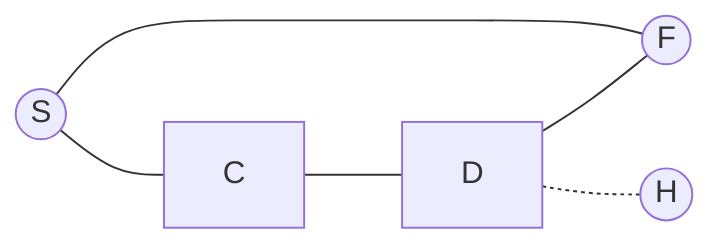

# AI Agent: AI的下一个风口 智能体的定义与特点

作者：禅与计算机程序设计艺术

## 1.背景介绍

### 1.1 人工智能的发展历程
#### 1.1.1 人工智能的起源与早期发展
#### 1.1.2 人工智能的低谷期
#### 1.1.3 人工智能的复兴与繁荣

### 1.2 当前人工智能技术现状
#### 1.2.1 机器学习和深度学习的突破
#### 1.2.2 自然语言处理和计算机视觉的进展
#### 1.2.3 人工智能在各行业的应用落地

### 1.3 人工智能发展面临的挑战
#### 1.3.1 算力和数据的瓶颈
#### 1.3.2 算法的可解释性和公平性问题
#### 1.3.3 人工智能系统的安全与隐私风险

## 2.核心概念与联系

### 2.1 什么是AI Agent
#### 2.1.1 AI Agent的定义
AI Agent，也称为智能体或智能代理，是一种能够感知环境并根据环境做出自主决策和行动的人工智能系统。它们具备感知、推理、学习和执行任务的能力，可以适应不确定和动态变化的环境。

#### 2.1.2 AI Agent的特点
- 自主性：能够独立地感知环境，做出决策和执行行动，无需人工干预。
- 社会性：能够与人类或其他智能体进行交互和协作，理解和遵循社会规范。
- 反应性：能够及时响应环境的变化，快速做出恰当的反应。 
- 主动性：能够主动探索环境，学习新知识，主动完成目标任务。
- 连续性：能够持续运行，不间断地感知、思考和行动。

#### 2.1.3 AI Agent与传统AI系统的区别
传统的AI系统通常是针对特定任务设计的，输入确定、输出确定，缺乏自主性和适应性。而AI Agent则是一个更加通用和自主的AI系统，能够在复杂多变的环境中自主决策行动，完成多种任务。

### 2.2 AI Agent的分类
#### 2.2.1 按架构分类
- 反应型Agent：根据当前感知做出决策，没有内部状态，如简单的反射行为。
- 模型型Agent：在内部维护一个环境模型，能够预测环境变化，如自动驾驶汽车。
- 目标型Agent：有明确的目标，并为实现目标而规划和执行行动，如智能助理。 
- 效用型Agent：根据行为的效用(收益)来选择最佳行动，追求长期利益最大化。

#### 2.2.2 按任务领域分类
- 对话型Agent：能够与人进行自然语言交互和对话，提供信息和服务，如智能客服。
- 感知型Agent：能够分析视频、图像等感知数据，进行目标检测、行为识别等，如安防监控。
- 规划型Agent：能够进行任务规划、路径规划，实现导航、调度优化等，如智能物流调度。
- 推荐型Agent：能够根据用户画像和行为数据，进行个性化推荐，如电商推荐系统。

### 2.3 AI Agent与其他AI技术的关系
#### 2.3.1 机器学习与AI Agent
机器学习是实现AI Agent的重要技术基础。Agent可以通过机器学习算法，从环境反馈中学习，优化自身的决策模型。强化学习尤其适合训练Agent。

#### 2.3.2 知识图谱与AI Agent
知识图谱可以为Agent提供丰富的结构化知识，增强Agent的常识推理和决策能力。Agent可以利用知识图谱进行问答、对话、推荐等。

#### 2.3.3 区块链与AI Agent
区块链为构建安全可信的去中心化Agent系统提供了解决方案。将区块链与多智能体系统相结合，有望实现可信协同和价值交换。

## 3.核心算法原理具体操作步骤

### 3.1 马尔科夫决策过程(MDP)
#### 3.1.1 MDP的定义
马尔科夫决策过程是对智能体与环境交互的数学建模。一个MDP由状态集合S、动作集合A、状态转移概率矩阵P、奖励函数R构成，形式化定义为一个元组$(S,A,P,R,\gamma)$。
- S是有限的状态集，$s_t \in S$表示时间步t时的状态
- A是有限的动作集，$a_t \in A$表示在t时刻智能体采取的动作
- $P(s'|s,a)$表示在状态s下执行动作a后转移到状态s'的概率
- $R(s,a)$表示在状态s下执行动作a获得的即时奖励
- $\gamma \in [0,1]$是折扣因子，表示对未来奖励的衰减

#### 3.1.2 求解MDP的价值迭代算法
价值迭代通过迭代贝尔曼最优方程，直到值函数收敛，得到最优策略。算法步骤如下：
1. 随机初始化值函数$V(s)$
2. 重复直到值函数收敛：
    - 对每个状态$s \in S$，更新值函数：
      $$V(s) \leftarrow \max\limits_{a \in A} \left\{ R(s,a) + \gamma \sum\limits_{s'\in S} P(s'|s,a)V(s')\right\}$$
3. 根据值函数导出最优策略：
   $$\pi^*(s)=\arg\max\limits_{a \in A} \left\{ R(s,a) + \gamma \sum\limits_{s'\in S} P(s'|s,a)V(s')\right\}$$

#### 3.1.3 求解MDP的策略迭代算法
策略迭代交替进行策略评估和策略改进，直到策略不再变化。算法步骤如下：
1. 随机初始化策略$\pi(s)$
2. 重复直到策略收敛：
   - 策略评估：对每个状态$s$，在给定策略$\pi$下更新值函数
     $$V^{\pi}(s) \leftarrow R(s,\pi(s)) + \gamma \sum\limits_{s'\in S} P(s'|s,\pi(s))V^{\pi}(s')$$
   - 策略改进：对每个状态$s$，更新策略 
     $$\pi'(s) \leftarrow \arg\max\limits_{a\in A}\left\{R(s,a) + \gamma \sum\limits_{s'\in S} P(s'|s,a)V^{\pi}(s')\right\}$$
   - 如果$\pi'=\pi$，则停止迭代，否则令$\pi \leftarrow \pi'$

### 3.2 蒙特卡洛树搜索(MCTS) 
#### 3.2.1 MCTS的定义
蒙特卡洛树搜索是一种启发式搜索算法，通过随机模拟来估计行动价值，并逐步构建搜索树。特别适用于信息不完全的博弈问题，如围棋、国际象棋。

#### 3.2.2 MCTS的四个步骤
1. 选择(Selection)：从根节点出发，依次选择最有价值的子节点，直到叶节点。常用UCB1公式选择：
   $$UCB1 = \frac{w_i}{n_i} + c \sqrt{\frac{\ln N}{n_i}} $$
   其中$w_i$是节点的累计收益，$n_i$是节点被访问次数，$c$是探索常数，$N$是总模拟次数。

2. 扩展(Expansion)：如果叶节点不是终止状态，则创建一个或多个子节点。

3. 仿真(Simulation)：从新扩展的节点开始，随机执行动作，直到到达终止状态。这个过程也称为rollout。

4. 回溯(Backpropagation)：将rollout的结果回溯到根节点，更新沿途节点的访问次数和收益值。

MCTS通过反复迭代这四个步骤，不断细化搜索树，最终在根节点处选择最佳行动。

#### 3.2.3 MCTS的伪代码

```
function MCTS(s_0):
    create root node v_0 with state s_0
    while within computational budget do
        v_l = TreePolicy(v_0)
        Δ = DefaultPolicy(s(v_l))  
        Backup(v_l, Δ)
    return BestChild(v_0)

function TreePolicy(v):
    while v is not a terminal node do
        if v is not fully expanded then
            return Expand(v) 
        else 
            v = BestChild(v)
    return v
    
function Expand(v):
    choose an untried action a from A(s(v))
    add a new child v' to v with s(v')=f(s(v),a)
    return v'

function BestChild(v):
    return argmax_{v' in children of v} UCB1(v') 
    
function DefaultPolicy(s):
    while s is not terminal do
        choose a in A(s) uniformly at random
        s = f(s,a)
    return reward for state s
    
function Backup(v, Δ):
    while v is not null do
        N(v) = N(v) + 1
        Q(v) = Q(v) + Δ
        v = parent of v
```

### 3.3 深度强化学习算法
#### 3.3.1 DQN (Deep Q Network)
DQN使用深度神经网络来逼近Q值函数，将状态作为网络输入，每个动作的Q值作为输出。网络参数通过最小化时序差分(TD)误差来训练：

$$L(\theta) = \mathbb{E}_{s,a,r,s'} \left[\left(r+\gamma \max\limits_{a'}Q(s',a';\theta^{-})-Q(s,a;\theta)\right)^2\right]$$

其中$\theta^{-}$表示目标网络的参数，用于计算TD目标值，每隔一定步数从在线网络复制得到。

此外，DQN还引入了经验回放(Experience Replay)机制，将$(s,a,r,s')$的转移数据存入回放缓冲区，之后从中随机采样小批量数据来更新在线网络，以打破数据的相关性。

#### 3.3.2 DDPG (Deep Deterministic Policy Gradient)
DDPG结合了DQN和Actor-Critic，适用于连续动作空间的控制任务。它由一个Actor网络$\mu(s;\theta^{\mu})$和一个Critic网络$Q(s,a;\theta^{Q})$组成。

- Actor网络以状态为输入，输出确定性动作$a_t=\mu(s_t;\theta^{\mu})$
- Critic网络以状态和动作为输入，输出Q值估计$Q(s_t,a_t)$
- Actor的目标是最大化Critic给出的动作价值，其策略梯度为：
$$\nabla_{\theta^{\mu}} J \approx \mathbb{E}_{s_t \sim \rho^{\mu}} \left[\left.\nabla_a Q(s,a;\theta^{Q})\right|_{s=s_t,a=\mu(s_t)} \nabla_{\theta^{\mu}} \mu(s;\theta^{\mu})|_{s=s_t}\right]$$
- Critic网络通过最小化TD误差来更新，目标值由目标网络给出：
$$L(\theta^{Q})=\mathbb{E}_{s_t,a_t,r_t,s_{t+1}} \left[\left(r_t+\gamma Q(s_{t+1},\mu(s_{t+1};\theta^{\mu});\theta^{Q'})-Q(s_t,a_t;\theta^{Q})\right)^2 \right]$$
- Actor和Critic的目标网络参数分别软更新：
$$\theta' \leftarrow \tau \theta + (1-\tau) \theta', \tau \ll 1$$

DDPG同样使用了经验回放来稳定训练。此外还加入了探索噪声，在执行时给Actor输出的动作添加随机噪声，以维持一定的探索。

## 4.数学模型和公式详细讲解举例说明
### 4.1 智能体与环境交互的数学建模
考虑一个简单的迷宫寻路问题，如图所示：



- S表示起点(Start)，F表示终点(Finish)，H表示陷阱(Hole)
- 智能体的目标是从S出发，尽快到达F，同时避免掉入H
- 每一步移动的奖励为-1，掉入H的奖励为-10，到达F的奖励为+10

我们可以用MDP来对这个问题建模：
- 状态集合 $S=\{S,B,C,D,E,F\}$
- 动作集合 $A=\{上,下,左,右\}$
- 转移概率 $P(s'|s,a)$