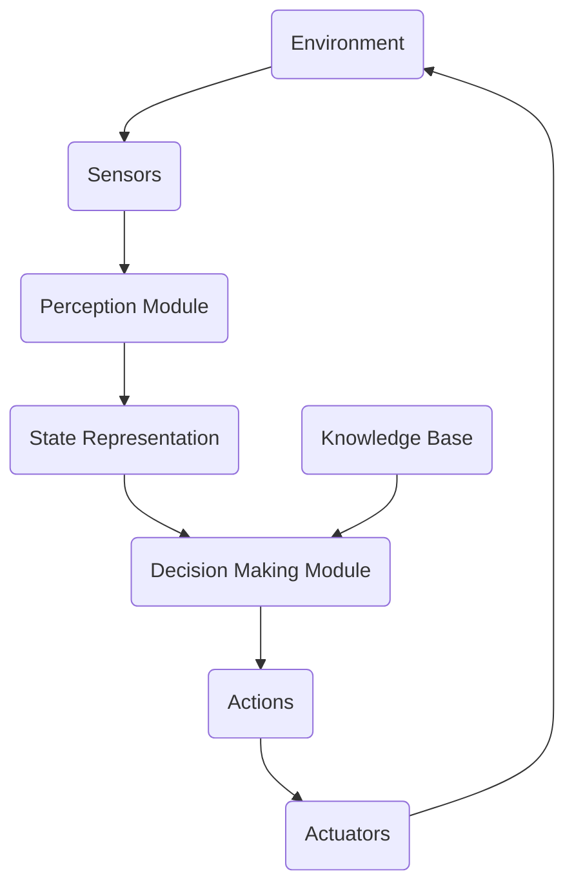

# AI Agent: AI的下一个风口 自主式智能体的典型案例

## 1. 背景介绍

### 1.1 人工智能的发展历程

人工智能(Artificial Intelligence, AI)经历了几个重要的发展阶段,从早期的专家系统和机器学习,到深度学习和神经网络的兴起,再到当前的大型语言模型和多模态AI等新兴技术。AI已经渗透到我们生活的方方面面,如计算机视觉、自然语言处理、推理决策等领域。

### 1.2 智能体与自主性的重要性

在AI的发展过程中,自主性(Autonomy)成为了一个关键概念。传统的AI系统大多是被动的、受控的,需要人类不断输入指令和数据。而真正的智能则需要系统能够主动感知环境、分析决策并自主行动,这就需要具备自主性。自主式智能体(Autonomous Agents)应运而生。

### 1.3 自主式智能体的前景

自主式智能体被认为是AI发展的下一个风口。它们能够在复杂、动态的环境中自主运作,适应变化,完成各种任务。这种智能系统的自主性、灵活性和通用性,将为人类社会带来巨大的变革,如无人驾驶、智能家居、智能制造等领域。

## 2. 核心概念与联系

### 2.1 智能体(Agent)的定义

智能体是AI系统中的一个核心概念。它是一个感知和行动于某种环境的自主实体。智能体能够感知环境的状态,并根据这些感知作出理性的行为决策,以实现特定目标。

### 2.2 智能体与环境的交互

智能体存在于某种环境(Environment)中,与环境交互是它的核心功能。典型的交互过程包括:

1. 感知(Perception):通过传感器获取环境状态信息
2. 决策(Decision Making):根据感知结果及内部状态,决策下一步行为
3. 行为(Action):执行相应行为,影响环境状态

这种感知-决策-行为的闭环过程不断重复,使智能体能够持续运作。

### 2.3 自主性(Autonomy)的内涵

自主性是智能体的关键特征。自主性包括以下几个层面:

- 自主决策:能够独立做出决策,而非被动执行指令
- 主动性:能够主动采取行动,而非被动等待
- 自我驱动:行为由内在目标和动机驱动,而非外部控制
- 环境适应:能够感知环境变化并相应调整行为
- 持续运作:能够长期稳定运行,而非一次性任务

具备这些能力的智能体,才能真正称为自主式智能体。

### 2.4 典型的自主式智能体

一些典型的自主式智能体包括:

- 智能机器人:如家用服务机器人、工业机器人等
- 无人驾驶系统:感知道路环境,自主导航和驾驶
- 智能调度系统:根据实时状况,自主调度资源和任务
- 游戏AI:能在复杂环境下做出合理决策和行为
- 对话系统:能根据上下文自主地理解和回应

## 3. 核心算法原理与操作步骤

### 3.1 基于Agent的AI系统架构

典型的基于Agent的AI系统架构包括以下几个核心模块:



1. **环境(Environment)**: 智能体所处的外部世界,可能是物理世界或虚拟世界。
2. **传感器(Sensors)**: 用于获取环境信息,如视觉、声音、位置等传感器。
3. **感知模块(Perception Module)**: 将传感器数据转换为有意义的状态表示。
4. **状态表示(State Representation)**: 对当前环境状态的内部模型化表示。
5. **决策模块(Decision Making Module)**: 根据当前状态和知识库,决策下一步的行为。
6. **知识库(Knowledge Base)**: 存储智能体的领域知识、规则、目标等。  
7. **执行器(Actuators)**: 将决策的行为实际执行到环境中。

这个循环持续运行,使智能体能够不断感知、决策和行动。

### 3.2 感知(Perception)

感知是将传感器数据转化为对环境状态的内部表示,是整个系统的基础。主要包括以下步骤:

1. **传感器数据获取**:从各种传感器获取原始数据,如图像、声音、位置等。
2. **数据预处理**:对原始数据进行滤波、降噪、校正等预处理。  
3. **特征提取**:使用手工特征工程或自动特征学习提取有意义的特征。
4. **模式识别**:将特征输入识别模型(如深度学习模型),识别出对象、事件等模式。
5. **状态建模**:将识别结果融合,建立对当前环境状态的内部表示模型。

这个过程需要综合计算机视觉、模式识别、信号处理等多种技术。

### 3.3 决策(Decision Making)

决策模块是智能体的"大脑",根据当前状态和知识库,选择下一步的最佳行为。主要步骤包括:

1. **目标分析**:明确当前的任务目标,可能是短期目标或长期目标。
2. **规划**:根据目标和当前状态,生成可能的行为序列方案。
3. **评估**:基于效用函数或其他评估标准,评估每个方案的价值。
4. **选择**:选择评估值最高(或满足约束条件)的行为方案作为决策。  

常用的决策算法有:

- 基于规则的系统
- 启发式搜索算法(如A*算法)
- 强化学习算法
- 基于效用理论的决策算法
- 决策网络等

### 3.4 行为执行(Action)

将决策的行为方案通过执行器实际执行到环境中,影响和改变环境状态。主要步骤:

1. **行为规划**:根据决策结果,规划出具体的行为序列。
2. **运动控制**:控制机器人、执行器等机构按计划执行动作。
3. **行为监控**:监控行为执行过程,处理异常和意外情况。
4. **反馈获取**:获取行为对环境的影响反馈,为下一周期决策提供信息。

在这个过程中,常需要运动规划、控制、动力学建模等技术。

## 4. 数学模型和公式详细讲解

在自主式智能体系统中,数学模型和公式扮演着重要角色,为系统的各个环节提供理论基础和计算支持。

### 4.1 马尔可夫决策过程(MDP)

马尔可夫决策过程(Markov Decision Process, MDP)是描述顺序决策问题的数学框架,广泛应用于强化学习和决策规划领域。一个MDP可以形式化定义为:

$$
\langle S, A, P, R, \gamma \rangle
$$

其中:

- $S$是状态空间的集合
- $A$是行为空间的集合  
- $P(s'|s,a)$是状态转移概率,表示在状态$s$执行行为$a$后,转移到状态$s'$的概率
- $R(s,a)$是在状态$s$执行行为$a$时获得的即时奖励
- $\gamma \in [0,1]$是折现因子,控制未来奖励的重要程度

在MDP框架下,智能体的目标是找到一个策略$\pi: S \rightarrow A$,使得期望的累积折现奖励最大:

$$
\max_\pi \mathbb{E}\left[ \sum_{t=0}^\infty \gamma^t R(s_t, a_t) \right]
$$

其中$s_t$和$a_t$分别是第$t$个时间步的状态和行为。

### 4.2 Q-Learning算法

Q-Learning是一种常用的基于MDP的强化学习算法,用于估计最优行为价值函数$Q^*(s,a)$,并据此获得最优策略$\pi^*$。算法过程如下:

1. 初始化$Q(s,a)$为任意值
2. 对每个状态-行为对$(s,a)$,重复:
    - 执行行为$a$,观察奖励$r$和下一状态$s'$
    - 更新$Q(s,a)$:
        $$
        Q(s,a) \leftarrow Q(s,a) + \alpha \left[ r + \gamma \max_{a'} Q(s',a') - Q(s,a) \right]
        $$
        其中$\alpha$是学习率。

3. 直到$Q$收敛为$Q^*$

最终,我们可以得到最优策略:

$$
\pi^*(s) = \arg\max_a Q^*(s,a)
$$

Q-Learning通过持续试错和价值函数更新,逐步获得最优策略,是强化学习的核心算法之一。

### 4.3 贝叶斯网络

在具有不确定性的环境中,贝叶斯网络提供了一种有效的不确定性建模和推理工具。贝叶斯网络是一种概率图模型,由节点(表示随机变量)和有向边(表示条件依赖关系)组成。

在贝叶斯网络中,节点的联合概率分布可以通过链式法则分解为条件概率的乘积:

$$
P(X_1, X_2, \ldots, X_n) = \prod_{i=1}^n P(X_i | \text{Parents}(X_i))
$$

其中$\text{Parents}(X_i)$表示节点$X_i$的父节点集合。

给定观测到的部分证据,我们可以使用贝叶斯公式进行概率推理:

$$
P(X|e) = \frac{P(X,e)}{P(e)} = \frac{P(X,e)}{\sum_X P(X,e)}
$$

这使得智能体能够根据不完全的观测,推断出环境的隐藏状态。

### 4.4 其他常用模型和公式

智能体系统中还会用到许多其他数学模型和公式,如:

- 卡尔曼滤波(Kalman Filter):用于状态估计
- PID控制器:用于机器人运动控制
- 期望最大化(EM)算法:用于隐马尔可夫模型参数估计
- 信念传播算法:用于贝叶斯网络推理
- 蒙特卡洛树搜索:用于大型复杂域的决策规划
- ......

总之,数学模型和公式为智能体系统提供了理论支撑和计算工具,是其不可或缺的组成部分。

## 5. 项目实践:代码实例和解释

为了更好地理解自主智能体的实现,我们来看一个基于Python和OpenAI Gym的强化学习项目示例。

### 5.1 OpenAI Gym环境

[OpenAI Gym](https://gym.openai.com/)是一个开发和比较强化学习算法的工具包,提供了多种模拟环境。我们以经典的"CartPole"环境为例:

```python
import gym
env = gym.make('CartPole-v1')
```

这个环境模拟一个小车需要通过左右移动小车来防止杆子倒下。状态空间是4维连续向量,包括小车位置、速度、杆子角度和角速度。行为空间是0(向左推)或1(向右推)。

### 5.2 使用Q-Learning算法

我们使用Q-Learning算法训练一个智能体Agent,让它学习如何平衡杆子:

```python
import numpy as np

class QAgent:
    def __init__(self, env):
        self.env = env
        self.Q = np.zeros((env.observation_space.shape[0], env.action_space.n))
        
    def get_action(self, state, epsilon):
        if np.random.rand() < epsilon:
            return self.env.action_space.sample() # 探索
        else:
            return np.argmax(self.Q[state]) # 利用
        
    def train(self, num_episodes, max_steps, epsilon, alpha, gamma):
        for episode in range(num_episodes):
            state = self.env.reset()
            total_reward = 0
            for step in range(max_steps):
                action = self.get_action(state, epsilon)
                next_state, reward, done, _ = self.env.step(action)
                
                # Q-Learning更新
                self.Q[state][action] += alpha * (reward + gamma * np.max(self.Q[next_state]) - self.Q[