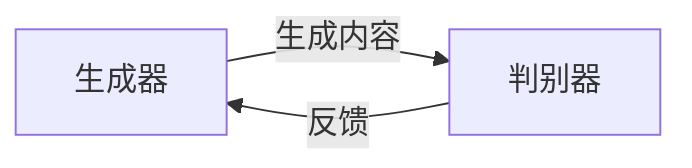

# AIGC 原理与代码实例讲解

作者：禅与计算机程序设计艺术

## 1.背景介绍

### 1.1 人工智能生成内容（AIGC）的发展历程

人工智能生成内容（AIGC，Artificial Intelligence Generated Content）是近年来人工智能领域最引人注目的发展之一。AIGC 技术的进步使得机器能够自动生成高质量的文本、图像、音频和视频内容，从而极大地改变了内容创作的方式。AIGC 的发展始于自然语言处理（NLP）和计算机视觉（CV）领域的突破，特别是深度学习和生成对抗网络（GAN）的引入。

### 1.2 AIGC 的重要性和应用场景

AIGC 在多个领域展现了其重要性和应用潜力，包括但不限于：

- **内容创作**：自动生成新闻报道、博客文章、广告文案等。
- **娱乐**：生成音乐、绘画、动画等艺术作品。
- **教育**：生成个性化的学习材料和测验题目。
- **医疗**：生成医疗报告和诊断建议。
- **商业**：生成产品描述和市场分析报告。

### 1.3 AIGC 技术的挑战

尽管 AIGC 技术已经取得了显著进展，但仍然面临一些挑战：

- **内容质量**：生成内容的质量和真实性需要进一步提高。
- **伦理问题**：如何防止生成内容被滥用，例如生成虚假新闻或深度伪造视频。
- **计算资源**：训练和运行 AIGC 模型需要大量的计算资源。

## 2.核心概念与联系

### 2.1 深度学习与神经网络

深度学习是 AIGC 的核心技术之一。深度学习使用多层神经网络来模拟人脑的工作方式，从而能够处理复杂的数据并生成高质量的内容。常用的神经网络架构包括卷积神经网络（CNN）、循环神经网络（RNN）和变压器（Transformer）。

### 2.2 生成对抗网络（GAN）

生成对抗网络（GAN）是 AIGC 中广泛使用的一种生成模型。GAN 由生成器和判别器两部分组成，生成器负责生成内容，判别器负责判断内容的真实性。通过生成器和判别器的对抗训练，GAN 能够生成逼真的内容。

### 2.3 自然语言处理（NLP）

自然语言处理（NLP）是 AIGC 中生成文本内容的关键技术。NLP 涉及文本的理解、生成和翻译等任务。近年来，基于变压器的模型（如 GPT-3 和 BERT）在 NLP 领域取得了显著进展，推动了 AIGC 的发展。

### 2.4 计算机视觉（CV）

计算机视觉（CV）是 AIGC 中生成图像和视频内容的关键技术。CV 涉及图像的识别、生成和处理等任务。深度卷积神经网络（CNN）在 CV 领域表现出色，广泛应用于图像生成和图像修复等任务。

## 3.核心算法原理具体操作步骤

### 3.1 深度学习模型的训练

训练深度学习模型是 AIGC 的基础步骤之一。以下是训练深度学习模型的一般步骤：

1. **数据准备**：
    - 收集和清理数据。
    - 数据预处理，如归一化和数据增强。

2. **模型设计**：
    - 选择合适的网络架构，如 CNN、RNN 或 Transformer。
    - 定义模型的层数、激活函数和损失函数。

3. **模型训练**：
    - 使用训练数据和优化算法（如 SGD 或 Adam）训练模型。
    - 监控训练过程中的损失和准确率，调整超参数。

4. **模型评估**：
    - 使用验证数据集评估模型的性能。
    - 进行超参数调优和模型优化。

5. **模型部署**：
    - 将训练好的模型部署到生产环境中。
    - 监控模型在实际应用中的表现，进行必要的调整。

### 3.2 GAN 的训练过程

GAN 的训练过程涉及生成器和判别器的交替训练。以下是 GAN 的训练步骤：

1. **初始化**：
    - 初始化生成器和判别器的权重。

2. **生成器训练**：
    - 使用随机噪声生成假样本。
    - 通过判别器对假样本进行评估。
    - 计算生成器的损失，并更新生成器的权重。

3. **判别器训练**：
    - 使用真实样本和假样本训练判别器。
    - 计算判别器的损失，并更新判别器的权重。

4. **迭代**：
    - 重复生成器和判别器的训练过程，直到生成器能够生成逼真的样本。

### 3.3 NLP 模型的训练过程

训练 NLP 模型通常包括以下步骤：

1. **数据准备**：
    - 收集和清理文本数据。
    - 文本预处理，如分词、去停用词和词向量表示。

2. **模型设计**：
    - 选择合适的 NLP 模型架构，如 Transformer。
    - 定义模型的层数、注意力机制和损失函数。

3. **模型训练**：
    - 使用训练数据和优化算法训练模型。
    - 监控训练过程中的损失和准确率，调整超参数。

4. **模型评估**：
    - 使用验证数据集评估模型的性能。
    - 进行超参数调优和模型优化。

5. **模型部署**：
    - 将训练好的模型部署到生产环境中。
    - 监控模型在实际应用中的表现，进行必要的调整。

## 4.数学模型和公式详细讲解举例说明

### 4.1 深度神经网络的数学基础

深度神经网络的核心在于前向传播和反向传播的数学原理。以下是神经网络的基本公式：

1. **前向传播**：
    - 输入层到隐藏层的计算：
    $$
    z^{(1)} = W^{(1)} x + b^{(1)}
    $$
    - 激活函数：
    $$
    a^{(1)} = \sigma(z^{(1)})
    $$
    - 隐藏层到输出层的计算：
    $$
    z^{(2)} = W^{(2)} a^{(1)} + b^{(2)}
    $$
    - 输出：
    $$
    y = \sigma(z^{(2)})
    $$

2. **反向传播**：
    - 损失函数的梯度计算：
    $$
    \frac{\partial L}{\partial W^{(2)}} = \delta^{(2)} a^{(1)^T}
    $$
    - 误差项的计算：
    $$
    \delta^{(2)} = \frac{\partial L}{\partial z^{(2)}} \cdot \sigma'(z^{(2)})
    $$
    - 更新权重和偏置：
    $$
    W^{(2)} = W^{(2)} - \eta \frac{\partial L}{\partial W^{(2)}}
    $$

### 4.2 GAN 的数学原理

GAN 的训练目标是找到生成器和判别器的最优策略，使得生成器生成的样本尽可能接近真实样本。GAN 的目标函数如下：

1. **生成器的目标函数**：
    $$
    \min_G V(G, D) = \mathbb{E}_{z \sim p_z(z)} [\log(1 - D(G(z)))]
    $$

2. **判别器的目标函数**：
    $$
    \max_D V(G, D) = \mathbb{E}_{x \sim p_{data}(x)} [\log D(x)] + \mathbb{E}_{z \sim p_z(z)} [\log(1 - D(G(z)))]
    $$

3. **联合目标函数**：
    $$
    \min_G \max_D V(G, D) = \mathbb{E}_{x \sim p_{data}(x)} [\log D(x)] + \mathbb{E}_{z \sim p_z(z)} [\log(1 - D(G(z)))]
    $$

### 4.3 NLP 模型的数学原理

以 Transformer 模型为例，Transformer 的核心在于自注意力机制和多头注意力机制。以下是 Transformer 的基本公式：

1. **自注意力机制**：
    - 输入序列表示为 $X = [x_1, x_2, \ldots, x_n]$。
    - 计算查询、键和值：
    $$
    Q = XW^Q, \quad K = XW^K,