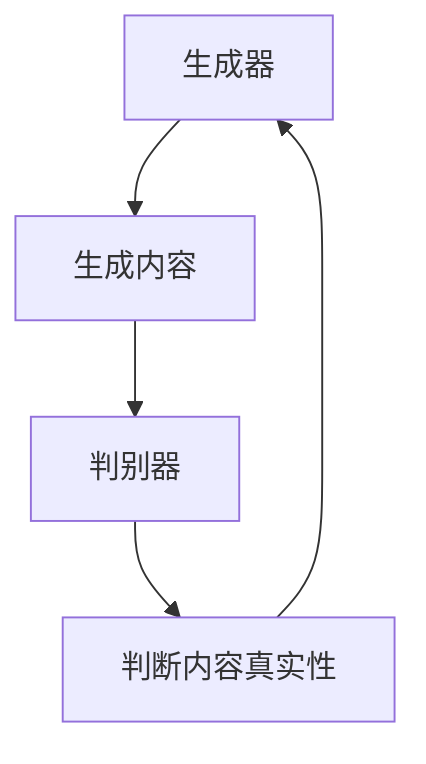

# AIGC与农业：AI赋能农业现代化

作者：禅与计算机程序设计艺术

## 1. 背景介绍

### 1.1 农业现代化的需求

农业作为人类社会发展的基石，历经数千年的演变，逐步从传统的手工劳作转向机械化、化学化和信息化。然而，随着全球人口的不断增长和气候变化的加剧，农业面临着越来越多的挑战。如何提高农作物产量、优化资源利用、减少环境负担成为现代农业亟待解决的问题。

### 1.2 人工智能生成内容（AIGC）的崛起

人工智能（AI）技术在过去几十年中取得了飞速发展，尤其是生成内容（AIGC）领域。AIGC通过深度学习模型，能够生成高质量的文本、图像、音频和视频内容。这些技术不仅在娱乐、媒体等领域大放异彩，也在农业现代化中展现出巨大的潜力。

### 1.3 AIGC在农业中的应用潜力

AIGC技术可以通过多种方式赋能农业现代化。例如，通过生成高精度的农作物生长模型，帮助农民优化种植方案；通过生成精准的天气预报，帮助农民合理安排农事活动；通过生成智能灌溉方案，帮助农民节约用水，提高农作物产量。本文将深入探讨AIGC在农业中的核心概念、算法原理、实际应用和未来发展趋势。

## 2. 核心概念与联系

### 2.1 AIGC的定义与分类

AIGC（Artificial Intelligence Generated Content）是指利用人工智能技术生成的各种内容。根据生成内容的不同，AIGC可以分为文本生成、图像生成、音频生成和视频生成等类别。每种类别的AIGC都涉及不同的技术和算法。

### 2.2 农业现代化的核心需求

农业现代化的核心需求包括提高农作物产量、优化资源利用、减少环境负担等。为实现这些目标，农业现代化需要依赖多种技术手段，包括精准农业、智能灌溉、智能农机、农作物生长模型等。

### 2.3 AIGC与农业现代化的结合点

AIGC技术可以在多个方面与农业现代化结合，具体包括：

- **精准农业**：通过生成农作物生长模型，优化种植方案，提高产量。
- **智能灌溉**：通过生成智能灌溉方案，节约用水，提高农作物产量。
- **病虫害监测**：通过生成病虫害监测模型，及时发现并处理病虫害，减少农药使用。
- **天气预报**：通过生成精准的天气预报，帮助农民合理安排农事活动。

## 3. 核心算法原理具体操作步骤

### 3.1 深度学习与生成模型

深度学习是AIGC技术的核心，其主要通过神经网络模型进行内容生成。常见的生成模型包括生成对抗网络（GAN）、变分自编码器（VAE）和自回归模型（如GPT-3）。这些模型通过大量数据的训练，能够生成高质量的内容。

### 3.2 生成对抗网络（GAN）

生成对抗网络（GAN）由生成器和判别器两个部分组成。生成器负责生成内容，判别器负责判断内容的真实性。通过生成器和判别器的对抗训练，生成器能够生成越来越逼真的内容。



### 3.3 变分自编码器（VAE）

变分自编码器（VAE）通过编码器将输入数据映射到潜在空间，再通过解码器从潜在空间重建输入数据。VAE通过最大化输入数据的对数似然估计，能够生成与输入数据分布相似的内容。

### 3.4 自回归模型

自回归模型通过预测序列中的下一个元素来生成内容。常见的自回归模型包括GPT-3和Transformer。这些模型通过大量数据的训练，能够生成高质量的文本内容。

## 4. 数学模型和公式详细讲解举例说明

### 4.1 生成对抗网络（GAN）的数学原理

生成对抗网络（GAN）的核心思想是通过生成器和判别器的对抗训练，使生成器能够生成逼真的内容。GAN的目标是最大化生成器生成内容的对数似然估计，同时最小化判别器判断生成内容为假的对数似然估计。其数学公式如下：

$$
\min_G \max_D V(D, G) = \mathbb{E}_{x \sim p_{data}(x)} [\log D(x)] + \mathbb{E}_{z \sim p_z(z)} [\log (1 - D(G(z)))]
$$

其中，$G$ 表示生成器，$D$ 表示判别器，$p_{data}(x)$ 表示真实数据的分布，$p_z(z)$ 表示生成器的输入噪声分布。

### 4.2 变分自编码器（VAE）的数学原理

变分自编码器（VAE）通过最大化输入数据的对数似然估计，生成与输入数据分布相似的内容。VAE的目标是最大化输入数据的对数似然估计，同时最小化潜在空间的KL散度。其数学公式如下：

$$
\mathcal{L}(\theta, \phi; x) = \mathbb{E}_{q_\phi(z|x)} [\log p_\theta(x|z)] - D_{KL}(q_\phi(z|x) \| p_\theta(z))
$$

其中，$p_\theta(x|z)$ 表示解码器的概率分布，$q_\phi(z|x)$ 表示编码器的概率分布，$D_{KL}$ 表示KL散度。

### 4.3 自回归模型的数学原理

自回归模型通过预测序列中的下一个元素来生成内容。其目标是最大化生成内容的对数似然估计。其数学公式如下：

$$
\mathcal{L}(\theta) = \sum_{t=1}^T \log p_\theta(x_t | x_{1:t-1})
$$

其中，$p_\theta(x_t | x_{1:t-1})$ 表示在已生成内容 $x_{1:t-1}$ 的条件下生成下一个元素 $x_t$ 的概率分布。

## 5. 项目实践：代码实例和详细解释说明

### 5.1 使用GAN生成农作物生长模型

```python
import tensorflow as tf
from tensorflow.keras import layers

# 定义生成器
def build_generator():
    model = tf.keras.Sequential()
    model.add(layers.Dense(256, activation='relu', input_dim=100))
    model.add(layers.BatchNormalization())
    model.add(layers.Dense(512, activation='relu'))
    model.add(layers.BatchNormalization())
    model.add(layers.Dense(1024, activation='relu'))
    model.add(layers.BatchNormalization())
    model.add(layers.Dense(28*28*1, activation='tanh'))
    model.add(layers.Reshape((28, 28, 1)))
    return model

# 定义判别器
def build_discriminator():
    model = tf.keras.Sequential()
    model.add(layers.Flatten(input_shape=(28, 28, 1)))
    model.add(layers.Dense(512, activation='relu'))
    model.add(layers.Dense(256, activation='relu'))
    model.add(layers.Dense(1, activation='sigmoid'))
    return model

# 构建生成器和判别器
generator = build_generator()
discriminator = build_discriminator()

# 定义GAN模型
discriminator.compile(loss='binary_crossentropy', optimizer='adam')
discriminator.trainable = False
gan_input = layers.Input(shape=(100,))
gan_output = discriminator(generator(gan_input))
gan = tf.keras.models.Model(gan_input, gan_output)
gan.compile(loss='binary_crossentropy', optimizer='adam')

# 训练GAN模型
import numpy as np

def train_gan(generator, discriminator, gan, epochs, batch_size, latent_dim):
    (x_train, _), (_, _) = tf.keras.datasets.mnist.load_data()
    x_train = (x_train.astype(np.float32) - 127.5) / 127.5
    x_train = np.expand_dims(x_train, axis=3)
    real = np.ones((batch_size, 1))
    fake = np.zeros((batch_size, 1))

    for epoch in range(epochs):
        idx = np.random.randint(0, x_train.shape[0], batch_size)
        real_imgs = x_train[idx]

        noise = np.random.normal(0, 1, (batch_size, latent_dim))
        gen_imgs = generator.predict