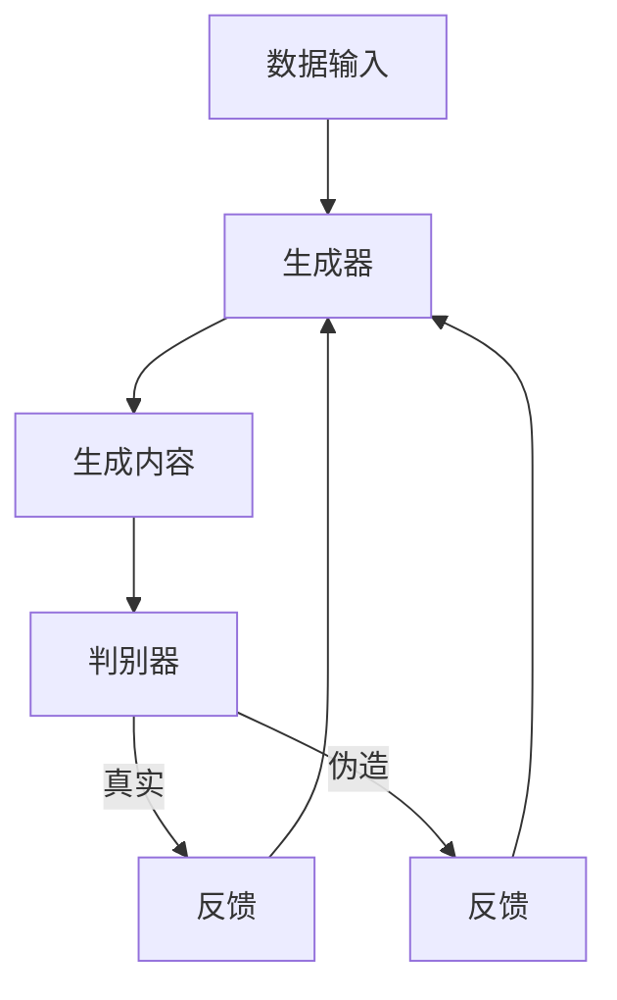

# AIGC从入门到实战：AIGC 的发展历程

作者：禅与计算机程序设计艺术

## 1.背景介绍

### 1.1 什么是AIGC

AIGC（AI Generated Content），即人工智能生成内容，是指利用人工智能技术生成文本、图像、音频、视频等多种形式的内容。随着深度学习和自然语言处理技术的飞速发展，AIGC已经从实验室走向了实际应用，并在多个领域展示出巨大的潜力。

### 1.2 AIGC的发展历程

AIGC的发展可以追溯到20世纪中期，人工智能的早期研究阶段。随着计算能力的提升和算法的改进，AIGC经历了从简单规则系统到复杂神经网络的演变。近年来，生成对抗网络（GANs）和变分自编码器（VAEs）的出现，进一步推动了AIGC的发展，使得生成内容的质量和多样性有了显著提升。

### 1.3 AIGC的应用领域

AIGC的应用领域非常广泛，包括但不限于以下几个方面：

- **文本生成**：新闻报道、小说创作、技术文档等。
- **图像生成**：艺术创作、广告设计、虚拟现实等。
- **音频生成**：音乐创作、语音合成、音效制作等。
- **视频生成**：电影制作、动画生成、虚拟主播等。

## 2.核心概念与联系

### 2.1 人工智能与机器学习

人工智能（AI）是指使计算机系统能够执行通常需要人类智能才能完成的任务的技术。机器学习（ML）是人工智能的一个子领域，强调通过数据和经验来改进系统的性能。

### 2.2 深度学习

深度学习是机器学习的一个分支，主要利用多层神经网络来建模复杂的模式和关系。深度学习在图像识别、语音识别、自然语言处理等领域取得了突破性进展，是AIGC的核心技术之一。

### 2.3 自然语言处理

自然语言处理（NLP）是人工智能的一个重要分支，旨在使计算机能够理解、解释和生成人类语言。NLP技术在文本生成中的应用尤为广泛，如自动写作、机器翻译、对话系统等。

### 2.4 生成对抗网络（GANs）

生成对抗网络（GANs）是一种深度学习模型，由生成器和判别器两个对抗网络组成。生成器负责生成逼真的内容，而判别器负责区分生成内容和真实内容。通过这种对抗训练，生成器能够生成越来越逼真的内容。



### 2.5 变分自编码器（VAEs）

变分自编码器（VAEs）是一种生成模型，通过编码器将输入数据映射到潜在空间，再通过解码器从潜在空间生成新的数据。VAEs在生成多样性较高的内容时表现出色，常用于图像生成和文本生成。

## 3.核心算法原理具体操作步骤

### 3.1 生成对抗网络（GANs）

#### 3.1.1 GANs的基本结构

生成对抗网络由生成器（Generator）和判别器（Discriminator）组成。生成器负责生成逼真的内容，判别器负责区分生成内容和真实内容。两者通过对抗训练，不断提升各自的能力。

#### 3.1.2 GANs的训练过程

1. **初始化生成器和判别器的参数**。
2. **生成器生成伪造内容**。
3. **判别器对伪造内容和真实内容进行分类**。
4. **根据判别器的反馈，更新生成器的参数**。
5. **根据真实内容和生成内容，更新判别器的参数**。
6. **重复以上步骤，直到生成内容足够逼真**。

### 3.2 变分自编码器（VAEs）

#### 3.2.1 VAEs的基本结构

变分自编码器由编码器（Encoder）和解码器（Decoder）组成。编码器将输入数据映射到潜在空间，解码器从潜在空间生成新的数据。通过最大化数据的似然函数，VAEs能够生成多样性较高的内容。

#### 3.2.2 VAEs的训练过程

1. **初始化编码器和解码器的参数**。
2. **将输入数据通过编码器映射到潜在空间**。
3. **从潜在空间采样，生成潜在变量**。
4. **将潜在变量通过解码器生成新的数据**。
5. **计算生成数据与输入数据的重构误差**。
6. **最大化重构误差和潜在变量的似然函数**。
7. **重复以上步骤，直到生成内容足够逼真**。

## 4.数学模型和公式详细讲解举例说明

### 4.1 生成对抗网络（GANs）

生成对抗网络的目标是通过对抗训练，使生成器生成的内容尽可能逼真。其损失函数可以表示为：

$$
\min_G \max_D V(D, G) = \mathbb{E}_{x \sim p_{data}(x)}[\log D(x)] + \mathbb{E}_{z \sim p_{z}(z)}[\log(1 - D(G(z)))]
$$

其中，$G$ 是生成器，$D$ 是判别器，$p_{data}(x)$ 是真实数据的分布，$p_{z}(z)$ 是潜在空间的分布。

### 4.2 变分自编码器（VAEs）

变分自编码器的目标是最大化数据的似然函数，其损失函数可以表示为：

$$
\mathcal{L} = -\mathbb{E}_{q(z|x)}[\log p(x|z)] + KL(q(z|x) || p(z))
$$

其中，$q(z|x)$ 是编码器的输出分布，$p(x|z)$ 是解码器的输出分布，$KL$ 是Kullback-Leibler散度。

## 5.项目实践：代码实例和详细解释说明

### 5.1 生成对抗网络（GANs）

#### 5.1.1 代码实例

以下是一个简单的GANs实现，用于生成手写数字（MNIST）：

```python
import torch
import torch.nn as nn
import torch.optim as optim
from torchvision import datasets, transforms

# 定义生成器
class Generator(nn.Module):
    def __init__(self):
        super(Generator, self).__init__()
        self.main = nn.Sequential(
            nn.Linear(100, 256),
            nn.ReLU(True),
            nn.Linear(256, 512),
            nn.ReLU(True),
            nn.Linear(512, 1024),
            nn.ReLU(True),
            nn.Linear(1024, 784),
            nn.Tanh()
        )

    def forward(self, x):
        return self.main(x)

# 定义判别器
class Discriminator(nn.Module):
    def __init__(self):
        super(Discriminator, self).__init__()
        self.main = nn.Sequential(
            nn.Linear(784, 1024),
            nn.LeakyReLU(0.2, inplace=True),
            nn.Linear(1024, 512),
            nn.LeakyReLU(0.2, inplace=True),
            nn.Linear(512, 256),
            nn.LeakyReLU(0.2, inplace=True),
            nn.Linear(256, 1),
            nn.Sigmoid()
        )

    def forward(self, x):
        return self.main(x)

# 初始化生成器和判别器
G = Generator()
D = Discriminator()

# 定义损失函数和优化器
criterion = nn.BCELoss()
optimizerG = optim.Adam(G.parameters(), lr=0.0002)
optimizerD = optim.Adam(D.parameters(), lr=0.0002)

# 加载数据
transform = transforms.Compose([
    transforms.ToTensor(),
    transforms.Normalize((0.5,), (0.5,))
])
train_loader = torch.utils.data.DataLoader(
    datasets.MNIST('.', train=True, download=True, transform=transform),
    batch_size=64, shuffle=True
)

# 训练GANs
for epoch in range(100):
    for i, (data, _) in enumerate(train_loader):
        # 训练判别器
        D.zero_grad()
        real_data = data.view(-1, 784)
        real_output = D(real_data)
        real_label = torch.ones(real_output.size())
        fake_data = G(torch.randn(real_data.size(0), 100))
        fake_output = D(fake_data.detach())
        fake_label = torch.zeros(fake_output.size())
        lossD_real = criterion(real_output