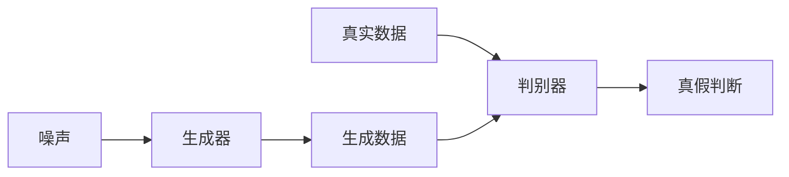
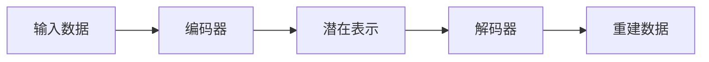

# AIGC从入门到实战：人工智能应用发展较快的领域

作者：禅与计算机程序设计艺术

## 1. 背景介绍

### 1.1 AIGC的兴起与发展

近年来，人工智能（AI）技术发展迅速，特别是在生成式人工智能（AIGC）领域，其应用范围不断扩大，从图像生成、音乐创作到文本创作，AIGC正在深刻地改变着我们的生活和工作方式。AIGC的兴起源于深度学习技术的突破，特别是生成对抗网络（GAN）、变分自编码器（VAE）等深度生成模型的出现，使得机器能够从大量数据中学习并生成逼真的内容。

### 1.2 AIGC的应用领域

AIGC的应用领域非常广泛，涵盖了图像、视频、音频、文本等多个领域。

#### 1.2.1 图像生成

*  **图像风格迁移：**将一张图片的风格迁移到另一张图片上，例如将梵高的画风应用到一张照片上。
*  **图像修复：**修复破损的图片，例如去除图片上的水印、修复老照片等。
*  **图像生成：**根据文字描述生成图片，例如输入“一只穿着西装的猫在弹钢琴”，AIGC可以生成相应的图片。

#### 1.2.2 视频生成

*  **视频风格迁移：**将一段视频的风格迁移到另一段视频上，例如将动画风格应用到一段真人视频上。
*  **视频预测：**根据已有的视频帧预测未来的视频帧，例如预测行人下一步的运动轨迹。
*  **视频生成：**根据文字描述生成视频，例如输入“一只小狗在草地上奔跑”，AIGC可以生成相应的视频。

#### 1.2.3 音频生成

*  **语音合成：**将文字转换成语音，例如将电子书转换成有声读物。
*  **音乐生成：**根据指定的风格和乐器生成音乐，例如生成一首古典钢琴曲。
*  **声音特效生成：**生成各种声音特效，例如爆炸声、脚步声等。

#### 1.2.4 文本生成

*  **机器翻译：**将一种语言的文本翻译成另一种语言的文本，例如将英文翻译成中文。
*  **文本摘要：**从一篇长文本中提取出关键信息，生成简短的摘要。
*  **文本生成：**根据指定的主题和关键词生成文章、故事、诗歌等。

### 1.3 AIGC的意义和影响

AIGC的出现和发展具有重要的意义和影响：

*  **提高内容创作效率：**AIGC可以帮助人类快速生成大量高质量的内容，提高内容创作效率。
*  **降低内容创作门槛：**AIGC使得普通人也能够轻松创作出高质量的内容，降低了内容创作的门槛。
*  **促进产业升级：**AIGC可以应用于各个行业，推动产业升级和发展。

## 2. 核心概念与联系

### 2.1 生成式人工智能（AIGC）

生成式人工智能（AIGC）是指利用人工智能技术生成各种类型的内容，例如图像、视频、音频、文本等。AIGC的核心是深度生成模型，例如生成对抗网络（GAN）、变分自编码器（VAE）等。

### 2.2 生成对抗网络（GAN）

生成对抗网络（GAN）是一种深度学习模型，由两个神经网络组成：生成器和判别器。生成器的目标是生成逼真的数据，判别器的目标是区分真实数据和生成数据。在训练过程中，生成器和判别器相互对抗，不断优化自身，最终生成器可以生成以假乱真的数据。

#### 2.2.1 GAN的结构



#### 2.2.2 GAN的训练过程

1.  从随机噪声中生成数据。
2.  将真实数据和生成数据输入判别器。
3.  根据判别器的输出，更新生成器和判别器的参数。
4.  重复步骤1-3，直到生成器可以生成以假乱真的数据。

### 2.3 变分自编码器（VAE）

变分自编码器（VAE）也是一种深度学习模型，它可以学习数据的潜在表示，并根据潜在表示生成新的数据。VAE由编码器和解码器组成。编码器的目标是将输入数据压缩成低维的潜在表示，解码器的目标是根据潜在表示重建输入数据。

#### 2.3.1 VAE的结构



#### 2.3.2 VAE的训练过程

1.  将输入数据输入编码器，得到潜在表示。
2.  从潜在表示中采样，得到新的潜在表示。
3.  将新的潜在表示输入解码器，得到重建数据。
4.  根据重建数据和输入数据的差异，更新编码器和解码器的参数。
5.  重复步骤1-4，直到VAE可以生成与输入数据相似的新的数据。

## 3. 核心算法原理具体操作步骤

### 3.1 基于GAN的图像生成

以基于GAN的图像生成为例，介绍AIGC的核心算法原理和具体操作步骤。

#### 3.1.1 数据准备

*  收集大量的图像数据，例如人脸图像、风景图像等。
*  对图像数据进行预处理，例如缩放、裁剪、归一化等。

#### 3.1.2 模型构建

*  构建生成器网络，例如使用反卷积神经网络。
*  构建判别器网络，例如使用卷积神经网络。

#### 3.1.3 模型训练

*  将随机噪声输入生成器，生成图像。
*  将真实图像和生成图像输入判别器，进行真假判断。
*  根据判别器的输出，更新生成器和判别器的参数。
*  重复上述步骤，直到生成器可以生成以假乱真的图像。

#### 3.1.4 图像生成

*  将随机噪声输入训练好的生成器，即可生成新的图像。

### 3.2 基于VAE的文本生成

以基于VAE的文本生成为例，介绍AIGC的核心算法原理和具体操作步骤。

#### 3.2.1 数据准备

*  收集大量的文本数据，例如新闻文章、小说等。
*  对文本数据进行预处理，例如分词、去除停用词、构建词向量等。

#### 3.2.2 模型构建

*  构建编码器网络，例如使用循环神经网络（RNN）。
*  构建解码器网络，例如使用RNN或Transformer网络。

#### 3.2.3 模型训练

*  将文本数据输入编码器，得到潜在表示。
*  从潜在表示中采样，得到新的潜在表示。
*  将新的潜在表示输入解码器，生成文本。
*  根据生成文本和真实文本的差异，更新编码器和解码器的参数。
*  重复上述步骤，直到VAE可以生成流畅自然的文本。

#### 3.2.4 文本生成

*  将随机噪声输入训练好的解码器，即可生成新的文本。

## 4. 数学模型和公式详细讲解举例说明

### 4.1 GAN的数学模型

GAN的目标是找到一个生成器 $G$，使得生成器生成的样本分布 $p_g$ 尽可能接近真实样本分布 $p_{data}$。判别器 $D$ 的作用是区分真实样本和生成样本，其目标是最大化区分真实样本和生成样本的概率。

GAN的损失函数可以表示为：

$$
\min_G \max_D V(D,G) = \mathbb{E}_{x\sim p_{data}(x)}[\log D(x)] + \mathbb{E}_{z\sim p_z(z)}[\log(1-D(G(z)))]
$$

其中，$x$ 表示真实样本，$z$ 表示随机噪声，$D(x)$ 表示判别器判断真实样本 $x$ 为真的概率，$D(G(z))$ 表示判别器判断生成样本 $G(z)$ 为真的概率。

### 4.2 VAE的数学模型

VAE的目标是学习一个潜在变量 $z$ 的分布 $p(z)$，以及一个生成模型 $p(x|z)$，使得 $p(x|z)$ 能够生成与真实数据分布 $p_{data}(x)$ 相似的样本。

VAE的损失函数可以表示为：

$$
\mathcal{L}(\theta,\phi) = \mathbb{E}_{x\sim p_{data}(x)}[-\log p(x|\theta,\phi)] + KL[q(z|x,\phi)||p(z)]
$$

其中，$\theta$ 和 $\phi$ 分别表示解码器和编码器的参数，$q(z|x,\phi)$ 表示编码器学习到的后验分布，$p(z)$ 表示先验分布，$KL$ 表示 KL 散度。

### 4.3 举例说明

以图像生成为例，说明GAN和VAE的数学模型如何应用于实际问题。

#### 4.3.1 GAN

假设我们要训练一个GAN来生成人脸图像。

*  **真实样本分布 $p_{data}$：**真实人脸图像的分布。
*  **生成器 $G$：**一个神经网络，输入随机噪声，输出人脸图像。
*  **判别器 $D$：**一个神经网络，输入人脸图像，输出真假判断。

GAN的训练过程如下：

1.  从随机噪声中采样，输入生成器，生成人脸图像。
2.  将真实人脸图像和生成的人脸图像输入判别器，进行真假判断。
3.  根据判别器的输出，更新生成器和判别器的参数。

通过不断训练，生成器可以生成越来越逼真的人脸图像，判别器也越来越难以区分真实人脸图像和生成的人脸图像。

#### 4.3.2 VAE

假设我们要训练一个VAE来生成人脸图像。

*  **真实数据分布 $p_{data}(x)$：**真实人脸图像的分布。
*  **潜在变量 $z$：**表示人脸图像的特征，例如性别、年龄、表情等。
*  **编码器 $q(z|x,\phi)$：**将人脸图像编码成潜在变量。
*  **解码器 $p(x|z,\theta)$：**根据潜在变量生成人脸图像。

VAE的训练过程如下：

1.  将人脸图像输入编码器，得到潜在变量。
2.  从潜在变量中采样，得到新的潜在变量。
3.  将新的潜在变量输入解码器，生成人脸图像。
4.  根据生成的人脸图像和真实人脸图像的差异，更新编码器和解码器的参数。

通过不断训练，VAE可以学习到人脸图像的特征，并根据这些特征生成新的、多样的人脸图像。

## 5. 项目实践：代码实例和详细解释说明

### 5.1 基于GAN的图像生成

```python
import torch
import torch.nn as nn
import torch.optim as optim
from torch.utils.data import DataLoader
from torchvision import datasets, transforms

# 定义生成器网络
class Generator(nn.Module):
    def __init__(self):
        super(Generator, self).__init__()
        # 定义网络结构
        # ...

    def forward(self, x):
        # 定义前向传播过程
        # ...

# 定义判别器网络
class Discriminator(nn.Module):
    def __init__(self):
        super(Discriminator, self).__init__()
        # 定义网络结构
        # ...

    def forward(self, x):
        # 定义前向传播过程
        # ...

# 定义超参数
batch_size = 64
lr = 0.0002
epochs = 100

# 加载数据集
train_dataset = datasets.MNIST(
    root='./data',
    train=True,
    download=True,
    transform=transforms.ToTensor(),
)
train_loader = DataLoader(train_dataset, batch_size=batch_size, shuffle=True)

# 实例化生成器和判别器
generator = Generator()
discriminator = Discriminator()

# 定义优化器和损失函数
optimizer_G = optim.Adam(generator.parameters(), lr=lr)
optimizer_D = optim.Adam(discriminator.parameters(), lr=lr)
criterion = nn.BCELoss()

# 开始训练
for epoch in range(epochs):
    for i, (images, _) in enumerate(train_loader):
        # 训练判别器
        real_labels = torch.ones(batch_size, 1)
        fake_labels = torch.zeros(batch_size, 1)
        # ...

        # 训练生成器
        # ...

        # 打印训练信息
        # ...

# 保存模型
torch.save(generator.state_dict(), 'generator.pth')
torch.save(discriminator.state_dict(), 'discriminator.pth')
```

**代码解释:**

1.  **导入必要的库：** 包括 PyTorch 库，用于构建和训练神经网络，以及 torchvision 库，用于加载 MNIST 数据集。
2.  **定义生成器和判别器网络：**  使用 PyTorch 的 `nn.Module` 类定义生成器和判别器网络的结构。
3.  **定义超参数：** 设置训练过程中的超参数，例如批大小、学习率和训练轮数。
4.  **加载数据集：** 使用 `torchvision.datasets.MNIST` 加载 MNIST 数据集，并使用 `DataLoader` 将数据集分成批次。
5.  **实例化模型、优化器和损失函数：** 创建生成器和判别器模型的实例，并定义优化器和损失函数。
6.  **训练模型：** 迭代训练数据，并在每个批次上更新模型的参数。
7.  **保存模型：** 训练完成后，保存模型的参数以便后续使用。

### 5.2 基于VAE的文本生成

```python
import torch
import torch.nn as nn
import torch.optim as optim
from torch.utils.data import Dataset, DataLoader

# 定义编码器网络
class Encoder(nn.Module):
    def __init__(self, vocab_size, embedding_dim, hidden_dim, latent_dim):
        super(Encoder, self).__init__()
        # ...

    def forward(self, x):
        # ...

# 定义解码器网络
class Decoder(nn.Module):
    def __init__(self, vocab_size, embedding_dim, hidden_dim, latent_dim):
        super(Decoder, self).__init__()
        # ...

    def forward(self, x):
        # ...

# 定义VAE网络
class VAE(nn.Module):
    def __init__(self, vocab_size, embedding_dim, hidden_dim, latent_dim):
        super(VAE, self).__init__()
        self.encoder = Encoder(vocab_size, embedding_dim, hidden_dim, latent_dim)
        self.decoder = Decoder(vocab_size, embedding_dim, hidden_dim, latent_dim)

    def forward(self, x):
        # ...

# 定义数据集
class TextDataset(Dataset):
    def __init__(self, texts, vocab):
        # ...

    def __len__(self):
        # ...

    def __getitem__(self, idx):
        # ...

# 定义超参数
vocab_size = 10000
embedding_dim = 128
hidden_dim = 256
latent_dim = 128
batch_size = 64
lr = 0.001
epochs = 100

# 加载数据集
texts = [...] # 加载文本数据
vocab = [...] # 构建词汇表
train_dataset = TextDataset(texts, vocab)
train_loader = DataLoader(train_dataset, batch_size=batch_size, shuffle=True)

# 实例化模型、优化器和损失函数
model = VAE(vocab_size, embedding_dim, hidden_dim, latent_dim)
optimizer = optim.Adam(model.parameters(), lr=lr)
criterion = nn.CrossEntropyLoss()

# 开始训练
for epoch in range(epochs):
    for i, (inputs, targets) in enumerate(train_loader):
        # ...

        # 打印训练信息
        # ...

# 保存模型
torch.save(model.state_dict(), 'vae.pth')
```

**代码解释:**

1.  **导入必要的库：**  导入 PyTorch 库，用于构建和训练神经网络。
2.  **定义编码器、解码器和 VAE 网络：** 使用 PyTorch 的 `nn.Module` 类定义编码器、解码器和 VAE 网络的结构。
3.  **定义数据集：**  创建一个自定义的数据集类 `TextDataset`，用于加载和预处理文本数据。
4.  **定义超参数：**  设置训练过程中的超参数，例如词汇表大小、嵌入维度、隐藏维度、潜在维度、批大小、学习率和训练轮数。
5.  **加载数据集：**  加载文本数据并构建词汇表，然后创建 `TextDataset` 和 `DataLoader` 的实例。
6.  **实例化模型、优化器和损失函数：**  创建 VAE 模型的实例，并定义优化器和损失函数。
7.  **训练模型：**  迭代训练数据，并在每个批次上更新模型的参数。
8.  **保存模型：**  训练完成后，保存模型的参数