# AIGC从入门到实战：人工智能应用大规模涌现的原因

## 1.背景介绍

### 1.1 人工智能的发展历程

人工智能(Artificial Intelligence, AI)是一门研究开发模拟人类智能行为的理论、方法、技术及应用系统的学科。人工智能的发展可以追溯到20世纪50年代,当时一批科学家提出了"用机器模拟人类智能"的想法。从此,人工智能经历了起步阶段、知识阶段、算法阶段和数据阶段等几个重要发展时期。

在起步阶段,人工智能主要集中在逻辑推理、博弈和模式识别等基础问题上。随后的知识阶段,研究重点转移到基于知识库的专家系统。算法阶段则突破了传统算法的局限性,提出了新的算法范式,如神经网络、遗传算法等。而数据阶段则是现代人工智能的重要阶段,大数据和计算能力的飞速提升推动了深度学习等技术的发展。

### 1.2 AI生成内容(AIGC)的概念

AI生成内容(AI-Generated Content, AIGC)是指利用人工智能技术自动生成的文本、图像、音频、视频等数字内容。AIGC技术通过机器学习算法从大量数据中提取特征和规律,再基于训练好的模型来生成新的内容。

AIGC可以广泛应用于内容创作、营销、教育、娱乐等多个领域,为用户提供高效、个性化的内容体验。比如用于生成新闻报道、文案广告、绘画漫画、音乐作品、视频剪辑等。相比于传统的手工创作方式,AIGC具有更高的效率和更低的成本。

### 1.3 AIGC技术的兴起原因

过去几年,AIGC技术迎来了爆发式增长,究其原因主要有以下几个方面:

1. **算力提升**:计算能力的飞速提高,特别是GPU的普及,为训练大型AI模型提供了硬件基础。
2. **数据爆炸**:互联网上海量的文本、图像、音频等数据为训练AI模型提供了足够的素材。
3. **算法突破**:深度学习、生成对抗网络等新算法的出现极大提高了模型的性能。
4. **开源开放**:像Transformer、BERT等核心模型和框架被开源,促进了AIGC的快速发展。
5. **商业需求**:各行业对高效、智能、个性化内容的需求也推动了AIGC技术的应用。

总的来说,技术、数据、算法、开源和商业需求等多方面因素共同催生了AIGC的大规模兴起。

## 2.核心概念与联系

### 2.1 生成式AI与判别式AI

根据AI系统的目标任务,可以将AI技术分为生成式AI和判别式AI两大类:

- **生成式AI(Generative AI)**: 主要目标是生成新的内容,如生成文本、图像、音频等。AIGC技术就属于生成式AI的范畴。核心思想是从现有数据中学习特征和规律,并基于此生成新样本。
- **判别式AI(Discriminative AI)**: 主要目标是对输入数据进行分类、预测或决策。常见的有图像分类、语音识别、推荐系统等。它们学习的是输入和输出之间的映射关系。

生成式AI和判别式AI有着内在的联系,前者需要后者作为判别器评估生成样本的质量,从而指导模型优化。比如生成对抗网络(GAN)就是将生成器和判别器结合起来的范例。

### 2.2 AIGC的核心技术

#### 2.2.1 自然语言处理(NLP)

自然语言处理是AIGC中最核心的技术,主要包括:

- **语言模型**: 学习文本数据的语义和语法规律,用于文本生成。主要有N-gram、神经网络语言模型等。
- **编码器-解码器**: 将输入序列编码为语义向量,再将向量解码为输出序列。应用于机器翻译、文本摘要等。
- **注意力机制**: 赋予模型对输入不同部分的区分能力,提高了长序列建模效果。
- **预训练语言模型**: 在大规模语料上预先训练得到通用语义表示,再应用于下游任务,如BERT、GPT等。

#### 2.2.2 计算机视觉(CV)

用于生成图像、视频等视觉内容,主要技术包括:

- **生成对抗网络(GAN)**: 生成器网络生成候选图像,判别器网络评估图像质量,两者相互对抗促进生成效果。
- **变分自编码器(VAE)**: 将高维图像数据压缩编码为低维潜在空间表示,再解码生成图像。
- **扩散模型**: 基于扩散过程的概率模型,通过反向推理生成高质量图像。

#### 2.2.3 多模态技术

指同时处理多种模态(文本、图像、音频等)数据的技术,是未来AIGC发展的重要方向。主要包括:

- **视觉问答系统**: 结合计算机视觉和自然语言处理,回答基于图像的自然语言问题。
- **多模态融合**: 将不同模态特征融合为统一的表示,实现跨模态理解和生成。
- **模态转换**: 将一种模态数据转换为另一种模态,如文本到图像、图像到视频等。

### 2.3 评估指标

评估AIGC系统的质量和性能非常重要,主要考虑以下几个方面:

- **质量评估**: 包括生成内容的流畅性、一致性、多样性等,可用人工评测和自动指标(如BLEU、FID)评估。
- **鲁棒性评估**: 测试模型在小扰动、对抗样本等情况下的性能稳定性。
- **效率评估**: 评估模型的计算效率、内存占用、响应速度等。
- **公平性评估**: 检测生成内容中的潜在偏见和不当内容。
- **创新性评估**: 衡量生成内容的新颖性和创造力水平。

## 3.核心算法原理具体操作步骤

### 3.1 Transformer模型

Transformer是AIGC中最核心的模型之一,尤其在自然语言处理领域应用广泛。它抛弃了序列模型中的循环和卷积结构,完全基于注意力机制构建,有以下优势:

1. 并行计算能力强
2. 捕捉长距离依赖能力好
3. 可直接处理不定长序列

Transformer的核心组件是**多头注意力(Multi-Head Attention)**和**前馈网络(Feed-Forward Network)**,整体结构如下:

```mermaid
graph LR
    I[Input Embedding] --> MA1[Multi-Head Attention 1]
    MA1 --> LN1[Layer Norm 1]
    LN1 --> FFN1[Feed-Forward Network 1]
    FFN1 --> LN2[Layer Norm 2]
    LN2 --> MA2[Multi-Head Attention 2]
    MA2 --> LN3[Layer Norm 3]  
    LN3 --> FFN2[Feed-Forward Network 2]
    FFN2 --> LN4[Layer Norm 4]
    LN4 --> O[Output]
```

其中多头注意力机制是模型的核心,具体计算过程如下:

1. 将输入分别计算与Query、Key和Value的点积注意力
2. 将多个注意力结果拼接,得到多头注意力表示
3. 对注意力结果进行残差连接和层归一化

$$
\begin{aligned}
\text{MultiHead}(Q,K,V) &= \text{Concat}(\text{head}_1, \ldots, \text{head}_h)W^O\\
\text{where\ head}_i &= \text{Attention}(QW_i^Q, KW_i^K, VW_i^V)
\end{aligned}
$$

其中 $\text{Attention}(Q, K, V)=\text{softmax}(\frac{QK^T}{\sqrt{d_k}})V$ 表示标准的注意力计算。

Transformer的自注意力层捕获了输入序列内部的依赖关系,而编码器-解码器结构则实现了两个序列间的注意力,可以应用于序列到序列的生成任务。

### 3.2 生成对抗网络(GAN)

GAN是AIGC中生成图像、视频等视觉内容的核心技术。它由生成器网络和判别器网络组成,两者通过对抗训练达到生成逼真样本的目的。

1. **生成器(Generator)**: 给定一个随机噪声向量 $z$,生成器 $G$ 将其映射为一个伪造样本 $G(z)$,目标是使生成样本尽可能接近真实数据分布。
2. **判别器(Discriminator)**: 判别器 $D$ 接收真实样本和生成样本,目标是将它们正确分类,即最大化 $D(x)$ 且最小化 $D(G(z))$。

生成器和判别器相互对抗,可以形式化为一个二人minimax博弈问题:

$$\min_G\max_D V(D,G) = \mathbb{E}_{x\sim p_{data}}[\log D(x)] + \mathbb{E}_{z\sim p_z}[\log(1-D(G(z)))]$$

在训练过程中,生成器不断努力生成能够欺骗判别器的伪造样本,判别器则努力提高识别真伪的能力。二者相互博弈、相互促进,最终达到生成器生成的样本无法被判别器区分的状态。

GAN存在模式崩溃、收敛困难等问题,研究者提出了诸多改进方案,如WGAN、LSGAN、ProGAN等,显著提高了生成质量和稳定性。

### 3.3 变分自编码器(VAE)

VAE是一种生成式模型,能够学习数据的隐含潜在表示,并从潜在空间中采样生成新样本。常用于生成图像等视觉内容。

VAE由编码器(Encoder)和解码器(Decoder)两部分组成:

1. **编码器(Encoder)**: 将高维输入数据 $x$ 编码为潜在变量 $z$ 的概率分布 $q_\phi(z|x)$。
2. **解码器(Decoder)**: 从潜在空间中采样 $z$,再将 $z$ 解码为重建样本 $\hat{x}=p_\theta(x|z)$。

VAE的目标是最大化输入数据的边缘对数似然:

$$
\log p_\theta(x) = \mathbb{E}_{q_\phi(z|x)}[\log p_\theta(x|z)] - D_{KL}(q_\phi(z|x)||p(z))
$$

其中第一项是重构项,第二项是KL散度正则化项,用于保证潜在变量分布 $q(z|x)$ 接近先验分布 $p(z)$ (通常为标准正态分布)。

训练VAE的关键是使用随机重参数技巧(Reparameterization Trick)来估计和优化 $\log p_\theta(x)$:

$$
\log p_\theta(x) \approx \frac{1}{L}\sum_{l=1}^L \log p_\theta(x|\epsilon_l\odot\sigma+\mu) - D_{KL}(q_\phi(z|x)||p(z))
$$

其中 $\epsilon_l \sim \mathcal{N}(0, I)$, $z_l = \epsilon_l\odot\sigma+\mu$, $\mu$和$\sigma$分别是编码器输出的均值和标准差。

相比于标准自编码器,VAE的主要优势在于:

1. 学习数据的潜在表示,而不仅仅是重建输入
2. 可以通过潜在空间采样生成新样本
3. 具有更好的生成能力和泛化性能

VAE广泛应用于生成图像、风格迁移等视觉任务。此外,还有诸多改进版本如条件VAE、向量量化VAE(VQ-VAE)等。

### 3.4 扩散模型

扩散模型(Diffusion Model)是最新兴起的一类生成式模型,在生成高质量图像等视觉内容方面表现优异,已成为AIGC领域的重要技术。

扩散模型的基本思想是:首先将数据通过一个正向扩散(Diffusion)过程逐步添加高斯噪声,最终得到完全的噪声样本;然后反过来通过一个逆向过程(Reverse Process)从纯噪声中生成样本。

1. **正向扩散过程**:将原始数据样本 $x_0$ 经过 $T$ 步扩散,逐步添加高斯噪声,最终得到 $x_T \sim \