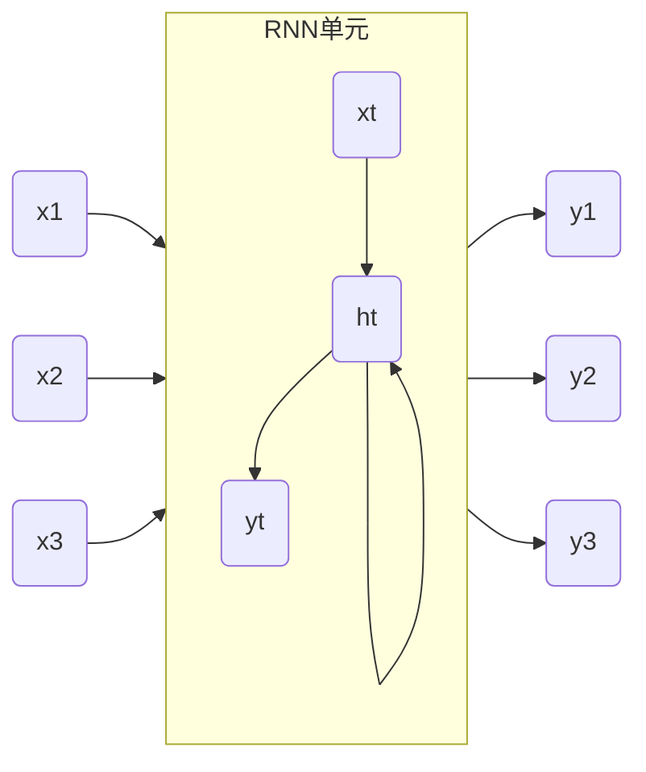
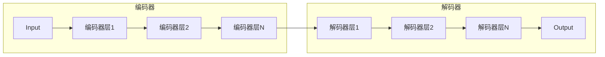

# AIGC从入门到实战：关于企业和组织

作者：禅与计算机程序设计艺术

## 1. 背景介绍

### 1.1 AIGC的兴起与发展

近年来，人工智能(AI)技术发展迅速，其中AIGC（Artificial Intelligence Generated Content，人工智能生成内容）作为AI领域的新兴分支，正逐渐走入大众视野。AIGC是指利用人工智能技术自动生成各种形式的内容，例如文本、图像、音频、视频等，其应用范围涵盖了新闻媒体、广告营销、娱乐游戏、教育培训等众多领域。

AIGC的兴起源于深度学习技术的突破性进展，特别是生成对抗网络(GAN)、变分自编码器(VAE)等深度生成模型的出现，使得机器能够从海量数据中学习并生成逼真、富有创意的内容。随着技术的不断进步和应用场景的不断拓展，AIGC正逐渐成为推动内容生产方式变革的重要力量。

### 1.2 AIGC对企业和组织的意义

AIGC的出现为企业和组织带来了前所未有的机遇和挑战。一方面，AIGC可以帮助企业和组织：

* **提升内容生产效率：** 自动化内容生成流程，降低人工成本，提高内容生产速度和规模。
* **丰富内容形式和类型：**  突破传统内容创作的局限，生成更具创意、更吸引人的内容。
* **个性化内容定制：**  根据用户需求和偏好，精准生成个性化内容，提升用户体验。

另一方面，AIGC也给企业和组织带来了一些挑战：

* **技术门槛高：** AIGC技术发展迅速，需要企业和组织投入大量资源进行技术研发和人才培养。
* **数据安全和隐私保护：** AIGC需要大量数据进行训练，如何保障数据安全和用户隐私是亟需解决的问题。
* **伦理和法律问题：** AIGC生成的内容可能存在版权归属、虚假信息等伦理和法律风险，需要制定相应的规范和标准。

## 2. 核心概念与联系

### 2.1 AIGC核心技术

AIGC的核心技术主要包括以下几个方面：

* **自然语言处理(NLP)：**  让机器理解和处理人类语言的技术，是文本生成、机器翻译、问答系统等AIGC应用的基础。
* **计算机视觉(CV)：**  让机器“看懂”图像和视频的技术，是图像生成、视频生成、目标识别等AIGC应用的基础。
* **深度学习(DL)：**  一种强大的机器学习方法，通过构建多层神经网络，让机器从海量数据中学习复杂的模式和规律，是AIGC技术的核心驱动力。
* **生成对抗网络(GAN)：**  一种深度学习模型，通过生成器和判别器之间的对抗训练，生成逼真的数据样本，被广泛应用于图像生成、视频生成等领域。

### 2.2 AIGC与其他相关概念的关系

AIGC与其他相关概念，如人工智能(AI)、机器学习(ML)、深度学习(DL)、元宇宙等，有着密切的联系：

* **AIGC是AI的一个分支：**  AIGC是人工智能技术在内容生成领域的具体应用。
* **AIGC依赖于ML和DL技术：**  AIGC的核心技术，如NLP、CV、GAN等，都属于机器学习和深度学习的范畴。
* **AIGC是元宇宙的重要组成部分：**  AIGC可以为元宇宙提供丰富的内容，例如虚拟场景、虚拟角色、虚拟物品等。

## 3. 核心算法原理具体操作步骤

本节以文本生成为例，介绍AIGC核心算法原理和具体操作步骤。

### 3.1 基于循环神经网络(RNN)的文本生成

#### 3.1.1 RNN原理

RNN是一种专门处理序列数据的深度学习模型，其结构如下图所示：



RNN的特点是每个时间步的隐藏状态ht都包含了之前所有时间步的信息，因此可以学习到序列数据中的长期依赖关系。

#### 3.1.2 文本生成步骤

基于RNN的文本生成步骤如下：

1. 数据预处理：对文本数据进行分词、编码等预处理操作。
2. 模型训练：使用预处理后的文本数据训练RNN模型，学习语言模型。
3. 文本生成：输入一个起始字符或单词，RNN模型根据学习到的语言模型，逐个字符或单词地生成文本，直到生成结束符为止。

### 3.2 基于Transformer的文本生成

#### 3.2.1 Transformer原理

Transformer是一种基于自注意力机制的深度学习模型，其结构如下图所示：



Transformer的特点是利用自注意力机制捕捉序列数据中的长期依赖关系，相比于RNN，Transformer的并行计算能力更强，训练速度更快。

#### 3.2.2 文本生成步骤

基于Transformer的文本生成步骤与RNN类似，只是将RNN模型替换为Transformer模型。

## 4. 数学模型和公式详细讲解举例说明

本节以基于RNN的文本生成为例，详细讲解其数学模型和公式。

### 4.1 RNN的数学模型

RNN的数学模型可以用以下公式表示：

$$
\begin{aligned}
h_t &= f(W_{xh}x_t + W_{hh}h_{t-1} + b_h) \\
y_t &= g(W_{hy}h_t + b_y)
\end{aligned}
$$

其中：

* $x_t$ 表示t时刻的输入向量
* $h_t$ 表示t时刻的隐藏状态向量
* $y_t$ 表示t时刻的输出向量
* $W_{xh}$ 表示输入到隐藏状态的权重矩阵
* $W_{hh}$ 表示隐藏状态到隐藏状态的权重矩阵
* $W_{hy}$ 表示隐藏状态到输出的权重矩阵
* $b_h$ 表示隐藏状态的偏置向量
* $b_y$ 表示输出的偏置向量
* $f$ 表示隐藏状态的激活函数，例如tanh函数
* $g$ 表示输出的激活函数，例如softmax函数

### 4.2 举例说明

假设我们要训练一个RNN模型，用于生成以“The cat sat on the”开头的文本。

1. 数据预处理：将文本数据转换为数字序列，例如：

```
The cat sat on the --> [1, 2, 3, 4, 5]
```

2. 模型训练：使用预处理后的数字序列训练RNN模型，学习语言模型。

3. 文本生成：输入起始字符序列“[1, 2, 3, 4, 5]”，RNN模型根据学习到的语言模型，预测下一个字符的概率分布，例如：

```
[1, 2, 3, 4, 5] --> [0.1, 0.2, 0.3, 0.4]
```

其中，概率最高的字符是“mat”，因此RNN模型会生成字符“mat”，并将“[1, 2, 3, 4, 5, 6]”作为下一个时间步的输入，继续生成文本，直到生成结束符为止。

## 5. 项目实践：代码实例和详细解释说明

### 5.1 基于Python和TensorFlow的文本生成

```python
import tensorflow as tf

# 定义RNN模型
model = tf.keras.Sequential([
    tf.keras.layers.Embedding(input_dim=vocab_size, output_dim=embedding_dim),
    tf.keras.layers.LSTM(units=rnn_units),
    tf.keras.layers.Dense(units=vocab_size, activation='softmax')
])

# 定义损失函数和优化器
loss_fn = tf.keras.losses.SparseCategoricalCrossentropy()
optimizer = tf.keras.optimizers.Adam()

# 训练模型
@tf.function
def