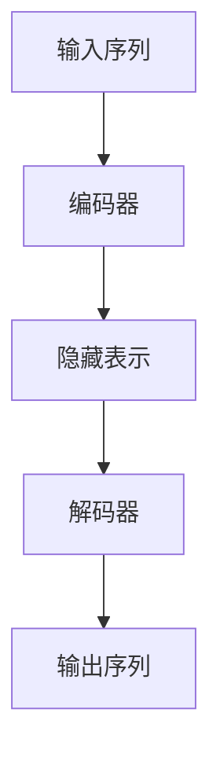

# AIGC从入门到实战：探秘：ChatGPT 到底是什么

作者：禅与计算机程序设计艺术

## 1.背景介绍

### 1.1 人工智能生成内容（AIGC）的崛起

在过去的几年中，人工智能生成内容（AIGC，Artificial Intelligence Generated Content）逐渐成为技术领域的热门话题。AIGC不仅改变了内容创作的方式，还在各个行业中展现出巨大的潜力。无论是文本生成、图像生成还是音频生成，AIGC都在不断突破技术的边界，为我们带来前所未有的创新体验。

### 1.2 ChatGPT 的诞生与发展

作为AIGC领域的重要一员，ChatGPT（Generative Pre-trained Transformer）由OpenAI开发，旨在通过自然语言处理技术生成高质量的文本内容。自其首次亮相以来，ChatGPT不断迭代更新，逐步提升了其生成文本的能力和准确性。ChatGPT不仅在学术界引起广泛关注，也在商业应用中展现出巨大的潜力。

### 1.3 本文目的与结构

本文旨在深入探讨ChatGPT的技术原理、核心算法、实际应用以及未来发展趋势。通过详细的技术分析和实战案例，帮助读者全面理解ChatGPT的工作机制，并提供实用的指导和资源，助力读者在AIGC领域取得更大的成就。

## 2.核心概念与联系

### 2.1 自然语言处理（NLP）

自然语言处理（NLP，Natural Language Processing）是人工智能的一个重要分支，主要研究如何使计算机理解、生成和处理人类语言。NLP涉及多个领域，包括语言学、计算机科学和人工智能。ChatGPT作为NLP的应用之一，通过深度学习技术实现了高效的语言生成。

### 2.2 生成对抗网络（GAN）

生成对抗网络（GAN，Generative Adversarial Network）是一种深度学习模型，由生成器和判别器两个网络组成。生成器负责生成数据，判别器则负责评估生成数据的真实性。虽然ChatGPT并不直接使用GAN，但GAN的生成思想对理解AIGC具有重要意义。

### 2.3 变换器模型（Transformer）

变换器模型（Transformer）是深度学习中的一种架构，广泛应用于NLP任务。Transformer通过自注意力机制（Self-Attention）实现了对序列数据的高效处理。ChatGPT正是基于Transformer架构，通过大规模预训练和微调，实现了高质量的文本生成。

### 2.4 预训练与微调

预训练与微调（Pre-training and Fine-tuning）是深度学习中的重要技术。预训练阶段，模型在大规模数据集上进行训练，学习通用的语言表示。微调阶段，模型在特定任务的数据集上进行训练，适应具体任务的需求。ChatGPT通过预训练和微调，能够生成符合上下文的高质量文本。

## 3.核心算法原理具体操作步骤

### 3.1 Transformer架构详解

Transformer架构由编码器（Encoder）和解码器（Decoder）组成。编码器负责将输入序列转换为隐藏表示，解码器则将隐藏表示转换为输出序列。Transformer通过自注意力机制和多头注意力机制，实现了对序列数据的高效处理。



### 3.2 自注意力机制

自注意力机制通过计算序列中每个位置与其他位置的相关性，捕捉序列中的长距离依赖关系。自注意力机制的核心是计算注意力权重（Attention Weights），公式如下：

$$
\text{Attention}(Q, K, V) = \text{softmax}\left(\frac{QK^T}{\sqrt{d_k}}\right)V
$$

其中，$Q$、$K$和$V$分别表示查询矩阵（Query）、键矩阵（Key）和值矩阵（Value），$d_k$表示键矩阵的维度。

### 3.3 多头注意力机制

多头注意力机制通过并行计算多个自注意力，增强模型的表达能力。每个头（Head）独立计算注意力，然后将结果拼接在一起，公式如下：

$$
\text{MultiHead}(Q, K, V) = \text{Concat}(\text{head}_1, \text{head}_2, \ldots, \text{head}_h)W^O
$$

其中，$\text{head}_i = \text{Attention}(QW_i^Q, KW_i^K, VW_i^V)$，$W_i^Q$、$W_i^K$、$W_i^V$和$W^O$为可训练参数。

### 3.4 位置编码

由于Transformer不具备序列位置信息，需要通过位置编码（Positional Encoding）引入位置信息。位置编码的公式如下：

$$
PE_{(pos, 2i)} = \sin\left(\frac{pos}{10000^{2i/d_{model}}}\right)
$$

$$
PE_{(pos, 2i+1)} = \cos\left(\frac{pos}{10000^{2i/d_{model}}}\right)
$$

其中，$pos$为位置，$i$为维度索引，$d_{model}$为模型维度。

## 4.数学模型和公式详细讲解举例说明

### 4.1 序列到序列模型

序列到序列模型（Seq2Seq）是NLP中的一种基本模型，用于将输入序列转换为输出序列。Seq2Seq模型通常由编码器和解码器组成，编码器将输入序列编码为隐藏表示，解码器将隐藏表示解码为输出序列。

### 4.2 语言模型

语言模型（Language Model）用于估计句子的概率。给定一个句子$w_1, w_2, \ldots, w_T$，语言模型的目标是计算该句子的联合概率：

$$
P(w_1, w_2, \ldots, w_T) = \prod_{t=1}^{T} P(w_t | w_1, w_2, \ldots, w_{t-1})
$$

其中，$P(w_t | w_1, w_2, \ldots, w_{t-1})$表示在上下文$w_1, w_2, \ldots, w_{t-1}$下生成$w_t$的条件概率。

### 4.3 GPT模型

GPT模型基于Transformer的解码器，通过自回归方式生成文本。GPT模型的目标是最大化生成文本的似然：

$$
L(\theta) = \sum_{t=1}^{T} \log P(w_t | w_1, w_2, \ldots, w_{t-1}; \theta)
$$

其中，$\theta$为模型参数。

## 4.项目实践：代码实例和详细解释说明

### 4.1 环境准备

在开始项目实践之前，我们需要准备开发环境。以下是所需的主要工具和库：

- Python 3.7+
- PyTorch
- Transformers（Hugging Face）
- Jupyter Notebook

### 4.2 数据预处理

在进行模型训练之前，我们需要对数据进行预处理。以下是一个简单的文本预处理示例：

```python
import re

def preprocess_text(text):
    # 转换为小写
    text = text.lower()
    # 移除特殊字符
    text = re.sub(r'[^a-zA-Z0-9\s]', '', text)
    # 移除多余的空格
    text = re.sub(r'\s+', ' ', text).strip()
    return text

sample_text = "Hello, World! This is a sample text."
processed_text = preprocess_text(sample_text)
print(processed_text)
```

### 4.3 模型训练

以下是使用Transformers库训练GPT模型的示例代码：

```python
from transformers import GPT2LMHeadModel, GPT2Tokenizer, Trainer, TrainingArguments

# 加载预训练模型和分词器
model_name = 'gpt2'
model = GPT2LMHeadModel.from_pretrained(model_name)
tokenizer = GPT2Tokenizer.from_pretrained(model_name)

# 数据集
texts = ["Hello, how are you?", "I am fine, thank you!"]
inputs = tokenizer(texts, return_tensors='pt', max_length=512, truncation=True, padding='max_length')

# 训练参数
training_args = TrainingArguments(
    output_dir='./results',
    num_train_epochs=1,
    per_device_train_batch_size=2,
    save_steps=10,
    save_total_limit=2,
)

# 训练
trainer = Trainer(
    model=model,
    args=training_args,
