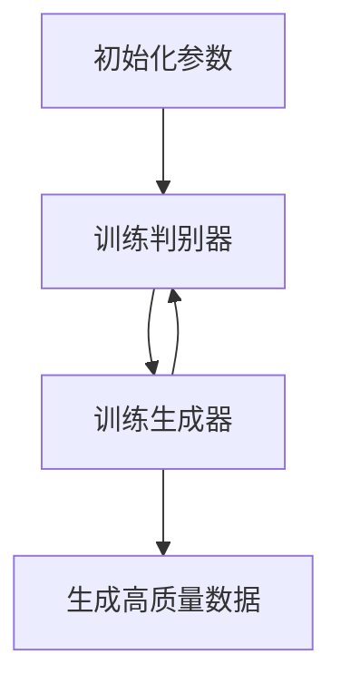
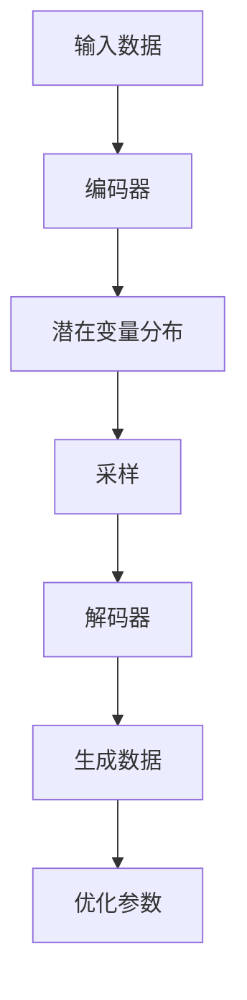
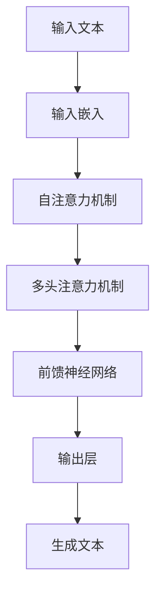

# AIGC原理与代码实例讲解

作者：禅与计算机程序设计艺术

## 1. 背景介绍

### 1.1 什么是AIGC

AIGC（Artificial Intelligence Generated Content）是指利用人工智能技术生成内容的过程。随着深度学习和自然语言处理技术的飞速发展，AIGC在文本生成、图像生成、音频生成等领域展现出了强大的能力。AIGC的应用不仅限于娱乐和创意产业，还在教育、医疗、金融等领域逐渐崭露头角。

### 1.2 AIGC的发展历程

AIGC的发展可以追溯到早期的专家系统和规则引擎。随着机器学习算法的进步，尤其是深度学习的兴起，AIGC技术进入了一个新的阶段。近年来，生成对抗网络（GANs）和变分自编码器（VAEs）等技术的应用，使AIGC在生成高质量内容方面取得了显著进展。

### 1.3 AIGC的重要性

AIGC的重要性体现在以下几个方面：

1. **自动化创作**：AIGC可以大大提高内容创作的效率，减少人工劳动。
2. **个性化服务**：通过AIGC技术，可以根据用户的需求和偏好生成个性化内容，提高用户体验。
3. **创新与创意**：AIGC可以激发新的创意和想法，推动文化和艺术的发展。

## 2. 核心概念与联系

### 2.1 生成对抗网络（GANs）

生成对抗网络（GANs）由Ian Goodfellow等人在2014年提出，是一种通过两个神经网络（生成器和判别器）相互对抗来生成数据的模型。生成器负责生成数据，而判别器负责区分生成数据和真实数据。通过不断的对抗训练，生成器能够生成越来越逼真的数据。

### 2.2 变分自编码器（VAEs）

变分自编码器（VAEs）是一种生成模型，通过学习数据的潜在分布来生成新的数据。VAEs由编码器和解码器组成，编码器将输入数据映射到潜在空间，解码器则从潜在空间生成数据。VAEs在生成高质量图像和文本方面表现出色。

### 2.3 自然语言处理（NLP）

自然语言处理（NLP）是AIGC的重要组成部分，涉及到文本的生成和理解。近年来，基于Transformer架构的模型（如GPT-3）在NLP领域取得了巨大成功，能够生成连贯且有意义的文本。

### 2.4 深度学习与神经网络

深度学习是AIGC的基础，涉及到多层神经网络的训练和优化。通过深度学习，AIGC能够从大量数据中学习复杂的模式和特征，从而生成高质量的内容。

## 3. 核心算法原理具体操作步骤

### 3.1 生成对抗网络（GANs）

#### 3.1.1 GAN的基本结构

GAN由生成器（Generator）和判别器（Discriminator）组成。生成器负责生成假数据，判别器负责区分真数据和假数据。GAN的训练过程如下：

1. **初始化参数**：随机初始化生成器和判别器的参数。
2. **训练判别器**：使用真实数据和生成器生成的假数据训练判别器，使其能够区分真数据和假数据。
3. **训练生成器**：使用判别器的反馈来训练生成器，使其生成的数据能够骗过判别器。
4. **重复步骤2和3**：不断迭代训练，直到生成器能够生成高质量的数据。

#### 3.1.2 GAN的训练过程



### 3.2 变分自编码器（VAEs）

#### 3.2.1 VAE的基本结构

VAE由编码器（Encoder）和解码器（Decoder）组成。编码器将输入数据映射到潜在空间，解码器则从潜在空间生成数据。VAE的训练过程如下：

1. **编码器**：将输入数据编码为潜在变量的分布。
2. **采样**：从潜在变量的分布中采样。
3. **解码器**：将采样的潜在变量解码为数据。
4. **优化**：通过最大化似然估计来优化编码器和解码器的参数。

#### 3.2.2 VAE的训练过程



### 3.3 自然语言处理（NLP）

#### 3.3.1 基于Transformer的模型

基于Transformer的模型（如GPT-3）在NLP领域表现出色。Transformer模型的基本结构包括自注意力机制和多头注意力机制。Transformer的训练过程如下：

1. **输入嵌入**：将输入文本转换为嵌入向量。
2. **自注意力机制**：计算输入向量之间的注意力权重。
3. **多头注意力机制**：通过多个注意力头来捕捉不同的特征。
4. **前馈神经网络**：通过前馈神经网络进行非线性变换。
5. **输出层**：生成输出文本。

#### 3.3.2 Transformer的训练过程



## 4. 数学模型和公式详细讲解举例说明

### 4.1 生成对抗网络（GANs）

GAN的目标是通过生成器 $G$ 和判别器 $D$ 之间的对抗训练，使生成器生成的数据尽可能接近真实数据。GAN的损失函数如下：

$$
\min_G \max_D V(D, G) = \mathbb{E}_{x \sim p_{data}(x)}[\log D(x)] + \mathbb{E}_{z \sim p_z(z)}[\log(1 - D(G(z)))]
$$

其中，$p_{data}(x)$ 是真实数据的分布，$p_z(z)$ 是生成器的输入噪声分布。

### 4.2 变分自编码器（VAEs）

VAE的目标是通过最大化似然估计来优化编码器和解码器的参数。VAE的损失函数包括重构误差和KL散度：

$$
L = \mathbb{E}_{q(z|x)}[\log p(x|z)] - D_{KL}(q(z|x) \| p(z))
$$

其中，$q(z|x)$ 是编码器的输出分布，$p(x|z)$ 是解码器的输出分布，$D_{KL}$ 是KL散度。

### 4.3 自然语言处理（NLP）

基于Transformer的模型使用自注意力机制来计算输入向量之间的注意力权重。自注意力机制的计算公式如下：

$$
\text{Attention}(Q, K, V) = \text{softmax}\left(\frac{QK^T}{\sqrt{d_k}}\right)V
$$

其中，$Q$ 是查询向量，$K$ 是键向量，$V$ 是值向量，$d_k$ 是键向量的维度。

## 5. 项目实践：代码实例和详细解释说明

### 5.1 生成对抗网络（GANs）

以下是一个简单的GAN实现，用于生成手写数字图像（MNIST数据集）：

```python
import tensorflow as tf
from tensorflow.keras.layers import Dense, Flatten, Reshape, LeakyReLU
from tensorflow.keras.models import Sequential

# 生成器模型
def build_generator():
    model = Sequential([
        Dense(256, input_dim=100),
        LeakyReLU(alpha=0.2),
        Dense(512),
        LeakyReLU(alpha=0.2),
        Dense(1024),
        LeakyReLU(alpha=0.2),
        Dense(28 * 28 * 1, activation='tanh'),
        Reshape((28, 28, 1))
    ])
    return model

# 判别器模型
def build_discriminator():
    model = Sequential([
        Flatten(input_shape=(28, 28, 1)),
        Dense(512),
        LeakyReLU(alpha=0.2),
