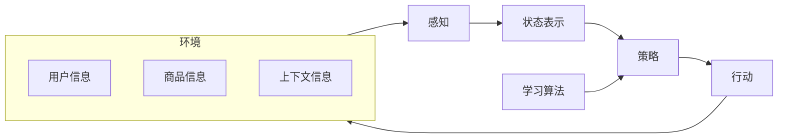

# AI人工智能 Agent：在个性化推荐中的应用

作者：禅与计算机程序设计艺术

## 1. 背景介绍

### 1.1 个性化推荐的兴起与挑战

互联网时代，信息爆炸式增长，用户面临着海量信息的冲击，如何从海量信息中找到自己真正感兴趣的内容成为一大难题。个性化推荐系统应运而生，它能够根据用户的历史行为、兴趣偏好等信息，为用户推荐其可能感兴趣的内容，极大地提升了用户体验和平台价值。

传统的推荐算法，如协同过滤、矩阵分解等，在一定程度上能够满足用户的个性化需求。然而，随着用户规模的扩大和信息复杂度的提升，传统推荐算法面临着以下挑战：

* **数据稀疏性问题:**  新用户或冷启动商品缺乏足够的历史行为数据，难以进行准确的推荐。
* **冷启动问题:**  新上线的商品或服务缺乏用户交互数据，难以被推荐给潜在用户。
* **可解释性问题:**  传统推荐算法大多是黑盒模型，难以解释推荐结果背后的原因，不利于用户理解和信任。
* **动态变化问题:**  用户的兴趣偏好是动态变化的，传统的静态推荐模型难以捕捉这种变化，导致推荐结果的时效性较差。

### 1.2 AI Agent 的优势与潜力

AI Agent，也称为智能体，是一种能够感知环境、进行决策和执行动作的自主实体。近年来，随着人工智能技术的快速发展，AI Agent 在个性化推荐领域展现出巨大的优势和潜力：

* **自主学习能力:**  AI Agent 能够通过与环境交互，不断学习用户的兴趣偏好，并根据用户的反馈调整推荐策略，从而解决数据稀疏性和动态变化问题。
* **个性化建模能力:**  AI Agent 可以为每个用户建立独立的兴趣模型，并根据用户的实时行为和上下文信息进行个性化的推荐，提高推荐结果的精准度和用户满意度。
* **可解释性:**  AI Agent 的决策过程更加透明，可以向用户解释推荐结果背后的原因，增强用户对推荐系统的信任感。
* **自适应性:**  AI Agent 能够根据环境的变化自动调整自身的策略，适应不同的应用场景和用户需求。

## 2. 核心概念与联系

### 2.1 AI Agent 的基本要素

一个典型的 AI Agent 系统通常包含以下几个核心要素：

* **环境（Environment）：** Agent 所处的外部环境，包括用户信息、商品信息、上下文信息等。
* **感知（Perception）：** Agent 通过传感器感知环境信息，例如用户的点击、浏览、购买等行为数据。
* **状态表示（State Representation）：** Agent 将感知到的环境信息转化为内部状态表示，用于决策和学习。
* **策略（Policy）：**  根据当前状态，决定下一步采取何种行动的规则或函数。
* **学习算法（Learning Algorithm）：**  根据环境的反馈，更新 Agent 的策略，使其能够更好地适应环境。

### 2.2 AI Agent 与推荐系统的结合

在个性化推荐系统中，AI Agent 可以扮演不同的角色，例如：

* **推荐代理（Recommender Agent）：** 负责为用户推荐商品或服务，其目标是最大化用户的点击率、转化率等指标。
* **用户代理（User Agent）：**  模拟用户的行为，与推荐代理进行交互，帮助推荐代理更好地学习用户的兴趣偏好。
* **评论代理（Critic Agent）：**  评估推荐结果的质量，并向推荐代理提供反馈，帮助其改进推荐策略。

### 2.3 核心概念之间的联系

下图展示了 AI Agent 在个性化推荐系统中的应用框架，以及各个核心概念之间的联系：



## 3. 核心算法原理具体操作步骤

### 3.1 强化学习：让 Agent 在交互中学习

强化学习是一种机器学习方法，它可以让 Agent 通过与环境进行交互来学习最优策略。在个性化推荐系统中，我们可以将推荐过程建模为一个强化学习问题：

* **环境：** 用户、商品、上下文信息等构成了环境。
* **状态：** 用户的历史行为、当前浏览的商品等信息可以作为 Agent 的状态。
* **动作：** Agent 的动作是推荐商品给用户。
* **奖励：**  用户的点击、购买等行为可以作为 Agent 的奖励。

基于强化学习的推荐算法的基本流程如下：

1.  **初始化：**  初始化 Agent 的策略，例如随机推荐商品。
2.  **交互：**  Agent 根据当前策略推荐商品给用户，并观察用户的反馈。
3.  **学习：**  Agent 根据用户的反馈更新策略，例如增加推荐用户喜欢商品的概率。
4.  **重复步骤 2 和 3，直到 Agent 的策略收敛。**

### 3.2 深度强化学习：提升 Agent 的学习效率

深度强化学习是强化学习与深度学习的结合，它利用深度神经网络来逼近 Agent 的策略或价值函数，从而提升 Agent 的学习效率和泛化能力。

常用的深度强化学习算法包括：

* **深度 Q 网络（DQN）：** 利用深度神经网络来逼近 Q 函数，用于评估不同动作的价值。
* **策略梯度算法（Policy Gradient）：**  直接优化 Agent 的策略，使其能够最大化累积奖励。
* **演员-评论家算法（Actor-Critic）：**  结合了 DQN 和策略梯度算法的优点，利用 Actor 网络生成策略，Critic 网络评估策略的价值。

### 3.3  具体操作步骤：以 DQN 为例

以 DQN 为例，介绍 AI Agent 在个性化推荐中的具体操作步骤：

1.  **数据准备：**  收集用户的历史行为数据，例如用户 ID、商品 ID、点击时间、购买时间等。
2.  **特征工程：**  对原始数据进行预处理，例如用户画像、商品 embedding 等。
3.  **模型构建：**  构建 DQN 模型，包括输入层、隐藏层、输出层等。
4.  **训练模型：**  使用历史数据训练 DQN 模型，例如使用随机梯度下降算法更新模型参数。
5.  **在线推荐：**  将训练好的 DQN 模型部署到线上，根据用户的实时行为推荐商品。
6.  **模型更新：**  收集用户的在线反馈数据，例如点击率、转化率等，并使用这些数据更新 DQN 模型，使其能够更好地适应用户的动态变化。

## 4. 数学模型和公式详细讲解举例说明

### 4.1 马尔可夫决策过程（MDP）

马尔可夫决策过程（Markov Decision Process, MDP）是强化学习的基础理论框架，它可以用来描述 Agent 与环境交互的过程。

一个 MDP 通常包含以下几个要素：

*   状态空间 $S$：所有可能的状态的集合。
*   动作空间 $A$：所有可能的动作的集合。
*   状态转移概率 $P(s'|s, a)$：在状态 $s$ 下采取动作 $a$ 后，转移到状态 $s'$ 的概率。
*   奖励函数 $R(s, a)$：在状态 $s$ 下采取动作 $a$ 后，获得的奖励。
*   折扣因子 $\gamma$：用于平衡当前奖励和未来奖励的重要性。

### 4.2  Q-learning 算法

Q-learning 是一种常用的强化学习算法，它可以用来学习状态-动作值函数（Q 函数）。Q 函数表示在状态 $s$ 下采取动作 $a$ 的长期累积奖励的期望值。

Q-learning 算法的基本思想是：不断迭代更新 Q 函数，使其逐渐逼近最优 Q 函数。Q 函数的更新公式如下：

$$
Q(s, a) \leftarrow Q(s, a) + \alpha [R(s, a) + \gamma \max_{a'} Q(s', a') - Q(s, a)]
$$

其中：

* $\alpha$ 是学习率，控制每次更新的幅度。
* $\gamma$ 是折扣因子，用于平衡当前奖励和未来奖励的重要性。
* $s'$ 是状态 $s$ 下采取动作 $a$ 后转移到的下一个状态。
* $\max_{a'} Q(s', a')$ 是在状态 $s'$ 下所有可能动作中，Q 值最大的动作对应的 Q 值。

### 4.3  举例说明

假设有一个推荐系统，用户可以对推荐的商品进行点击或不点击操作。我们可以将这个推荐系统建模为一个 MDP：

*  **状态空间：**  用户的历史行为序列，例如 [商品 1，点击，商品 2，不点击]。
*  **动作空间：**  推荐不同的商品给用户，例如商品 3、商品 4 等。
*  **状态转移概率：**  用户点击或不点击某个商品后，状态会发生转移。
*  **奖励函数：**  用户点击商品，奖励为 1；用户不点击商品，奖励为 0。

我们可以使用 Q-learning 算法来学习一个推荐策略。例如，初始时，Q 函数的所有值都为 0。假设 Agent 在状态 [商品 1，点击] 下推荐了商品 3，用户点击了商品 3。那么，Q 函数的值会更新为：

$$
Q([商品 1，点击], 商品 3) \leftarrow 0 + \alpha [1 + \gamma \max_{a'} Q([商品 1，点击，商品 3], a') - 0]
$$

其中，$\max_{a'} Q([商品 1，点击，商品 3], a')$ 是在状态 [商品 1，点击，商品 3] 下所有可能动作中，Q 值最大的动作对应的 Q 值。由于初始时 Q 函数的所有值都为 0，因此 $\max_{a'} Q([商品 1，点击，商品 3], a') = 0$。假设 $\alpha = 0.1$，$\gamma = 0.9$，那么：

$$
Q([商品 1，点击], 商品 3) \leftarrow 0 + 0.1 \times [1 + 0.9 \times 0 - 0] = 0.1
$$

这意味着，在状态 [商品 1，点击] 下推荐商品 3 的长期累积奖励的期望值为 0.1。

## 5. 项目实践：代码实例和详细解释说明

### 5.1  构建基于 DQN 的电影推荐系统

```python
import random

import gym
import numpy as np
from tensorflow import keras


class ReplayMemory:
    def __init__(self, capacity):
        self.capacity = capacity
        self.memory = []
        self.position = 0

    def push(self, state, action, reward, next_state, done):
        if len(self.memory) < self.capacity:
            self.memory.append(None)
        self.memory[self.position] = (state, action, reward, next_state, done)
        self.position = (self.position + 1) % self.capacity

    def sample(self, batch_size):
        return random.sample(self.memory, batch_size)

    def __len__(self):
        return len(self.memory)


class DQN:
    def __init__(self, state_size, action_size):
        self.state_size = state_size
        self.action_size = action_size
        self.memory = ReplayMemory(10000)
        self.gamma = 0.95
        self.epsilon = 1.0
        self.epsilon_min = 0.01
        self.epsilon_decay = 0.995
        self.learning_rate = 0.001
        self.model = self._build_model()

    def _build_model(self):
        model = keras.Sequential(
            [
                keras.layers.Dense(24, activation="relu", input_shape=(self.state_size,)),
                keras.layers.Dense(24, activation="relu"),
                keras.layers.Dense(self.action_size, activation="linear"),
            ]
        )
        model.compile(loss="mse", optimizer=keras.optimizers.Adam(lr=self.learning_rate))
        return model

    def remember(self, state, action, reward, next_state, done):
        self.memory.push(state, action, reward, next_state, done)

    def act(self, state):
        if np.random.random() <= self.epsilon:
            return random.randrange(self.action_size)
        act_values = self.model.predict(state)
        return np.argmax(act_values[0])

    def replay(self, batch_size):
        minibatch = self.memory.sample(batch_size)
        for state, action, reward, next_state, done in minibatch:
            target = reward
            if not done:
                target = reward + self.gamma * np.amax(self.model.predict(next_state)[0])
            target_f = self.model.predict