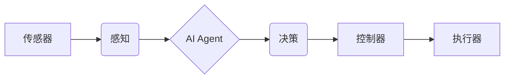

# AI人工智能 Agent：在无人驾驶中的应用

作者：禅与计算机程序设计艺术

## 1. 背景介绍

### 1.1 无人驾驶技术的发展历程

无人驾驶技术，作为人工智能和自动化领域的尖端科技，近年来取得了显著的进步。从20世纪70年代的第一辆自动驾驶汽车诞生，到21世纪初谷歌、特斯拉等科技巨头的大力投入，无人驾驶技术经历了从实验室走向现实应用的巨大飞跃。

### 1.2  AI Agent在无人驾驶中的重要性

在无人驾驶系统中，AI Agent扮演着至关重要的角色。它们是能够感知环境、做出决策并执行动作的智能体，负责处理复杂的驾驶任务，例如路径规划、障碍物避障、交通信号识别和决策控制等。AI Agent的引入，使得无人驾驶汽车能够更加智能、安全、高效地行驶。

### 1.3 本文的研究目的和意义

本文旨在深入探讨AI Agent在无人驾驶技术中的应用，分析其核心概念、算法原理、实践方法以及未来发展趋势。通过对AI Agent的全面解析，帮助读者更好地理解无人驾驶技术的本质，并为相关领域的研发人员提供参考和借鉴。

## 2. 核心概念与联系

### 2.1 AI Agent的定义和特征

AI Agent，全称为人工智能代理，是指能够感知环境、进行决策并执行动作的智能体。它们通常具有以下特征：

* **自主性:** AI Agent能够独立地感知环境、做出决策并执行动作，无需人工干预。
* **目标导向性:** AI Agent的行为由预先设定的目标驱动，并通过不断学习和优化来实现目标。
* **适应性:** AI Agent能够根据环境的变化动态调整自身的行为，以适应不同的驾驶场景。
* **学习能力:** AI Agent能够从经验中学习，不断提升自身的驾驶技能。

### 2.2  AI Agent与无人驾驶系统的关系

在无人驾驶系统中，AI Agent是实现智能驾驶的核心模块。它们通过与传感器、控制器、执行器等其他模块的协同工作，完成感知、决策、控制等一系列驾驶任务。

下图展示了AI Agent在无人驾驶系统中的典型架构：

**图1. AI Agent在无人驾驶系统中的典型架构**

* **传感器:** 用于感知周围环境，例如摄像头、激光雷达、毫米波雷达等。
* **感知:** 对传感器数据进行处理，提取环境信息，例如物体识别、定位、跟踪等。
* **AI Agent:** 根据感知到的环境信息，做出驾驶决策，例如路径规划、速度控制、转向控制等。
* **决策:** 将AI Agent的决策结果转化为具体的控制指令。
* **控制器:** 将控制指令发送给执行器。
* **执行器:** 执行控制指令，例如转向、加速、制动等。

### 2.3  常见的AI Agent类型

常见的AI Agent类型包括：

* **基于规则的Agent:** 根据预先设定的规则进行决策，例如交通规则、驾驶规范等。
* **反应式Agent:** 根据当前的环境状态做出即时反应，例如避障、超车等。
* ** deliberative Agent:** 能够进行规划和推理，预测未来的环境状态并制定行动计划，例如路径规划、导航等。
* **学习型Agent:** 能够从经验中学习，不断提升自身的驾驶技能，例如强化学习、模仿学习等。

## 3. 核心算法原理具体操作步骤

### 3.1 感知算法

感知算法是AI Agent获取环境信息的关键技术，其主要任务是将传感器数据转化为可被理解和利用的信息。常见的感知算法包括：

* **计算机视觉:** 利用摄像头图像进行目标检测、识别、跟踪等，例如YOLO、Faster R-CNN等。
* **激光雷达点云处理:** 利用激光雷达点云数据进行环境建模、定位、避障等，例如SLAM、ICP等。
* **传感器融合:** 将来自多个传感器的的信息进行融合，提高感知的准确性和鲁棒性，例如卡尔曼滤波、粒子滤波等。

#### 3.1.1  计算机视觉

计算机视觉技术在无人驾驶中主要用于识别道路、交通标志、车辆、行人等目标。其基本原理是利用深度学习模型对图像进行特征提取和分类。

以目标检测为例，其具体操作步骤如下：

1. **图像预处理:** 对原始图像进行去噪、增强等处理，提高图像质量。
2. **特征提取:** 利用卷积神经网络(CNN)对图像进行特征提取，例如VGG、ResNet等。
3. **目标分类:** 利用分类器对提取的特征进行分类，例如SVM、Softmax等。
4. **目标定位:** 利用回归模型对目标进行定位，例如边界框回归。

#### 3.1.2 激光雷达点云处理

激光雷达点云处理技术主要用于构建环境地图、定位车辆、识别障碍物等。其基本原理是利用点云数据进行三维空间建模和分析。

以SLAM(Simultaneous Localization and Mapping)为例，其具体操作步骤如下：

1. **点云配准:** 将不同时刻、不同视角的点云数据进行匹配，消除由于车辆运动带来的误差。
2. **闭环检测:** 检测车辆是否回到了之前访问过的位置，消除累积误差。
3. **地图构建:** 根据配准后的点云数据构建环境地图，例如占据栅格地图、点云地图等。
4. **定位:** 根据地图和当前的点云数据估计车辆的位姿。

#### 3.1.3 传感器融合

传感器融合技术可以将来自多个传感器的的信息进行融合，提高感知的准确性和鲁棒性。例如，将摄像头和激光雷达的信息融合，可以弥补单一传感器在某些场景下的不足，例如光线昏暗、雨雪天气等。

常见的传感器融合算法包括：

* **卡尔曼滤波:**  一种基于概率论的线性滤波算法，可以用于融合不同传感器的数据，估计系统的状态。
* **粒子滤波:** 一种基于蒙特卡洛方法的非线性滤波算法，可以用于处理非线性、非高斯系统。

### 3.2 决策算法

决策算法是AI Agent根据感知到的环境信息做出驾驶决策的关键技术。常见的决策算法包括：

* **基于规则的决策:** 根据预先设定的规则进行决策，例如交通规则、驾驶规范等。
* **有限状态机(FSM):**  将驾驶任务分解成有限个状态，并定义状态之间的转换规则，例如起步、加速、巡航、减速、停车等。
* **决策树:**  利用树形结构对决策过程进行建模，每个节点代表一个决策条件，每个分支代表一个决策结果。
* **马尔可夫决策过程(MDP):**  将决策过程建模为一个马尔可夫过程，通过求解最优策略来实现最优决策。
* **强化学习:**  让AI Agent通过与环境交互学习最优决策策略，例如Q-learning、SARSA、DQN等。

#### 3.2.1 基于规则的决策

基于规则的决策是最简单的一种决策方法，其基本原理是根据预先设定的规则进行决策。例如，当交通信号灯为红色时，车辆应该停车；当检测到前方有障碍物时，车辆应该避障。

#### 3.2.2 有限状态机(FSM)

有限状态机(FSM)是一种常用的决策方法，其基本原理是将驾驶任务分解成有限个状态，并定义状态之间的转换规则。例如，车辆的驾驶状态可以分为起步、加速、巡航、减速、停车等。

#### 3.2.3 决策树

决策树是一种常用的分类和回归方法，其基本原理是利用树形结构对决策过程进行建模。每个节点代表一个决策条件，每个分支代表一个决策结果。

#### 3.2.4 马尔可夫决策过程(MDP)

马尔可夫决策过程(MDP)是一种常用的序列决策模型，其基本原理是将决策过程建模为一个马尔可夫过程。

#### 3.2.5 强化学习

强化学习是一种机器学习方法，其基本原理是让AI Agent通过与环境交互学习最优决策策略。

## 4. 数学模型和公式详细讲解举例说明

### 4.1  卡尔曼滤波

卡尔曼滤波是一种常用的状态估计方法，其基本思想是利用系统的状态方程和观测方程，对系统的状态进行递推估计。

**状态方程:**

$$
x_k = F_k x_{k-1} + B_k u_k +