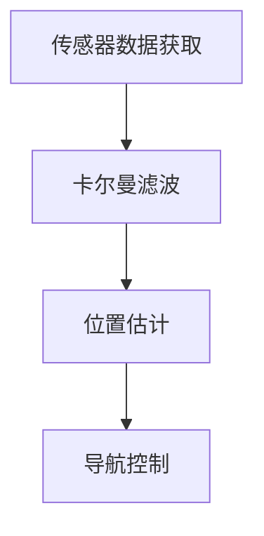
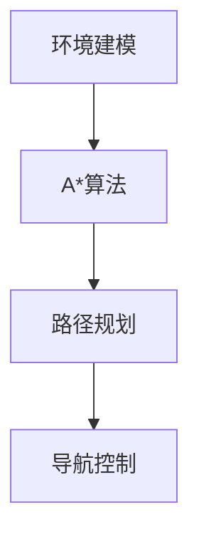
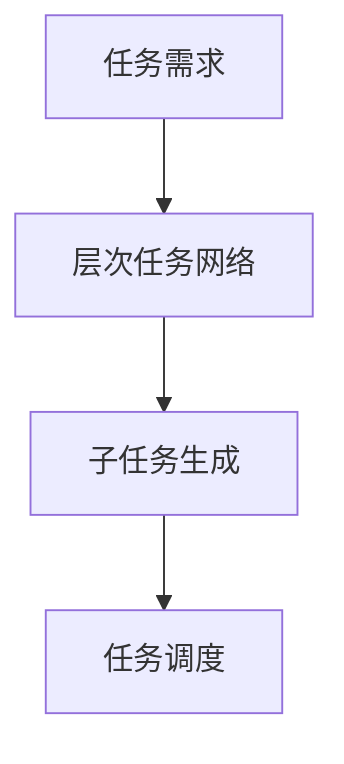
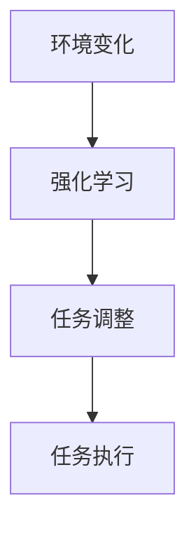
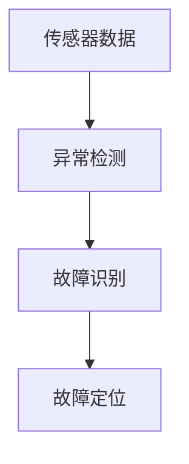
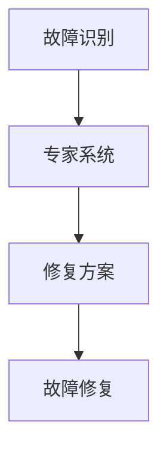
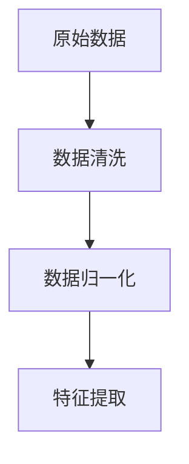
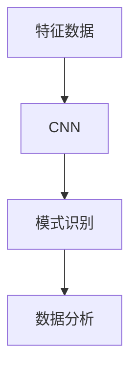

# AI人工智能 Agent：在航天领域中的应用

## 1. 背景介绍

### 1.1 航天领域的复杂性与挑战
航天领域是一个高度复杂和技术密集的领域，涉及到物理学、材料科学、计算机科学等多个学科。航天任务通常包括卫星发射、空间站维护、深空探测等，这些任务需要高精度和高可靠性的技术支持。传统的航天技术已经取得了显著的成就，但随着任务复杂性的增加，传统方法面临着越来越多的挑战。

### 1.2 人工智能的兴起
随着人工智能技术的快速发展，AI在各个领域的应用越来越广泛。人工智能Agent，作为AI技术的一个重要分支，具有自主学习、自主决策和自我优化的能力。AI Agent在处理复杂任务、实时决策和高效资源管理方面表现出了巨大的潜力。

### 1.3 航天领域对AI Agent的需求
航天任务的复杂性和不确定性使得人工智能Agent成为解决这些问题的理想工具。AI Agent可以在航天器导航、任务规划、故障诊断和修复等方面发挥重要作用，提高任务成功率和效率，降低成本和风险。

## 2. 核心概念与联系

### 2.1 人工智能Agent的定义
人工智能Agent是一种能够感知环境并采取行动以实现特定目标的自主系统。它们可以通过传感器获取环境信息，通过执行器进行操作，并通过学习和推理不断优化其行为。

### 2.2 航天任务中的关键任务
航天任务通常包括以下几个关键任务：
- **导航与控制**：确保航天器按照预定轨迹飞行。
- **任务规划**：制定和调整任务计划，以应对变化的任务需求和环境条件。
- **故障诊断与修复**：及时发现和修复航天器故障，确保任务的连续性和安全性。
- **数据处理与分析**：处理和分析从航天器传回的海量数据，为科学研究和决策提供支持。

### 2.3 人工智能Agent在航天任务中的角色
人工智能Agent可以在航天任务中扮演多个角色，包括但不限于：
- **自主导航系统**：通过实时分析传感器数据，调整航天器的飞行路径。
- **任务规划助手**：根据任务需求和环境变化，动态调整任务计划。
- **故障诊断专家**：通过机器学习算法，快速识别和定位故障，并提出修复方案。
- **数据分析师**：利用深度学习和大数据技术，对航天数据进行深入分析，提供有价值的科学发现。

## 3. 核心算法原理具体操作步骤

### 3.1 自主导航与控制算法

#### 3.1.1 传感器数据融合
传感器数据融合是自主导航系统的基础，通过融合多种传感器数据（如GPS、惯性测量单元、星敏感器等），提高航天器的定位精度。常用的融合算法包括卡尔曼滤波和粒子滤波。

#### 3.1.2 路径规划算法
路径规划算法用于计算航天器的最优飞行路径，常用的方法包括A*算法、Dijkstra算法和快速探索随机树（RRT）算法。

### 3.2 任务规划算法

#### 3.2.1 任务分解与调度
任务规划的核心是将复杂任务分解为若干子任务，并合理调度这些子任务。常用的方法包括层次任务网络（HTN）和遗传算法。

#### 3.2.2 动态调整与优化
任务规划需要根据环境变化和任务进展进行动态调整，常用的方法包括强化学习和蒙特卡罗树搜索（MCTS）。

### 3.3 故障诊断与修复算法

#### 3.3.1 故障检测
故障检测是故障诊断的第一步，通过分析传感器数据和系统日志，识别异常情况。常用的方法包括异常检测、时间序列分析和贝叶斯网络。

#### 3.3.2 故障修复
故障修复需要根据故障类型和位置，制定相应的修复方案。常用的方法包括专家系统和强化学习。

### 3.4 数据处理与分析算法

#### 3.4.1 数据预处理
数据预处理是数据分析的基础，包括数据清洗、数据归一化和特征提取。常用的方法包括主成分分析（PCA）和独立成分分析（ICA）。

#### 3.4.2 数据分析与挖掘
数据分析与挖掘通过机器学习和深度学习算法，从海量数据中提取有价值的信息。常用的方法包括卷积神经网络（CNN）和长短期记忆网络（LSTM）。

## 4. 数学模型和公式详细讲解举例说明

### 4.1 卡尔曼滤波算法
卡尔曼滤波是一种用于线性动态系统状态估计的递归算法，广泛应用于导航与控制中。其核心思想是通过估计和更新两个步骤，不断优化系统状态的估计值。

#### 4.1.1 状态估计
状态估计的数学模型为：

$$
\hat{x}_{k|k-1} = F_k \hat{x}_{k-1|k-1} + B_k u_k
$$

其中，$\hat{x}_{k|k-1}$ 是时刻 $k$ 的先验状态估计，$F_k$ 是状态转移矩阵，$B_k$ 是控制输入矩阵，$u_k$ 是控制输入。

#### 4.1.2 估计更新
估计更新的数学模型为：

$$
\hat{x}_{k|k} = \hat{x}_{k|k-1} + K_k (z_k - H_k \hat{x}_{k|k-1})
$$

其中，$\hat{x}_{k|k}$ 是时刻 $k$ 的后验状态估计，$K_k$ 是卡尔曼增益，$z_k$ 是测量值，$H_k$ 是测量矩阵。

#### 4.1.3 卡尔曼增益计算
卡尔曼增益的计算公式为：

$$
K_k = P_{k|k-1} H_k^T (H_k P_{k|k-1} H_k^T + R_k)^{-1}
$$

其中，$P_{k|k-1}$ 是先验估计协方差，$R_k$ 是测量噪声协方差。

### 4.2 强化学习算法
强化学习是一种通过与环境交互来学习最优策略的机器学习方法，广泛应用于任务规划和故障修复中。

#### 4.2.1 马尔可夫决策过程
强化学习的数学模型通常采用马尔可夫决策过程（MDP），其定义为一个五元组 $(S, A, P, R, \gamma)$：

- $S$：状态空间
- $A$：动作空间
- $P$：状态转移概率
- $R$：奖励函数
- $\gamma$：折扣因子

#### 4.2.2 Q学习算法
Q学习是一种常用的强化学习算法，其核心是通过更新Q值来逼近最优策略。Q值的更新公式为：

$$
Q(s, a) \leftarrow Q(s, a) + \alpha [