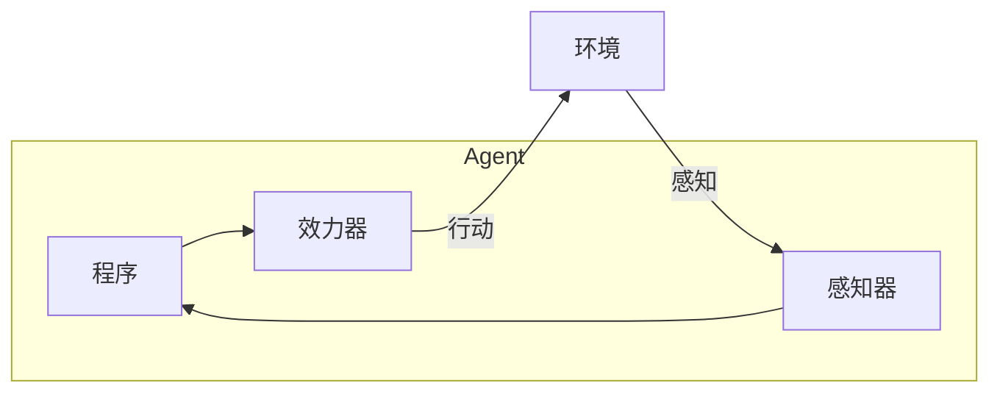
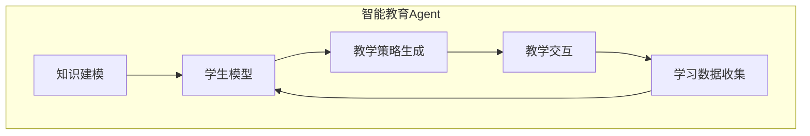

# AI人工智能 Agent：对教育的影响

## 1. 背景介绍

### 1.1 教育领域的挑战

教育是一个关乎国家未来的重要领域,但长期以来,教育领域一直面临着诸多挑战:

- **教学资源分配不均**:城乡之间、地区之间教育资源差距明显,优质教育资源向大城市和发达地区集中。
- **师资力量不足**:许多地区缺乏高质量的教师,特别是在一些薄弱学科,教师的授课水平参差不齐。
- **课堂互动性低**:传统课堂教学模式单一,师生互动较少,难以激发学生的学习兴趣和主动性。
- **个性化教学缺失**:由于学生基础知识存在差异,采用同一教学方案无法满足不同学生的个性化需求。

### 1.2 人工智能在教育中的应用前景

随着人工智能技术的不断发展,人工智能在教育领域的应用前景广阔。智能教育Agent作为人工智能在教育领域的重要应用,具有望解决传统教育面临的诸多困难,为教育领域带来全新的变革。

## 2. 核心概念与联系

### 2.1 人工智能Agent

人工智能Agent是一种具有自主性、反应性、主动性和持续时间概念的软件实体。它能够感知环境,持续时间地根据感知进行思考,并在环境中采取行动以实现预定目标。

人工智能Agent通常由以下几个核心组件组成:

- **感知器(Sensors)**:感知环境状态的输入设备。
- **效力器(Actuators)**:对环境产生影响的输出设备。
- **程序(Program)**:根据感知信息做出决策并指挥效力器的核心算法。

Agent与环境之间通过感知器和效力器进行交互,如下图所示:



### 2.2 智能教育Agent

智能教育Agent是指将人工智能Agent应用于教育领域,旨在提供智能化、个性化的教育服务。它能够:

- 感知学生的学习状态、知识掌握程度等信息
- 分析学生的学习数据,制定个性化教学方案
- 通过自然语言交互、虚拟实境等形式开展教学
- 根据学生的反馈自主调整教学策略

智能教育Agent的引入,能够极大地提高教育的质量和效率,促进因材施教、个性化学习的实现。

## 3. 核心算法原理具体操作步骤  

智能教育Agent的核心是"程序"模块,它包含了感知学习状态、分析数据、制定教学策略和实施教学的算法。下面我们详细介绍其工作原理和算法流程。

### 3.1 知识建模

知识建模是构建智能教育Agent的基础,需要将教学知识以计算机可识别的形式表示出来。常用的知识表示方法有:

- **本体(Ontology)**:使用概念、实体、属性和关系等形式化描述知识领域。
- **语义网络**:以节点(概念)和边(关系)的网络形式表示知识。
- **生成式规则**:使用IF-THEN形式的规则表示知识。

这些方法可以很好地对结构化知识进行建模,但对于非结构化知识(如文本)的表示仍有一定困难。

### 3.2 学生模型

为了实现个性化教学,智能教育Agent需要建立每个学生的模型,描述其知识掌握程度、学习风格、认知能力等特征。常用的学生模型包括:

- **知识追踪模型**:通过贝叶斯知识追踪、表现因子分析等方法估计学生对每个知识点的掌握水平。
- **认知诊断模型**:基于多维项目反应理论等方法,诊断学生在不同认知技能上的表现。
- **学习风格模型**:通过分析学生的学习行为数据,确定其偏好的学习方式(视觉、听觉等)。

这些模型需要持续更新,以反映学生的学习进展情况。

### 3.3 教学策略生成

基于知识模型和学生模型,智能教育Agent可以为每个学生生成个性化的教学策略,包括:

- **课程路径规划**:确定学习内容的呈现顺序和难度渐进。
- **教学方式选择**:根据学习风格为学生选择合适的教学方式(视频、游戏、实践等)。
- **练习设计**:设计恰当的练习题目,针对学生的薄弱知识点进行加强训练。
- **反馈调整**:根据学生的学习效果,动态调整教学策略。

这个过程可以建模为马尔可夫决策过程,使用强化学习等技术求解最优策略。

### 3.4 教学交互

智能教育Agent通过多模态交互界面(自然语言对话、虚拟现实等)与学生进行教学互动,实现教学策略。同时,它会持续收集学生的反馈信息(如学习行为、测试结果等),并将这些数据输入到学生模型中,形成闭环调整,不断优化教学策略。



以上就是智能教育Agent的核心工作流程。可以看出,它是一个复杂的人工智能系统,涉及知识表示、建模、规划、交互等多个领域的技术,需要多学科的知识和算法相结合。

## 4. 数学模型和公式详细讲解举例说明

在智能教育Agent中,数学模型和算法扮演着重要角色。下面我们介绍其中的一些核心模型。

### 4.1 知识追踪模型

知识追踪模型旨在估计学生对每个知识概念的掌握程度。其中,贝叶斯知识追踪(Bayesian Knowledge Tracing,BKT)是一种常用的模型。

BKT模型将学生对一个知识概念的状态分为两种:未掌握(U)和已掌握(L)。该模型考虑以下几个参数:

- $P(L_0)$:初始掌握概率,即在没有学习之前掌握该知识点的概率
- $P(T)$:转移概率,即从未掌握状态转移到掌握状态的概率,反映该知识点的难度
- $P(G)$:猜测概率,即处于未掌握状态但能正确作答的概率
- $P(S)$:滑落概率,即处于掌握状态但错误作答的概率

设$L_j$表示在第$j$次练习后,学生是否掌握该知识点,取值为0(U)或1(L)。$O_j$表示第$j$次练习的观测结果,取值为0(错误)或1(正确)。

BKT模型的目标是估计在观测到$O_{1:j}$的情况下,学生处于$L_j=1$的后验概率:

$$P(L_j=1|O_{1:j})$$

该后验概率可以通过贝叶斯公式递推计算:

$$
\begin{aligned}
P(L_{j+1}=1|O_{1:j+1}) &= \dfrac{P(O_{j+1}|L_{j+1}=1)P(L_{j+1}=1|O_{1:j})}{P(O_{j+1}|O_{1:j})}\\
&=\dfrac{P(O_{j+1}|L_{j+1}=1)[P(T)P(L_j=0|O_{1:j})+(1-P(S))P(L_j=1|O_{1:j})]}{P(O_{j+1}|O_{1:j})}
\end{aligned}
$$

其中:
- $P(O_{j+1}|L_{j+1}=1)=1-P(S)$如果$O_{j+1}=1$,否则为$P(S)$
- $P(O_{j+1}|L_{j+1}=0)=P(G)$如果$O_{j+1}=1$,否则为$1-P(G)$

通过这一模型,我们可以实时跟踪学生对每个知识点的掌握情况,为个性化教学提供依据。

### 4.2 多维项目反应理论模型

多维项目反应理论(Multidimensional Item Response Theory,MIRT)模型常用于认知诊断,即诊断学生在不同认知技能上的表现水平。

在MIRT模型中,我们定义:

- $\alpha_{ij}$:表示第$i$个练习题目(item)对第$j$个认知技能的要求程度
- $\theta_j$:表示学生在第$j$个认知技能上的能力参数
- $c_i$:表示第$i$个练习题目的困难度参数

学生在第$i$个练习题目上的作答正确概率可以表示为:

$$P(X_i=1|\alpha_i, \theta, c_i)=\Phi\left(\sum_{j=1}^J\alpha_{ij}\theta_j-c_i\right)$$

其中$\Phi$为标准正态分布函数。

通过最大似然估计等方法,可以估计出每个学生在各个认知技能上的能力值$\theta_j$,从而发现其薄弱技能,为个性化教学提供建议。

MIRT模型能够较好地诊断学生的认知状态,但需要提前对练习题目的认知技能要求进行标注,存在一定的知识工程问题。

### 4.3 马尔可夫决策过程教学规划

在确定了学生的知识状态模型后,我们可以将教学策略生成问题建模为马尔可夫决策过程(Markov Decision Process,MDP),通过动态规划或强化学习等方法求解最优教学序列。

在MDP模型中:

- 状态$s$表示学生的当前知识状态
- 动作$a$表示给予学生的教学活动(如视频、练习等)
- 奖赏$r(s,a)$表示采取动作$a$后,学生的知识状态转移到$s'$的收益值
- 状态转移概率$P(s'|s,a)$表示在状态$s$采取动作$a$后,转移到状态$s'$的概率

我们的目标是找到一个策略$\pi$,使得在初始状态$s_0$下的期望累积奖赏最大化:

$$\max_\pi \mathbb{E}\left[\sum_{t=0}^\infty \gamma^tr(s_t,a_t)|s_0,\pi\right]$$

其中$\gamma$是折现因子,用于权衡即时奖赏和长期奖赏。

这个优化问题可以通过价值迭代或策略迭代等动态规划算法求解,得到最优教学策略$\pi^*$。

$$V^*(s)=\max_a\left\{r(s,a)+\gamma\sum_{s'}P(s'|s,a)V^*(s')\right\}$$

当状态空间和动作空间较大时,也可以采用深度强化学习的方法,如Deep Q-Network等,通过神经网络来逼近最优策略。

以上是智能教育Agent中几种常用的数学模型,通过这些模型的互相结合,Agent能够实现个性化、适应性的智能教学。

## 5. 项目实践:代码实例和详细解释说明

为了更好地理解智能教育Agent的工作原理,我们提供了一个简化的Python实现示例,基于BKT模型进行知识追踪,并使用强化学习生成最优教学序列。

### 5.1 知识点和学习活动定义

首先,我们定义知识点和学习活动的数据结构:

```python
from collections import namedtuple

# 定义知识点
KnowledgePoint = namedtuple('KnowledgePoint', ['id', 'name', 'init_prob', 'transit_prob', 'guess_prob', 'slip_prob'])

# 定义学习活动
Activity = namedtuple('Activity', ['id', 'name', 'knowledge_points'])

# 知识点和活动数据
kps = [
    KnowledgePoint(1, '加法', 0.3, 0.2, 0.1, 0.05),
    KnowledgePoint(2, '减法', 0.4, 0.3, 0.2, 0.1),
    KnowledgePoint(3, '乘法', 0.2, 0.5, 0.1, 0.05),
    KnowledgePoint(4, '除法', 0.1, 0.6, 0.05, 0.1)
]

activities = [
    Activity(1, '