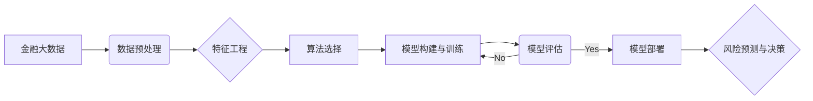

# AI人工智能深度学习算法：在金融风险预测中的应用

作者：禅与计算机程序设计艺术

## 1. 背景介绍
### 1.1 人工智能与深度学习的兴起
### 1.2 金融风险预测的重要性
### 1.3 深度学习在金融风险预测中的应用前景

## 2. 核心概念与联系
### 2.1 人工智能、机器学习与深度学习
#### 2.1.1 人工智能的定义与发展历程
#### 2.1.2 机器学习的原理与分类
#### 2.1.3 深度学习的特点与优势
### 2.2 金融风险的类型与评估方法
#### 2.2.1 信用风险
#### 2.2.2 市场风险 
#### 2.2.3 操作风险
#### 2.2.4 传统金融风险评估方法
### 2.3 深度学习与金融风险预测的结合
#### 2.3.1 深度学习在金融风险预测中的优势
#### 2.3.2 深度学习在金融风险预测中的应用现状

## 3. 核心算法原理具体操作步骤
### 3.1 前馈神经网络(FNN)
#### 3.1.1 FNN的基本结构与原理
#### 3.1.2 FNN在金融风险预测中的应用
#### 3.1.3 FNN模型的构建与训练步骤
### 3.2 卷积神经网络(CNN)  
#### 3.2.1 CNN的基本结构与原理
#### 3.2.2 CNN在金融风险预测中的应用
#### 3.2.3 CNN模型的构建与训练步骤
### 3.3 循环神经网络(RNN)
#### 3.3.1 RNN的基本结构与原理
#### 3.3.2 RNN在金融风险预测中的应用
#### 3.3.3 RNN模型的构建与训练步骤
### 3.4 长短期记忆网络(LSTM)
#### 3.4.1 LSTM的基本结构与原理 
#### 3.4.2 LSTM在金融风险预测中的应用
#### 3.4.3 LSTM模型的构建与训练步骤

## 4. 数学模型和公式详细讲解举例说明
### 4.1 FNN的数学模型与公式推导
### 4.2 CNN的数学模型与公式推导
### 4.3 RNN的数学模型与公式推导
### 4.4 LSTM的数学模型与公式推导

## 5. 项目实践：代码实例和详细解释说明
### 5.1 数据预处理
#### 5.1.1 数据清洗
#### 5.1.2 特征工程
#### 5.1.3 数据标准化
### 5.2 模型构建
#### 5.2.1 FNN模型构建
#### 5.2.2 CNN模型构建
#### 5.2.3 RNN模型构建 
#### 5.2.4 LSTM模型构建
### 5.3 模型训练与评估
#### 5.3.1 训练集与测试集的划分
#### 5.3.2 模型训练
#### 5.3.3 模型评估与优化
### 5.4 模型部署与应用
#### 5.4.1 模型部署流程
#### 5.4.2 模型的实时预测应用

## 6. 实际应用场景 
### 6.1 信用评分与违约预测
### 6.2 反欺诈与反洗钱
### 6.3 股票价格预测
### 6.4 衍生品定价与风险管理

## 7. 工具和资源推荐
### 7.1 深度学习框架
#### 7.1.1 TensorFlow
#### 7.1.2 PyTorch
#### 7.1.3 Keras
### 7.2 金融数据源
#### 7.2.1 Bloomberg
#### 7.2.2 Wind 
#### 7.2.3 Tushare
### 7.3 学习资源
#### 7.3.1 在线课程
#### 7.3.2 书籍推荐
#### 7.3.3 研究论文

## 8. 总结：未来发展趋势与挑战
### 8.1 深度学习在金融风险预测中的发展趋势
### 8.2 技术与伦理的挑战
### 8.3 跨学科合作的重要性

## 9. 附录：常见问题与解答
### 9.1 如何选择适合的深度学习模型？
### 9.2 如何处理金融数据中的噪声和异常值？
### 9.3 如何解释深度学习模型的预测结果？
### 9.4 如何确保深度学习模型在金融风险预测中的稳健性？

人工智能和深度学习技术的飞速发展为金融风险预测领域带来了新的机遇和挑战。传统的金融风险评估方法已经无法完全满足日益复杂的金融市场需求,深度学习凭借其强大的特征提取和非线性建模能力,在金融风险预测中展现出了巨大的潜力。

本文首先介绍了人工智能、机器学习和深度学习的基本概念和发展历程,分析了它们之间的联系和区别。然后重点讨论了几种主流的深度学习算法,包括前馈神经网络(FNN)、卷积神经网络(CNN)、循环神经网络(RNN)和长短期记忆网络(LSTM)的原理、结构和在金融风险预测中的应用。通过详细的数学模型推导和代码实例,展示了如何利用这些算法构建金融风险预测模型。 

在实践部分,本文以信用评分、反欺诈、股票价格预测等具体场景为例,讲解了如何进行数据预处理、模型构建、训练评估和部署应用等关键步骤。同时推荐了一些常用的深度学习框架、金融数据源和学习资源,帮助读者快速入门。

展望未来,深度学习在金融风险预测中还有很大的发展空间。一方面,随着计算能力的提升和数据量的增加,深度学习模型的性能还将继续提高；另一方面,如何在保证模型性能的同时兼顾可解释性和稳健性,平衡技术创新与合规风控,仍然是亟待解决的挑战。金融机构应当积极拥抱人工智能技术,加强跨学科交流合作,不断探索行业特色的智能风控之路。

*本文的核心算法流程图如下:


**FNN前馈神经网络的数学模型**:
$$
\begin{aligned}
h_i &= f(\sum_{j=1}^{n}{w_{ij}x_j} + b_i)\\
\hat{y} &= g(\sum_{i=1}^{m}{v_ih_i} + b_0)
\end{aligned}
$$
其中 $x_j$ 是输入层第 $j$ 个节点的值, $w_{ij}$ 是输入层第 $j$ 个节点到隐藏层第 $i$ 个节点的权重, $b_i$ 是隐藏层第 $i$ 个节点的偏置, $f$ 是激活函数, $h_i$ 是隐藏层第 $i$ 个节点的输出。 $v_i$ 是隐藏层第 $i$ 个节点到输出层的权重, $b_0$ 是输出层的偏置, $g$ 是输出层的激活函数, $\hat{y}$ 是最终的预测输出。  

**LSTM长短期记忆网络的前向传播公式**:
$$
\begin{aligned}
f_t &= \sigma(W_f\cdot[h_{t-1},x_t] + b_f)\\
i_t &= \sigma(W_i\cdot[h_{t-1},x_t] + b_i)\\ 
\tilde{C}_t &= tanh(W_C\cdot[h_{t-1},x_t] + b_C)\\
C_t &= f_t*C_{t-1} + i_t*\tilde{C}_t\\
o_t &= \sigma(W_o\cdot[h_{t-1},x_t]+b_o)\\
h_t &= o_t*tanh(C_t) 
\end{aligned}
$$
其中 $f_t$ 是遗忘门,$i_t$ 是输入门,$o_t$ 是输出门,$C_t$ 是当前时刻的细胞状态,$\tilde{C}_t$ 是候选细胞状态,$h_t$ 是当前时刻的隐藏状态。$W$ 和 $b$ 分别是权重矩阵和偏置向量。$\sigma$ 是 sigmoid 激活函数, $tanh$ 是双曲正切激活函数, $*$ 表示Hadamard Product(逐元素相乘)。

下面是一个使用PyTorch实现LSTM预测股票价格的简单示例:

```python
import torch
import torch.nn as nn

class LSTM(nn.Module):
    def __init__(self, input_size=5, hidden_size=32, num_layers=1 , output_size=1):
        super().__init__()
        self.hidden_size = hidden_size
        self.lstm = nn.LSTM(input_size, hidden_size, num_layers, batch_first=True)
        self.fc = nn.Linear(hidden_size, output_size)

    def forward(self, x):
        h0 = torch.zeros(1, x.size(0), self.hidden_size) 
        c0 = torch.zeros(1, x.size(0), self.hidden_size)
        out, _ = self.lstm(x, (h0, c0)) 
        out = self.fc(out[:, -1, :])
        return out

model = LSTM()
criterion = torch.nn.MSELoss()
optimizer = torch.optim.Adam(model.parameters(), lr=0.01)  

for epoch in range(num_epochs):
    for x_batch, y_batch in data_loader:
        y_pred = model(x_batch)
        loss = criterion(y_pred, y_batch)
        optimizer.zero_grad()
        loss.backward()
        optimizer.step()
```

以上只是一个简要的示例,实际应用中还需要进一步优化模型结构和训练过程。总之,将深度学习应用于金融风险预测是一个复杂而有趣的课题,既需要扎实的理论功底,也需要丰富的实践经验。相信通过业界和学界的共同努力,人工智能必将为金融行业带来更多创新与变革!