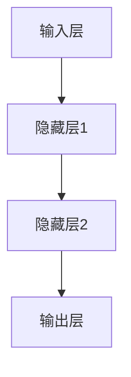

# AI人工智能深度学习算法：情境智能与深度学习模型的动态调整

作者：禅与计算机程序设计艺术

## 1. 背景介绍

### 1.1 人工智能的发展历程

人工智能（AI）作为计算机科学的一个重要分支，其发展历程可以追溯到20世纪50年代。自那时起，AI经历了多个阶段的发展，从最初的符号主义AI到后来的机器学习，再到如今的深度学习和情境智能。每个阶段的进步都带来了计算能力和算法的显著提升，使得AI在各个领域得到了广泛应用。

### 1.2 深度学习的崛起

深度学习作为机器学习的一个子领域，通过多层神经网络的训练，能够自动提取和学习数据的特征。自2012年AlexNet在ImageNet竞赛中取得突破以来，深度学习在图像识别、自然语言处理、语音识别等领域取得了显著的成果。深度学习的成功离不开大数据和高性能计算硬件的发展，这些因素共同推动了AI的快速进步。

### 1.3 情境智能的概念

情境智能（Contextual Intelligence）指的是AI系统能够理解和适应不同情境的能力。这种智能不仅仅依赖于预先训练的数据和模型，还需要根据当前的环境和需求进行动态调整。情境智能的实现需要结合深度学习、强化学习、迁移学习等多种技术，旨在使AI系统更加智能和灵活。

## 2. 核心概念与联系

### 2.1 深度学习的基本概念

深度学习是一种基于人工神经网络的机器学习方法，其核心在于通过多层网络结构来模拟人脑的学习过程。深度学习模型通常包括输入层、多个隐藏层和输出层，每一层都包含若干神经元，这些神经元通过权重和激活函数进行连接和计算。

### 2.2 神经网络的基本结构

一个典型的神经网络结构如下：

在这个结构中，输入层接收原始数据，隐藏层通过非线性变换提取特征，输出层则根据特征进行最终的预测或分类。

### 2.3 情境智能的实现原理

情境智能的实现需要AI系统具备以下几个能力：

1. **情境感知**：能够实时感知和理解当前环境和任务的变化。
2. **动态调整**：根据情境的变化，动态调整模型的参数和结构。
3. **多模态融合**：结合多种数据源（如图像、文本、语音等）进行综合分析和决策。

### 2.4 深度学习与情境智能的联系

深度学习提供了强大的特征提取和模式识别能力，而情境智能则进一步要求AI系统能够根据不同情境进行动态调整。两者的结合可以使AI系统在复杂和动态的环境中表现得更加智能和灵活。

## 3. 核心算法原理具体操作步骤

### 3.1 数据预处理

数据预处理是深度学习模型训练的第一步，主要包括数据清洗、归一化、分割等步骤。数据的质量直接影响模型的性能，因此需要特别注意数据预处理的细节。

#### 3.1.1 数据清洗

数据清洗包括去除噪声、填补缺失值、删除重复数据等。常用的方法有：

- 均值填补：用数据的均值填补缺失值。
- 插值法：用插值方法填补缺失值。
- 删除法：直接删除包含缺失值的数据。

#### 3.1.2 数据归一化

数据归一化是将数据缩放到一个特定的范围（如0到1），以消除不同特征之间的量纲差异。常用的方法有：

- Min-Max归一化：将数据缩放到[0, 1]范围。
- Z-score归一化：将数据转换为标准正态分布。

### 3.2 模型训练

模型训练是深度学习的核心步骤，主要包括模型的初始化、前向传播、损失计算、反向传播和参数更新等。

#### 3.2.1 模型初始化

模型的初始化包括神经网络结构的设计和参数的初始化。常用的初始化方法有：

- 随机初始化：参数随机初始化。
- Xavier初始化：根据输入和输出的数量进行参数初始化。
- He初始化：根据输入的数量进行参数初始化，适用于ReLU激活函数。

#### 3.2.2 前向传播

前向传播是将输入数据通过神经网络进行计算，得到输出结果的过程。前向传播的公式如下：

$$
z^{(l)} = W^{(l)}a^{(l-1)} + b^{(l)}
$$

$$
a^{(l)} = \sigma(z^{(l)})
$$

其中，$z^{(l)}$是第$l$层的线性组合，$W^{(l)}$是权重矩阵，$a^{(l-1)}$是上一层的激活值，$b^{(l)}$是偏置，$\sigma$是激活函数。

#### 3.2.3 损失计算

损失函数用于衡量模型的预测结果与真实结果之间的差异。常用的损失函数有：

- 均方误差（MSE）：用于回归问题。
- 交叉熵损失：用于分类问题。

#### 3.2.4 反向传播

反向传播是计算损失函数对模型参数的梯度，并通过梯度下降法更新参数的过程。反向传播的公式如下：

$$
\frac{\partial L}{\partial W^{(l)}} = \delta^{(l)}a^{(l-1)^T}
$$

$$
\delta^{(l)} = \frac{\partial L}{\partial z^{(l)}} \cdot \sigma'(z^{(l)})
$$

其中，$L$是损失函数，$\delta^{(l)}$是第$l$层的误差项，$\sigma'$是激活函数的导数。

### 3.3 模型评估

模型评估是通过一系列指标衡量模型性能的过程。常用的评估指标有：

- 准确率（Accuracy）：用于分类问题，表示正确预测的比例。
- 精确率（Precision）：用于分类问题，表示真正例占预测为正例的比例。
- 召回率（Recall）：用于分类问题，表示真正例占实际正例的比例。
- F1-score：精确率和召回率的调和平均数。

### 3.4 动态调整

动态调整是情境智能的关键步骤，主要包括模型参数的动态调整和模型结构的动态调整。

#### 3.4.1 模型参数的动态调整

模型参数的动态调整可以通过在线学习和迁移学习实现。在线学习是指模型在接收到新数据后，立即进行训练和更新参数。迁移学习是将已有模型的知识迁移到新任务中，通过微调参数来适应新任务。

#### 3.4.2 模型结构的动态调整

模型结构的动态调整可以通过自适应神经网络实现。自适应神经网络能够根据情境的变化，自动调整网络的层数和神经元的数量，以提高模型的适应性和泛化能力。

## 4. 数学模型和公式详细讲解举例说明

### 4.1 神经网络的数学模型

神经网络的数学模型可以表示为一组线性和非线性变换的组合。假设一个简单的两层神经网络，其数学模型如下：

$$
z^{(1)} = W^{(1)}x + b^{(1)}
$$

$$
a^{(1)} = \sigma(z^{(1)})
$$

$$
z^{(2)} = W^{(2)}a^{(1)} + b^{(2)}
$$

$$
a^{(2)} = \sigma(z^{(2)})
$$

其中，$x$是输入向量，$W^{(1)}$和$W^{(2)}$是权重矩阵，$b^{(1)}$和$b^{(2)}$是偏置向量，$\sigma$是激活函数。

### 4.2 反向传播算法

反向传播算法是通过链式法则计算损失函数对模型参数的梯度，并通过梯度下降法更新参数的过程。假设损失函数为$L$，反向传播的公式如下：

$$
\frac{\partial L}{\partial W^{(2)}} = \delta^{(2)}a^{(1)^T}
$$

$$
\delta^{(2)} = \frac{\partial L}{\