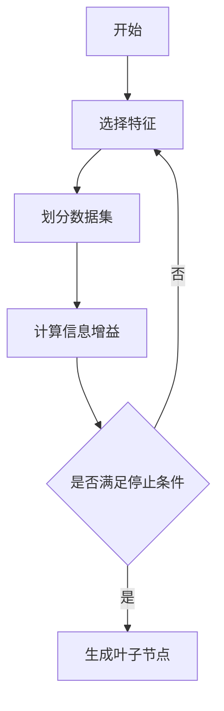

# AI人工智能深度学习算法：理解决策制定与推理机制

作者：禅与计算机程序设计艺术

## 1. 背景介绍

### 1.1 人工智能的崛起

人工智能（AI）作为21世纪最具革命性的技术之一，已经在多个领域展示了其强大的潜力。从自动驾驶汽车到智能客服，从医疗诊断到金融分析，AI正在改变我们的生活和工作方式。深度学习作为AI的核心技术之一，依靠其强大的数据处理和模式识别能力，成为推动AI发展的重要引擎。

### 1.2 深度学习的定义与发展历程

深度学习是一种基于人工神经网络的机器学习方法，通过多层网络结构实现对数据的复杂特征提取和模式识别。其发展历程可以追溯到20世纪80年代，但真正的突破发生在2010年代，得益于计算能力的提升和数据量的爆炸式增长。深度学习的成功案例，如AlphaGo战胜围棋冠军、ImageNet大赛中的图像识别突破等，进一步推动了其在各个领域的应用。

### 1.3 决策制定与推理机制的重要性

在AI系统中，决策制定与推理机制是实现智能化的重要环节。通过有效的决策制定，AI系统可以在复杂环境中做出最优选择；通过推理机制，AI系统可以解释其决策过程，提高透明度和可信度。这对于医疗、金融、自动驾驶等高风险领域尤为重要。因此，深入理解深度学习算法中的决策制定与推理机制，对于推动AI技术的进一步发展具有重要意义。

## 2. 核心概念与联系

### 2.1 深度学习基础

#### 2.1.1 人工神经网络

人工神经网络（ANN）是深度学习的基础结构，模仿人脑神经元的工作原理，通过层层传递和处理信息，实现对复杂数据的学习和识别。一个典型的ANN由输入层、隐藏层和输出层组成，各层之间通过权重连接，权重的调整是网络学习的核心。

#### 2.1.2 反向传播算法

反向传播算法（Backpropagation）是训练神经网络的关键技术，通过计算损失函数的梯度，调整网络权重，使网络输出逐步逼近目标值。反向传播算法依赖于链式法则，对每一层的权重进行更新，从而实现整个网络的优化。

### 2.2 决策制定

#### 2.2.1 决策树

决策树是一种常见的决策制定模型，通过树形结构表示决策过程中的各个选择和结果。每个节点代表一个决策点，每个分支代表一个可能的选择，叶子节点代表最终的决策结果。决策树直观且易于理解，广泛应用于分类和回归任务中。

#### 2.2.2 强化学习

强化学习（Reinforcement Learning, RL）是一种通过与环境交互学习最优策略的算法，广泛应用于机器人控制、游戏AI等领域。RL通过奖励机制引导代理（Agent）学习，以最大化累积奖励为目标。Q-learning和策略梯度（Policy Gradient）是常见的RL算法。

### 2.3 推理机制

#### 2.3.1 贝叶斯网络

贝叶斯网络是一种基于概率论的推理模型，通过有向无环图表示变量之间的条件依赖关系。贝叶斯网络可以进行概率推断，计算给定证据下某一事件发生的概率，广泛应用于医学诊断、故障检测等领域。

#### 2.3.2 模糊逻辑

模糊逻辑是一种处理不确定性和模糊性的推理方法，通过模糊集合和模糊规则进行推理。模糊逻辑在处理复杂系统、控制系统等方面具有独特优势，能够处理传统二值逻辑无法处理的模糊信息。

## 3. 核心算法原理具体操作步骤

### 3.1 深度神经网络训练

#### 3.1.1 数据预处理

深度学习模型的训练依赖于大量高质量的数据。数据预处理是训练过程中的重要步骤，包括数据清洗、归一化、数据增强等。通过数据预处理，可以提高模型的训练效率和准确性。

#### 3.1.2 模型构建

深度神经网络的构建包括选择网络结构、初始化权重、定义损失函数和优化算法等。常见的网络结构包括卷积神经网络（CNN）、循环神经网络（RNN）、生成对抗网络（GAN）等。不同的任务需要选择合适的网络结构和超参数。

#### 3.1.3 模型训练

模型训练是深度学习的核心步骤，通过反向传播算法调整网络权重，使损失函数逐步收敛。训练过程中需要设置合适的学习率、批量大小等超参数，并监控训练过程中的损失值和准确率，防止过拟合和欠拟合。

### 3.2 决策树算法

#### 3.2.1 构建决策树

决策树的构建过程包括选择特征、划分数据集、计算信息增益等步骤。通过递归地划分数据集，构建树形结构，最终形成决策树模型。常见的决策树算法包括ID3、C4.5、CART等。

#### 3.2.2 剪枝

决策树的剪枝是防止过拟合的重要步骤，通过去除不必要的分支，提高模型的泛化能力。剪枝方法包括预剪枝和后剪枝，预剪枝是在构建过程中提前停止，后剪枝是在构建完成后进行修剪。

### 3.3 强化学习算法

#### 3.3.1 Q-learning

Q-learning是一种无模型的强化学习算法，通过学习状态-动作值函数（Q函数），指导代理选择最优动作。Q-learning算法的核心是Q值更新公式，通过不断更新Q值，逼近最优策略。

$$
Q(s, a) \leftarrow Q(s, a) + \alpha [r + \gamma \max_{a'} Q(s', a') - Q(s, a)]
$$

#### 3.3.2 策略梯度

策略梯度算法通过直接优化策略函数，使得累积奖励最大化。策略梯度算法的核心是策略梯度定理，通过梯度上升法更新策略参数。

$$
\nabla J(\theta) = \mathbb{E}_{\pi_\theta} [\nabla_\theta \log \pi_\theta(a|s) Q^{\pi_\theta}(s, a)]
$$

### 3.4 贝叶斯网络推理

#### 3.4.1 结构学习

贝叶斯网络的结构学习包括确定网络结构和参数估计。结构学习可以通过专家知识或数据驱动的方法进行，常见的方法包括贪心算法、模拟退火等。

#### 3.4.2 参数学习

参数学习是指确定贝叶斯网络中各个条件概率分布的参数。常见的方法包括最大似然估计（MLE）和贝叶斯估计。通过参数学习，可以确定网络中各个变量的依赖关系和概率分布。

### 3.5 模糊逻辑推理

#### 3.5.1 模糊规则

模糊规则是模糊逻辑推理的核心，通过模糊集合和模糊关系描述系统的行为。模糊规则通常以“如果-那么”的形式表示，如“如果温度高，那么风速大”。

#### 3.5.2 模糊推理

模糊推理是指根据模糊规则和输入模糊集合，计算输出模糊集合的过程。常见的模糊推理方法包括Mamdani推理和Sugeno推理，通过模糊化、规则评估、聚合和解模糊化等步骤实现推理。

## 4. 数学模型和公式详细讲解举例说明

### 4.1 深度神经网络的数学模型

#### 4.1.1 神经元模型

一个神经元的输出可以表示为：

$$
y = f\left(\sum_{i=1}^n w_i x_i + b\right)
$$

其中，$x_i$ 是输入，$w_i$ 是权重，$b$ 是偏置，$f$ 是激活函数。

#### 4.1.2 反向传播算法

反向传播算法的核心是计算损失函数对