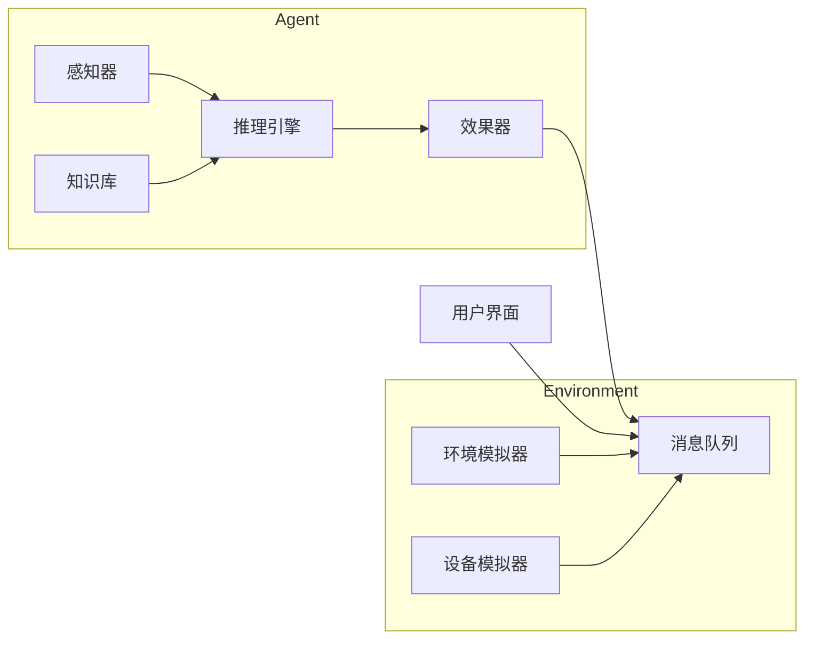

# AI代理在物联网(IoT)系统中的工作流设计

## 1. 背景介绍

### 1.1 物联网(IoT)概述

物联网(Internet of Things, IoT)是一种新兴的技术范式,旨在通过互联网将各种物理设备和虚拟服务连接起来,实现信息的高效交换和共享。在物联网系统中,每个设备(如传感器、执行器、网关等)都被赋予了独特的识别编码,可以与其他设备进行通信和协作。

物联网的应用领域非常广泛,包括智能家居、智能城市、智能农业、工业自动化、医疗保健等。随着设备数量和复杂性的不断增加,有效管理和协调这些设备的工作流程变得至关重要。这就为AI代理在物联网系统中的应用提供了广阔的空间。

### 1.2 AI代理在物联网中的作用

AI代理是一种基于人工智能技术构建的软件实体,能够感知环境、做出决策并执行相应的动作。在物联网系统中,AI代理可以充当智能协调员的角色,负责管理和优化各种设备的工作流程,提高系统的效率和可靠性。

AI代理可以执行以下关键任务:

- 设备发现和注册
- 工作流程编排和执行
- 实时监控和异常检测
- 自动化决策和优化
- 资源调度和负载均衡
- 安全和隐私保护

通过AI代理,物联网系统可以实现自主运行、自我优化和自我修复,从而降低人工干预的需求,提高运营效率。

## 2. 核心概念与联系

### 2.1 AI代理的体系结构

AI代理通常采用基于代理的软件体系结构,由以下几个核心组件组成:

1. **感知器(Sensor)**: 用于从环境中获取数据和信息,如传感器数据、日志文件等。
2. **效果器(Effector)**: 用于对环境执行操作,如控制执行器、发送命令等。 
3. **知识库(Knowledge Base)**: 存储代理所需的规则、策略、模型等知识。
4. **推理引擎(Reasoning Engine)**: 根据感知器输入和知识库,进行逻辑推理和决策。
5. **学习模块(Learning Module)**: 使用机器学习算法从历史数据中获取经验,持续优化决策。
6. **通信模块(Communication Module)**: 与其他代理、设备和系统进行信息交换。

这些组件通过有机结合,赋予了AI代理感知、推理、学习和行动的能力。

### 2.2 AI代理与物联网设备的交互

AI代理在物联网系统中扮演着协调员的角色,与各种物联网设备进行交互。典型的交互模式包括:

1. **设备发现和注册**: AI代理自动发现新加入的设备,获取其功能描述和元数据,并在系统中注册。
2. **任务分配**: AI代理根据设备的能力和当前状态,为它们分配合适的任务。
3. **命令下发**: AI代理向设备发送控制命令,执行特定的操作。
4. **数据收集**: AI代理从设备获取各种监控数据和运行状态信息。
5. **异常处理**: AI代理检测到设备异常时,采取相应的故障排除和恢复措施。

通过这些交互,AI代理可以高效地管理和协调物联网设备的工作流程,实现智能化运营。

## 3. 核心算法原理具体操作步骤  

设计AI代理在物联网系统中的工作流程涉及多种算法和技术,包括规划算法、机器学习、多智能体系统等。下面我们介绍一种常见的基于规划算法的工作流设计方法。

### 3.1 工作流建模

首先,我们需要对物联网系统中的设备、任务和约束条件进行形式化建模,构建一个工作流模型。常用的建模方法包括:

1. **层次任务网络(Hierarchical Task Network, HTN)**: 将复杂任务分解为子任务的层次结构。
2. **规划域定义语言(Planning Domain Definition Language, PDDL)**: 使用标准化语言描述规划问题。

以智能家居系统为例,一个简化的HTN模型如下:

```
Task: 智能家居控制
    Subtasks:
        - 环境监测
            - 获取温度数据
            - 获取湿度数据
            - ...
        - 设备控制
            - 调节空调
            - 控制电灯
            - ...
        - 用户交互
            - 语音识别
            - 显示反馈
            - ...
```

### 3.2 规划算法

基于建模的工作流,我们可以使用经典的规划算法或启发式搜索算法来生成满足约束条件的行动序列,即工作流程编排方案。一些常用的算法包括:

1. **状态空间搜索算法**
    - 朴素搜索: 广度优先搜索、深度优先搜索等
    - 启发式搜索: A*算法、最佳优先搜索等
2. **规划图算法**
    - 图划分规划
    - 层次任务网规划
3. **时序规划算法**
    - 时序约束满足问题
    - 时序决策网络

这些算法的核心思想是从初始状态出发,探索可能的行动路径,直到达到目标状态,同时满足各种约束条件(如时间、资源等)。

### 3.3 工作流执行与监控

得到工作流方案后,AI代理需要执行和监控整个过程:

1. **任务分解**: 将工作流分解为具体的设备操作指令。
2. **指令下发**: 通过通信模块将指令发送给相应的设备执行。
3. **状态监控**: 持续收集设备的运行状态数据,检测异常情况。
4. **异常处理**: 一旦发现异常,启动重新规划或故障恢复流程。
5. **过程优化**: 根据监控数据,优化后续的决策和资源调度。

通过反馈控制的闭环机制,AI代理可以持续优化工作流的执行效率。

## 4. 数学模型和公式详细讲解举例说明

在设计AI代理的工作流时,我们常常需要使用数学模型来准确描述和求解规划问题。下面我们介绍一些常用的数学模型。

### 4.1 马尔可夫决策过程(MDP)

马尔可夫决策过程(Markov Decision Process, MDP)是一种常用的sequentical决策模型,可以用于描述AI代理在不确定环境中的决策问题。

MDP由一个五元组$(S, A, P, R, \gamma)$定义:

- $S$是有限的状态集合
- $A$是有限的行动集合  
- $P(s'|s, a)$是状态转移概率,表示在状态$s$执行行动$a$后,转移到状态$s'$的概率
- $R(s, a)$是即时奖励函数,表示在状态$s$执行行动$a$获得的奖励
- $\gamma \in [0, 1)$是折现因子,用于权衡即时奖励和长期奖励

MDP的目标是找到一个最优策略$\pi^*(s)$,使得期望的累积奖励最大化:

$$
\max_{\pi} \mathbb{E}\left[ \sum_{t=0}^{\infty} \gamma^t R(s_t, a_t) \right]
$$

其中$a_t = \pi(s_t)$是在状态$s_t$执行的行动。

MDP可以通过动态规划或强化学习算法求解。例如,在智能家居系统中,我们可以将房间温度、设备状态等作为状态,将调节空调、开关电灯等作为行动,奖励函数可以考虑舒适度和能耗,通过求解MDP即可获得最优的控制策略。

### 4.2 约束优化问题(COP)

在设计工作流时,我们往往需要考虑多种约束条件,如时间、资源、优先级等,这可以建模为约束优化问题(Constraint Optimization Problem, COP)。

COP由一个三元组$(X, D, C)$定义:

- $X = \{x_1, x_2, \ldots, x_n\}$是决策变量集合
- $D = \{D_1, D_2, \ldots, D_n\}$是决策变量的有效值域集合
- $C = \{c_1, c_2, \ldots, c_m\}$是约束条件集合,每个$c_i$是对变量的一个限制

COP的目标是找到一个可行解$x^* \in D$,使得目标函数$f(x)$最小(或最大)化,同时满足所有约束条件:

$$
\begin{aligned}
&\min_{x \in D} f(x) \\
&\text{s.t.} \quad c_i(x) \leq 0, \quad i = 1, 2, \ldots, m
\end{aligned}
$$

在工作流设计中,决策变量可以是任务分配方案、资源分配策略等;约束条件可以是时间窗口、资源限制、优先级要求等;目标函数可以是makespan(完成时间)、成本、能耗等。

COP可以通过约束规划算法、整数规划等方法求解。例如,在工业物联网系统中,我们可以将设备作为资源、工序作为任务,以最小化makespan为目标,同时考虑设备能力、优先级等约束,构建COP模型并求解最优的工作流安排方案。

### 4.3 时序约束网络(STN)

在设计实时工作流时,我们需要明确地描述和推理各个活动之间的时序约束关系。时序约束网络(Simple Temporal Network, STN)提供了一种有效的建模和求解方法。

STN由一个二元组$(X, C)$定义:

- $X = \{x_1, x_2, \ldots, x_n\}$是时间点变量集合
- $C = \{c_{ij}\}$是时间约束集合,每个$c_{ij} = [lb_{ij}, ub_{ij}]$表示时间点$x_j - x_i$的时间间隔范围

STN的一个可行解需要满足所有时间约束:

$$
lb_{ij} \leq x_j - x_i \leq ub_{ij}, \quad \forall c_{ij} \in C
$$

我们可以将STN表示为一个加权有向图,其中节点是时间点,边权是时间间隔范围。求解STN的核心算法是最短路径算法,如Bellman-Ford算法,可以检测是否存在解,并计算出每个时间点的最小值和最大值范围。

在工作流设计中,我们可以将任务开始时间和结束时间作为时间点变量,任务持续时间、优先级等作为时间约束,通过求解STN即可获得满足所有约束的时间安排方案。

## 4. 项目实践:代码实例和详细解释说明

为了更好地理解AI代理在工作流设计中的应用,我们提供了一个基于Python的示例项目。该项目模拟了一个智能家居系统,其中AI代理负责根据环境状态和用户偏好,动态调度家居设备的工作流程。

### 4.1 系统架构

该项目采用基于代理的软件架构,主要包括以下几个模块:

1. **环境模拟器(Environment Simulator)**: 模拟家居环境的状态变化,如温度、湿度、光线强度等。
2. **设备模拟器(Device Simulator)**: 模拟家居设备的功能和行为,如空调、电灯、窗帘等。
3. **AI代理(AI Agent)**: 实现工作流设计和执行的核心模块,包括感知器、推理引擎、知识库等组件。
4. **用户界面(User Interface)**: 用于设置用户偏好和显示系统运行状态。

这些模块通过消息队列进行通信和协作。



### 4.2 核心算法实现

AI代理模块是整个系统的核心,我们在其中实现了工作流设计和执行的主要算法。

#### 4.2.1 工作流建模

我们使用层次任务网络(HTN)对家居控制任务进行建模,定义了一个`HierarchicalTask`类:

```python
class HierarchicalTask:
    def __init__(self, name, subtasks