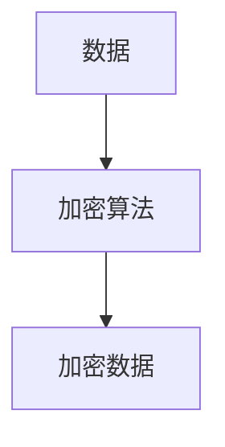
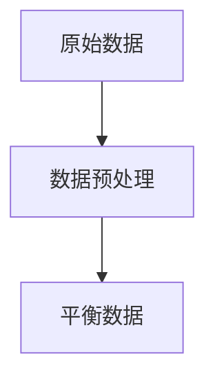
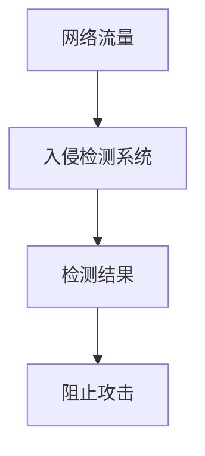

# AI安全国际合作：共同应对全球性安全威胁

作者：禅与计算机程序设计艺术

## 1. 背景介绍

### 1.1 人工智能的快速发展

近年来，人工智能（AI）技术的迅猛发展不仅显著改变了各行各业的面貌，还在全球范围内引发了深远的社会和经济变革。无论是自动驾驶汽车、智能助手，还是医疗诊断系统，AI的应用无处不在。然而，随着AI技术的广泛应用，安全问题也随之而来。

### 1.2 AI安全问题的全球性

AI安全问题具有全球性特征。无论是数据隐私泄露、算法偏见，还是恶意使用AI技术进行网络攻击，这些问题都跨越国界，对全球安全构成威胁。因此，AI安全问题的解决需要国际社会的共同努力。

### 1.3 国际合作的重要性

在应对AI安全威胁时，国际合作显得尤为重要。不同国家和地区在技术、法律、伦理等方面存在差异，这些差异可能成为AI安全问题的隐患。通过国际合作，各国可以共享技术资源、制定统一标准、共同应对安全威胁，从而实现AI技术的安全、可持续发展。

## 2. 核心概念与联系

### 2.1 AI安全的定义

AI安全是指在开发和应用AI技术的过程中，确保系统的可靠性、稳定性和安全性，防止恶意攻击、数据泄露和算法偏见等问题。AI安全涵盖了技术安全、数据安全、算法安全和伦理安全等多个方面。

### 2.2 AI安全的主要威胁

#### 2.2.1 数据隐私泄露

AI系统依赖于大量数据进行训练和决策，如果数据被恶意获取或滥用，将导致严重的隐私泄露问题。

#### 2.2.2 算法偏见

AI算法可能会因训练数据的不平衡或设计缺陷而产生偏见，从而导致不公平的决策结果。

#### 2.2.3 恶意攻击

恶意攻击者可能利用AI技术进行网络攻击、信息窃取或制造虚假信息，给社会带来巨大危害。

### 2.3 国际合作的必要性

#### 2.3.1 技术共享

不同国家在AI技术研发方面各有所长，通过国际合作，可以实现技术资源的共享，提升全球AI技术的整体水平。

#### 2.3.2 统一标准

制定统一的AI安全标准和规范，有助于各国在AI技术应用中遵循一致的安全准则，减少安全隐患。

#### 2.3.3 联合应对

面对全球性AI安全威胁，各国可以通过联合行动，共同应对恶意攻击和安全事件，提升全球安全水平。

## 3. 核心算法原理具体操作步骤

### 3.1 数据安全算法

#### 3.1.1 数据加密

数据加密是保护数据隐私的重要手段。常见的数据加密算法包括对称加密算法（如AES）和非对称加密算法（如RSA）。



#### 3.1.2 数据匿名化

数据匿名化通过对数据进行处理，使其无法直接关联到个人，从而保护隐私。常见的数据匿名化技术包括k-匿名、l-多样性和t-接近性。

### 3.2 算法公平性

#### 3.2.1 数据预处理

在训练AI模型之前，对数据进行预处理，确保数据的平衡性和多样性，是防止算法偏见的重要步骤。



#### 3.2.2 模型评估

在模型评估阶段，使用公平性指标（如统计均值差异、机会均等）对模型进行评估，确保模型的决策结果不具有偏见。

### 3.3 恶意攻击防护

#### 3.3.1 入侵检测

通过入侵检测系统（IDS），实时监控网络流量和系统行为，检测并阻止恶意攻击。



#### 3.3.2 对抗样本防护

对抗样本是通过微小扰动使AI模型产生错误预测的样本。通过对抗训练和防御性模型设计，可以提高模型对对抗样本的鲁棒性。

## 4. 数学模型和公式详细讲解举例说明

### 4.1 数据加密算法

#### 4.1.1 AES加密算法

AES（Advanced Encryption Standard）是一种对称加密算法，其核心是使用固定长度的密钥对数据进行加密和解密。AES算法的主要步骤包括密钥扩展、初始轮密钥加、轮变换和最终轮变换。

$$
C = E_{K}(P)
$$

其中，$C$ 是加密后的密文，$E$ 是加密函数，$K$ 是密钥，$P$ 是明文。

### 4.2 数据匿名化技术

#### 4.2.1 k-匿名

k-匿名通过将数据划分为k个组，使每个组中的数据无法区分，从而实现数据匿名化。

$$
\text{Anonymized Data} = \{x \in X | |\{y \in X | y \sim x\}| \geq k\}
$$

其中，$x$ 和 $y$ 是数据记录，$X$ 是数据集，$\sim$ 表示等价关系，$k$ 是匿名化参数。

### 4.3 算法公平性指标

#### 4.3.1 统计均值差异

统计均值差异用于衡量不同群体之间的决策结果差异。

$$
\text{Mean Difference} = \frac{1}{n_1} \sum_{i=1}^{n_1} y_i - \frac{1}{n_2} \sum_{j=1}^{n_2} y_j
$$

其中，$n_1$ 和 $n_2$ 是两个群体的样本数量，$y_i$ 和 $y_j$ 是决策结果。

### 4.4 对抗样本防护

#### 4.4.1 对抗训练

对抗训练通过在训练过程中加入对抗样本，提高模型对对抗攻击的鲁棒性。

$$
\min_{\theta} \mathbb{E}_{(x,y) \sim D} \left[ \max_{\delta \in \Delta} L(f_{\theta}(x + \delta), y) \right]
$$

其中，$\theta$ 是模型参数，$D$ 是数据分布，$\delta$ 是对抗扰动，$L$ 是损失函数，$f$ 是模型。

## 5. 项目实践：代码实例和详细解释说明

### 5.1 数据加密实例

以下是一个使用Python实现AES加密的示例代码：

```python
from Crypto.Cipher import AES
import base64

def pad(s):
    return s + (AES.block_size - len(s) % AES.block_size) * chr(AES.block_size - len(s) % AES.block_size)

def encrypt(raw, key):
    raw = pad(raw)
    cipher = AES.new(key, AES.MODE_ECB)
    return base64.b64encode(cipher.encrypt(raw))

def decrypt(enc, key):
    enc = base64.b64decode(enc)
    cipher = AES.new(key, AES.MODE_ECB)
    return cipher.decrypt(enc).decode('utf-8').strip()

key = 'This is a key123'
data = 'Hello World!'
encrypted = encrypt(data, key)
decrypted = decrypt(encrypted, key)

print(f'Encrypted: {encrypted}')
print(f'Decrypted: {decrypted}')
```

### 5.2 数据匿名化实例

以下是一个使用Python实现k-匿名的示例代码：

```python
import pandas as pd
from sklearn.preprocessing import KBinsDiscretizer

def k_anonymity(data, k):
    binner = KBinsDiscretizer(n_bins=k, encode='ordinal', strategy='uniform')
    anonymized_data = binner.fit_transform(data)
    return pd.DataFrame(anonymized_data, columns=data.columns)

data = pd.DataFrame({
    'Age': [23, 45, 56, 67, 34, 25, 46, 57, 68, 35],
    'Income': [50000, 60000, 70000, 80000, 55000, 52000, 62000, 72000, 82000, 56000]
})

k = 3
anonymized_data = k_anonymity(data