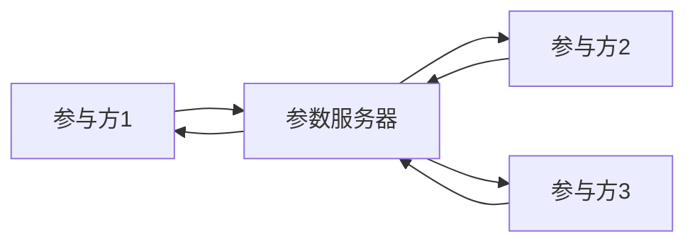

##  AI模型安全与隐私保护原理与代码实战案例讲解

作者：禅与计算机程序设计艺术

## 1. 背景介绍

### 1.1 人工智能的快速发展与数据安全挑战

近年来，人工智能(AI)技术发展迅猛，已经在图像识别、自然语言处理、语音识别等领域取得了突破性进展，并逐渐渗透到金融、医疗、交通、安防等各个行业，为人们的生活带来了极大的便利。然而，随着AI技术的广泛应用，其安全和隐私问题也日益凸显。

一方面，AI模型的训练和应用需要海量的数据，这些数据中往往包含着用户的个人隐私信息，例如姓名、年龄、住址、电话号码、银行卡号等。如果这些数据被泄露或滥用，将会给用户带来巨大的损失。

另一方面，AI模型本身也存在着安全漏洞，例如对抗样本攻击、模型窃取攻击、数据投毒攻击等。攻击者可以利用这些漏洞来欺骗、控制或破坏AI模型，从而造成严重的后果。

### 1.2 AI模型安全与隐私保护的重要性

AI模型的安全与隐私保护不仅关系到用户的个人利益，也关系到企业的商业利益和国家安全。因此，加强AI模型的安全与隐私保护已经成为当务之急。

## 2. 核心概念与联系

### 2.1  AI模型安全

AI模型安全是指保护AI模型免受各种攻击和威胁，确保其完整性、可用性和机密性。

#### 2.1.1 完整性

完整性是指确保AI模型的数据和代码不被篡改或破坏，保证其输出结果的准确性和可靠性。

#### 2.1.2 可用性

可用性是指确保AI模型能够正常运行，并为用户提供服务，防止因攻击或故障导致的模型不可用。

#### 2.1.3 机密性

机密性是指保护AI模型的算法、参数、训练数据等敏感信息不被未授权访问或泄露。

### 2.2 AI模型隐私保护

AI模型隐私保护是指在训练和应用AI模型的过程中，保护用户数据的隐私，防止其被泄露或滥用。

#### 2.2.1 数据最小化

数据最小化是指只收集和使用必要的用户数据，避免过度收集和使用用户数据。

#### 2.2.2 数据匿名化

数据匿名化是指对用户数据进行处理，使其无法识别特定个体，例如通过删除或替换用户标识符、对数据进行聚合或泛化等方式。

#### 2.2.3 差分隐私

差分隐私是一种更强大的隐私保护技术，它通过向数据中添加噪声来保护用户隐私，同时保证数据分析结果的准确性。

### 2.3 核心概念之间的联系

AI模型安全与隐私保护是相互依存、相互促进的关系。一方面，AI模型的安全是保障AI模型隐私保护的前提条件，如果AI模型本身存在安全漏洞，那么攻击者就可以利用这些漏洞来窃取或篡改用户数据，从而破坏用户隐私。另一方面，AI模型的隐私保护也是提升AI模型安全性的重要手段，例如通过数据匿名化和差分隐私等技术，可以有效地降低AI模型被攻击的风险。

## 3. 核心算法原理具体操作步骤

### 3.1 对抗训练

对抗训练是一种常用的防御对抗样本攻击的方法。其基本原理是：在训练AI模型的过程中，将对抗样本加入到训练集中，并对模型进行训练，使其能够正确地分类对抗样本。

#### 3.1.1  对抗样本生成

对抗样本的生成方法有很多种，例如FGSM (Fast Gradient Sign Method)、JSMA (Jacobian-based Saliency Map Attack)等。

#### 3.1.2 对抗训练流程

对抗训练的流程如下：

1.  使用正常样本训练一个初始的AI模型。
2.  使用对抗样本生成方法生成对抗样本。
3.  将对抗样本加入到训练集中。
4.  使用新的训练集对AI模型进行训练。
5.  重复步骤2-4，直到AI模型的鲁棒性达到要求。

### 3.2 联邦学习

联邦学习是一种分布式机器学习技术，它允许多个参与方在不共享数据的情况下协同训练一个全局模型。联邦学习可以有效地保护用户数据的隐私，因为它不需要将用户数据集中到一个中心服务器上进行训练。

#### 3.2.1 联邦学习架构

联邦学习通常采用参数服务器架构，其架构图如下所示：



#### 3.2.2 联邦学习流程

联邦学习的流程如下：

1.  参数服务器初始化一个全局模型，并将模型参数发送给各个参与方。
2.  各个参与方使用本地数据对全局模型进行训练，并将更新后的模型参数发送回参数服务器。
3.  参数服务器聚合各个参与方上传的模型参数，更新全局模型。
4.  重复步骤2-3，直到全局模型收敛。

### 3.3 差分隐私

差分隐私是一种强大的隐私保护技术，它通过向数据中添加噪声来保护用户隐私，同时保证数据分析结果的准确性。

#### 3.3.1 差分隐私定义

差分隐私的定义如下：

> 对于任何两个相邻的数据集 $D$ 和 $D'$（$D$ 和 $D'$ 之间只有一个数据项不同），对于任何可能的输出结果 $S$，满足以下不等式：
>
> $$
> Pr[M(D) \in S] \le e^{\epsilon} \times Pr[M(D') \in S]
> $$
>
> 其中，$M$ 是一个随机算法，$\epsilon$ 是隐私预算，它控制着隐私保护的强度，$\epsilon$ 越小，隐私保护强度越高。

#### 3.3.2 差分隐私机制

常用的差分隐私机制包括拉普拉斯机制和指数机制。

##### 3.3.2.1 拉普拉斯机制

拉普拉斯机制通过向查询结果中添加服从拉普拉斯分布的噪声来实现差分隐私。

##### 3.3.2.2 指数机制

指数机制通过从一个候选结果集中选择一个结果，并以与其隐私损失成正比的概率返回该结果来实现差分隐私。

### 3.4  同态加密

同态加密是一种特殊的加密技术，它允许对加密数据进行计算，而无需先解密数据。同态加密可以有效地保护用户数据的隐私，因为它允许在不解密数据的情况下对数据进行分析和处理。

#### 3.4.1 同态加密的性质

同态加密具有以下性质：

*   **同态加法：**  $Enc(m_1) + Enc(m_2) = Enc(m_1 + m_2)$
*   **同态乘法：**  $Enc(m_1) * Enc(m_2) = Enc(m_1 * m_2)$

#### 3.4.2 同态加密的应用

同态加密可以应用于以下场景：

*   **隐私保护的机器学习：**  在不解密数据的情况下训练和应用AI模型。
*   **安全的多方计算：**  多个参与方在不泄露各自数据的情况下进行联合计算。

## 4. 数学模型和公式详细讲解举例说明

### 4.1  逻辑回归中的差分隐私

逻辑回归是一种常用的分类算法，它可以用于预测一个样本属于某个类别的概率。逻辑回归的数学模型如下：

$$
P(y=1|x) = \frac{1}{1 + e^{-(w^Tx + b)}}
$$

其中，$x$ 是输入特征向量，$y$ 是标签，$w$ 是权重向量，$b$ 是偏置。

为了保护用户数据的隐私，我们可以使用差分隐私来训练逻辑回归模型。具体来说，我们可以使用梯度下降算法来训练模型，并在每次迭代中向梯度添加拉普拉斯噪声。

#### 4.1.1  梯度计算

逻辑回归的损失函数为：

$$
L(w, b) = -\frac{1}{N}\sum_{i=1}^{N}[y_i\log(P(y_i=1|x_i)) + (1-y_i)\log(1-P(y_i=1|x_i))]
$$

其中，$N$ 是样本数量。

损失函数关于权重向量 $w$ 的梯度为：

$$
\nabla_w L(w, b) = -\frac{1}{N}\sum_{i=1}^{N}(y_i - P(y_i=1|x_i))x_i
$$

#### 4.1.2  添加拉普拉斯噪声

为了实现差分隐私，我们可以向梯度添加服从拉普拉斯分布的噪声：

$$
\tilde{\nabla}_w L(w, b) = \nabla_w L(w, b) + Lap(\frac{\Delta}{\epsilon})
$$

其中，$\Delta$ 是梯度的敏感度，$\epsilon$ 是隐私预算。

#### 4.1.3  梯度更新

使用添加了噪声的梯度更新权重向量：

$$
w = w - \eta \tilde{\nabla}_w L(w, b)
$$

其中，$\eta$ 是学习率。

### 4.2  线性回归中的同态加密

线性回归是一种常用的回归算法，它可以用于预测一个连续变量的值。线性回归的数学模型如下：

$$
y = w^Tx + b
$$

其中，$x$ 是输入特征向量，$y$ 是目标变量，$w$ 是权重向量，$b$ 是偏置。

为了保护用户数据的隐私，我们可以使用同态加密来训练线性回归模型。具体来说，我们可以使用梯度下降算法来训练模型，并在每次迭代中使用同态加密来计算梯度。

#### 4.2.1  梯度计算

线性回归的损失函数为：

$$
L(w, b) = \frac{1}{2N}\sum_{i=1}^{N}(y_i - w^Tx_i - b)^2
$$

损失函数关于权重向量 $w$ 的梯度为：

$$
\nabla_w L(w, b) = \frac{1}{N}\sum_{i=1}^{N}(w^Tx_i + b - y_i)x_i
$$

#### 4.2.2  同态加密

我们可以使用同态加密来加密梯度：

$$
Enc(\nabla_w L(w, b)) = \frac{1}{N}\sum_{i=1}^{N}(Enc(w)^TEnc(x_i) + Enc(b) - Enc(y_i))Enc(x_i)
$$

#### 4.2.3  梯度更新

使用解密后的梯度更新权重向量：

$$
w = w - \eta Dec(Enc(\nabla_w L(w, b)))
$$

## 5. 项目实践：代码实例和详细解释说明

### 5.1 使用 TensorFlow Privacy 实现差分隐私的逻辑回归

```python
import tensorflow as tf
import tensorflow_privacy as tfp

# 定义模型
model = tf.keras.Sequential([
  tf.keras.layers.Dense(1, activation='sigmoid')
])

# 定义损失函数和优化器
loss_fn = tf.keras.losses.BinaryCrossentropy()
optimizer = tf.keras.optimizers.SGD(learning_rate=0.01)

# 定义差分隐私参数
l2_norm_clip = 1.0
noise_multiplier = 1.1
num_microbatches = 1

# 创建差分隐私优化器
optimizer = tfp.Privacy.optimizers.dp_optimizer.DPAdamGaussianOptimizer(
    l2_norm_clip=l2_norm_clip,
    noise_multiplier=noise_multiplier,
    num_microbatches=num_microbatches,
    learning_rate=0.01)

# 训练模型
epochs = 10
batch_size = 32
for epoch in range(epochs):
  for batch in range(x_train.shape[0] // batch_size):
    with tf.GradientTape() as tape:
      # 计算模型输出
      predictions = model(x_train[batch * batch_size:(batch + 1) * batch_size])
      # 计算损失
      loss = loss_fn(y_train[batch * batch_size:(batch + 1) * batch_size], predictions)
    # 计算梯度
    gradients = tape.gradient(loss, model.trainable_variables)
    # 更新模型参数
    optimizer.apply_gradients(zip(gradients, model.trainable_variables))
```

### 5.2  使用 TenSEAL 实现同态加密的线性回归

```python
import tenseal as ts

# 创建一个上下文
context = ts.context(
    ts.SCHEME_TYPE.CKKS,
    poly_modulus_degree=8192,
    coeff_mod_bit_sizes=[60, 40, 40, 60]
)

# 生成密钥
keygen = ts.ckks_vector_keygen(context)
public_key = keygen.public_key()
secret_key = keygen.secret_key()

# 加密数据
x_enc = ts.ckks_vector(context, [1, 2, 3])
y_enc = ts.ckks_vector(context, [4, 5, 6])

# 初始化模型参数
w_enc = ts.ckks_vector(context, [0, 0, 0])
b_enc = ts.ckks_vector(context, [0])

# 训练模型
epochs = 10
learning_rate = 0.01
for epoch in range(epochs):
  # 计算预测值
  y_pred_enc = x_enc * w_enc + b_enc

  # 计算误差
  error_enc = y_enc - y_pred_enc

  # 计算梯度
  w_grad_enc = error_enc * x_enc
  b_grad_enc = error_enc.sum()

  # 更新模型参数
  w_enc -= learning_rate * w_grad_enc
  b_enc -= learning_rate * b_grad_enc

# 解密模型参数
w = w_enc.decrypt(secret_key)
b = b_enc.decrypt(secret_key)
```

## 6. 实际应用场景

### 6.1  金融风控

在金融风控领域，AI模型可以用于评估用户的信用风险、欺诈风险等。为了保护用户数据的隐私，可以使用联邦学习来训练风控模型。例如，多家银行可以联合起来，在不共享用户数据的情况下，协同训练一个全局的风控模型。

### 6.2  医疗诊断

在医疗诊断领域，AI模型可以用于辅助医生进行疾病诊断。为了保护患者的隐私，可以使用差分隐私来训练医疗诊断模型。例如，可以使用差分隐私来训练一个癌症诊断模型，该模型可以根据患者的基因数据来预测患者患癌症的风险。

### 6.3  智能家居

在智能家居领域，AI模型可以用于控制智能家居设备。为了保护用户的隐私，可以使用同态加密来保护用户数据。例如，可以使用同态加密来保护用户的语音指令，防止用户的语音指令被窃听或篡改。

## 7. 总结：未来发展趋势与挑战

### 7.1  未来发展趋势

*   **更加注重隐私保护的AI模型设计：**  未来的AI模型设计将更加注重隐私保护，例如使用联邦学习、差分隐私、同态加密等技术来保护用户数据的隐私。
*   **更加完善的AI模型安全标准和规范：**  随着AI技术的不断发展，将会制定更加完善的AI模型安全标准和规范，以指导AI模型的开发和应用。
*   **更加强大的AI模型安全工具和平台：**  未来将会出现更加强大的AI模型安全工具和平台，以帮助开发者更加方便地开发和部署安全的AI模型。

### 7.2  挑战

*   **平衡隐私保护和模型性能：**  隐私保护技术往往会降低AI模型的性能，因此如何平衡隐私保护和模型性能是一个挑战。
*   **应对新型攻击手段：**  随着AI技术的不断发展，将会出现更多新型的攻击手段，因此如何应对新型攻击手段是一个挑战。
*   **缺乏统一的标准和规范：**  目前，AI模型安全和隐私保护领域缺乏统一的标准和规范，这给AI模型的开发和应用带来了一定的困难。

## 8. 附录：常见问题与解答

### 8.1  什么是对抗样本攻击？

对抗样本攻击是一种针对AI模型的攻击方式，攻击者可以通过向输入数据中添加微小的扰动来欺骗AI模型，使其输出错误的结果。

### 8.2  什么是联邦学习？

联邦学习是一种分布式机器学习技术，它允许多个参与方在不共享数据的情况下协同训练一个全局模型。

### 8.3  什么是差分隐私？

差分隐私是一种强大的隐私保护技术，它通过向数据中添加噪声来保护用户隐私，同时保证数据分析结果的准确性。

### 8.4  什么是同态加密？

同态加密是一种特殊的加密技术，它允许对加密数据进行计算，而无需先解密数据。