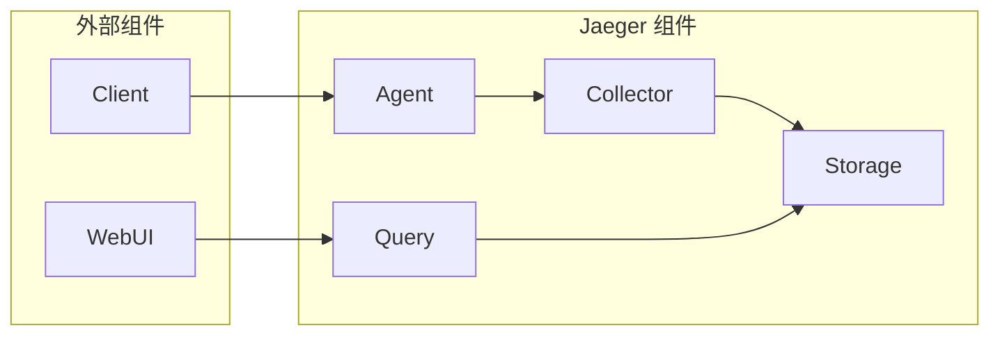

## AI系统Jaeger原理与代码实战案例讲解

作者：禅与计算机程序设计艺术

## 1. 背景介绍

### 1.1 分布式系统追踪的必要性

随着互联网架构的不断演进，微服务架构已经成为构建现代应用程序的主流方式。微服务架构将复杂的应用程序拆分成多个小型、独立的服务单元，这些服务单元之间通过网络进行通信。虽然微服务架构带来了诸多优势，例如更高的灵活性、可扩展性和可维护性，但也引入了新的挑战，其中之一就是分布式系统追踪。

在单体应用程序中，调用链路清晰，很容易定位问题。但在微服务架构中，一个请求可能会跨越多个服务，调用链路复杂，一旦出现问题，很难定位故障点。为了解决这个问题，分布式系统追踪应运而生。

### 1.2 Jaeger的诞生背景

Jaeger 是由 Uber Technologies 开发并开源的分布式追踪系统，它受 DapperZipkin 启发，旨在解决 Uber 复杂的微服务架构中出现的分布式追踪问题。Jaeger 已成为 Cloud Native Computing Foundation (CNCF) 的毕业项目，被广泛应用于各种规模的企业中。

### 1.3 Jaeger的优势

Jaeger 具有以下优势：

* **高扩展性：**Jaeger 使用 gRPC 进行通信，并支持多种存储后端，例如 Cassandra、Elasticsearch 和 Kafka，可以轻松扩展以满足大规模应用程序的需求。
* **低延迟：**Jaeger 采用异步、非阻塞的架构设计，可以实现低延迟的追踪数据收集和查询。
* **丰富的功能：**Jaeger 提供了丰富的功能，包括分布式上下文传播、服务依赖关系图、性能指标分析和报警等。
* **易于使用：**Jaeger 提供了友好的用户界面，方便用户查看和分析追踪数据。

## 2. 核心概念与联系

### 2.1 追踪 (Trace)

追踪表示一个潜在的、分布式的、与业务逻辑相关的活动。一个追踪由多个跨度组成，这些跨度代表工作单元。

### 2.2 跨度 (Span)

跨度表示一个逻辑工作单元，例如一个 HTTP 请求或一个数据库查询。每个跨度都包含以下信息：

* 操作名称
* 开始时间和结束时间
* 标签 (Tags)
* 日志 (Logs)
* 父跨度 ID (可选)

### 2.3 上下文传播 (Context Propagation)

上下文传播是指将追踪信息从一个服务传递到另一个服务的过程。Jaeger 支持多种上下文传播机制，例如基于 HTTP 头的传播和基于消息队列的传播。

### 2.4 采样 (Sampling)

由于追踪数据量可能非常大，为了降低成本和提高性能，Jaeger 支持对追踪数据进行采样。采样策略可以根据业务需求进行配置。

### 2.5 核心组件关系图



* **Client:** 应用程序代码，负责创建跨度并将追踪数据发送到 Agent。
* **Agent:** 接收来自 Client 的追踪数据，并将数据批量发送到 Collector。
* **Collector:** 接收来自 Agent 的追踪数据，并将数据写入 Storage。
* **Storage:** 存储追踪数据，例如 Cassandra、Elasticsearch 或 Kafka。
* **Query:** 提供查询接口，允许用户检索和分析追踪数据。
* **WebUI:** 基于 Web 的用户界面，用于可视化和分析追踪数据。

## 3. 核心算法原理具体操作步骤

Jaeger 使用了多种算法和技术来实现分布式追踪，包括：

* **分布式 ID 生成：**Jaeger 使用 Twitter 的 Snowflake 算法生成全局唯一的追踪 ID。
* **上下文传播：**Jaeger 支持多种上下文传播机制，例如基于 HTTP 头的传播和基于消息队列的传播。
* **跨度树构建：**Jaeger 使用父跨度 ID 将跨度组织成树形结构，以便于可视化和分析调用链路。
* **采样：**Jaeger 支持多种采样策略，例如基于概率的采样和基于速率的采样。
* **数据存储和查询：**Jaeger 支持多种存储后端，例如 Cassandra、Elasticsearch 和 Kafka，并提供高效的查询接口。

### 3.1 分布式 ID 生成

Jaeger 使用 Twitter 的 Snowflake 算法生成全局唯一的追踪 ID。Snowflake 算法生成 64 位的 ID，其中包含以下部分：

* **时间戳：**41 位，表示 ID 生成的毫秒时间戳。
* **数据中心 ID：**5 位，用于区分不同的数据中心。
* **机器 ID：**5 位，用于区分同一数据中心的不同机器。
* **序列号：**12 位，用于区分同一毫秒内生成的多个 ID。

### 3.2 上下文传播

上下文传播是指将追踪信息从一个服务传递到另一个服务的过程。Jaeger 支持多种上下文传播机制，例如：

* **基于 HTTP 头的传播：**Jaeger 使用 HTTP 头 `uber-trace-id` 传递追踪 ID，使用 `uber-span-id` 传递跨度 ID。
* **基于消息队列的传播：**Jaeger 可以将追踪信息添加到消息队列的消息头中，以便于在消费者端重建调用链路。

### 3.3 跨度树构建

Jaeger 使用父跨度 ID 将跨度组织成树形结构。每个跨度都包含一个可选的父跨度 ID，表示该跨度的父跨度。通过递归地遍历所有跨度，可以构建出完整的调用链路。

### 3.4 采样

Jaeger 支持多种采样策略，例如：

* **基于概率的采样：**Jaeger 可以根据配置的概率对追踪数据进行采样，例如 10% 的追踪数据会被采样。
* **基于速率的采样：**Jaeger 可以根据配置的速率对追踪数据进行采样，例如每秒钟采样 100 个追踪数据。

### 3.5 数据存储和查询

Jaeger 支持多种存储后端，例如：

* **Cassandra:** 高度可扩展的 NoSQL 数据库，适用于存储大量的追踪数据。
* **Elasticsearch:** 分布式搜索引擎，适用于快速查询和分析追踪数据。
* **Kafka:** 高吞吐量的消息队列，适用于实时处理追踪数据。

Jaeger 提供了高效的查询接口，允许用户根据追踪 ID、服务名称、操作名称、标签等条件检索和分析追踪数据。

## 4. 数学模型和公式详细讲解举例说明

Jaeger 使用了一些数学模型和公式来计算和分析追踪数据，例如：

* **延迟分布：**Jaeger 使用直方图来统计跨度的延迟分布，并计算平均延迟、中位数延迟和 P99 延迟等指标。
* **服务依赖关系图：**Jaeger 使用图论算法构建服务依赖关系图，并计算服务的入度、出度和 PageRank 等指标。

### 4.1 延迟分布

Jaeger 使用直方图来统计跨度的延迟分布。直方图将延迟数据分成多个区间，并统计每个区间内的数据量。Jaeger 可以根据直方图计算以下指标：

* **平均延迟：**所有延迟数据的平均值。
* **中位数延迟：**将所有延迟数据排序后，位于中间位置的数据。
* **P99 延迟：**将所有延迟数据排序后，位于第 99% 位置的数据。

### 4.2 服务依赖关系图

Jaeger 使用图论算法构建服务依赖关系图。服务依赖关系图是一个有向图，其中节点表示服务，边表示服务之间的调用关系。Jaeger 可以根据服务依赖关系图计算以下指标：

* **入度：**指向某个服务的边的数量。
* **出度：**从某个服务发出的边的数量。
* **PageRank：**用于衡量服务在整个系统中的重要性。

## 5. 项目实践：代码实例和详细解释说明

### 5.1 安装 Jaeger

```bash
docker run -d --name jaeger \
  -e COLLECTOR_ZIPKIN_HTTP_PORT=9411 \
  -p 5775:5775/udp \
  -p 6831:6831/udp \
  -p 6832:6832/udp \
  -p 5778:5778 \
  -p 16686:16686 \
  -p 14268:14268 \
  -p 9411:9411 \
  jaegertracing/all-in-one:1.30
```

### 5.2 示例代码

```python
from opentracing import set_global_tracer
from jaeger_client import Config, Tracer

config = Config(
    config={
        'sampler': {
            'type': 'const',
            'param': 1,
        },
        'logging': True,
        'reporter_batch_size': 1,
    },
    service_name='my-service',
)

tracer = config.initialize_tracer()
set_global_tracer(tracer)

# 创建一个跨度
with tracer.start_active_span('my-operation') as span:
    span.log_kv({'event': 'start'})

    # 模拟业务逻辑
    time.sleep(0.1)

    span.log_kv({'event': 'finish'})
```

### 5.3 代码解释

* 首先，我们需要初始化 Jaeger 客户端，并设置全局追踪器。
* 然后，我们可以使用 `tracer.start_active_span()` 方法创建一个跨度。
* 在跨度中，我们可以使用 `span.log_kv()` 方法记录日志信息。
* 最后，我们需要调用 `span.finish()` 方法结束跨度。

## 6. 实际应用场景

Jaeger 可以应用于各种场景，例如：

* **微服务架构：**Jaeger 可以帮助开发人员快速定位微服务架构中的性能瓶颈和故障点。
* **分布式数据库：**Jaeger 可以追踪数据库查询的执行过程，帮助开发人员优化数据库性能。
* **消息队列：**Jaeger 可以追踪消息的传递过程，帮助开发人员排查消息丢失和延迟问题。

## 7. 总结：未来发展趋势与挑战

Jaeger 作为一款成熟的分布式追踪系统，未来将继续发展和完善，以下是一些发展趋势和挑战：

* **更高的性能和可扩展性：**随着微服务架构的普及，Jaeger 需要不断提升性能和可扩展性，以满足更大规模的应用需求。
* **更丰富的功能：**Jaeger 需要提供更丰富的功能，例如更强大的查询功能、更灵活的报警机制等。
* **更完善的生态系统：**Jaeger 需要与其他开源组件更好地集成，例如 Prometheus、Grafana 等。

## 8. 附录：常见问题与解答

### 8.1 如何配置 Jaeger 的采样率？

可以通过修改 Jaeger 客户端的配置来调整采样率。

### 8.2 如何查看 Jaeger 的追踪数据？

可以使用 Jaeger 的 WebUI 查看追踪数据。

### 8.3 如何排查 Jaeger 的常见问题？

可以查看 Jaeger 的日志文件，或者查阅 Jaeger 的官方文档。
