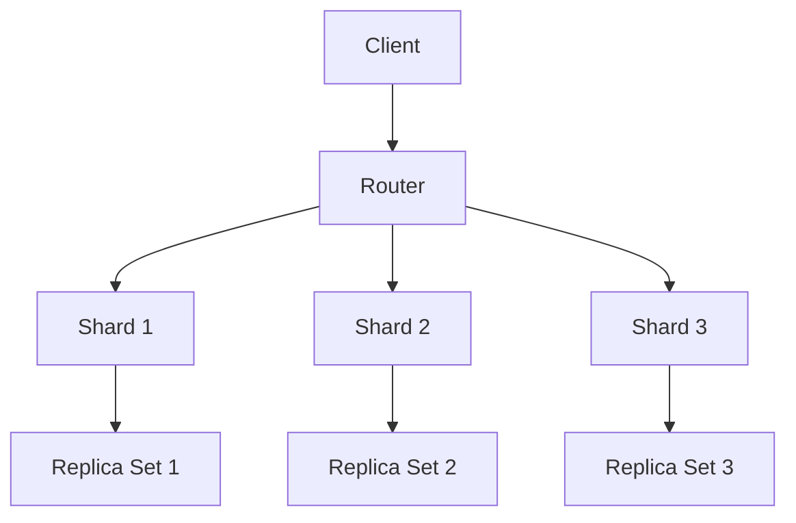

# AI系统MongoDB原理与代码实战案例讲解

作者：禅与计算机程序设计艺术

## 1.背景介绍

### 1.1 MongoDB简介

MongoDB是一种基于分布式文件存储的开源数据库系统，由C++语言编写。作为NoSQL数据库的代表，MongoDB以其灵活的文档数据模型、高效的查询性能和强大的可扩展性，广泛应用于大数据、实时分析和云计算等领域。其数据结构由键值对组成，类似于JSON格式，使得数据存储和查询更加直观和高效。

### 1.2 AI系统中的数据存储需求

在AI系统中，数据存储是一个至关重要的环节。无论是训练数据集、模型参数还是实时数据，数据的存储和管理都直接影响到AI系统的性能和可靠性。传统的关系型数据库在面对大规模、非结构化数据时，往往显得力不从心。而MongoDB凭借其灵活的数据模型和高效的查询能力，成为AI系统数据存储的理想选择。

### 1.3 本文目标

本文旨在深入探讨MongoDB在AI系统中的应用原理与实践，通过详细的算法解析、数学模型讲解和代码实例，帮助读者全面理解MongoDB在AI系统中的作用和实现方法。我们将从MongoDB的核心概念入手，逐步深入到具体的操作步骤、数学模型、实际应用场景和工具资源推荐，最后总结其未来发展趋势与挑战。

## 2.核心概念与联系

### 2.1 文档模型

MongoDB采用文档模型来存储数据，每个文档都是一个键值对的集合，类似于JSON对象。文档模型的灵活性允许存储复杂的数据结构，如嵌套文档和数组，使得数据的表示更加自然和直观。

```json
{
    "name": "Alice",
    "age": 30,
    "skills": ["Python", "Machine Learning", "Data Analysis"]
}
```

### 2.2 集合与数据库

在MongoDB中，文档被存储在集合（Collection）中，而多个集合组成一个数据库（Database）。集合是无模式的，这意味着同一个集合中的文档可以有不同的结构和字段。

### 2.3 索引

索引是提高查询性能的关键。MongoDB支持多种索引类型，如单字段索引、复合索引和地理空间索引。合理的索引设计可以显著提升查询效率，减少查询时间。

### 2.4 分片与复制

分片（Sharding）和复制（Replication）是MongoDB实现高可用性和可扩展性的两大核心机制。分片通过将数据分布到多个服务器上，实现水平扩展；复制则通过数据冗余和故障转移，确保数据的高可用性和容错性。



## 3.核心算法原理具体操作步骤

### 3.1 数据插入

数据插入是MongoDB的基本操作之一。通过`insertOne`和`insertMany`方法，可以将单个或多个文档插入到集合中。

```javascript
db.collection.insertOne({
    "name": "Alice",
    "age": 30,
    "skills": ["Python", "Machine Learning", "Data Analysis"]
});
```

### 3.2 数据查询

MongoDB提供了丰富的查询语言，支持复杂的查询条件和投影操作。常用的查询方法包括`find`、`findOne`和`aggregate`。

```javascript
db.collection.find({
    "age": { "$gt": 25 }
}, {
    "name": 1,
    "skills": 1
});
```

### 3.3 数据更新

数据更新操作包括`updateOne`、`updateMany`和`replaceOne`，可以根据条件更新指定的文档字段。

```javascript
db.collection.updateOne({
    "name": "Alice"
}, {
    "$set": { "age": 31 }
});
```

### 3.4 数据删除

数据删除操作包括`deleteOne`和`deleteMany`，可以根据条件删除指定的文档。

```javascript
db.collection.deleteOne({
    "name": "Alice"
});
```

## 4.数学模型和公式详细讲解举例说明

### 4.1 索引优化的数学模型

索引优化是提升查询性能的关键。假设我们有一个集合`collection`，其中包含$n$个文档，每个文档的大小为$b$字节。创建一个单字段索引的时间复杂度为$O(n \log n)$，查询时间复杂度为$O(\log n)$。

$$
T_{\text{index}} = O(n \log n)
$$

$$
T_{\text{query}} = O(\log n)
$$

### 4.2 分片策略的数学模型

分片策略的选择直接影响到系统的性能和扩展性。假设我们有$k$个分片，每个分片包含$n/k$个文档。查询时间复杂度为$O(\log (n/k))$，分片的均衡性和查询分布是影响性能的关键因素。

$$
T_{\text{shard}} = O(\log (n/k))
$$

### 4.3 复制机制的数学模型

复制机制通过数据冗余和故障转移提高系统的可用性。假设我们有$m$个副本，写操作的时间复杂度为$O(m)$，读操作的时间复杂度为$O(1)$。

$$
T_{\text{write}} = O(m)
$$

$$
T_{\text{read}} = O(1)
$$

## 4.项目实践：代码实例和详细解释说明

### 4.1 项目背景

假设我们要开发一个AI系统，用于实时处理和分析用户行为数据。系统需要高效地存储和查询大量的用户行为日志，并提供实时分析和推荐功能。MongoDB作为数据存储层，将发挥关键作用。

### 4.2 数据模型设计

首先，我们设计用户行为日志的数据模型。每条日志记录一个用户的行为事件，包括用户ID、事件类型、事件时间和事件详情。

```json
{
    "user_id": "12345",
    "event_type": "click",
    "event_time": "2024-05-23T04:08:09Z",
    "event_details": {
        "page": "homepage",
        "button_id": "signup"
    }
}
```

### 4.3 数据插入代码实例

```javascript
const MongoClient = require('mongodb').MongoClient;
const url = 'mongodb://localhost:27017';
const dbName = 'ai_system';

MongoClient.connect(url, function(err, client) {
    if (err) throw err;
    const db = client.db(dbName);
    const collection = db.collection('user_events');
    
    const event = {
        "user_id": "12345",
        "event_type": "click",
        "event_time": new Date(),
        "event_details": {
            "page": "homepage",
            "button_id": "signup"
        }
    };
    
    collection.insertOne(event, function(err, result) {
        if (err) throw err;
        console.log("Event inserted");
        client.close();
    });
});
```

### 4.4 数据查询代码实例

```javascript
MongoClient.connect(url, function(err, client) {
    if (err) throw err;
    const db = client.db(dbName);
    const collection = db.collection('user_events');
    
    const query = { "user_id": "12345" };
    const projection = { "event_type": 1, "event_time": 1, "event_details": 1 };
    
    collection.find(query).project(projection).toArray(function(err, docs) {
        if (err) throw err;
        console.log("User events:", docs);
        client.close();
    });
});
```

### 4.5 数据更新代码实例

```javascript
MongoClient.connect(url, function(err, client) {
    if (err) throw err;
    const db = client.db(dbName);
    const collection = db.collection('user_events');
    
    const filter = { "user_id": "12345", "event_type": "click" };
    const update = { "$set": { "event_details.button_id": "login" } };
    
    collection.updateOne(filter, update, function(err, result) {
        if (err) throw err;
        console.log("Event updated");
        client.close();
    });
});
```

### 4.6 数据删除代码实例

```javascript
MongoClient.connect(url, function(err, client) {
    if (err) throw err;
    const db = client.db(dbName);
    const collection = db.collection('user_events');
    
    const filter = { "user_id": "123